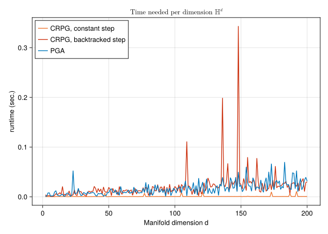
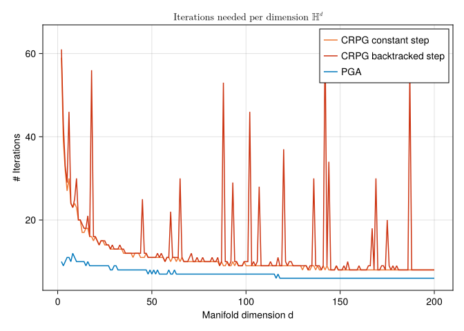

# The Constrained mean on high-dimensional Hyperbolic space.
Hajg Jasa, Ronny Bergmann
2026-04-06

## Introduction

This example is to be thought of as a continuation of the [Constrained Mean on Hyperbolic Space](https://juliamanifolds.github.io/ManoptExamples.jl/stable/examples/Constrained-Mean-Hn/), where we compare the Intrinsic Convex Riemannian Proximal Gradient Method (CRPG) from [BergmannJasaJohnPfeffer:2025:2](@cite) with the Projected Gradient Algorithm (PGA) as introduced in [BergmannFerreiraNemethZhu:2025](@cite).
For CRPG, we test performances of both constant and backtracked stepsize strategies.

``` julia
using Chairmarks, CSV, DataFrames, Manifolds, Manopt, CairoMakie, Random
import ColorSchemes.tol_vibrant
```

Consider the constrained Riemannian center of mass
for a given set of points \`\`q_i M\$ $i=1,\ldots,N$
given by

``` math
\operatorname*{arg\,min}_{p\in\mathcal C}
\sum_{i=1}^N d_{\mathrm{M}}^2(p,q_i)
```

constrained to a set $\mathcal C \subset \mathcal M$.

The same problem can be formulated as an unconstrained optimization problem by introducing the characteristic function for the set $\mathcal C$:

``` math
\operatorname*{arg\,min}_{p\in\mathcal M}
\sum_{i=1}^N d_{\mathrm{M}}^2(p,q_i) + \chi_{\mathcal C}(p)
```

where $\chi_{\mathcal C}(p) = 0$ if $p \in \mathcal C$ and $\chi_{\mathcal C}(p) = \infty$ otherwise.
This formulation allows us to use CRPG to solve the problem.

For this experiment set $\mathcal M = \mathbb H^d$ for $d=2,\ldots,200$, the [Hyperbolic space](@extref Manifolds :std:doc:`manifolds/hyperbolic`)
and the constrained set $\mathcal C = C_{c,r}$ as the ball of radius $r$ around the center point $c$, where we choose here $r=\frac{1}{\sqrt{n}}$ and $c = (0,\ldots,0,1)^{\mathrm{T}}$ and a $σ = \frac{3}{2}n^{1/4}$.

``` julia
n_range = Vector(2:200)
radius_range = [1 / sqrt(n) for n in n_range]
N_range = [400 for n ∈ n_range]
M_range = [Hyperbolic(n) for n ∈ n_range]
σ_range = [ 1.5/sqrt(sqrt(n-1)) for n ∈ n_range]
tol = 1e-7
```

The data consists of $N=200$ points, where we skew the data a bit to force the mean to be outside of the constrained set $\mathcal C$.

## Cost, gradient and projection

We can formulate the constrained problem above in two different forms.
Both share a cost and require a gradient. For performance reasons, we also provide a mutating variant of the gradient

``` julia
f(M, p; pts=[]) = 1 / (2 * length(pts)) .* sum(distance(M, p, q)^2 for q in pts)

grad_f(M, p; pts=[]) = -1 / length(pts) .* sum(log(M, p, q) for q in pts)

function grad_f!(M, X, p; pts=[])
    zero_vector!(M, X, p)
    Y = zero_vector(M, p)
    for q in pts
        log!(M, Y, p, q)
        X .+= Y
    end
    X .*= -1 / length(pts)
    return X
end
```

We can model the constraint either with an inequality constraint $g(p) \geq 0$ or using a projection onto the set. For the gradient of $g$ and the projection we again also provide mutating variants.
Lastly, we define the cost function $F$ as the sum of the original cost and the characteristic function for the set $\mathcal C$.

``` julia
g(M, p; op=[], radius=1) = distance(M, op, p)^2 - radius^2;
# The characteristic function for the set C is defined with tol^2 to avoid numerical issues
characteristic_C(M, p; op=[], radius=1) = (g(M, p; op=op, radius=radius) ≤ tol^2) ? 0 : Inf;

function project_C(M, p; op=[], radius=1)
    X = log(M, op, p)
    n = norm(M, op, X)
    q = (n > radius) ? exp(M, op, (radius / n) * X) : copy(M, p)
    return q
end;

function project_C!(M, q, p; radius=1, op=[], X=zero_vector(M, op))
    log!(M, X, op, p)
    n = norm(M, op, X)
    if (n > radius)
        exp!(M, q, op, (radius / n) * X)
    else
        copyto!(M, q, p)
    end
    return q
end;

grad_g(M, p; op=[]) = -2 * log(M, p, op)
function grad_g!(M, X, p; op=[])
    log!(M, X, p, op)
    X .*= -2
    return X
end

F(M, p; pts=[], radius=1, op=[]) = f(M, p; pts=pts) + characteristic_C(M, p; op=op, radius=radius)
```

## The mean

For comparison, we first compute the Riemannian center of mass, that is the minimization above but not constrained to $\mathcal C$. We can then project this onto $\mathcal C$.
For the projected mean we obtain $g(p) = 0$ since the original mean is outside of the set, the projected one lies on the boundary.

We first generate all data

``` julia
centers = [[zeros(n)..., 1.0] for n in n_range]
begin
    Random.seed!(5)
    data = [
        [
            exp(
                M,
                c,
                get_vector(
                    M, c, σ * randn(n) .+ 2 * r .* ones(n), DefaultOrthonormalBasis()
                ),
            ) for _ in 1:N
        ] for
        (c, r, n, N, M, σ) in zip(centers, radius_range, n_range, N_range, M_range, σ_range)
    ]
end
```

``` julia
means = [mean(M, d) for (M, d) in zip(M_range, data)]
dc = [
    characteristic_C(M, m; op=c, radius=r) for
    (M, m, c, r) in zip(M_range, means, centers, radius_range)
]
minimum(dc) # Sanity Check, this should be inf
```

    Inf

``` julia
Proj_means = [
    project_C(M, m; op=c, radius=r) for
    (M, m, c, r) in zip(M_range, means, centers, radius_range)
]
# Samll sanity check, these should all be about zero
ds = [distance(M, m, c) - r for (M, m, c, r) in zip(M_range, Proj_means, centers, radius_range)]
maximum(abs.(ds))
```

    1.1102230246251565e-16

## The experiment

First, we define a single test function for one set of data for a manifold

``` julia
function bench_aep(Manifold, center, radius, data)
    # local functions
    _f(M, p) = f(M, p; pts=data)
    _grad_f!(M, X, p) = grad_f!(M, X, p; pts=data)
    _proj_C!(M, q, p) = project_C!(M, q, p; radius=radius, op=center)
    _F(M, p) = F(M, p; pts=data, radius=radius, op=center)
    _prox_I!(M, q, λ, p) = _proj_C!(M, q, p)
    # Copmute the Lipschitz constant of the gradient of f for the stepsize
    D = 2 * maximum([distance(Manifold, center, pt) for pt in data])
    L_f = Manopt.ζ_1(-1, D)
    constant_stepsize = 1 / L_f
    initial_stepsize = constant_stepsize
    contraction_factor = 0.995
    #
    # returns
    stats = Dict(:CRPG_CN => Dict(), :CRPG_BT => Dict(), :PGA => Dict())
    #
    mean_crpg_cn = copy(Manifold, center)
    crpg_cn = proximal_gradient_method!(
        Manifold, 
        _F, 
        _f, 
        _grad_f!, 
        mean_crpg_cn;
        prox_nonsmooth=_prox_I!,
        evaluation=InplaceEvaluation(), return_state=true,
        record=[:Iteration, :Cost],
        stepsize=ConstantLength(
            constant_stepsize,
        ),
        stopping_criterion=StopWhenGradientMappingNormLess(tol)|StopAfterIteration(5000),
    )
    stats[:CRPG_CN][:Iter] = length(get_record(crpg_cn, :Iteration))
    stats[:CRPG_CN][:Cost] = get_record(crpg_cn)
    # 
    # Backtracked stepsize
    mean_crpg_bt = copy(Manifold, center)
    crpg_bt = proximal_gradient_method!(
        Manifold, 
        _F, 
        _f, 
        _grad_f!, 
        mean_crpg_bt;
        prox_nonsmooth=_prox_I!,
        evaluation=InplaceEvaluation(), return_state=true,
        record=[:Iteration, :Cost],
        stepsize=ProximalGradientMethodBacktracking(; 
            strategy=:convex,   
            initial_stepsize=initial_stepsize,
            stop_when_stepsize_less=tol,
            contraction_factor=contraction_factor,
        ),
        stopping_criterion=StopWhenGradientMappingNormLess(tol)|StopAfterIteration(5000),
    )
    stats[:CRPG_BT][:Iter] = length(get_record(crpg_bt, :Iteration)) 
    stats[:CRPG_BT][:Cost] = get_record(crpg_bt)
    # 
    mean_pga = copy(Manifold, center)
    pgas = projected_gradient_method!(
        Manifold,
        _f,
        _grad_f!,
        _proj_C!,
        mean_pga;
        evaluation=InplaceEvaluation(),
        record=[:Iteration, :Cost],
        stopping_criterion=StopAfterIteration(150) |
                           StopWhenProjectedGradientStationary(Manifold, tol),
        return_state=true,
    )
    stats[:PGA][:Iter] = length(get_record(pgas, :Iteration))
    stats[:PGA][:Cost] = get_record(pgas)
    #
    #
    # Benchmarks
    crpg_b_cn = @be proximal_gradient_method!($Manifold, $_F, $_f, $_grad_f!,
        $(copy(Manifold, center)); prox_nonsmooth=$_prox_I!, evaluation=$(InplaceEvaluation()),
        stepsize=$(ConstantLength(
            constant_stepsize,
        )),
        stopping_criterion=$(StopWhenGradientMappingNormLess(tol)|StopAfterIteration(5000)),
    ) evals = 1 samples = 10 seconds = 100
    stats[:CRPG_CN][:time] = mean(crpg_b_cn).time
    crpg_b_bt = @be proximal_gradient_method!($Manifold, $_F, $_f, $_grad_f!,
        $(copy(Manifold, center)); prox_nonsmooth=$_prox_I!, evaluation=$(InplaceEvaluation()),
        stepsize=$(ProximalGradientMethodBacktracking(; 
            strategy=:convex,   
            initial_stepsize=initial_stepsize,
            stop_when_stepsize_less=tol,
            contraction_factor=contraction_factor,
        )),
        stopping_criterion=$(StopWhenGradientMappingNormLess(tol)|StopAfterIteration(5000)),
    ) evals = 1 samples = 10 seconds = 100
    stats[:CRPG_BT][:time] = mean(crpg_b_bt).time
    # 
    pga_b = @be projected_gradient_method!($Manifold, $_f, $_grad_f!, $_proj_C!,
        $(copy(Manifold, center)); evaluation=$(InplaceEvaluation()),
        stopping_criterion=$(
            StopAfterIteration(150) | StopWhenProjectedGradientStationary(Manifold, tol)
        ),
    ) evals = 1 samples = 10 seconds = 100
    stats[:PGA][:time] = mean(pga_b).time
    return stats
end
```

    bench_aep (generic function with 1 method)

and run these

The resulting plot of runtime is

``` julia
fig = Figure()
axis = Axis(fig[1, 1]; title=L"\text{Time needed per dimension }$\mathbb{H}^d$")
lines!(axis, n_range, [bi[:CRPG_CN][:time] for bi in b]; label="CRPG, constant step", color=tol_vibrant[1],)
lines!(axis, n_range, [bi[:CRPG_BT][:time] for bi in b]; label="CRPG, backtracked step", color=tol_vibrant[5],)
lines!(axis, n_range, [bi[:PGA][:time] for bi in b]; label="PGA", color=tol_vibrant[2],)
axis.xlabel = "Manifold dimension d"
axis.ylabel = "runtime (sec.)"
axislegend(axis; position=:lt)
fig
```



and the number of iterations reads

``` julia
fig2 = Figure()
axis2 = Axis(fig2[1, 1]; title=L"\text{Iterations needed per dimension }$\mathbb{H}^d$")
lines!(axis2, n_range, [bi[:CRPG_CN][:Iter] for bi in b]; label="CRPG constant step", color=tol_vibrant[1])
lines!(axis2, n_range, [bi[:CRPG_BT][:Iter] for bi in b]; label="CRPG backtracked step", color=tol_vibrant[5],)
lines!(axis2, n_range, [bi[:PGA][:Iter] for bi in b]; label="PGA", color=tol_vibrant[2],)
axis2.xlabel = "Manifold dimension d"
axis2.ylabel = "# Iterations"
axislegend(axis2; position=:rt)
fig2
```



## Literature

```@bibliography
Pages = ["CRPG-Constrained-Mean-Hn.md"]
Canonical=false
```

## Technical details

This tutorial is cached. It was last run on the following package versions.

    Status `~/Repositories/Julia/ManoptExamples.jl/examples/Project.toml`
      [6e4b80f9] BenchmarkTools v1.6.0
      [336ed68f] CSV v0.10.15
    ⌃ [13f3f980] CairoMakie v0.13.4
      [0ca39b1e] Chairmarks v1.3.1
      [35d6a980] ColorSchemes v3.29.0
    ⌅ [5ae59095] Colors v0.12.11
      [a93c6f00] DataFrames v1.7.0
    ⌃ [7073ff75] IJulia v1.27.0
      [682c06a0] JSON v0.21.4
      [8ac3fa9e] LRUCache v1.6.2
    ⌃ [d3d80556] LineSearches v7.3.0
    ⌅ [ee78f7c6] Makie v0.22.4
      [af67fdf4] ManifoldDiff v0.4.2
    ⌃ [1cead3c2] Manifolds v0.10.17
      [3362f125] ManifoldsBase v1.2.0
      [0fc0a36d] Manopt v0.5.18
      [5b8d5e80] ManoptExamples v0.1.14 `..`
      [51fcb6bd] NamedColors v0.2.3
    ⌃ [91a5bcdd] Plots v1.40.13
      [08abe8d2] PrettyTables v2.4.0
    ⌃ [6099a3de] PythonCall v0.9.24
    ⌃ [f468eda6] QuadraticModels v0.9.8
    ⌃ [1e40b3f8] RipQP v0.6.4
    Info Packages marked with ⌃ and ⌅ have new versions available. Those with ⌃ may be upgradable, but those with ⌅ are restricted by compatibility constraints from upgrading. To see why use `status --outdated`

This tutorial was last rendered June 19, 2025, 15:32:46.
