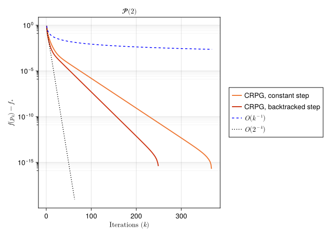

# A Geodesically Convex Example on SPDs
Hajg Jasa
2025-04-16

## Introduction

In this example we compare the Convex Riemannian Proximal Gradient (CRPG) method [BergmannJasaJohnPfeffer:2025:2](@cite) with the Cyclic Proximal Point Algorithm, which was introduced in [Bacak:2014](@cite), on the space of symmetric positive definite matrices.
This example reproduces the results from [BergmannJasaJohnPfeffer:2025:2](@cite), Section 5.3.

``` julia
using PrettyTables
using BenchmarkTools
using CSV, DataFrames
using ColorSchemes, Plots, LaTeXStrings, CairoMakie, Chairmarks
using Random, LinearAlgebra, LRUCache
using ManifoldDiff, Manifolds, Manopt, ManoptExamples
import ColorSchemes.tol_vibrant
```

## The Problem

Let $\mathcal M = \mathcal H^2$ be the $2$-dimensional hyperbolic space.

Let $g \colon \mathcal M \to \mathbb R$ be defined by

``` math
g(p) = \log(\det(p))^4.
```

Observe that the function $g$ is geodesically convex with respect to the Riemannian metric on $\mathcal M$.

Let now $q_1 \neq q_1$ be a given point, and let $h \colon \mathcal M \to \mathbb R$ be defined by

``` math
h(p) = \tau \mathrm{dist}(p, q_1),
```

for some $\tau > 0$.
We define our total objective function as $f = g + h$.
Notice that this objective function is also geodesically convex with respect to the Riemannian metric on $\mathcal M$.
The goal is to find the minimizer of $f$ on $\mathcal M$.

## Numerical Experiment

We initialize the experiment parameters, as well as some utility functions.

``` julia
random_seed = 42

atol = 1e-7
max_iters = 20000
τ = 1/2 # weight for the component h
spd_dims = [2, 3, 4, 5]
```

``` julia
# Objective, gradient, and proxes
g(M, p) = log(det(p))^4
grad_g(M, p) = 4log(det(p))^3 * p
# 
h(M, p, q) = τ * distance(M, p, q)
prox_h(M, λ, p, q) = ManifoldDiff.prox_distance(M, τ * λ, q, p, 1)
# 
f(M, p, q) = g(M, p) + h(M, p, q)
# Function to generate points close to the given point p
function close_point(M, p, tol; retraction_method=Manifolds.default_retraction_method(M, typeof(p)))
    X = rand(M; vector_at = p)
    X .= tol * rand() * X / norm(M, p, X)
    return retract(M, p, X, retraction_method)
end
# Estimate Lipschitz constant of the gradient of g
function theoretical_lipschitz_constant(M, anchor, n, R=D, N=100_000)
    constants = []
    for i in 1:N
        p = close_point(M, anchor, R)

        push!(constants, 12 * n * log(det(p))^2)
    end
    return maximum(constants)
end
```

We introduce some keyword arguments for the solvers we will use in this experiment

``` julia
# Solver arguments for backtracking
pgm_kwargs(contraction_factor, initial_stepsize, warm_start_factor) = [
    :record => [:Iteration, :Cost, :Iterate],
    :return_state => true,
    :stepsize => ProximalGradientMethodBacktracking(; 
        contraction_factor=contraction_factor,
        strategy=:convex, 
        initial_stepsize=initial_stepsize,
        stop_when_stepsize_less=atol,
        warm_start_factor=warm_start_factor,
    ),
    :stopping_criterion => StopWhenAny(
        StopWhenGradientMappingNormLess(atol), StopAfterIteration(max_iters)
    ),
]
pgm_bm_kwargs(contraction_factor, initial_stepsize, warm_start_factor) = [
    :record => [:Iteration, :Cost, :Iterate],
    :return_state => true,
    :stepsize => ProximalGradientMethodBacktracking(;
        contraction_factor=contraction_factor, 
        strategy=:convex,   
        initial_stepsize=initial_stepsize,
        stop_when_stepsize_less=atol,
        warm_start_factor=warm_start_factor,
    ),
    :stopping_criterion => StopWhenAny(
        StopWhenGradientMappingNormLess(atol), StopAfterIteration(max_iters)
    ), 
]
# Solver arguments for constant stepsize 
pgm_kwargs_constant(stepsize) = [
    :record => [:Iteration, :Cost, :Iterate],
    :return_state => true,
    :stepsize => ConstantLength(stepsize),
    :stopping_criterion => StopWhenAny(
        StopWhenGradientMappingNormLess(atol), StopAfterIteration(max_iters)
    ),
]
pgm_bm_kwargs_constant(stepsize) = [
    :record => [:Iteration, :Cost, :Iterate],
    :return_state => true,
    :stepsize => ConstantLength(stepsize),
    :stopping_criterion => StopWhenAny(
        StopWhenGradientMappingNormLess(atol), StopAfterIteration(max_iters)
    ), 
]
```

Before running the experiments, we initialize data collection functions that we will use later

``` julia
# Header for the dataframe
global col_names_1 = [
    :Dimension,
    :Iterations_1,
    :Time_1,
    :Cost_1,
    :Iterations_2,
    :Time_2,
    :Cost_2,
]
col_types_1 = [
    Int64,
    Int64,
    Float64,
    Float64,
    Int64,
    Float64,
    Float64,
]
named_tuple_1 = (; zip(col_names_1, type[] for type in col_types_1 )...)
# Function for initializing the dataframe
function initialize_dataframes(
    results_folder, 
    experiment_name, 
    named_tuple_1,
)
    A1 = DataFrame(named_tuple_1)
    CSV.write(
        joinpath(
            results_folder,
            experiment_name * 
            "-Comparisons.csv",
        ),
        A1;
        header=false,
    )
    return A1
end
```

``` julia
function export_dataframes(
    M, 
    records, 
    times, 
)
    B1 = DataFrame(;
        Dimension=manifold_dimension(M),
        Iterations_1=maximum(first.(records[1])),
        Time_1=times[1],
        Cost_1=minimum([r[2] for r in records[1]]),
        Iterations_2=maximum(first.(records[2])),
        Time_2=times[2],
        Cost_2=minimum([r[2] for r in records[2]]),
    )
    return B1
end
function write_dataframes(
    B1, 
    results_folder, 
    experiment_name, 
)
    CSV.write(
        joinpath(
            results_folder,
            experiment_name *
            "-Comparisons.csv",
        ),
        B1;
        append=true,
    )
end
```

``` julia
global A1_SPD = initialize_dataframes(
    results_folder,
    experiment_name,
    named_tuple_1,
)
stats = Dict(:CRPG_CN => Dict(), :CRPG_BT => Dict())
for n in spd_dims

    Random.seed!(random_seed)

    M = SymmetricPositiveDefinite(Int(n))
    q = rand(M)
    p0 = rand(M)

    prox_h_spd(M, λ, p) = prox_h(M, λ, p, q)
    f_spd(M, p) = f(M, p, q)

    D = 4*distance(M, p0, q)
    # Conseravative estimate of the Lipschitz constant for grad_g
    L_g = 1.05 * theoretical_lipschitz_constant(M, p0, n, D/2)
    constant_stepsize = 1/L_g
    initial_stepsize = 3/2 * constant_stepsize
    contraction_factor = 0.9
    warm_start_factor = 2.0

    # Optimization
    pgm_constant = proximal_gradient_method(M, f_spd, g, grad_g, p0;
        prox_nonsmooth=prox_h_spd, 
        pgm_bm_kwargs_constant(constant_stepsize)...
    )
    pgm_constant_result = get_solver_result(pgm_constant)
    pgm_constant_record = get_record(pgm_constant) 
    stats[:CRPG_CN][n] = Dict()
    stats[:CRPG_CN][n][:Iteration] = length(get_record(pgm_constant, :Iteration)) + 1
    stats[:CRPG_CN][n][:Cost] = get_record(pgm_constant, :Iteration, :Cost)
    pushfirst!(stats[:CRPG_CN][n][:Cost], f_spd(M, p0))

    # We can also use a backtracked stepsize
    pgm = proximal_gradient_method(M, f_spd, g, grad_g, p0; 
        prox_nonsmooth=prox_h_spd,
        pgm_kwargs(contraction_factor, initial_stepsize, warm_start_factor)...
    )
    pgm_result = get_solver_result(pgm)
    pgm_record = get_record(pgm)
    stats[:CRPG_BT][n] = Dict()
    stats[:CRPG_BT][n][:Iteration] = length(get_record(pgm, :Iteration)) + 1 
    stats[:CRPG_BT][n][:Cost] = get_record(pgm, :Iteration, :Cost)
    pushfirst!(stats[:CRPG_BT][n][:Cost], f_spd(M, p0))

    records = [
        pgm_constant_record,
        pgm_record,
    ]

    # Benchmarking
    if benchmarking
        pgm_constant_bm = @benchmark proximal_gradient_method($M, $f_spd, $g, $grad_g, $p0; 
            prox_nonsmooth=$prox_h_spd,
            $pgm_bm_kwargs_constant($constant_stepsize)...
        )
        pgm_bm = @benchmark proximal_gradient_method($M, $f_spd, $g, $grad_g, $p0; 
            prox_nonsmooth=$prox_h_spd,
            $pgm_bm_kwargs($contraction_factor, $initial_stepsize, $warm_start_factor)...
        )
        
        times = [
            median(pgm_constant_bm).time * 1e-9,
            median(pgm_bm).time * 1e-9,
        ]
        # Export the results
        B1 = export_dataframes(
            M,
            records,
            times,
        )
        append!(A1_SPD, B1)
        (export_table) && (write_dataframes(B1, results_folder, experiment_name))
    end
end
```

We can take a look at how the algorithms compare to each other in their performance with the following table, where columns 2 to 4 relate to CRPG with a constant stepsize, while columns 5 to 7 refer to the backtracked case…

| **Dimension** | **Iterations\_1** | **Time\_1** | **Cost\_1** | **Iterations\_2** | **Time\_2** | **Cost\_2** |
|--------------:|------------------:|------------:|------------:|------------------:|------------:|------------:|
| 3             | 367               | 0.00415113  | 0.18593     | 250               | 0.00888871  | 0.18593     |
| 6             | 1944              | 0.0439392   | 0.27078     | 1313              | 0.0795954   | 0.27078     |
| 10            | 8640              | 0.272177    | 0.371274    | 5878              | 0.522786    | 0.371274    |
| 15            | 15535             | 0.618404    | 0.449625    | 12937             | 3.06766     | 0.449625    |

Lastly, we showcase the rate of decay of the function values for $n = 2$.

``` julia
function plot_convergence(
    stats,
    dimensions=[2],
)
    # Extract the results for the specified dimensions
    crpg_cn = [stats[:CRPG_CN][d] for d in dimensions]
    crpg_bt = [stats[:CRPG_BT][d] for d in dimensions]

    figs = Vector{Figure}()

    for i in 1:length(crpg_cn)

        # Get the solvers' results and records
        # crpg_cn_result = crpg_cn[i][:Result]
        crpg_cn_record = crpg_cn[i][:Cost]

        # crpg_bt_result = crpg_bt[i][:Result]
        crpg_bt_record = crpg_bt[i][:Cost]


        # Calculate the minimum cost for relative error
        min_cost_crpg_cn = minimum(crpg_cn_record)
        min_cost_crpg_bt = minimum(crpg_bt_record)

        # Create vectors for plotting
        iterations_crpg_cn = 1:crpg_cn[i][:Iteration]
        iterations_crpg_bt = 1:crpg_bt[i][:Iteration]

        # Get initial error for scaling reference lines
        relative_errors_crpg_cn = max.(crpg_cn_record .- min_cost_crpg_cn, 0)
        initial_error_crpg_cn = relative_errors_crpg_cn[1]

        relative_errors_crpg_bt = max.(crpg_bt_record .- min_cost_crpg_bt, 0)
        initial_error_crpg_bt = relative_errors_crpg_bt[1]

        initial_error = max(
            initial_error_crpg_cn,
            initial_error_crpg_bt,
        )
        
        iterations = max(
            iterations_crpg_cn,
            iterations_crpg_bt,
        )

        # Create reference trajectories
        # O(1/√k)
        ref_rate_sqrt = [initial_error/√k for k in iterations]
        # O(1/k)
        ref_rate_1 = [initial_error/k for k in iterations]
        # O(1/k²)
        ref_rate_2 = [initial_error/k^2 for k in iterations]
        # O(1/2^k)
        ref_rate_2k = [initial_error/2^k for k in iterations]

        # Create the convergence plot
        fig = Figure()
        ax = Axis(fig[1, 1],
            title =L"\mathcal{P}(%$(dimensions[i]))",
            xlabel =L"\text{Iterations }(k)",
            ylabel =L"f(p_k) - f_*",
            # xscale=log10,
            yscale=log10,
            yminorticksvisible = true, 
            yminorgridvisible = true,
            yminorticks = IntervalsBetween(8),
        )
        lines!(
            ax,
            iterations_crpg_cn,
            abs.(relative_errors_crpg_cn);
            label="CRPG, constant step",
            linewidth=2,
            color=tol_vibrant[1],
        )
        lines!(
            ax,
            iterations_crpg_bt,
            abs.(relative_errors_crpg_bt);
            label="CRPG, backtracked step",
            linewidth=2,
            color=tol_vibrant[5],
        )
        lines!(
            ax,
            iterations,
            abs.(ref_rate_1);
            linestyle=:dash,
            linewidth=1.5,
            color=:blue,
            label=L"\mathcal O\left(k^{-1}\right)"
        )
        lines!(
            ax,
            iterations,
            abs.(ref_rate_2k);
            linestyle=:dot,
            linewidth=1.5,
            color=:black,
            label=L"\mathcal O\left(2^{-k}\right)"
        )
        fig[1, 2] = Legend(fig, ax, framevisible = true)
        fig

        push!(figs, fig)
    end
    return figs
end
figs = plot_convergence(stats)
```

``` julia
for fig in figs
    display(fig)
end
```



This is in line with the convergence rates of the CRPG method in the geodesically convex setting, as shown in [BergmannJasaJohnPfeffer:2025:2](@cite), Theorem 4.7.

## Technical details

This tutorial is cached. It was last run on the following package versions.

``` julia
using Pkg
Pkg.status()
```

    Status `~/Repositories/Julia/ManoptExamples.jl/examples/Project.toml`
      [6e4b80f9] BenchmarkTools v1.6.0
      [336ed68f] CSV v0.10.15
      [13f3f980] CairoMakie v0.15.3
      [0ca39b1e] Chairmarks v1.3.1
      [35d6a980] ColorSchemes v3.30.0
    ⌅ [5ae59095] Colors v0.12.11
      [a93c6f00] DataFrames v1.7.0
      [7073ff75] IJulia v1.29.0
      [682c06a0] JSON v0.21.4
      [8ac3fa9e] LRUCache v1.6.2
      [b964fa9f] LaTeXStrings v1.4.0
      [d3d80556] LineSearches v7.4.0
      [ee78f7c6] Makie v0.24.3
      [af67fdf4] ManifoldDiff v0.4.4
      [1cead3c2] Manifolds v0.10.22
      [3362f125] ManifoldsBase v1.2.0
      [0fc0a36d] Manopt v0.5.20 `../../Manopt.jl`
      [5b8d5e80] ManoptExamples v0.1.14 `..`
      [51fcb6bd] NamedColors v0.2.3
    ⌃ [91a5bcdd] Plots v1.40.16
      [08abe8d2] PrettyTables v2.4.0
    ⌃ [6099a3de] PythonCall v0.9.25
      [f468eda6] QuadraticModels v0.9.13
      [1e40b3f8] RipQP v0.7.0
    Info Packages marked with ⌃ and ⌅ have new versions available. Those with ⌃ may be upgradable, but those with ⌅ are restricted by compatibility constraints from upgrading. To see why use `status --outdated`

This tutorial was last rendered July 16, 2025, 16:47:53.

## Literature

```@bibliography
Pages = ["CRPG-Convex-SPD.md"]
Canonical=false
```
