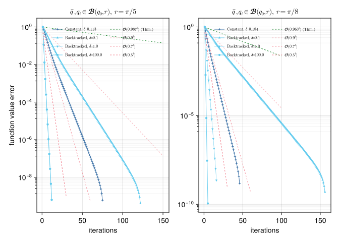

# A Geodesically Convex Example on the Sphere
Paula John
2026-06-15

## Introduction

In this example we compare the Convex Riemannian Proximal Gradient (CRPG) method [BergmannJasaJohnPfeffer:2025:2](@cite) with both a constant and a backtracked step size strategy on the sphere.
This example reproduces the results from [BergmannJasaJohnPfeffer:2025:2](@cite), Section 6.2.

``` julia
using PrettyTables
using BenchmarkTools
using CSV, DataFrames
using ColorSchemes, Plots, LaTeXStrings, CairoMakie, Chairmarks
using Random, LinearAlgebra, LRUCache
using ManifoldDiff, Manifolds, Manopt, ManoptExamples
import ColorSchemes.tol_vibrant
```

## The Problem

Let $\mathcal M = \mathbb S^2$ be the $2$-dimensional hyperbolic space.

Let $g \colon \mathcal M \to \mathbb R$ be defined by

``` math
g(p) = \frac{1}{2} \sum_{j = 1}^N w_j \, \mathrm{dist}(p, q_j)^2,
```

where $w_j$, $j = 1, \ldots, N$ are positive weights such that $\sum_{j = 1}^N w_j = 1$, and $\{q_1,\ldots,q_N\} \in \mathcal M$ denote $N = 1000$ Gaussian random data points.

Observe that the function $g$ is geodesically convex with respect to the Riemannian metric on $\mathcal M$ on balls of radius smaller than $\frac{\pi}{2}$.

Let now $\bar q$ be a given point, and let $h \colon \mathcal M \to \mathbb R$ be defined by

``` math
h(p) = \tau \mathrm{dist}(p, \bar q),
```

for some $\tau > 0$.
We define our total objective function as $f = g + h$.
Notice that this objective function is also geodesically convex with respect to the Riemannian metric on $\mathcal M$.
The goal is to find the minimizer of $f$ on $\mathcal M$.

## Numerical Experiment

We initialize the experiment parameters, as well as some utility functions.

``` julia
random_seed = 42

dims = [100, 500, 1000, 5000]
num_tests = 10

N = 1000 # Number of points
τ = 0.1  # weight parameter
max_it = 1000
stop = 1e-5
min_stepsize_bt = 1e-8

contraction_factor = 0.5
warm_start_factor = 2.0
# Choose a radius < pi/4
# The smaller the diameter of our set, the larger we can choose λ 
radius = pi/6
```

First we define the objective and related quantities

``` julia
# Objective, gradient, and proxes
_g(S, p, qs) = sum(distance(S, p, qk)^2 for qk in qs) / (2 * length(qs))
get_g(qs) = (S, p) -> _g(S, p, qs)
#
get_h(q_bar, τ) = (S, p) -> τ * distance(S, p, q_bar)
#
_grad_g(S, p, qs) = -sum(log(S, p, qk) for qk in qs) / length(qs)
get_grad_g(qs) = (S, p) -> _grad_g(S, p, qs)
#
function _prox(S, λ, p, q_bar, τ)
    if distance(S,p,q_bar) <= λ*τ
        return q_bar
    end 
    V = log(S,p,q_bar)
    return exp(S, p, λ * τ * V/norm(V))
end 
get_prox(q_bar, τ) = (S, λ, p) -> _prox(S, λ, p, q_bar, τ)
#
```

and then generate the problem data

``` julia
# Generate points and data
function generate_point(S, anchor, radius)
    X = rand(S; vector_at = anchor)
    return exp(S, anchor, rand()*radius*X/norm(X))
end 
function generate_data(S, radius; N=1000)
    anchor = rand(S)
    start = generate_point(S, anchor, radius)
    q_bar = generate_point(S, anchor, radius)
    qs = [generate_point(S, anchor, radius) for i in 1:N]
    return start, q_bar, qs
end
```

    generate_data (generic function with 1 method)

We now define some functions related to the stepsize selection

``` julia
# Stepsize calculation
get_λ_δ(α1, α2, αg, δ) = (sqrt(4*(α2 - α1)^2 + 1/(2 + δ)^2 * αg^2) - 2 * (α2 - α1)) / (2 * αg^2)
get_ζ_δ(δ) = pi/(2 + δ) * cot(pi/(2 + δ))
#
function get_const_stepsize(radius, τ)
    # α1 ≤ h(p) ≤ α2 ∀p ∈ B(anchor, radius)
    α1 = 0.0
    α2 = τ * 2 * radius
    # ||grad_g(p)|| ≤ αg ∀p ∈ B(anchor, radius)
    αg = 2 * radius 
    Lg = 1.0
    # Compute optimal δ for constant stepsize
    δ_grid = 0.0:0.001:0.4
    vals = [min(get_λ_δ(α1, α2, αg, δ),get_ζ_δ(δ)/Lg) for δ in 0.0:0.001:0.4]
    λ_const, max_idx = findmax(vals)
    return λ_const, δ_grid[max_idx]
end
```

    get_const_stepsize (generic function with 1 method)

Since the stepsizes are independent of the dimension, we define them here, in conjunction with the parameter $\delta$ used for the backtracking

``` julia
λ_const, δ = get_const_stepsize(radius, τ)
δ_bt = 1.0
λ_init = 10 * λ_const
```

    1.4758225181520177

Before running the experiments, we initialize data collection functions that we will use later

``` julia
# Header for the dataframe
column_names = [ 
  "Dim"        => Int64[],
  "Stepsize"   => Float64[],
  "Time"       => Float64[],
  "Iterations" => Int64[], 
  "Objective"  => Float64[]
]
column_labels = [
  :Dimension,
  :Stepsize,
  :Time,
  :Iterations,
  :Objective,
]
df_const = DataFrame(column_names, makeunique=true) 
df_bt = DataFrame(column_names, makeunique=true)
```

``` julia
function export_dataframes(
    M,
    records,
    times,
)
    B1 = DataFrame(;
        Dimension=manifold_dimension(M),
        Iterations_1=maximum(first.(records[1])),
        Time_1=times[1],
        Cost_1=minimum([r[2] for r in records[1]]),
        Iterations_2=maximum(first.(records[2])),
        Time_2=times[2],
        Cost_2=minimum([r[2] for r in records[2]]),
    )
    return B1
end
function write_dataframes(
    B1,
    results_folder,
    experiment_name,
)
    CSV.write(
        joinpath(
            results_folder,
            experiment_name *
            "-Comparisons.csv",
        ),
        B1;
        append=true,
    )
end
```

``` julia
for dim in dims 
    S = Manifolds.Sphere(dim)
    time_bt = 0.0
    time_const = 0.0

    iterations_bt = 0
    iterations_const = 0

    objective_bt = 0.0
    objective_const = 0.0

    for i in 1:num_tests
        Random.seed!(1520 + i)

        start, q_bar, qs = generate_data(S, radius)

        g = get_g(qs)
        h = get_h(q_bar, τ)
        f(S, p) = g(S, p) + h(S, p)
        grad_g = get_grad_g(qs)
        prox = get_prox(q_bar, τ)
        rec_const = proximal_gradient_method(S, f, g, grad_g, start;
            prox_nonsmooth=prox, 
            stepsize=ConstantLength(λ_const),
            record=[:Iteration, :Iterate],
            return_state=true,
            stopping_criterion=StopAfterIteration(max_it)| StopWhenGradientMappingNormLess(stop)
        )
        bm_const = @benchmark proximal_gradient_method($S, $f, $g, $grad_g, $start;
            prox_nonsmooth=$prox, 
            stepsize=ConstantLength($λ_const),
            stopping_criterion=StopAfterIteration($max_it)| StopWhenGradientMappingNormLess($stop)
        )
        rec_CRPG_bt = proximal_gradient_method(S, f, g, grad_g, start;
            prox_nonsmooth=prox, 
            stepsize=ProximalGradientMethodBacktracking(; 
                strategy=:convex, 
                initial_stepsize=λ_init, 
                stop_when_stepsize_less=min_stepsize_bt,
                δ=δ_bt,
                contraction_factor=contraction_factor,
                warm_start_factor=warm_start_factor,
                k_max=1.0,
            ),
            record=[:Iteration, :Iterate],
            return_state=true,
            stopping_criterion=StopAfterIteration(max_it)| StopWhenGradientMappingNormLess(stop)
        )
        bm_bt = @benchmark proximal_gradient_method($S, $f, $g, $grad_g, $start;
            prox_nonsmooth=$prox, 
            stepsize=ProximalGradientMethodBacktracking(;
                strategy=:convex,
                initial_stepsize=$λ_init,
                stop_when_stepsize_less=$min_stepsize_bt,
                δ=$δ_bt,
                contraction_factor=$contraction_factor,
                warm_start_factor=$warm_start_factor,
                k_max=$(1.0),
            ),
            stopping_criterion=StopAfterIteration($max_it)| StopWhenGradientMappingNormLess($stop)
        )

        it_const, res_const = get_record(rec_const)[end]
        it_bt, res_bt = get_record(rec_CRPG_bt)[end]

        t_const = median(bm_const).time/1e9
        t_bt    = median(bm_bt).time/1e9
        
        objective_bt += f(S, res_bt)
        objective_const += f(S, res_const)
        time_bt += t_bt
        time_const += t_const
        iterations_bt += it_bt
        iterations_const += it_const
    end 

    push!(df_const, [
      dim, λ_const, time_const/num_tests, iterations_const/num_tests, objective_const/num_tests
    ])
    push!(df_bt, [
      dim, λ_init, time_bt/num_tests, iterations_bt/num_tests, objective_bt/num_tests
    ])
end
```

We can take a look at how the algorithms compare to each other in their performance with the following tables.
The first table showcases the algorithm run with a constant stepsize…

| **Dimension** | **Stepsize** |  **Time** | **Iterations** | **Objective** |
|--------------:|-------------:|----------:|---------------:|--------------:|
|         100.0 |     0.147582 | 0.0231786 |           57.5 |     0.0775637 |
|         500.0 |     0.147582 |  0.102482 |           54.7 |     0.0632621 |
|        1000.0 |     0.147582 |  0.196127 |           61.8 |     0.0754969 |
|        5000.0 |     0.147582 |  0.534626 |           43.9 |     0.0618121 |

… while the second table showcases the algorithm run with a backtracked stepsize

| **Dimension** | **Stepsize** |  **Time** | **Iterations** | **Objective** |
|--------------:|-------------:|----------:|---------------:|--------------:|
|         100.0 |      1.47582 | 0.0130627 |           21.1 |     0.0775637 |
|         500.0 |      1.47582 | 0.0538948 |           19.9 |     0.0632621 |
|        1000.0 |      1.47582 |  0.109934 |           22.4 |     0.0754969 |
|        5000.0 |      1.47582 |  0.335534 |           16.4 |     0.0618121 |

## Test with different parameters

We now test CRPG on the same problem, but with different radii and different values of $\delta$.
We start by introducing these parameters

``` julia
radii = [pi/5, pi/8]
# (radius, algorithm, δ) → error vector
#   algorithm = :CONST for constant stepsize
#               :BT    for back‑tracking
#   δ is `missing` for the constant‑stepsize runs
global results = Dict{Tuple{Float64, Symbol, Union{Missing, Float64}}, Vector{Float64}}()
```

    Dict{Tuple{Float64, Symbol, Union{Missing, Float64}}, Vector{Float64}}()

As well as a function to save the generated data

``` julia
function export_dataframe(radius::Float64, algo::Symbol)
    # 5.1 Filter the dictionary for the wanted radius & algorithm = :BT
    bt_entries = [(δ, vec) for ((r, alg, δ), vec) in results
                  if r == radius && alg == algo]
    sort!(bt_entries, by = x -> x[1]) # sort by delta 
    max_len = maximum(length(v) for (_, v) in bt_entries)
    df = DataFrame(Iter = 1:max_len)
    # Add one column per δ
    for (δ, vec) in bt_entries
        δ = round(δ, digits=3)
        col_name = Symbol("delta$(δ)")                
        padded = vcat(vec, fill(NaN, max_len - length(vec)))
        df[!, col_name] = padded
    end
    return df
end
function write_csv(df, out_path::String)
    CSV.write(out_path, df; delim=",", writeheader=true)
end
```

    write_csv (generic function with 1 method)

And now we run the different experiments

``` julia
S = Manifolds.Sphere(500)
for radius in radii
    Random.seed!(1520)
    start, q_bar, qs = generate_data(S, radius; N = N)
    h = get_h(q_bar, τ)
    g = get_g(qs)
    f = (S, p) -> g(S, p) + h(S, p)
    grad_g = get_grad_g(qs)
    prox = get_prox(q_bar, τ)
    # constant stepsize 
    λ_const, δ_opt = get_const_stepsize(radius, τ)
    δs_bt = [0.1, 1.0, 100.0]
    λ_init = 10*λ_const

    rec_const = proximal_gradient_method(S, f, g, grad_g, start;
        prox_nonsmooth=prox, 
        stepsize=ConstantLength(λ_const),
        record=[:Iteration, :Iterate],
        return_state=true,
        stopping_criterion=StopAfterIteration(max_it)| StopWhenGradientMappingNormLess(stop)
    )
    iters_const = get_record(rec_const, :Iteration, :Iterate)
    prepend!(iters_const, [start])    
    obj_const = [f(S, it) for it in iters_const]
    err_const = [obj_const[i] - obj_const[end] for i in 1:length(obj_const)-1]
    # Normalise by the first error
    err_const ./= err_const[1]

    results[(radius, :CONST, δ_opt)] = err_const

    # Backtracking

    for δ_bt in δs_bt
        rec_bt = proximal_gradient_method(S, f, g, grad_g, start;
            prox_nonsmooth=prox, 
            stepsize=ProximalGradientMethodBacktracking(;
                strategy=:convex,
                initial_stepsize=λ_init,
                stop_when_stepsize_less=min_stepsize_bt,
                contraction_factor=contraction_factor,
                warm_start_factor=warm_start_factor,
                δ=δ_bt,
                k_max=1.0,
            ),
            record=[:Iteration, :Iterate],
            return_state=true,
            stopping_criterion=StopAfterIteration(max_it)| StopWhenGradientMappingNormLess(stop)
        )
        iters_bt = get_record(rec_bt, :Iteration, :Iterate)
        prepend!(iters_bt, [start])
        obj_bt = [f(S, it) for it in iters_bt]
        err_bt = [obj_bt[i] - obj_bt[end] for i in 1:length(obj_bt) - 1]
        err_bt ./= err_bt[1]
        results[(radius, :BT, δ_bt)] = err_bt
    end 
end
```

We now save the results of the experiments

Lastly, we plot the rate of decay of the function values for these experiments

``` julia
function plot_sphere_results(
    df_02_const, df_02_bt,
    df_0125_const, df_0125_bt,
)
    tol_blue  = colorant"#4477AA"
    tol_green = colorant"#228833"
    tol_cyan  = colorant"#66CCEE"
    tol_red   = colorant"#EE6677"

    ref_rates  = (0.9,   0.7,   0.5)
    ref_alphas = (0.5f0, 0.7f0, 0.9f0)
    bt_markers = (:utriangle, :dtriangle, :circle)
    bt_lws     = (1.0, 0.6, 1.0)

    configs = [
        (
            df_const  = df_02_const,
            df_bt     = df_02_bt,
            c_delta   = "delta0.113",
            bt_deltas = ("delta0.1",  "delta1.0", "delta100.0"),
            thm_rate  = 0.987,
            thm_xend  = 150,
            ref_xends = (150, 60, 30),
            subtitle  = L"\bar{q}, q_i \in \mathcal{B}(q_0, r),\; r = \pi/5",
        ),
        (
            df_const  = df_0125_const,
            df_bt     = df_0125_bt,
            c_delta   = "delta0.184",
            bt_deltas = ("delta0.1", "delta1.0", "delta100.0"),
            thm_rate  = 0.963,
            thm_xend  = 100,
            ref_xends = (100, 60, 30),
            subtitle  = L"\bar{q}, q_i \in \mathcal{B}(q_0, r),\; r = \pi/8",
        ),
    ]

    fig = Figure()#size = (1280, 720))

    for (col, cfg) in enumerate(configs)
        ax = Axis(fig[1, col];
            title  = cfg.subtitle,
            xlabel = "iterations",
            ylabel = col == 1 ? "function value error" : "",
            yscale = log10,
            yminorticksvisible = true,
            yminorgridvisible  = true,
            yminorticks        = IntervalsBetween(8),
        )

        iters_c = cfg.df_const[!, "Iter"]
        δ_c = split(cfg.c_delta, "delta")[2]

        scatterlines!(ax, iters_c, cfg.df_const[!, cfg.c_delta];
            color = tol_blue, linewidth = 1.0,
            marker = :star4, markersize = 6,
            label  = latexstring("\\text{Constant},\\;\\delta\\!=\\!$(δ_c)"), #L"\text{Constant},\;\delta\!=\!$(δ_c)",
        )
        lines!(ax, 1:cfg.thm_xend, cfg.thm_rate .^ (1:cfg.thm_xend);
            color = tol_green, linewidth = 1.0, linestyle = :dash,
            label = latexstring("\\mathcal{O}($(cfg.thm_rate)^k)\\;\\text{(Thm.)}"), # L"\mathcal{O}($(cfg.thm_rate)^k)\;\text{(Thm.)}",
        )

        iters_bt = cfg.df_bt[!, "Iter"]
        for (delta, mk, rr, x_end, alpha, lw) in zip(
            cfg.bt_deltas, bt_markers, ref_rates, cfg.ref_xends, ref_alphas, bt_lws
        )
            δ_v = split(delta, "delta")[2]
            scatterlines!(ax, iters_bt, cfg.df_bt[!, delta];
                color = tol_cyan, linewidth = lw,
                marker = mk, markersize = 6,
                label  = latexstring("\\text{Backtracked},\\;\\delta\\!=\\!$(δ_v)"), # L"\text{Backtracked},\;\delta\!=\!$(δ_v)",
            )
            lines!(ax, 1:x_end, rr .^ (1:x_end);
                color = (tol_red, alpha), linewidth = 1.0, linestyle = :dash,
                label = latexstring("\\mathcal{O}($(rr)^k)"), # L"\mathcal{O}($(rr)^k)",
            )
        end

        axislegend(ax;
            position     = :ct,
            nbanks       = 2,
            framevisible = false,
            labelsize    = 8,
            rowgap       = -3,
        )
    end

    return fig
end
fig = plot_sphere_results(df_02_const, df_02_bt, df_0125_const, df_0125_bt)
```

``` julia
display(fig)
```



    CairoMakie.Screen{IMAGE}

This is in line with the convergence rates of the CRPG method in the geodesically convex setting, as shown in [BergmannJasaJohnPfeffer:2025:2](@cite), Theorem 4.10.

## Technical details

This tutorial is cached. It was last run on the following package versions.

    Status `~/Repositories/Julia/ManoptExamples.jl/examples/Project.toml`
      [6e4b80f9] BenchmarkTools v1.8.0
      [336ed68f] CSV v0.10.16
      [13f3f980] CairoMakie v0.15.13
      [0ca39b1e] Chairmarks v1.3.1
      [35d6a980] ColorSchemes v3.31.0
      [5ae59095] Colors v0.13.1
      [a93c6f00] DataFrames v1.8.2
      [31c24e10] Distributions v0.25.129
      [e9467ef8] GLMakie v0.13.13
      [5c1252a2] GeometryBasics v0.5.11
      [4d00f742] GeometryTypes v0.8.5
      [7073ff75] IJulia v1.34.4
      [682c06a0] JSON v1.6.1
      [8ac3fa9e] LRUCache v1.6.2
      [b964fa9f] LaTeXStrings v1.4.0
      [d3d80556] LineSearches v7.7.1
      [ee78f7c6] Makie v0.24.13
      [7351309b] ManifoldAsymptote v0.1.0
      [af67fdf4] ManifoldDiff v0.4.5
      [9d80ff41] ManifoldMakie v0.1.2
      [1cead3c2] Manifolds v0.11.28
      [3362f125] ManifoldsBase v2.5.0
      [0fc0a36d] Manopt v0.6.2
      [5b8d5e80] ManoptExamples v0.1.20 `..`
      [51fcb6bd] NamedColors v0.2.3
      [6fe1bfb0] OffsetArrays v1.17.0
      [91a5bcdd] Plots v1.41.6
      [08abe8d2] PrettyTables v3.4.2
      [6099a3de] PythonCall v0.9.35
      [f468eda6] QuadraticModels v0.9.16
      [731186ca] RecursiveArrayTools v4.3.4
      [1e40b3f8] RipQP v0.7.0

This tutorial was last rendered July 20, 2026, 15:28:56.

## Literature

```@bibliography
Pages = ["CRPG-Convex-SPD.md"]
Canonical=false
```
