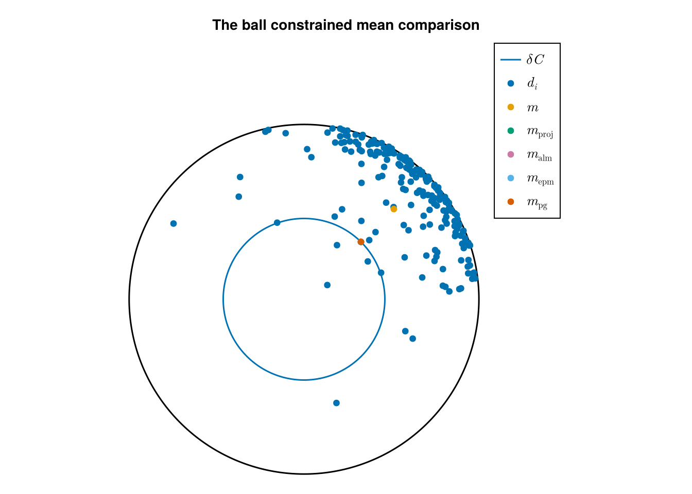
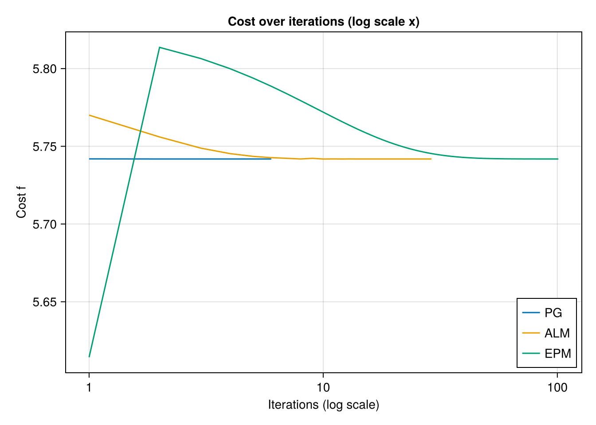

# The Constrained mean on Hyperbolic space.
Ronny Bergmann
2027-03-03

## Introduction

In this example we compare the Pprojected Gradient Algorithm (PGA) as introduced in [BergmannFerreiraNemethZhu:2025](@cite) with both the Augmented Lagrangian Method (ALM) and the Exact Penalty Method (EPM) [LiuBoumal:2019](@cite).

``` julia
using Chairmarks, CSV, DataFrames, Manifolds, Manopt, CairoMakie, Random
```

Consider the constrained Riemannian center of mass
for a given set of points \`\`q_i M\$ $i=1,\ldots,N$
given by

```math
\operatorname*{arg\,min}_{p\in\mathcal C}
\sum_{i=1}^N d_{\mathrm{M}}^2(p,q_i)
```

constrained to a set $\mathcal C \subset \mathcal M$.

For this experiment set $\mathcal M = \mathbb H^2$ is the [Hyperbolic space](@extref Manifolds :std:doc:`manifolds/hyperbolic`)
and the constrained set $\mathcal C = C_{c,r}$ as the ball of radius $r$ around the center point $c$, where we choose here $r=1$ and $c = (0,0,1)^{\mathrm{T}}$.

``` julia
M = Hyperbolic(2)
c = Manifolds._hyperbolize(M, [0, 0])
radius = 1.0
# Sample the boundary
unit_circle = [
    exp(M, c, get_vector(M, c, radius .* [cos(α), sin(α)], DefaultOrthonormalBasis())) for
    α in 0:(2π / 720):(2π)
]
```

Our data consists of $N=200$ points, where we skew the data a bit to force the mean to be outside of the constrained set $\mathcal C$.

``` julia
N = 200;
σ = 1.5
Random.seed!(42)
# N random points moved to top left to have a mean outside
data_pts = [
    exp(
        M,
        c,
        get_vector(
            M, c, σ .* randn(manifold_dimension(M)) .+ [2.5, 2.5], DefaultOrthonormalBasis()
        ),
    ) for _ in 1:N
]
```

## Cost, gradient and projection

We can formulate the constrained problem above in two different forms.
Both share a cost adn require a gradient. For performance reasons, we also provide a mutating variant of the gradient

``` julia
f(M, p; pts=[op]) = 1 / (2 * length(pts)) .* sum(distance(M, p, q)^2 for q in pts);

grad_f(M, p; pts=[op]) = -1 / length(pts) .* sum(log(M, p, q) for q in pts);

function grad_f!(M, X, p; pts=[op])
    zero_vector!(M, X, p)
    Y = zero_vector(M, p)
    for q in pts
        log!(M, Y, p, q)
        X .+= Y
    end
    X .*= -1 / length(pts)
    return X
end;
```

We can model the constrained either with an inequality constraint $g(p) \geq 0$ or using a projection onto the set. For the gradient of $g$ and the projection we again also provide mutating variants.

``` julia
g(M, p) = distance(M, c, p)^2 - radius^2;
indicator_C(M, p) = (g(M, p) ≤ 0) ? 0 : Inf;

function project_C(M, p, r=radius)
    X = log(M, c, p)
    n = norm(M, c, X)
    q = (n > r) ? exp(M, c, (r / n) * X) : copy(M, p)
    return q
end;
function project_C!(M, q, p; X=zero_vector(M, c), r=radius)
    log!(M, X, c, p)
    n = norm(M, c, X)
    if (n > r)
        exp!(M, q, c, (r / n) * X)
    else
        copyto!(M, q, p)
    end
    return q
end;

grad_g(M, p) = -2 * log(M, p, c);
function grad_g!(M, X, p)
    log!(M, X, p, c)
    X .*= -2
    return X
end
```

## The mean

For comparison, we first compute the Riemannian center of mass, that is the minimization above but not constrained to $\mathcal C$. We can then
project this onto $\mathcal C$.
For the projected mean we obtain $g(p) = 0$ since the original mean is outside of the set, the projected one lies on the boundary.

``` julia
mean_data = mean(M, data_pts)
mean_projected = project_C(M, mean_data)
g(M, mean_projected)
```

    0.0

## The experiment

We first define the specific data cost functions

``` julia
_f(M, p) = f(M, p; pts=data_pts)
_grad_f(M, p) = grad_f(M, p; pts=data_pts)
_grad_f!(M, X, p) = grad_f!(M, X, p; pts=data_pts)
```

and in a first run record a projected gradient method solver run

``` julia
mean_pg = copy(M, c) # start at the center
@time pgms = projected_gradient_method!(
    M, _f, _grad_f!, project_C!, mean_pg;
    evaluation=InplaceEvaluation(),
    indicator=indicator_C,
    debug=[:Iteration, :Cost, " ", :GradientNorm, "\n", 1, :Stop],
    record=[:Iteration, :Iterate, :Cost, :Gradient],
    stopping_criterion=StopAfterIteration(150) |
                       StopWhenProjectedGradientStationary(M, 1e-7),
    return_state=true,
)
```

    Initial f(x): 8.519830
    # 1     f(x): 5.741908 |grad f(p)|:3.560737798355543
    # 2     f(x): 5.741846 |grad f(p)|:1.881900575821152
    # 3     f(x): 5.741846 |grad f(p)|:1.8819696248924744
    # 4     f(x): 5.741846 |grad f(p)|:1.881964795224877
    # 5     f(x): 5.741846 |grad f(p)|:1.8819649705365404
    # 6     f(x): 5.741846 |grad f(p)|:1.8819649640556793
    At iteration 6 algorithm has reached a stationary point, since the distance from the last iterate to the projected gradient (1.0030679901141345e-8) less than 1.0e-7.
      1.589012 seconds (7.34 M allocations: 370.937 MiB, 3.65% gc time, 99.67% compilation time)

    # Solver state for `Manopt.jl`s Projected Gradient Method
    After 6 iterations

    ## Parameters
    * inverse retraction method: LogarithmicInverseRetraction()
    * retraction method: ExponentialRetraction()

    ## Stepsize for the gradient step
    ConstantLength(1.0; type=:relative)

    ## Stepsize for the complete step
    ArmijoLinesearch(;
        initial_stepsize=1.0
        retraction_method=ExponentialRetraction()
        contraction_factor=0.95
        sufficient_decrease=0.1
    )

    ## Stopping criterion

    Stop When _one_ of the following are fulfilled:
      * Max Iteration 150:  not reached
      * projected gradient stationary (<1.0e-7):    reached
    Overall: reached
    This indicates convergence: Yes

    ## Debug
        :Iteration = [(:Iteration, "# %-6d"), (:Cost, "f(x): %f"), " ", (:GradientNorm, "|grad f(p)|:%s"), "\n", 1]
        :Stop = :Stop

    ## Record
    (Iteration = RecordGroup([RecordIteration(), RecordIterate(Vector{Float64}), RecordCost(), RecordGradient{Vector{Float64}}()]),)

and similarly perform a first run of both the [augmented Lagrangian method](@extref `Manopt.augmented_Lagrangian_method`)
and the [exact penalty method](@extref `Manopt.exact_penalty_method`)

``` julia
mean_alm = copy(M, c)
@time alms = augmented_Lagrangian_method!(
    M, _f, _grad_f!, mean_alm;
    evaluation=InplaceEvaluation(),
    g=[g], grad_g=[grad_g!],
    debug=[:Iteration, :Cost, " ", "\n", 10, :Stop],
    record=[:Iteration, :Iterate, :Cost],
    return_state=true,
)
```

    Initial f(x): 8.519830
    # 10    f(x): 5.741814
    # 20    f(x): 5.741845
    The algorithm computed a step size (5.830448990119683e-11) less than 1.0e-10.
      1.748130 seconds (9.92 M allocations: 503.845 MiB, 4.47% gc time, 99.07% compilation time)

    # Solver state for `Manopt.jl`s Augmented Lagrangian Method
    After 29 iterations

    ## Parameters
    * ϵ: 0.0001348962882591652 (ϵ_min: 1.0e-6, θ_ϵ: 0.933254300796991)
    * λ: Float64[] (λ_min: -20.0, λ_max: 20.0)
    * μ: [0.94098958634295] (μ_max: 20.0)
    * ρ: 15241.579027587262 (θ_ρ: 0.3)
    * τ: 0.8
    * current penalty: 1.1472098826459387e-9

    ## Stopping criterion

    Stop When _one_ of the following are fulfilled:
      * Max Iteration 300:  not reached
      * Stop When _all_ of the following are fulfilled:
          * Field :ϵ ≤ 1.0e-6:  not reached
          * |Δp| < 0.00014454397707459258: not reached
        Overall: not reached
      * Stepsize s < 1.0e-10:   reached
    Overall: reached
    This indicates convergence: No

    ## Debug
        :Iteration = [(:Iteration, "# %-6d"), (:Cost, "f(x): %f"), " ", "\n", 10]
        :Stop = :Stop

    ## Record
    (Iteration = RecordGroup([RecordIteration(), RecordIterate(Vector{Float64}), RecordCost()]),)

``` julia
mean_epm = copy(M, c)
@time epms = exact_penalty_method!(
    M, _f, _grad_f!, mean_epm;
    evaluation = InplaceEvaluation(),
    g = [g], grad_g = [grad_g!],
    debug = [:Iteration, :Cost, " ", "\n", 25, :Stop],
    record = [:Iteration, :Iterate, :Cost],
    return_state = true,
)
```

    Initial f(x): 8.519830
    # 25    f(x): 5.747352
    # 50    f(x): 5.742157
    # 75    f(x): 5.741863
    # 100   f(x): 5.741847
    The value of the variable (ϵ) is smaller than or equal to its threshold (1.0e-6).
    At iteration 101 the algorithm performed a step with a change (5.712257693422003e-8) less than 1.0e-6.
      1.078051 seconds (7.59 M allocations: 359.751 MiB, 4.62% gc time, 89.39% compilation time)

    # Solver state for `Manopt.jl`s Exact Penalty Method
    After 101 iterations

    ## Parameters
    * ϵ: 1.0e-6 (ϵ_min: 1.0e-6, θ_ϵ: 0.933254300796991)
    * u: 1.0e-6 (ϵ_min: 1.0e-6, θ_u: 0.8912509381337456)
    * ρ: 3.3333333333333335 (θ_ρ: 0.3)

    ## Stopping criterion

    Stop When _one_ of the following are fulfilled:
      * Max Iteration 300:  not reached
      * Stop When _all_ of the following are fulfilled:
          * Field :ϵ ≤ 1.0e-6:  reached
          * |Δp| < 1.0e-6: reached
        Overall: reached
    Overall: reached
    This indicates convergence: Yes

    ## Debug
        :Iteration = [(:Iteration, "# %-6d"), (:Cost, "f(x): %f"), " ", "\n", 25]
        :Stop = :Stop

    ## Record
    (Iteration = RecordGroup([RecordIteration(), RecordIterate(Vector{Float64}), RecordCost()]),)

### Benchmark

After a first run we now Benchmark the three algorithms with [`Chairmarks.jl`](https://github.com/LilithHafner/Chairmarks.jl)

``` julia
pg_b = @be projected_gradient_method!(
    $M, $_f, $_grad_f!, $project_C!, $(copy(M, c));
    evaluation=$(InplaceEvaluation()),
    indicator=$indicator_C,
    stopping_criterion=$(
        StopAfterIteration(150) | StopWhenProjectedGradientStationary(M, 1e-7)
    ),
) evals = 1 samples = 5 seconds = 100
```

    Benchmark: 5 samples with 1 evaluation
     min    183.583 μs (3862 allocs: 145.734 KiB)
     median 231.000 μs (5486 allocs: 208.797 KiB)
     mean   290.992 μs (7353.60 allocs: 281.319 KiB)
     max    605.583 μs (17260 allocs: 666.000 KiB)

``` julia
alm_b = @be augmented_Lagrangian_method!(
    $M, $_f, $_grad_f!, $(copy(M, c));
    evaluation = $(InplaceEvaluation()),
    g = $([g]),
    grad_g = $([grad_g!]),
) evals = 1 samples = 5 seconds = 100
```

    Benchmark: 5 samples with 1 evaluation
     min    13.538 ms (322539 allocs: 11.890 MiB)
     median 15.662 ms (391018 allocs: 14.427 MiB)
     mean   15.472 ms (369894.80 allocs: 13.646 MiB, 2.63% compile time)
     max    16.310 ms (400764 allocs: 14.791 MiB, 13.15% compile time)

``` julia
epm_b = @be exact_penalty_method!(
    $M, $_f, $_grad_f!, $(copy(M, c));
    evaluation = $(InplaceEvaluation()),
    g = $([g]),
    grad_g = $([grad_g!]),
) evals = 1 samples = 5 seconds = 100
```

    Benchmark: 5 samples with 1 evaluation
     min    87.115 ms (1981548 allocs: 73.062 MiB)
     median 90.660 ms (1981548 allocs: 73.062 MiB)
     mean   94.963 ms (1981548 allocs: 73.062 MiB, 6.10% gc time)
     max    109.907 ms (1981548 allocs: 73.062 MiB, 16.78% gc time)

## Plots & results

``` julia
pb_x(data) = [convert(PoincareBallPoint, p).value[1] for p in data]
pb_y(data) = [convert(PoincareBallPoint, p).value[2] for p in data]
```

The results are

``` julia
fig = Figure()
axis = Axis(fig[1, 1], title = "The ball constrained mean comparison", aspect = 1)
arc!(Point2f(0, 0), 1, -π, π; color = :black)
lines!(axis, pb_x(unit_circle), pb_y(unit_circle); label = L"δC")
scatter!(axis, pb_x(data_pts), pb_y(data_pts), label = L"d_i")
scatter!(axis, pb_x([mean_data]), pb_y([mean_data]), label = L"m")
scatter!(
    axis,
    pb_x([mean_projected]),
    pb_y([mean_projected]),
    label = L"m_{\text{proj}}",
)
scatter!(axis, pb_x([mean_alm]), pb_y([mean_alm]), label = L"m_{\text{alm}}")
scatter!(axis, pb_x([mean_epm]), pb_y([mean_epm]), label = L"m_{\text{epm}}")
scatter!(axis, pb_x([mean_pg]), pb_y([mean_pg]), label = L"m_{\text{pg}}")
axislegend(axis, position = :rt)
xlims!(axis, -1.02, 1.5)
ylims!(axis, -1.02, 1.5)
hidespines!(axis)
hidedecorations!(axis)
fig
```



``` julia
min_cost = minimum(map(p -> _f(M, p), [mean_pg, mean_alm, mean_epm]))
```

    5.7418455315254855

``` julia
fig2 = Figure()
axis2 = Axis(
    fig2[1, 1];
    title="Cost over iterations (log scale x)",
    xscale=log10,
    yscale=identity,
    xticks=[1, 10, 100],
)
lines!(
    axis2,
    get_record(pgms, :Iteration, :Iteration),
    get_record(pgms, :Iteration, :Cost);
    label="PG",
)
lines!(
    axis2,
    get_record(alms, :Iteration, :Iteration),
    get_record(alms, :Iteration, :Cost);
    label="ALM",
)
lines!(
    axis2,
    get_record(epms, :Iteration, :Iteration),
    get_record(epms, :Iteration, :Cost);
    label="EPM",
)
axislegend(axis2; position=:rb)
#ylims!(axis2, min_cost-0.001,)
axis2.xlabel = "Iterations (log scale)"
axis2.ylabel = "Cost f"
fig2
```



## Literature

```@bibliography
Pages = ["Constrained-Mean-H2.md"]
Canonical=false
```

## Technical details

This tutorial is cached. It was last run on the following package versions.

    Status `/ManoptExamples.jl/examples/Project.toml`
      [6e4b80f9] BenchmarkTools v1.6.0
      [336ed68f] CSV v0.10.15
      [13f3f980] CairoMakie v0.13.4
      [0ca39b1e] Chairmarks v1.3.1
      [35d6a980] ColorSchemes v3.29.0
    ⌅ [5ae59095] Colors v0.12.11
      [a93c6f00] DataFrames v1.7.0
      [7073ff75] IJulia v1.27.0
      [682c06a0] JSON v0.21.4
      [8ac3fa9e] LRUCache v1.6.2
      [d3d80556] LineSearches v7.3.0
      [ee78f7c6] Makie v0.22.4
      [af67fdf4] ManifoldDiff v0.4.2
      [1cead3c2] Manifolds v0.10.16
      [3362f125] ManifoldsBase v1.0.3
      [0fc0a36d] Manopt v0.5.12
      [5b8d5e80] ManoptExamples v0.1.14 `..`
      [51fcb6bd] NamedColors v0.2.3
      [91a5bcdd] Plots v1.40.12
      [08abe8d2] PrettyTables v2.4.0
      [6099a3de] PythonCall v0.9.24
      [f468eda6] QuadraticModels v0.9.8
      [1e40b3f8] RipQP v0.6.4
    Info Packages marked with ⌅ have new versions available but compatibility constraints restrict them from upgrading. To see why use `status --outdated`

This tutorial was last rendered April 13, 2025, 14:06:35.
