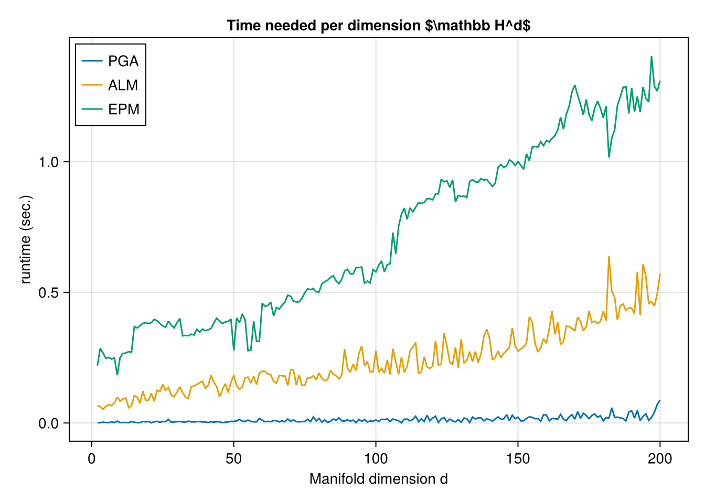

# The Constrained mean on high-dimensional Hyperbolic space.
Ronny Bergmann
2027-03-03

## Introduction

In this example we compare the Pprojected Gradient Algorithm (PGA) as introduced in [BergmannFerreiraNemethZhu:2025](@cite) with both the Augmented Lagrangian Method (ALM) and the Exact Penalty Method (EPM) [LiuBoumal:2019](@cite).

``` julia
using Chairmarks, CSV, DataFrames, Manifolds, Manopt, CairoMakie, Random
```

Consider the constrained Riemannian center of mass
for a given set of points \`\`q_i M\$ $i=1,\ldots,N$
given by

    \operatorname*{arg\,min}_{p\in\mathcal C} d_{\mathrm{M}}^2(p,d_i)

constrained to a set `\mathcal C \subset \mathcal M`.

For this experiment set `\mathcal M = \mathbb H^d` for `d=2,\ldots,200`, the [Hyperbolic space](@extref Manifolds :std:doc:`manifolds/hyperbolic`)
and the constrained set `\mathcal C = C_{c,r}` as the ball of radius `r` around the center point `c`, where we choose here `r=\frac{1}{\sqrt{n}}` and `c = (0,\ldots,0,1)^{\mathrm{T}}` and a `σ = \frac{3}{2}n^{1/4}`

``` julia
n_range = Vector(2:200)
radius_range = [1 / sqrt(n) for n in n_range]
N_range = [400 for n ∈ n_range]
M_range = [Hyperbolic(n) for n ∈ n_range]
σ_range = [ 1.5/sqrt(sqrt(n-1)) for n ∈ n_range]
```

Our data consists of `N=200` points, where we skew the data a bit to force the mean to be outside of the constrained set `\mathcal C`.

## Cost, gradient and projection

We can formulate the constrained problem above in two different forms.
Both share a cost adn require a gradient. For performance reasons, we also provide a mutating variant of the gradient

``` julia
f(M, p; pts=[]) = 1 / (2 * length(pts)) .* sum(distance(M, p, q)^2 for q in pts)

grad_f(M, p; pts=[]) = -1 / length(pts) .* sum(log(M, p, q) for q in pts)

function grad_f!(M, X, p; pts=[])
    zero_vector!(M, X, p)
    Y = zero_vector(M, p)
    for q in pts
        log!(M, Y, p, q)
        X .+= Y
    end
    X .*= -1 / length(pts)
    return X
end
```

We can model the constrained either with an inequality constraint `g(p) \geq 0` or using a projection onto the set. For the gradient of `g` and the projection we again also provide mutating variants.

``` julia
g(M, p; op=[], radius=1) = distance(M, op, p)^2 - radius^2;
indicator_C(M, p; op=[], radius=1) = (g(M, p; op=op, radius=radius) ≤ 0) ? 0 : Inf;

function project_C(M, p; op=[], radius=1)
    X = log(M, op, p)
    n = norm(M, op, X)
    q = (n > radius) ? exp(M, op, (radius / n) * X) : copy(M, p)
    return q
end;

function project_C!(M, q, p; radius=1, op=[], X=zero_vector(M, op))
    log!(M, X, op, p)
    n = norm(M, op, X)
    if (n > radius)
        exp!(M, q, op, (radius / n) * X)
    else
        copyto!(M, q, p)
    end
    return q
end;

grad_g(M, p; op=[]) = -2 * log(M, p, op)
function grad_g!(M, X, p; op=[])
    log!(M, X, p, op)
    X .*= -2
    return X
end
```

## the mean

For comparison, we first compute the Riemannian center of mass, that is the minimization above but not constrained to `\mathcal C`. We can then
project this onto `\mathcal C`.
For the projected mean we obtain `g(p) = 0` since the original mean is outside of the set, the projected one lies on the bounday.

We first generate all data

``` julia
centers = [[zeros(n)..., 1.0] for n in n_range]
begin
    Random.seed!(5)
    data = [
        [
            exp(
                M,
                c,
                get_vector(
                    M, c, σ * randn(n) .+ 2 * r .* ones(n), DefaultOrthonormalBasis()
                ),
            ) for _ in 1:N
        ] for
        (c, r, n, N, M, σ) in zip(centers, radius_range, n_range, N_range, M_range, σ_range)
    ]
end
```

``` julia
means = [mean(M, d) for (M, d) in zip(M_range, data)]
dc = [
    indicator_C(M, m; op=c, radius=r) for
    (M, m, c, r) in zip(M_range, means, centers, radius_range)
]
minimum(dc) # Sanity Check, this should be inf
```

    Inf

``` julia
Proj_means = [
    project_C(M, m; op=c, radius=r) for
    (M, m, c, r) in zip(M_range, means, centers, radius_range)
]
# Samll sanity check, these should all be about zero
ds = [distance(M, m, c) - r for (M, m, c, r) in zip(M_range, Proj_means, centers, radius_range)]
maximum(abs.(ds))
```

    1.1102230246251565e-16

## The experiment

We first define a single test function for one set of data for a manifold

``` julia
function bench_aep(Manifold, center, radius, data)
    # local functions
    _f(M, p) = f(M, p; pts=data)
    _grad_f!(M, X, p) = grad_f!(M, X, p; pts=data)
    _proj_C!(M, q, p) = project_C!(M, q, p; radius=radius, op=center)
    _g(M, p) = g(M, p; radius=radius, op=center)
    _grad_g!(M, X, p) = grad_g!(M, X, p; op=center)
    #
    #
    # returns
    stats = Dict(:PGA => Dict(), :ALM => Dict(), :EPM => Dict())
    #
    #
    # first runs
    # println(manifold_dimension(Manifold), ": ")
    mean_pga = copy(Manifold, center)
    pgas = projected_gradient_method!(
        Manifold,
        _f,
        _grad_f!,
        _proj_C!,
        mean_pga;
        evaluation=InplaceEvaluation(),
        record=[:Cost],
        stopping_criterion=StopAfterIteration(150) |
                           StopWhenProjectedGradientStationary(Manifold, 1e-7),
        return_state=true,
    )
    stats[:PGA][:Iter] = length(get_record(pgas, :Iteration))
    mean_alm = copy(Manifold, center)
    alms = augmented_Lagrangian_method!(
        Manifold,
        _f,
        _grad_f!,
        mean_alm;
        evaluation=InplaceEvaluation(),
        g=[_g],
        grad_g=[_grad_g!],
        record=[:Cost],
        return_state=true,
    )
    stats[:ALM][:Iter] = length(get_record(alms, :Iteration))
    mean_epm = copy(Manifold, center)
    epms = exact_penalty_method!(
        Manifold, _f, _grad_f!, mean_epm;
        evaluation=InplaceEvaluation(), return_state=true,
        g=[_g], grad_g=[_grad_g!], record=[:Cost],
    )
    stats[:EPM][:Iter] = length(get_record(epms, :Iteration))
    #
    #
    # Benchmarks
    pga_b = @be projected_gradient_method!($Manifold, $_f, $_grad_f!, $_proj_C!,
        $(copy(Manifold, center)); evaluation=$(InplaceEvaluation()),
        stopping_criterion=$(
            StopAfterIteration(150) | StopWhenProjectedGradientStationary(Manifold, 1e-7)
        ),
    ) evals = 1 samples = 10 seconds = 100
    stats[:PGA][:time] = mean(pga_b).time
    alm_b = @be augmented_Lagrangian_method!($Manifold, $_f, $_grad_f!,
        $(copy(Manifold, center)); evaluation=$(InplaceEvaluation()),
        g=$([_g]), grad_g=$([_grad_g!]),
    ) evals = 1 samples = 10 seconds = 100
    stats[:ALM][:time] = mean(alm_b).time
    epm_b = @be exact_penalty_method!($Manifold, $_f, $_grad_f!,
        $(copy(Manifold, center)); evaluation=$(InplaceEvaluation()),
        g=$([_g]), grad_g=$([_grad_g!]),
    ) evals = 1 samples = 10 seconds = 100
    stats[:EPM][:time] = mean(epm_b).time
    return stats
end
```

    bench_aep (generic function with 1 method)

and run these

The resulting plot of runtime is

``` julia
fig = Figure()
axis = Axis(fig[1, 1]; title=raw"Time needed per dimension $\mathbb H^d$")
lines!(axis, n_range, [bi[:PGA][:time] for bi in b]; label="PGA")
lines!(axis, n_range, [bi[:ALM][:time] for bi in b]; label="ALM")
lines!(axis, n_range, [bi[:EPM][:time] for bi in b]; label="EPM")
axis.xlabel = "Manifold dimension d"
axis.ylabel = "runtime (sec.)"
axislegend(axis; position=:lt)
fig
```

    ┌ Warning: Found `resolution` in the theme when creating a `Scene`. The `resolution` keyword for `Scene`s and `Figure`s has been deprecated. Use `Figure(; size = ...` or `Scene(; size = ...)` instead, which better reflects that this is a unitless size and not a pixel resolution. The key could also come from `set_theme!` calls or related theming functions.
    └ @ Makie ~/.julia/packages/Makie/ux0Te/src/scenes.jl:238



and the number of iterations reads

``` julia
fig2 = Figure()
axis2 = Axis(fig2[1, 1]; title=raw"Iterations needed per dimension $\mathbb H^d$")
lines!(axis2, n_range, [bi[:PGA][:Iter] for bi in b]; label="PGA")
lines!(axis2, n_range, [bi[:ALM][:Iter] for bi in b]; label="ALM")
lines!(axis2, n_range, [bi[:EPM][:Iter] for bi in b]; label="EPM")
axis2.xlabel = "Manifold dimension d"
axis2.ylabel = "# Iterations"
axislegend(axis2; position=:lt)
fig2
```

    ┌ Warning: Found `resolution` in the theme when creating a `Scene`. The `resolution` keyword for `Scene`s and `Figure`s has been deprecated. Use `Figure(; size = ...` or `Scene(; size = ...)` instead, which better reflects that this is a unitless size and not a pixel resolution. The key could also come from `set_theme!` calls or related theming functions.
    └ @ Makie ~/.julia/packages/Makie/ux0Te/src/scenes.jl:238


## Literature

```@bibliography
Pages = ["Constrained-Mean-Hn.md"]
Canonical=false
```

## Technical details

This tutorial is cached. It was last run on the following package versions.

    Status `~/.julia/environments/v1.11/Project.toml`
      [d1e3940c] AlgorithmsInterface v0.1.0 `../../../Repositories/Julia/IterativeAlgorithmsInterface.jl`
      [4c88cf16] Aqua v0.8.11
      [6e4b80f9] BenchmarkTools v1.6.0
      [336ed68f] CSV v0.10.15
      [13f3f980] CairoMakie v0.13.2
      [0ca39b1e] Chairmarks v1.3.1
      [35d6a980] ColorSchemes v3.29.0
      [5ae59095] Colors v0.13.0
      [8f4d0f93] Conda v1.10.2
      [d38c429a] Contour v0.6.3
      [acf6eb54] DFTK v0.7.11
      [f07c2035] DOI2BibTeX v0.1.7
      [a93c6f00] DataFrames v1.7.0
    ⌃ [a0c0ee7d] DifferentiationInterface v0.6.48
      [31c24e10] Distributions v0.25.118
      [e30172f5] Documenter v1.9.0
      [daee34ce] DocumenterCitations v1.3.6
      [d12716ef] DocumenterInterLinks v1.0.0
      [35a29f4d] DocumenterTools v0.1.20
      [497a8b3b] DoubleFloats v1.4.3
      [5789e2e9] FileIO v1.17.0
      [26cc04aa] FiniteDifferences v0.12.32
    ⌅ [f6369f11] ForwardDiff v0.10.38
      [713c75ef] Franklin v0.10.95
      [e9467ef8] GLMakie v0.11.3
      [4d00f742] GeometryTypes v0.8.5
      [86223c79] Graphs v1.12.0
      [7073ff75] IJulia v1.26.0
      [98e50ef6] JuliaFormatter v1.0.62
      [8ac3fa9e] LRUCache v1.6.2
      [b4f0291d] LazySets v3.1.0
      [6774de46] LieGroups v0.0.3 `../../../Repositories/Julia/LieGroups.jl`
      [ee78f7c6] Makie v0.22.2
      [af67fdf4] ManifoldDiff v0.4.2 `../../../Repositories/Julia/ManifoldDiff.jl`
      [21be47e3] ManifoldExamples v0.1.0 `../../../Repositories/Julia/ManifoldExamples.jl`
      [1cead3c2] Manifolds v0.10.15 `../../../Repositories/Julia/Manifolds.jl`
      [3362f125] ManifoldsBase v1.0.1 `../../../Repositories/Julia/ManifoldsBase.jl`
      [0fc0a36d] Manopt v0.5.9 `../../../Repositories/Julia/Manopt.jl`
      [5b8d5e80] ManoptExamples v0.1.13 `../../../Repositories/Julia/ManoptExamples.jl`
      [2774e3e8] NLsolve v4.5.1
      [51fcb6bd] NamedColors v0.2.3
      [6fe1bfb0] OffsetArrays v1.16.0
      [5fb14364] OhMyREPL v0.5.29
      [8314cec4] PGFPlotsX v1.6.2
      [91a5bcdd] Plots v1.40.11
      [c3e4b0f8] Pluto v0.20.5
      [33c8b6b6] ProgressLogging v0.1.4
      [94ee1d12] Quaternions v0.7.6
    ⌃ [731186ca] RecursiveArrayTools v3.31.1
    ⌃ [37e2e3b7] ReverseDiff v1.15.3
      [295af30f] Revise v3.7.3
      [6038ab10] Rotations v1.7.1
      [47aef6b3] SimpleWeightedGraphs v1.5.0
      [90137ffa] StaticArrays v1.9.13
      [2913bbd2] StatsBase v0.34.4
      [0c5d862f] Symbolics v6.34.0
      [d6d074c3] VideoIO v1.1.1
      [276b4fcb] WGLMakie v0.11.2
      [952999c0] WatchJuliaBurn v0.2.0
      [e88e6eb3] Zygote v0.7.5
      [9a3f8284] Random v1.11.0
    Info Packages marked with ⌃ and ⌅ have new versions available. Those with ⌃ may be upgradable, but those with ⌅ are restricted by compatibility constraints from upgrading. To see why use `status --outdated`

This tutorial was last rendered March 29, 2025, 17:39:0.
