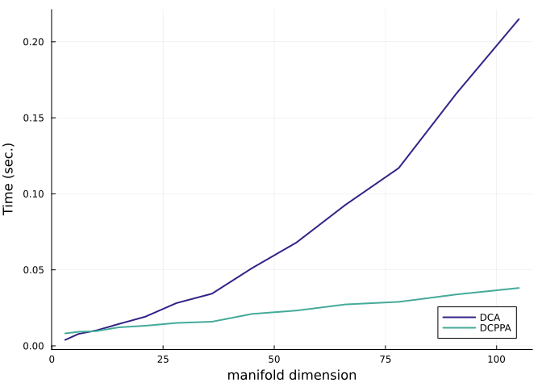

# Benchmark of the Difference of Convex Algorithms
Ronny Bergmann
2023-06-06

## Introduction

In this Benchmark we compare the Difference of Convex Algprithm (DCA) [BergmannFerreiraSantosSouza:2024](@cite)
and the Difference of Convex Proximal Point Algorithm (DCPPA) [SouzaOliveira:2015](@cite) which solve
Difference of Convex (DC) problems of the form. This Benchmark reproduces the results from [BergmannFerreiraSantosSouza:2024](@cite), Section 7.1.

``` math
\operatorname*{arg\,min}_{p\in\mathcal M}\ \  g(p) - h(p)
```

where $g,h\colon \mathcal M \to \mathbb R$ are geodesically convex function on the Riemannian manifold $\mathcal M$.

``` julia
using LinearAlgebra, Random, Statistics, BenchmarkTools
using Manifolds, Manopt, ManoptExamples
using NamedColors, Plots
Random.seed!(42)
```

and we load a few nice colors

``` julia
paul_tol = load_paul_tol()
indigo = paul_tol["mutedindigo"]
teal = paul_tol["mutedteal"]
```

## The DC Problem

We start with defining the two convex functions $g,h$ and their gradients as well as the DC problem $f$ and its gradient for the problem

``` math
    \operatorname*{arg\,min}_{p\in\mathcal M}\ \ \bigl( \log\bigr(\det(p)\bigr)\bigr)^4 - \bigl(\log \det(p) \bigr)^2.
```

where the critical points obtain a functional value of $-\frac{1}{4}$.

where $\mathcal M$ is the manifold of [symmetric positive definite (SPD) matrices](https://juliamanifolds.github.io/Manifolds.jl/stable/manifolds/symmetricpositivedefinite.html) with the [affine invariant metric](https://juliamanifolds.github.io/Manifolds.jl/stable/manifolds/symmetricpositivedefinite.html#Default-metric:-the-affine-invariant-metric), which is the default.

We first define the corresponding functions

``` julia
g(M, p) = log(det(p))^4
h(M, p) = log(det(p))^2
f(M, p) = g(M, p) - h(M, p)
```

and their gradients

``` julia
grad_g(M, p) = 4 * (log(det(p)))^3 * p
grad_h(M, p) = 2 * log(det(p)) * p
grad_f(M, p) = grad_g(M, p) - grad_h(M, p)
```

which we can use to verify that the gradients of $g$ and $h$ are correct.
We use for that

``` julia
n = 6
M = SymmetricPositiveDefinite(n)
p0 = log(n) * Matrix{Float64}(I, n, n);
X0 = 1 / n * Matrix{Float64}(I, n, n);
```

to tall both checks

``` julia
check_gradient(M, g, grad_g, p0, X0; plot=true)
```


and

``` julia
check_gradient(M, h, grad_h, p0, X0; plot=true)
```


which both pass the test.
We continue to define their inplace variants

``` julia
function grad_g!(M, X, p)
    copyto!(M, X, p)
    X .*= 4 * (log(det(p)))^3
    return X
end
function grad_h!(M, X, p)
    copyto!(M, X, p)
    X .*= 2 * (log(det(p)))
    return X
end
function grad_f!(M, X, p)
    grad_g!(M, X, p)
    Y = copy(M, p, X)
    grad_h!(M, Y, p)
    X .-= Y
    return X
end
```

And compare times for both algorithms, with a bit of debug output.

``` julia
@time p_min_dca = difference_of_convex_algorithm(
    M,
    f,
    g,
    grad_h!,
    p0;
    grad_g=grad_g!,
    gradient=grad_f!,
    evaluation=InplaceEvaluation(),
    debug=[
        :Iteration,
        (:Cost, "f(p): %1.9f"),
        (:GradientNorm, " |grad_f(p)|: %1.9f"),
        (:Change, " |δp|: %1.9f"),
        :Stop,
        5,
        "\n",
    ],
    stopping_criterion=StopAfterIteration(5000) | StopWhenGradientNormLess(1e-10),
    sub_stopping_criterion=StopAfterIteration(100) | StopWhenGradientNormLess(1e-10),
);
```

    Initial f(p): 137.679053470
    # 5     f(p): -0.249956120 |grad_f(p)|: 0.046196628 |δp|: 0.201349127
    # 10    f(p): -0.249999999 |grad_f(p)|: 0.000187633 |δp|: 0.000626103
    # 15    f(p): -0.250000000 |grad_f(p)|: 0.000000772 |δp|: 0.000002574
    # 20    f(p): -0.250000000 |grad_f(p)|: 0.000000005 |δp|: 0.000000011
    The algorithm reached approximately critical point after 24 iterations; the gradient norm (7.619584706652929e-11) is less than 1.0e-10.
      3.531235 seconds (8.71 M allocations: 628.709 MiB, 3.52% gc time, 67.16% compilation time)

The cost is

``` julia
f(M, p_min_dca)
```

    -0.25000000000000006

Similarly the DCPPA performs

``` julia
@time p_min_dcppa = difference_of_convex_proximal_point(
    M,
    grad_h!,
    p0;
    g=g,
    grad_g=grad_g!,
    λ=i -> 1 / (2 * n),
    cost=f,
    gradient=grad_f!,
    debug=[
        :Iteration,
        (:Cost, "f(p): %1.9f"),
        " ",
        (:GradientNorm, "|grad_f(p)|: %1.10f"),
        (:Change, "|δp|: %1.10f"),
        :Stop,
        5,
        "\n",
    ],
    evaluation=InplaceEvaluation(),
    stepsize=ConstantStepsize(1.0),
    stopping_criterion=StopAfterIteration(5000) | StopWhenGradientNormLess(1e-10),
    sub_stopping_criterion=StopAfterIteration(100) | StopWhenGradientNormLess(1e-10),
);
```

    Initial f(p): 137.679053470
    # 5     f(p): -0.248491803 |grad_f(p)|: 0.2793140152|δp|: 0.2753827692
    # 10    f(p): -0.249998655 |grad_f(p)|: 0.0080437374|δp|: 0.0050891316
    # 15    f(p): -0.249999999 |grad_f(p)|: 0.0002507329|δp|: 0.0001567676
    # 20    f(p): -0.250000000 |grad_f(p)|: 0.0000078348|δp|: 0.0000048968
    # 25    f(p): -0.250000000 |grad_f(p)|: 0.0000002448|δp|: 0.0000001530
    # 30    f(p): -0.250000000 |grad_f(p)|: 0.0000000076|δp|: 0.0000000048
    # 35    f(p): -0.250000000 |grad_f(p)|: 0.0000000002|δp|: 0.0000000001
    The algorithm reached approximately critical point after 37 iterations; the gradient norm (5.458071707233144e-11) is less than 1.0e-10.
      1.341931 seconds (2.55 M allocations: 180.474 MiB, 2.46% gc time, 59.94% compilation time)

It needs a few more iterations, but the single iterations are slightly faster.
Both obtain the same cost

``` julia
f(M, p_min_dcppa)
```

    -0.25

## Benchmark I: Time comparison

We compare both solvers first with respect to time. We initialise two vectors to collect
the results and a range of natrix sizes to test

``` julia
dca_benchmarks = Dict{Int,BenchmarkTools.Trial}()
dcppa_benchmarks = Dict{Int, BenchmarkTools.Trial}()
N_max=14
N = 2:N_max
```

and run a benchmark for both algorithms

``` julia
for n in N
    Mn = SymmetricPositiveDefinite(n)
    pn = log(n) * Matrix{Float64}(I, n, n)
    bdca = @benchmark difference_of_convex_algorithm(
        $Mn,
        $f,
        $g,
        $grad_h!,
        $pn;
        grad_g=$grad_g!,
        gradient=$grad_f!,
        evaluation=InplaceEvaluation(),
        stopping_criterion=StopAfterIteration(5000) | StopWhenGradientNormLess(1e-10),
        sub_stopping_criterion=StopAfterIteration(100) | StopWhenGradientNormLess(1e-10),
    )
    dca_benchmarks[n] = bdca
    bdcppa = @benchmark difference_of_convex_proximal_point(
        $Mn,
        $grad_h!,
        $pn;
        g=$g,
        grad_g=$grad_g!,
        λ=i -> 1 / (2 * n),
        cost=f,
        gradient=grad_f!,
        evaluation=InplaceEvaluation(),
        stepsize=ConstantStepsize(1.0),
        stopping_criterion=StopAfterIteration(5000) | StopWhenGradientNormLess(1e-10),
        sub_stopping_criterion=StopAfterIteration(100) | StopWhenGradientNormLess(1e-10),
    )
    dcppa_benchmarks[n] = bdcppa
end
```

Since we want to plot this versus the manifold dimension, we also create a vector for those and convert the times to seconds

``` julia
dims = [manifold_dimension(SymmetricPositiveDefinite(n)) for n in N]
dca_times = [mean(dca_benchmarks[n]).time / 1e9 for n in N]
dcppa_times = [mean(dcppa_benchmarks[n]).time / 1e9 for n in N]
```

``` julia
plot(; legend=:bottomright, xlabel="manifold dimension", ylabel="Time (sec.)")
plot!(dims, dca_times; label="DCA", color=indigo, linewidth=2)
plot!(dims, dcppa_times; label="DCPPA", color=teal, linewidth=2)
```



## Benchmark II: Iterations and cost.

As a second benchmark, let’s collect the number of iterations needed and the development of the cost over dimensions.

``` julia
N2 = [5,10,20,40,80]
dims2 = [manifold_dimension(SymmetricPositiveDefinite(n)) for n in N2]
dca_iterations = Dict{Int,Int}()
dca_costs = Dict{Int,Vector{Float64}}()
dcppa_iterations = Dict{Int,Int}()
dcppa_costs = Dict{Int,Vector{Float64}}()
```

``` julia
@time for n in N2
    println(n)
    Mn = SymmetricPositiveDefinite(n)
    pn = log(n) * Matrix{Float64}(I,n,n);
    @time dca_st = difference_of_convex_algorithm(
        Mn, f, g, grad_h!, pn;
        grad_g=grad_g!,
        gradient=grad_f!,
        evaluation = InplaceEvaluation(),
        stopping_criterion = StopAfterIteration(5000) | StopWhenGradientNormLess(1e-10),
        sub_stopping_criterion = StopAfterIteration(100) | StopWhenGradientNormLess(1e-10),
        record = [:Iteration, :Cost],
        return_state = true,
    );
    dca_costs[n] = get_record(dca_st, :Iteration, :Cost)
    dca_iterations[n] = length(dca_costs[n])
    @time dcppa_st = difference_of_convex_proximal_point(
        Mn, grad_h!, pn;
        g=g,
        grad_g=grad_g!,
        λ = i -> 1/(2*n),
        cost = f,
        gradient= grad_f!,
        evaluation = InplaceEvaluation(),
        stepsize = ConstantStepsize(1.0),
        stopping_criterion = StopAfterIteration(5000) | StopWhenGradientNormLess(1e-10),
        sub_stopping_criterion = StopAfterIteration(100) | StopWhenGradientNormLess(1e-10),
        record = [:Iteration, :Cost],
        return_state = true,
    );
    dcppa_costs[n] = get_record(dcppa_st, :Iteration, :Cost)
    dcppa_iterations[n] = length(dcppa_costs[n])
end
```

The iterations are like

``` julia
plot(; legend=:bottomright, xlabel="manifold dimension", ylabel="Iterations")
plot!(dims2, [values(dca_iterations)...]; label="DCA", color=indigo, linewidth=2)
plot!(dims2, [values(dcppa_iterations)...]; label="DCPPA", color=teal, linewidth=2)
```


And for the developtment of the cost


where we can see that the DCA needs less iterations than the DCPPA.

## Literature

```@bibliography
Pages = ["Difference-of-Convex-Benchmark.md"]
Canonical=false
```
