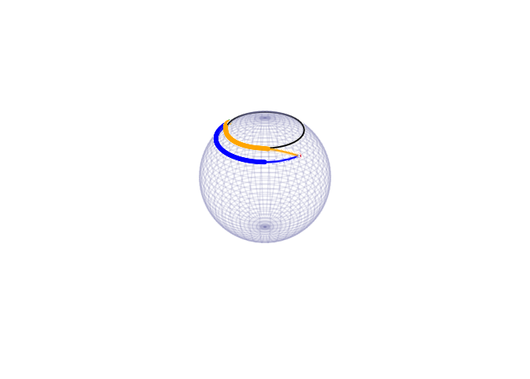

# Geodesic on Sphere with Obstacle Avoidance
Laura Weigl, Ronny Bergmann, and Anton Schiela
2025-11-25

``` julia
using LinearAlgebra, SparseArrays, OffsetArrays
using Manifolds, Manopt, ManoptExamples
using GLMakie, Makie, GeometryTypes, Colors, ColorSchemes, NamedColors
using CSV, DataFrames
```

# Introduction

In this example we compute a geodesic on the sphere avoiding an obstacle by applying Newton’s method on vector bundles which was introduced in [WeiglBergmannSchiela:2025](@cite). This example reproduces the results from the example in Section 6.2 therein.

We consider the sphere $$\mathbb{S}^2$$ equipped with the Riemannian metric $\langle \cdot, \cdot \rangle$ given by the Euclidean inner product with corresponding norm $\lVert\cdot\rVert$ and a time interval $Ω =[0,T]$.

Let $\mathcal X = H^1(Ω, \mathbb S^2)$ and $\mathcal E^* = T^*\mathcal X$ its cotangent bundle.

Consider the minimization problem

$\min_{γ ∈ H^1(Ω, \mathbb S^2)} \; \frac12 \int_0^T \lVert\dot γ(t)\rVert^2 \; \mathrm{d}t$

under the constraint that $γ_3(t) ≤ 1-h_{\mathrm{ref}} \; \text{ for all } t∈ [0,T]$ where $γ_3(t)$ denotes the third component of $γ(t)∈ \mathbb{S}^2$ and $h_{\mathrm{ref}} ∈ (0,1)$ is a given height. Additionally, we have to take into account that boundary conditions $γ(0) = γ_0$ and $γ(T) = γ_T$ for given $γ_0, γ_T ∈ \mathbb S^2$ are satisfied.

Using a penalty method, also known as Moreau-Yosida regularization with a quadratic penalty term we can rewrite this as an unconstrained minimization problem with a penalty coefficient $p∈ \mathbb R$:

$\min_{γ ∈ H^1(Ω, \mathbb S^2)} \; \underbrace{\frac12 \int_0^T \lVert\dot γ(t)\rVert^2 + p \max(0, γ_3(t) - 1 + h_{\mathrm{ref}})^2 \; \mathrm{d}t}_{=: f(γ)}$

Let $m: \mathbb R → \mathbb R, \, m(x): eqq \max(0, x)$.
The objective is differentiable function $f : \mathcal X → \mathbb R$ with derivative

``` math
f'(γ)δ γ = \int_0^T \langle \dotγ(t), \dot{δ γ}(t)\rangle + p \cdot m(γ_3(t) - 1 + h_{\mathrm{ref}})δ γ_3(t)
```

for $δ γ ∈ T_γ \mathcal X$.
This mapping is semismooth and our goal is to find a critical point of $f$ by applying Newton’s method on $f'$.

This then yields a geodesic avoiding the north pol cap and connecting $γ_0$ and $γ_T$.

For our example we set

``` julia
N=200

S = Manifolds.Sphere(2)
power = PowerManifold(S, NestedPowerRepresentation(), N) # power manifold of S

mutable struct variational_space
    manifold::AbstractManifold
    degree::Integer
end

test_space = variational_space(S, 1)

start_interval = -pi/2 + 0.1
end_interval = pi/2 - 0.1
discrete_time = range(; start=start_interval, stop = end_interval, length=N+2) # equidistant discrete time points

θ = pi/4
y0 = [sin(θ)*cos(start_interval),sin(θ)*sin(start_interval),cos(θ)] # startpoint of geodesic
yT = [sin(θ)*cos(end_interval),sin(θ)*sin(end_interval),cos(θ)] # endpoint of geodesic

h_ref = 0.17
```

    0.17

In order to apply Newton’s method to find a zero of $f'$, we need the linear mapping $Q_{f'(γ)}^*\circ f''(γ)$ (cf. ). Since the sphere is an embedded submanifold of $\mathbb R^3$, we can use the formula

$Q_{f'(γ)}^*\circ f''(γ)δ γ\,\phi = f'(γ)(\overset{→}{V}_γ'(γ)δ γ\,\phi) + f''_{\mathbb R^3}(γ)δ γ\,\phi$

for $δ γ, \, \phi ∈ T_γ \mathcal X$, where $\overset{→}{V}_γ(\hat γ) ∈ L(T_γ \mathcal X, T_{\hat{γ}}\mathcal X)$ is a vector transport and

$f_{\mathbb R^3}''(γ)δ γ\, \phi = \int_0^T \langle \dot{δ γ}(t), \dot{\phi}(t)\rangle + p \cdot m'(γ_3(t) - 1 + h_{\mathrm{ref}})\phi_{3}(t) δ γ_{3}(t)$

is an (euclidean) Newton-derivative of f’.

We define a structure that has to be filled for two purposes:
\* Definition of an integrand and its derivative
\* Definition of a vector transport and its derivative

``` julia
mutable struct DifferentiableMapping{F1<:Function,F2<:Function,T}
    value::F1
    derivative::F2
    scaling_penalty::T
end;
```

The following routines define a vector transport and its euclidean derivative. As seen above, they are needed to derive $Q_{f'(γ)}^*\circ f''(γ)$.

As a vector transport we use the (pointwise) orthogonal projection onto the tangent spaces, i.e. for $p, q ∈ \mathbb S^2$ and $X ∈ T_p\mathbb S^2$ we set

$\overset{→}{V}_{p}(q)X = (I-q\cdot q^T)X ∈ T_q\mathbb S^2.$

The derivative of the vector transport is then given by

$\left(\frac{d}{dq}\overset{→}{V}_{p}(q)\big\vert_{q=p}δ q\right)X = \left( - δ q\cdot p^T - p\cdot δ q^T\right)\cdot X.$

``` julia
function transport_by_proj(S, p, X, q)
    return X - q*(q'*X)
end
function transport_by_proj_prime(S, p, X, dq)
    return (- dq*p' - p*dq')*X
end
transport = DifferentiableMapping(transport_by_proj,transport_by_proj_prime,nothing)
```

    DifferentiableMapping{typeof(transport_by_proj), typeof(transport_by_proj_prime), Nothing}(transport_by_proj, transport_by_proj_prime, nothing)

The following two routines define the integrand of $f'$ and the euclidean second derivative $f''_{\mathbb R^3}$. Here, a Newton-derivative of the maximum function given by

``` math
m'(x): eqq \begin{cases}
        0 &: \; x<0 \\
        \text{arbitrary} &: \; x= 0\\
        1 &: \; x>0
    \end{cases}
```

is used. A scaling parameter for the penalty parameter is also employed.

``` julia
function f_prime_at(Integrand, y, ydot, B, Bdot)
    return ydot'*Bdot + Integrand.scaling_penalty * max(0.0, y[3] - 1.0 + h_ref)*B[3]
end
function max_prime(y)
    if y[3] < 1.0 - h_ref
        return 0.0
    else
        return 1.0
    end
end
function f_second_at(Integrand,y,ydot,B1,B1dot,B2,B2dot)
    return B1dot'*B2dot + Integrand.scaling_penalty*max_prime(y)*B1[3]*B2[3]
end
integrand = DifferentiableMapping(f_prime_at,f_second_at,1.0)
```

    DifferentiableMapping{typeof(f_prime_at), typeof(f_second_at), Float64}(f_prime_at, f_second_at, 1.0)

## Newton Equation

In this example we implement a functor to compute the Newton matrix and the right hand side for the Newton equation

``` math
Q^*_{f''(γ)}\circ f''(γ)δ γ + f'(γ) = 0^*_γ
```

by using the assembler provided in ManoptExamples.jl (cf. Referenz).

It returns the matrix and the right hand side in base representation.

The assembly routines need a function for evaluation the iterates at the left and right quadrature point.

``` julia
evaluate(p, i, tloc) = (1.0-tloc)*p[i-1]+tloc*p[i];

struct NewtonEquation{F, TS, T, I, NM, Nrhs}
    integrand::F
    test_space::TS
    transport::T
    time_interval::I
    A::NM
    b::Nrhs
end

function NewtonEquation(M, F, test_space, VT, interval)
    n = manifold_dimension(M)
    A = spzeros(n,n)
    b = zeros(n)
    return NewtonEquation{typeof(F), typeof(test_space), typeof(VT), typeof(interval), typeof(A), typeof(b)}(F, test_space, VT, interval, A, b)
end

function (ne::NewtonEquation)(M, VB, p)
    n = manifold_dimension(M)
    ne.A .= spzeros(n,n)
    ne.b .= zeros(n)

    Op = OffsetArray([y0, p..., yT], 0:(length(p)+1))

    ManoptExamples.get_jacobian!(M, Op, evaluate, ne.A, ne.integrand, ne.transport, ne.time_interval; test_space=ne.test_space)

    ManoptExamples.get_right_hand_side!(M, Op, evaluate, ne.b, ne.integrand, ne.time_interval; test_space=ne.test_space)
end
```

We compute the Newton direction $δ γ$ by solving the linear system given by the base representation of the Newton equation directly and return the Newton direction in vector representation:

``` julia
function solve_in_basis_repr(problem, newtonstate)
    X_base = (problem.newton_equation.A) \ (-problem.newton_equation.b)
    return get_vector(problem.manifold, newtonstate.p, X_base, DefaultOrthogonalBasis())
end;
```

For the computation of a solution of the penalized problem we use a simple path-following method increasing the penalty parameter by a factor 1.2 in each iteration. For the first iteration we use a curve along the latitude connecting $γ_0$ and $γ_T$:

``` julia
y(t) = [sin(θ)*cos(t), sin(θ)*sin(t), cos(θ)]
discretized_y = [y(ti) for ti in discrete_time[2:end-1]];
```

``` julia
y_star = copy(power, discretized_y)

    integrand.scaling_penalty = 5.0

    NE = NewtonEquation(power, integrand, test_space, transport, discrete_time)

    st_res = vectorbundle_newton(power, TangentBundle(power), NE, y_star; sub_problem=solve_in_basis_repr,
    stopping_criterion=(StopAfterIteration(150)|StopWhenChangeLess(power,1e-13; outer_norm=Inf)),
    retraction_method=ProjectionRetraction(),
    debug=[:Iteration, (:Change, "Change: %1.8e"), "\n", :Stop, (:Stepsize, "Stepsize: %1.8e"), "\n",],
    return_state=true)

    y_star = copy(power, get_solver_result(st_res))

    for i in range(1,50)
        integrand.scaling_penalty *= 1.2

        NE = NewtonEquation(power, integrand, test_space, transport, discrete_time)

        st_res = vectorbundle_newton(power, TangentBundle(power), NE, y_star; sub_problem=solve_in_basis_repr,
        stopping_criterion=(StopAfterIteration(150)|StopWhenChangeLess(power,1e-13; outer_norm=Inf)),
        retraction_method=ProjectionRetraction(),
        debug=[:Iteration, (:Change, "Change: %1.8e"), "\n", :Stop],
        return_state=true
        )
        y_star = copy(power, get_solver_result(st_res));
    end
```

    Initial 

    # 1     Change: 7.33716599e+00
    Stepsize: 1.00000000e+00
    # 2     Change: 2.75936762e+00
    Stepsize: 1.00000000e+00
    # 3     Change: 6.75382343e-01
    Stepsize: 1.00000000e+00
    # 4     Change: 1.20774906e-01
    Stepsize: 1.00000000e+00
    # 5     Change: 3.77631784e-03
    Stepsize: 1.00000000e+00
    # 6     Change: 3.61367995e-06
    Stepsize: 1.00000000e+00
    # 7     Change: 3.30059001e-12
    Stepsize: 1.00000000e+00
    # 8     Change: 1.44738405e-14
    Stepsize: 1.00000000e+00
    At iteration 8 the algorithm performed a step with a change (1.625064657096381e-15) less than 1.0e-13.
    Initial 
    # 1     Change: 4.45517149e-01
    # 2     Change: 5.01409660e-02
    # 3     Change: 7.27709890e-04
    # 4     Change: 1.52697123e-07
    # 5     Change: 1.07561525e-14
    At iteration 5 the algorithm performed a step with a change (1.0948510389028345e-15) less than 1.0e-13.
    Initial 
    # 1     Change: 4.48981130e-01
    # 2     Change: 5.47254459e-02
    # 3     Change: 9.13128214e-04
    # 4     Change: 2.53280506e-07
    # 5     Change: 2.70440199e-14
    At iteration 5 the algorithm performed a step with a change (2.7068674256996524e-15) less than 1.0e-13.
    Initial 
    # 1     Change: 4.08689738e-01
    # 2     Change: 4.69872753e-02
    # 3     Change: 6.74412833e-04
    # 4     Change: 1.38745344e-07
    # 5     Change: 1.45452272e-14
    At iteration 5 the algorithm performed a step with a change (1.6138858871646712e-15) less than 1.0e-13.
    Initial 
    # 1     Change: 3.50447022e-01
    # 2     Change: 3.47690170e-02
    # 3     Change: 3.62303977e-04
    # 4     Change: 3.93367158e-08
    # 5     Change: 3.20979971e-15
    At iteration 5 the algorithm performed a step with a change (3.6821932062951477e-16) less than 1.0e-13.
    Initial 
    # 1     Change: 2.93297260e-01
    # 2     Change: 2.44332486e-02
    # 3     Change: 1.74229307e-04
    # 4     Change: 8.86268579e-09
    # 5     Change: 7.98876502e-15
    At iteration 5 the algorithm performed a step with a change (9.556799296192407e-16) less than 1.0e-13.
    Initial 
    # 1     Change: 2.42616796e-01
    # 2     Change: 1.65225377e-02
    # 3     Change: 7.75457856e-05
    # 4     Change: 1.71039879e-09
    # 5     Change: 7.91687414e-15
    At iteration 5 the algorithm performed a step with a change (8.671119018262734e-16) less than 1.0e-13.
    Initial 
    # 1     Change: 2.00641832e-01
    # 2     Change: 1.13376689e-02
    # 3     Change: 3.57034129e-05
    # 4     Change: 3.53335456e-10
    # 5     Change: 1.99428465e-14
    At iteration 5 the algorithm performed a step with a change (2.2268552761255622e-15) less than 1.0e-13.
    Initial 
    # 1     Change: 1.65624068e-01
    # 2     Change: 7.66125681e-03
    # 3     Change: 1.58836892e-05
    # 4     Change: 6.85357340e-11
    # 5     Change: 6.05762389e-15
    At iteration 5 the algorithm performed a step with a change (8.294227969709541e-16) less than 1.0e-13.
    Initial 
    # 1     Change: 1.37294811e-01
    # 2     Change: 5.34285227e-03
    # 3     Change: 7.66522964e-06
    # 4     Change: 1.56142111e-11
    # 5     Change: 7.97397040e-15
    At iteration 5 the algorithm performed a step with a change (9.566618574882216e-16) less than 1.0e-13.
    Initial 
    # 1     Change: 1.13706855e-01
    # 2     Change: 3.68459715e-03
    # 3     Change: 3.53701253e-06
    # 4     Change: 3.29141039e-12
    # 5     Change: 4.61319214e-15
    At iteration 5 the algorithm performed a step with a change (6.304854800243424e-16) less than 1.0e-13.
    Initial 
    # 1     Change: 9.43332902e-02
    # 2     Change: 2.61039147e-03
    # 3     Change: 1.64644118e-06
    # 4     Change: 7.21873277e-13
    At iteration 4 the algorithm performed a step with a change (6.963497375150939e-14) less than 1.0e-13.
    Initial 
    # 1     Change: 7.83808519e-02
    # 2     Change: 1.96411324e-03
    # 3     Change: 7.49946215e-07
    # 4     Change: 1.58328399e-13
    At iteration 4 the algorithm performed a step with a change (1.590927223097879e-14) less than 1.0e-13.
    Initial 
    # 1     Change: 6.54397313e-02
    # 2     Change: 1.32876011e-03
    # 3     Change: 4.59863813e-07
    # 4     Change: 5.47312582e-14
    At iteration 4 the algorithm performed a step with a change (5.780694186607181e-15) less than 1.0e-13.
    Initial 
    # 1     Change: 5.45123300e-02
    # 2     Change: 9.72316856e-04
    # 3     Change: 2.35072872e-07
    # 4     Change: 1.76794827e-14
    At iteration 4 the algorithm performed a step with a change (2.0777787570717024e-15) less than 1.0e-13.
    Initial 
    # 1     Change: 4.54535942e-02
    # 2     Change: 7.20422064e-04
    # 3     Change: 1.24395822e-07
    # 4     Change: 5.63777263e-15
    At iteration 4 the algorithm performed a step with a change (7.870063977598499e-16) less than 1.0e-13.
    Initial 
    # 1     Change: 3.79319735e-02
    # 2     Change: 5.27994479e-04
    # 3     Change: 7.09789940e-08
    # 4     Change: 1.79455095e-14
    At iteration 4 the algorithm performed a step with a change (1.9420971147416815e-15) less than 1.0e-13.
    Initial 
    # 1     Change: 3.16790077e-02
    # 2     Change: 3.81063121e-04
    # 3     Change: 4.54609634e-08
    # 4     Change: 1.21773993e-14
    At iteration 4 the algorithm performed a step with a change (1.4043333874306805e-15) less than 1.0e-13.
    Initial 
    # 1     Change: 2.63448631e-02
    # 2     Change: 6.77271164e-04
    # 3     Change: 6.83714099e-08
    # 4     Change: 7.11293964e-15
    At iteration 4 the algorithm performed a step with a change (7.529898907871222e-16) less than 1.0e-13.
    Initial 
    # 1     Change: 2.20195124e-02
    # 2     Change: 4.63671003e-04
    # 3     Change: 3.18117746e-08
    # 4     Change: 6.18797663e-15
    At iteration 4 the algorithm performed a step with a change (7.200419022730857e-16) less than 1.0e-13.
    Initial 
    # 1     Change: 1.84164635e-02
    # 2     Change: 2.29319104e-04
    # 3     Change: 4.59160768e-09
    # 4     Change: 1.23270562e-14
    At iteration 4 the algorithm performed a step with a change (1.2670655869532562e-15) less than 1.0e-13.
    Initial 
    # 1     Change: 1.54156967e-02
    # 2     Change: 1.28021642e-04
    # 3     Change: 6.30558062e-09
    # 4     Change: 3.97737641e-15
    At iteration 4 the algorithm performed a step with a change (5.087681048627602e-16) less than 1.0e-13.
    Initial 
    # 1     Change: 1.28258845e-02
    # 2     Change: 3.34784879e-04
    # 3     Change: 2.76697453e-08
    # 4     Change: 1.16143827e-14
    At iteration 4 the algorithm performed a step with a change (1.2523886564118047e-15) less than 1.0e-13.
    Initial 
    # 1     Change: 1.07437377e-02
    # 2     Change: 7.90874077e-05
    # 3     Change: 2.64484418e-09
    # 4     Change: 6.53321389e-15
    At iteration 4 the algorithm performed a step with a change (7.114312260401321e-16) less than 1.0e-13.
    Initial 
    # 1     Change: 8.94080821e-03
    # 2     Change: 3.51306215e-04
    # 3     Change: 3.81845694e-08
    # 4     Change: 1.66446085e-15
    At iteration 4 the algorithm performed a step with a change (2.618455766672135e-16) less than 1.0e-13.
    Initial 
    # 1     Change: 7.49610345e-03
    # 2     Change: 5.02958210e-05
    # 3     Change: 1.16475290e-09
    # 4     Change: 1.09605997e-14
    At iteration 4 the algorithm performed a step with a change (1.1325499295668598e-15) less than 1.0e-13.
    Initial 
    # 1     Change: 6.23788654e-03
    # 2     Change: 2.54163325e-04
    # 3     Change: 2.37053210e-08
    # 4     Change: 1.20053478e-14
    At iteration 4 the algorithm performed a step with a change (1.2325475812854657e-15) less than 1.0e-13.
    Initial 
    # 1     Change: 5.23754191e-03
    # 2     Change: 3.25673926e-05
    # 3     Change: 5.28228262e-10
    # 4     Change: 3.19145442e-15
    At iteration 4 the algorithm performed a step with a change (5.087681048627601e-16) less than 1.0e-13.
    Initial 
    # 1     Change: 4.35687110e-03
    # 2     Change: 5.39755457e-05
    # 3     Change: 9.91378744e-10
    # 4     Change: 1.92246811e-15
    At iteration 4 the algorithm performed a step with a change (2.719479911021037e-16) less than 1.0e-13.
    Initial 
    # 1     Change: 3.66808638e-03
    # 2     Change: 2.12195029e-05
    # 3     Change: 2.42542376e-10
    # 4     Change: 1.68538273e-15
    At iteration 4 the algorithm performed a step with a change (2.830524433501838e-16) less than 1.0e-13.
    Initial 
    # 1     Change: 3.04934400e-03
    # 2     Change: 1.77506580e-05
    # 3     Change: 1.69872859e-10
    # 4     Change: 3.77726626e-15
    At iteration 4 the algorithm performed a step with a change (4.871083751574258e-16) less than 1.0e-13.
    Initial 
    # 1     Change: 2.53613537e-03
    # 2     Change: 1.49236711e-05
    # 3     Change: 1.19724816e-10
    # 4     Change: 3.77567785e-15
    At iteration 4 the algorithm performed a step with a change (4.965068306494546e-16) less than 1.0e-13.
    Initial 
    # 1     Change: 2.11075302e-03
    # 2     Change: 1.87221650e-04
    # 3     Change: 1.99871442e-08
    # 4     Change: 6.94691507e-15
    At iteration 4 the algorithm performed a step with a change (7.114312260401321e-16) less than 1.0e-13.
    Initial 
    # 1     Change: 1.78122658e-03
    # 2     Change: 9.71297837e-06
    # 3     Change: 5.50027766e-11
    # 4     Change: 6.22713032e-15
    At iteration 4 the algorithm performed a step with a change (7.406111315403549e-16) less than 1.0e-13.
    Initial 
    # 1     Change: 1.48035843e-03
    # 2     Change: 8.21295372e-06
    # 3     Change: 3.89601829e-11
    # 4     Change: 2.76651645e-15
    At iteration 4 the algorithm performed a step with a change (4.3797559573675874e-16) less than 1.0e-13.
    Initial 
    # 1     Change: 1.23090736e-03
    # 2     Change: 6.96712900e-06
    # 3     Change: 2.77077398e-11
    # 4     Change: 2.11043531e-15
    At iteration 4 the algorithm performed a step with a change (3.040470972244059e-16) less than 1.0e-13.
    Initial 
    # 1     Change: 1.02422694e-03
    # 2     Change: 4.43373495e-05
    # 3     Change: 1.59015744e-09
    # 4     Change: 5.42546831e-15
    At iteration 4 the algorithm performed a step with a change (6.377745716588144e-16) less than 1.0e-13.
    Initial 
    # 1     Change: 8.71518784e-04
    # 2     Change: 4.37449272e-06
    # 3     Change: 1.22489702e-11
    # 4     Change: 4.13510313e-15
    At iteration 4 the algorithm performed a step with a change (5.775561153410717e-16) less than 1.0e-13.
    Initial 
    # 1     Change: 7.23731829e-04
    # 2     Change: 3.70716473e-06
    # 3     Change: 8.68040103e-12
    # 4     Change: 5.11590784e-15
    At iteration 4 the algorithm performed a step with a change (6.206335383118184e-16) less than 1.0e-13.
    Initial 
    # 1     Change: 6.01123535e-04
    # 2     Change: 3.14832449e-06
    # 3     Change: 6.16851604e-12
    # 4     Change: 6.32231222e-15
    At iteration 4 the algorithm performed a step with a change (7.447602459741819e-16) less than 1.0e-13.
    Initial 
    # 1     Change: 4.99457790e-04
    # 2     Change: 2.67887040e-06
    # 3     Change: 4.39302551e-12
    # 4     Change: 6.50079504e-15
    At iteration 4 the algorithm performed a step with a change (8.200821523359857e-16) less than 1.0e-13.
    Initial 
    # 1     Change: 4.15198321e-04
    # 2     Change: 2.28332226e-06
    # 3     Change: 3.13156197e-12
    # 4     Change: 1.54362881e-14
    At iteration 4 the algorithm performed a step with a change (1.6184737617153636e-15) less than 1.0e-13.
    Initial 
    # 1     Change: 3.45393201e-04
    # 2     Change: 1.94907908e-06
    # 3     Change: 2.24250275e-12
    # 4     Change: 5.96090516e-15
    At iteration 4 the algorithm performed a step with a change (9.171947447016606e-16) less than 1.0e-13.
    Initial 
    # 1     Change: 2.87578604e-04
    # 2     Change: 1.66584546e-06
    # 3     Change: 1.60085711e-12
    # 4     Change: 3.07538452e-15
    At iteration 4 the algorithm performed a step with a change (4.611102534756203e-16) less than 1.0e-13.
    Initial 
    # 1     Change: 2.39698729e-04
    # 2     Change: 1.22422225e-05
    # 3     Change: 1.97565556e-10
    # 4     Change: 2.25798601e-15
    At iteration 4 the algorithm performed a step with a change (3.608224830031759e-16) less than 1.0e-13.
    Initial 
    # 1     Change: 2.08400640e-04
    # 2     Change: 9.11055894e-07
    # 3     Change: 6.09125142e-13
    At iteration 3 the algorithm performed a step with a change (6.785626906703728e-14) less than 1.0e-13.
    Initial 
    # 1     Change: 1.73108861e-04
    # 2     Change: 7.69059426e-07
    # 3     Change: 4.27654250e-13
    At iteration 3 the algorithm performed a step with a change (4.7544515182203815e-14) less than 1.0e-13.
    Initial 
    # 1     Change: 1.43798474e-04
    # 2     Change: 6.49493636e-07
    # 3     Change: 3.04210914e-13
    At iteration 3 the algorithm performed a step with a change (3.3912634152700446e-14) less than 1.0e-13.
    Initial 
    # 1     Change: 1.19461025e-04
    # 2     Change: 5.48663042e-07
    # 3     Change: 2.13277570e-13
    At iteration 3 the algorithm performed a step with a change (2.3711060454513856e-14) less than 1.0e-13.
    Initial 
    # 1     Change: 9.92558954e-05
    # 2     Change: 4.63517747e-07
    # 3     Change: 1.49911458e-13
    At iteration 3 the algorithm performed a step with a change (1.7108064904145692e-14) less than 1.0e-13.
    Initial 
    # 1     Change: 8.24827716e-05
    # 2     Change: 3.91536241e-07
    # 3     Change: 1.07672102e-13
    At iteration 3 the algorithm performed a step with a change (1.2247853403610938e-14) less than 1.0e-13.

This yields the geodesic shown below avoiding the north pole cap and connecting two points $γ_0$ and $γ_T$ (orange). The curve along the latitude connecting the two points (used as initial curve for the first iteration) is plotted as well (blue).

``` julia
n = 45
u = range(0,stop=2*π,length=n);
v = range(0,stop=π,length=n);
sx = zeros(n,n); sy = zeros(n,n); sz = zeros(n,n)

for i in 1:n
    for j in 1:n
        sx[i,j] = cos.(u[i]) * sin(v[j]);
        sy[i,j] = sin.(u[i]) * sin(v[j]);
        sz[i,j] = cos(v[j]);
    end
end

x = acos(1-h_ref)

circx = zeros(n)
circy = zeros(n)
circz = zeros(n)
for i in 1:n
    circx[i] = cos.(u[i]) * sin(x);
    circy[i] = sin.(u[i]) * sin(x);
    circz[i] = cos(x);
end

fig, ax, plt = meshscatter(
  sx,sy,sz,
  color = fill(RGBA(1.,1.,1.,0.), n, n),
  shading = Makie.automatic,
  transparency=true
)

geodesic_start = [y0, discretized_y ...,yT]

ax.show_axis = false
wireframe!(ax, sx, sy, sz, color = RGBA(0.5,0.5,0.7,0.1); transparency=true)
π1(x) = 1.0*x[1]
π2(x) = 1.0*x[2]
π3(x) = 1.0*x[3]

scatterlines!(ax, circx, circy, circz; markersize =2, color=:black, linewidth=2)

scatterlines!(ax, π1.(y_star), π2.(y_star), π3.(y_star); markersize =8, color=:orange, linewidth=2)

scatterlines!(ax, π1.(geodesic_start), π2.(geodesic_start), π3.(geodesic_start); markersize =8, color=:blue, linewidth=2)

scatter!(ax, π1.([y0]), π2.([y0]), π3.([y0]); markersize = 10, color=:green)
scatter!(ax, π1.([yT]), π2.([yT]), π3.([yT]); markersize = 10, color=:red)

fig
```



## Technical details

This tutorial is cached. It was last run on the following package versions.

``` julia
using Pkg
Pkg.status()
```

    Status `~/Repositories/Julia/ManoptExamples.jl/examples/Project.toml`
      [6e4b80f9] BenchmarkTools v1.6.3
      [336ed68f] CSV v0.10.15
      [13f3f980] CairoMakie v0.15.7
      [0ca39b1e] Chairmarks v1.3.1
      [35d6a980] ColorSchemes v3.31.0
      [5ae59095] Colors v0.13.1
      [a93c6f00] DataFrames v1.8.1
      [31c24e10] Distributions v0.25.122
      [e9467ef8] GLMakie v0.13.7
      [4d00f742] GeometryTypes v0.8.5
      [7073ff75] IJulia v1.33.0
      [682c06a0] JSON v1.3.0
      [8ac3fa9e] LRUCache v1.6.2
      [b964fa9f] LaTeXStrings v1.4.0
      [d3d80556] LineSearches v7.4.1
      [ee78f7c6] Makie v0.24.7
      [af67fdf4] ManifoldDiff v0.4.5
      [1cead3c2] Manifolds v0.11.6
      [3362f125] ManifoldsBase v2.2.1
      [0fc0a36d] Manopt v0.5.28
      [5b8d5e80] ManoptExamples v0.1.17 `..`
      [51fcb6bd] NamedColors v0.2.3
      [6fe1bfb0] OffsetArrays v1.17.0
      [91a5bcdd] Plots v1.41.2
      [08abe8d2] PrettyTables v3.1.2
      [6099a3de] PythonCall v0.9.30
      [f468eda6] QuadraticModels v0.9.14
      [731186ca] RecursiveArrayTools v3.39.0
      [1e40b3f8] RipQP v0.7.0

``` julia
using Dates
now()
```

    2025-11-25T16:35:32.638

## Literature

```@bibliography
Pages = ["Elastic-Geodesic-Obstacle.md"]
Canonical=false
```
