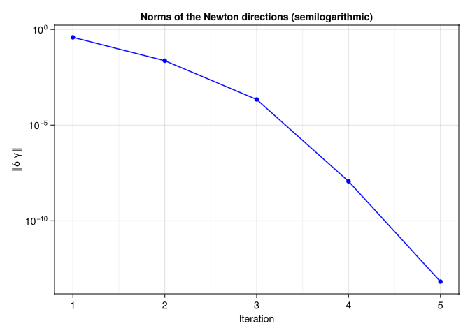

# Geodesic under Force Field on the Sphere
Laura Weigl, Ronny Bergmann, and Anton Schiela
2025-11-25

``` julia
using LinearAlgebra, SparseArrays, OffsetArrays
using Manifolds, Manopt, ManoptExamples
using GLMakie, Makie, GeometryTypes, Colors, ColorSchemes, NamedColors
using CSV, DataFrames
```

# Introduction

In this example we compute a geodesic under a force field on the sphere by applying Newton’s method on vector bundles which was introduced in [WeiglBergmannSchiela:2025](@cite). This example reproduces the results from the example in Sectin 6.1 therein.

We consider the sphere $\mathbb{S}^2$ equipped with the Riemannian metric $⟨  ⋅ ,  ⋅  ⟩$ given by the Euclidean inner product with corresponding norm $\lVert ⋅ \rVert$ and an interval $Ω ⊂ \mathbb R$.
Let $\mathcal X = H^1(Ω, \mathbb S^2)$ and $\mathcal E^* = T^*\mathcal X$ its cotangent bundle.

Our goal is to find a zero of the mapping $F: \mathcal X → \mathcal E^*$ with

``` math
F(γ)ϕ := \int_Ω ⟨\dot{γ}(t), \dot{ϕ}(t)⟩ + ω(γ(t))ϕ(t) \; \mathrm{d}t,
```

for $γ ∈ \mathcal X$ and $ϕ ∈ T_γ\mathcal X$.

Additionally, we have to take into account that boundary conditions $γ(0) = γ_0$ and $γ(T) = γ_T$ for given $γ_0, γ_T ∈ \mathbb S^2$ are satisfied.
This yields a geodesic under a given force field $ω: \mathbb S^2 → T^*\mathbb S^2$ connecting $γ_0$ and $γ_T$.

For our example we set

``` julia
    N = 50
    S = Manifolds.Sphere(2)
    power = PowerManifold(S, NestedPowerRepresentation(), N)

    mutable struct variational_space
        manifold::AbstractManifold
        degree::Integer
    end

    test_space = variational_space(S, 1)

    start_interval = 0.4
    end_interval = π - 0.4
    discrete_time = range(; start = start_interval, stop = end_interval, length=N+2) # equidistant discrete time points

    y0 = [sin(start_interval),0,cos(start_interval)] # startpoint of geodesic
    yT = [sin(end_interval),0,cos(end_interval)] # endpoint of geodesic
```

    3-element Vector{Float64}:
      0.3894183423086505
      0.0
     -0.9210609940028851

As a starting point, we use the geodesic connecting $γ_0$ and $γ_T$:

``` julia
y(t) =  [sin(t), 0, cos(t)]
discretized_y = [y(ti) for ti in discrete_time[2:end-1]]
```

    50-element Vector{Vector{Float64}}:
     [0.4312823089035602, 0.0, 0.9022170304460086]
     [0.47223726752861295, 0.0, 0.8814714760881995]
     [0.5121968979637886, 0.0, 0.8588680560576649]
     [0.5510769778290171, 0.0, 0.8344544112813096]
     [0.5887955600985645, 0.0, 0.8082819980725896]
     [0.6252731458196872, 0.0, 0.7804059796777266]
     [0.6604328516715138, 0.0, 0.7508851100088696]
     [0.6942005720109947, 0.0, 0.7197816098092585]
     [0.7265051350643781, 0.0, 0.6871610355113928]
     [0.7572784529350077, 0.0, 0.6530921410646137]
     ⋮
     [0.726505135064378, 0.0, -0.6871610355113931]
     [0.6942005720109946, 0.0, -0.7197816098092586]
     [0.6604328516715138, 0.0, -0.7508851100088696]
     [0.6252731458196874, 0.0, -0.7804059796777264]
     [0.5887955600985644, 0.0, -0.8082819980725897]
     [0.5510769778290171, 0.0, -0.8344544112813096]
     [0.5121968979637888, 0.0, -0.8588680560576648]
     [0.4722372675286131, 0.0, -0.8814714760881994]
     [0.43128230890356006, 0.0, -0.9022170304460086]

In order to apply Newton’s method to find a zero of $F$, we need the linear mapping $Q_{F(γ)}^*∘ F'(γ)$ [WeiglBergmannSchiela:2025](@cite) which can be seen as a covariant derivative.
Since the sphere is an embedded submanifold of $\mathbb R^3$, we can use the formular
$Q_{F(γ)}^*∘ F'(γ)δ γ\,ϕ = F(γ)(\overset{→}{V}_γ'(γ)δ γ\,ϕ) + F_{\mathbb R^3}'(γ)δ γ\,ϕ$
for $δ γ, \, ϕ ∈ T_γ \mathcal X$, where $\overset{→}{V}_γ(\hat γ) ∈ L(T_γ \mathcal X, T_{\hat{γ}}\mathcal X)$ is a vector transport and
$F_{\mathbb R^3}'(γ)δ γ\, ϕ = \int_Ω ⟨ \dot{δ γ}(t),\dot{ϕ}(t)⟩ + ω'(γ(t))δ γ(t)ϕ(t) \; \mathrm{d}t$
is the euclidean derivative of $F$.

We define a structure that has to be filled for two purposes:
\* Definition of an integrand and its derivative
\* Definition of a vector transport and its derivative

``` julia
mutable struct DifferentiableMapping{F1<:Function,F2<:Function,T}
    value::F1
    derivative::F2
    scaling::T
end;
```

md”“”
The following routines define a vector transport and its euclidean derivative. As seen above, they are needed to derive a covariant derivative of $F$.

As a vector transport we use the (pointwise) orthogonal projection onto the tangent spaces, i.e. for $p, q ∈ \mathbb S^2$ and $X ∈ T_p\mathbb S^2$ we set
$\overset{→}{V}_{p}(q)X = (I-q ⋅  q^T)X ∈ T_q\mathbb S^2.$
The derivative of the vector transport is then given by
$\left(\frac{d}{dq}\overset{→}{V}_{p}(q)\big\vert_{q=p}δ q\right)X = \left( - δ q ⋅  p^T - p ⋅  δ q^T\right) ⋅  X.$

``` julia
function transport_by_proj(S, p, X, q)
    return X - q*(q'*X)
end
function transport_by_proj_prime(S, p, X, dq)
    return (- dq*p' - p*dq')*X
end
transport=DifferentiableMapping(transport_by_proj,transport_by_proj_prime,nothing)
```

    DifferentiableMapping{typeof(transport_by_proj), typeof(transport_by_proj_prime), Nothing}(transport_by_proj, transport_by_proj_prime, nothing)

The following two routines define the integrand of $F$ and its euclidean derivative.
They use a force field $ω$, which is defined, below. A scaling parameter for the force is also employed.

In this example we consider the force field $ω: \mathbb S^2 → T^*\mathbb S^2$ given by the 1-form corresponding to a (scaled) winding field, i.e. for $C∈\mathbb R$ and $y∈ \mathbb{S}^2$ we set $ω(y) := \frac{C y_3}{y_1^2+y_2^2}  ⋅  \bigg⟨ \begin{pmatrix} -y_2 \\ y_1 \\ 0 \end{pmatrix},  ⋅  \bigg⟩ ∈ (T_y\mathbb{S}^2)^*.$

``` julia
w(p, c) = c*p[3]*[-p[2]/(p[1]^2+p[2]^2), p[1]/(p[1]^2+p[2]^2), 0.0];
```

Its derivative is given by

``` julia
function w_prime(p, c)
    denominator = p[1]^2+p[2]^2

    return c*[p[3]*2*p[1]*p[2]/denominator^2 p[3]*(-1.0/denominator+2.0*p[2]^2/denominator^2) -p[2]/denominator; p[3]*(1.0/denominator-2.0*p[1]^2/(denominator^2)) p[3]*(-2.0*p[1]*p[2]/(denominator^2)) p[1]/denominator; 0.0 0.0 0.0]
end;
```

``` julia
function F_at(Integrand, y, ydot, B, Bdot)
    return ydot'*Bdot+w(y,Integrand.scaling)'*B
end
function F_prime_at(Integrand,y,ydot,B1,B1dot,B2,B2dot)
    return B1dot'*B2dot+(w_prime(y,Integrand.scaling)*B1)'*B2
end
integrand=DifferentiableMapping(F_at,F_prime_at,3.0)
```

    DifferentiableMapping{typeof(F_at), typeof(F_prime_at), Float64}(F_at, F_prime_at, 3.0)

## Newton Equation

In this example we implement a functor to compute the Newton matrix and the right hand side for the Newton equation [WeiglBergmannSchiela:2025](@cite)

``` math
Q^*_{F(γ)}∘ F'(γ)δ γ + F(γ) = 0
```

by using the assembler provided in `ManoptExamples.jl`.

It returns the matrix and the right hand side in base representation.
Moreover, for the computation of the simplified Newton direction (which is necessary for affine covariant damping) a method for assembling the right hand side for the simplified Newton equation is provided.

The assembly routines need a function for evaluation the iterates at the left and right quadrature point.

``` julia
evaluate(p, i, tloc) = (1.0-tloc)*p[i-1]+tloc*p[i];

struct NewtonEquation{F, TS, T, I, NM, Nrhs}
    integrand::F
    test_space::TS
    transport::T
    time_interval::I
    A::NM
    b::Nrhs
end

function NewtonEquation(M, F, test_space, VT, interval)
    n = manifold_dimension(M)
    A = spzeros(n,n)
    b = zeros(n)
    return NewtonEquation{typeof(F), typeof(test_space), typeof(VT), typeof(interval), typeof(A), typeof(b)}(F, test_space, VT, interval, A, b)
end

function (ne::NewtonEquation)(M, VB, p)
    n = manifold_dimension(M)
    ne.A .= spzeros(n,n)
    ne.b .= zeros(n)

    Op = OffsetArray([y0, p..., yT], 0:(length(p)+1))

    ManoptExamples.get_jacobian!(M, Op, evaluate, ne.A, ne.integrand, ne.transport, ne.time_interval; test_space = ne.test_space)
    ManoptExamples.get_right_hand_side!(M, Op, evaluate, ne.b, ne.integrand, ne.time_interval; test_space = ne.test_space)
end

function (ne::NewtonEquation)(M, VB, p, p_trial)
    n = manifold_dimension(M)
    btrial=zeros(n)

    Op = OffsetArray([y0, p..., yT], 0:(length(p)+1))
    Optrial = OffsetArray([y0, p_trial..., yT], 0:(length(p_trial)+1))

    ManoptExamples.get_right_hand_side_simplified!(M, Op, Optrial, evaluate, btrial, ne.integrand, ne.transport, ne.time_interval; test_space = ne.test_space)

    return btrial
end
```

We compute the Newton direction $δ γ$ by solving the linear system given by the base representation of the Newton equation directly and return the Newton direction in vector representation:

``` julia
function solve_in_basis_repr(problem, newtonstate)
    X_base = (problem.newton_equation.A) \ (-problem.newton_equation.b)
    return get_vector(problem.manifold, newtonstate.p, X_base, DefaultOrthogonalBasis())
end
```

    solve_in_basis_repr (generic function with 1 method)

We adjust the norms for recording

``` julia
    rec = RecordChange(power;
    inverse_retraction_method=ProjectionInverseRetraction());
```

``` julia
begin
    NE = NewtonEquation(power, integrand, test_space, transport, discrete_time)

    st_res = vectorbundle_newton(power, TangentBundle(power), NE, discretized_y; sub_problem=solve_in_basis_repr,
    stopping_criterion=( StopAfterIteration(150) | StopWhenChangeLess(power,1e-12; outer_norm=Inf, inverse_retraction_method=ProjectionInverseRetraction())),
    retraction_method=ProjectionRetraction(),
    debug=[:Iteration, (:Change, "Change: %1.8e"), "\n", :Stop, (:Stepsize, "Stepsize: %1.8e"), "\n",],
    record=[:Iterate, rec => :Change],
    return_state=true
    )
end
```

    Initial 

    # 1     Change: 2.96686818e+00
    Stepsize: 1.00000000e+00
    # 2     Change: 3.86526790e-01
    Stepsize: 1.00000000e+00
    # 3     Change: 2.32737984e-02
    Stepsize: 1.00000000e+00
    # 4     Change: 2.19379934e-04
    Stepsize: 1.00000000e+00
    # 5     Change: 1.15340970e-08
    Stepsize: 1.00000000e+00
    # 6     Change: 6.63720131e-14
    Stepsize: 1.00000000e+00
    At iteration 6 the algorithm performed a step with a change (1.255273380563256e-14) less than 1.0e-12.

    # Solver state for `Manopt.jl`s Vector bundle Newton method
    After 6 iterations

    ## Parameters
    * retraction method: ManifoldsBase.ProjectionRetraction()
    * step size: ConstantLength(1.0; type=:relative)

    ## Stopping criterion

    Stop When _one_ of the following are fulfilled:
      * Max Iteration 150:  not reached
      * |Δp| < 1.0e-12: reached
    Overall: reached
    This indicates convergence: No

    ## Debug
        :Iteration = [ (:Iteration, "# %-6d"), (:Change, "Change: %1.8e"), "\n", (:Stepsize, "Stepsize: %1.8e"), "\n" ]
        :Stop = :Stop

    ## Record
    (Iteration = RecordGroup([RecordIterate(Vector{Vector{Float64}}), RecordChange(; inverse_retraction_method=ManifoldsBase.ProjectionInverseRetraction())]),)

We extract the recorded values

``` julia
    change = get_record(st_res, :Iteration, :Change)[2:end]
    p_res = get_solver_result(st_res)
```

    50-element Vector{Vector{Float64}}:
     [0.3862072810538758, -0.09533087331847834, 0.9174725939521621]
     [0.3834594005073149, -0.17575240047635604, 0.9066807497070671]
     [0.38420034508283774, -0.24281962050178213, 0.8907461629092762]
     [0.38997618444778864, -0.2984067370816809, 0.8711325931382714]
     [0.40135535377804027, -0.34415448366457074, 0.8488059680323159]
     [0.4183423247899146, -0.3813361456953533, 0.8243618400166167]
     [0.44062875023728093, -0.41088642206997666, 0.7981344827927591]
     [0.4677303732599358, -0.43347156157671524, 0.7702796266514941]
     [0.49905909206373583, -0.449559252230437, 0.7408350027924774]
     [0.5339610863554352, -0.4594777974939836, 0.7097645467816784]
     ⋮
     [0.49905909206373367, 0.4495592522304387, -0.7408350027924779]
     [0.4677303732599338, 0.43347156157671657, -0.7702796266514944]
     [0.44062875023727915, 0.41088642206997783, -0.7981344827927593]
     [0.4183423247899131, 0.38133614569535446, -0.8243618400166169]
     [0.4013553537780388, 0.3441544836645715, -0.8488059680323162]
     [0.3899761844477874, 0.29840673708168164, -0.8711325931382716]
     [0.38420034508283685, 0.24281962050178285, -0.8907461629092766]
     [0.3834594005073143, 0.17575240047635673, -0.9066807497070672]
     [0.38620728105387553, 0.09533087331847828, -0.9174725939521623]

and plot the result, where we measure the norms of the Newton direction in each iteration,

``` julia
f = Figure(;)
row, col = fldmod1(1, 2)
Axis(f[row, col], yscale = log10, title = string("Norms of the Newton directions (semilogarithmic)"), xminorgridvisible = true, xticks = (1:length(change)), xlabel = "Iteration", ylabel = "‖δx‖")
scatterlines!(change[1:end], color = :blue)
f
```



and the resulting geodesic under the force field (orange).
The starting geodesic (blue) is plotted as well. The force acting on each point of the geodesic is visualized by green arrows.

``` julia
n = 25
u = range(0; stop=2 * π, length=n);
v = range(0; stop=π, length=n);
sx = zeros(n, n);
sy = zeros(n, n);
sz = zeros(n, n);

ws = [-w(p, integrand.scaling) for p in p_res]
ws_start = [-w(p, integrand.scaling) for p in discretized_y]
for i in 1:n
    for j in 1:n
        sx[i, j] = cos.(u[i]) * sin(v[j])
        sy[i, j] = sin.(u[i]) * sin(v[j])
        sz[i, j] = cos(v[j])
    end
end
fig, ax, plt = meshscatter(
    sx, sy, sz; color=RGBA(1.0, 1.0, 1.0, 0.0), shading=Makie.automatic, transparency=true
)
geodesic_start = [y0, discretized_y..., yT]
geodesic_final = [y0, p_res..., yT]
ax.show_axis = false
wireframe!(ax, sx, sy, sz; color=RGBA(0.5, 0.5, 0.7, 0.1), transparency=true)
π1(x) = 1.02 * x[1]
π2(x) = 1.02 * x[2]
π3(x) = 1.02 * x[3]
scatterlines!(
    ax, π1.(geodesic_final), π2.(geodesic_final), π3.(geodesic_final);
    markersize=5, color=:orange, linewidth=2,
)
scatterlines!(
    ax, π1.(geodesic_start), π2.(geodesic_start), π3.(geodesic_start);
    markersize=5, color=:blue, linewidth=2,
)
scatter!(ax, π1.([y0, yT]), π2.([y0, yT]), π3.([y0, yT]); markersize=5, color=:red)
arrows!(
    ax, π1.(p_res), π2.(p_res), π3.(p_res), π1.(ws), π2.(ws), π3.(ws);
    color=:green, linewidth=0.01,
    arrowsize=Vec3f(0.03, 0.03, 0.05), transparency=true, lengthscale=0.07,
)
cam = cameracontrols(ax.scene); cam.lookat[] = [-2.5, 2.5, 2]
fig
```

    ┌ Warning: `arrows` are deprecated in favor of `arrows2d` and `arrows3d`.
    └ @ Makie ~/.julia/packages/Makie/TOy8O/src/basic_recipes/arrows.jl:166
    ┌ Warning: arrowsize has been deprecated in favor of tipradius and tiplength.
    └ @ Makie ~/.julia/packages/Makie/TOy8O/src/basic_recipes/arrows.jl:206


## Technical details

This tutorial is cached. It was last run on the following package versions.

``` julia
using Pkg
Pkg.status()
```

    Status `~/Repositories/Julia/ManoptExamples.jl/examples/Project.toml`
      [6e4b80f9] BenchmarkTools v1.6.3
      [336ed68f] CSV v0.10.15
      [13f3f980] CairoMakie v0.15.7
      [0ca39b1e] Chairmarks v1.3.1
      [35d6a980] ColorSchemes v3.31.0
      [5ae59095] Colors v0.13.1
      [a93c6f00] DataFrames v1.8.1
      [31c24e10] Distributions v0.25.122
      [e9467ef8] GLMakie v0.13.7
      [4d00f742] GeometryTypes v0.8.5
      [7073ff75] IJulia v1.33.0
      [682c06a0] JSON v1.3.0
      [8ac3fa9e] LRUCache v1.6.2
      [b964fa9f] LaTeXStrings v1.4.0
      [d3d80556] LineSearches v7.4.1
      [ee78f7c6] Makie v0.24.7
      [af67fdf4] ManifoldDiff v0.4.5
      [1cead3c2] Manifolds v0.11.6
      [3362f125] ManifoldsBase v2.2.1
      [0fc0a36d] Manopt v0.5.28
      [5b8d5e80] ManoptExamples v0.1.17 `..`
      [51fcb6bd] NamedColors v0.2.3
      [6fe1bfb0] OffsetArrays v1.17.0
      [91a5bcdd] Plots v1.41.2
      [08abe8d2] PrettyTables v3.1.2
      [6099a3de] PythonCall v0.9.30
      [f468eda6] QuadraticModels v0.9.14
      [731186ca] RecursiveArrayTools v3.39.0
      [1e40b3f8] RipQP v0.7.0

``` julia
using Dates
now()
```

    2025-11-25T16:36:23.956

## Literature

```@bibliography
Pages = ["Elastic-Geodesic-under-forcefield.md"]
Canonical=false
```
