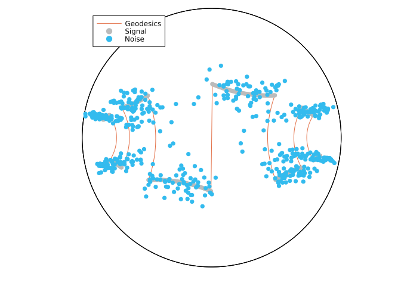

A comparison of the RCBM with the PBA, the SGM, and the CPPA for denoising a signal on the hyperbolic space
================
Hajg Jasa
1/11/23

## Introduction

In this example we compare the Riemannian Convex Bundle Method (RCBM) [BergmannHerzogJasa:2024](@cite)
with the Proximal Bundle Algorithm, which was introduced in [HoseiniMonjeziNobakhtianPouryayevali:2021:1](@cite), and with the Subgradient Method (SGM), introduced in [FerreiraOliveira:1998:1](@cite), to denoise an artificial signal on the Hyperbolic space $\mathcal H^2$.
This example reproduces the results from [BergmannHerzogJasa:2024](@cite), Section 5.2.

``` julia
using BenchmarkTools
using CSV, DataFrames
using ColorSchemes, Plots
using QuadraticModels, RipQP
using Random, LinearAlgebra, LRUCache
using ManifoldDiff, Manifolds, Manopt, ManoptExamples
```

## The Problem

Let $\mathcal M = \mathcal H^2$ be the $2$-dimensional hyperbolic space and let $p, q \in \mathcal M^n$ be two manifold-valued signals, for $n \in \mathbb N$.
Let $f \colon \mathcal M \to \mathbb R$ be defined by

``` math
    f_q (p)
    = 
    \frac{1}{n}
    \{
    \frac{1}{2} \sum_{i = 1}^n \mathrm{dist}(p_i, q_i)^2
    +
    \alpha \operatorname{TV}(p)
    \}
    ,
```

where $\operatorname{TV}(p)$, is the total variation term given by

``` math
    \operatorname{TV}(p)
    =
    \sum_{i = 1}^{n-1} \mathrm{dist}(p_i, p_{i+1})
    .
```

## Numerical Experiment

We initialize the experiment parameters, as well as some utility functions.

``` julia
Random.seed!(33)
n = 496 # (this is so that n equals the actual length of the artificial signal)
σ = 0.1 # Noise parameter
α = 0.05 # TV parameter
atol = 1e-8
k_max = 0.0
max_iters = 15000
#
# Colors
data_color = RGBA{Float64}(colorant"#BBBBBB")
noise_color = RGBA{Float64}(colorant"#33BBEE") # Tol Vibrant Teal
result_color = RGBA{Float64}(colorant"#EE7733") # Tol Vibrant Orange
```

``` julia
function artificial_H2_signal(
    pts::Integer=100; a::Real=0.0, b::Real=1.0, T::Real=(b - a) / 2
)
    t = range(a, b; length=pts)
    x = [[s, sign(sin(2 * π / T * s))] for s in t]
    y = [
        [x[1]]
        [
            x[i] for
            i in 2:(length(x) - 1) if (x[i][2] != x[i + 1][2] || x[i][2] != x[i - 1][2])
        ]
        [x[end]]
    ]
    y = map(z -> Manifolds._hyperbolize(Hyperbolic(2), z), y)
    data = []
    geodesics = []
    l = Int(round(pts * T / (2 * (b - a))))
    for i in 1:2:(length(y) - 1)
        append!(
            data,
            shortest_geodesic(Hyperbolic(2), y[i], y[i + 1], range(0.0, 1.0; length=l)),
        )
        if i + 2 ≤ length(y) - 1
            append!(
                geodesics,
                shortest_geodesic(Hyperbolic(2), y[i], y[i + 1], range(0.0, 1.0; length=l)),
            )
            append!(
                geodesics,
                shortest_geodesic(
                    Hyperbolic(2), y[i + 1], y[i + 2], range(0.0, 1.0; length=l)
                ),
            )
        end
    end
    #! In order to have length(data) ∝ pts, we need typeof(l) == Int and mod(pts, l) == 0.
    if pts != length(data)
        @warn "The length of the output signal will differ from the input number of points."
    end
    return data, geodesics
end
function matrixify_Poincare_ball(input)
    input_x = []
    input_y = []
    for p in input
        push!(input_x, p.value[1])
        push!(input_y, p.value[2])
    end
    return hcat(input_x, input_y)
end
```

We now fix the data for the experiment…

``` julia
H = Hyperbolic(2)
data, geodesics = artificial_H2_signal(n; a=-6.0, b=6.0, T=3)
Hn = PowerManifold(H, NestedPowerRepresentation(), length(data))
noise = map(p -> exp(H, p, rand(H; vector_at=p, σ=σ)), data)
p0 = noise
diameter = floatmax(Float64)
```

… As well as objective, subdifferential, and proximal map.

``` julia
function f(M, p)
    return 1 / length(data) *
           (1 / 2 * distance(M, data, p)^2 + α * ManoptExamples.Total_Variation(M, p))
end
domf(M, p) = distance(M, p, p0) < diameter / 2 ? true : false
function ∂f(M, p)
    return 1 / length(data) * (
        ManifoldDiff.grad_distance(M, data, p) +
        α * ManoptExamples.subgrad_Total_Variation(M, p; atol=atol)
    )
end
proxes = (
    (M, λ, p) -> ManifoldDiff.prox_distance(M, λ, data, p, 2),
    (M, λ, p) -> ManoptExamples.prox_Total_Variation(M, α * λ, p),
)
```

We can now plot the initial setting.

``` julia
global ball_scene = plot()
if export_orig
    ball_data = convert.(PoincareBallPoint, data)
    ball_noise = convert.(PoincareBallPoint, noise)
    ball_geodesics = convert.(PoincareBallPoint, geodesics)
    plot!(ball_scene, H, ball_data; geodesic_interpolation=100, label="Geodesics")
    plot!(
        ball_scene,
        H,
        ball_data;
        markercolor=data_color,
        markerstrokecolor=data_color,
        label="Data",
    )
    plot!(
        ball_scene,
        H,
        ball_noise;
        markercolor=noise_color,
        markerstrokecolor=noise_color,
        label="Noise",
    )
    display(ball_scene)
    matrix_data = matrixify_Poincare_ball(ball_data)
    matrix_noise = matrixify_Poincare_ball(ball_noise)
    matrix_geodesics = matrixify_Poincare_ball(ball_geodesics)
    CSV.write(
        joinpath(results_folder, experiment_name * "-data.csv"),
        DataFrame(matrix_data, :auto);
        header=["x", "y"],
    )
    CSV.write(
        joinpath(results_folder, experiment_name * "-noise.csv"),
        DataFrame(matrix_noise, :auto);
        header=["x", "y"],
    )
    CSV.write(
        joinpath(results_folder, experiment_name * "-geodesics.csv"),
        DataFrame(matrix_geodesics, :auto);
        header=["x", "y"],
    )
end
```



    "/Users/hajgj/Repositories/Julia/ManoptExamples.jl/examples/H2-Signal-TV/H2-Signal-TV-geodesics.csv"

We introduce some keyword arguments for the solvers we will use in this experiment

``` julia
cbm_kwargs = [
    :cache => (:LRU, [:Cost, :SubGradient], 50),
    :diameter => diameter,
    :domain => domf,
    :k_max => k_max,
    :debug => [
        :Iteration,
        (:Cost, "F(p): %1.8f "),
        (:ξ, "ξ: %1.16f "),
        (:ε, "ε: %1.16f "),
        :WarnBundle,
        :Stop,
        1000,
        "\n",
        ],
    :record => [:Iteration, :Cost, :Iterate],
    :return_state => true,
]
cbm_bm_kwargs = [
    :cache => (:LRU, [:Cost, :SubGradient], 50),
    :diameter => diameter,
    :domain => domf,
    :k_max => k_max,
]
pba_kwargs = [
    :cache => (:LRU, [:Cost, :SubGradient], 50),
    :debug => [
        :Iteration,
        :Stop,
        (:Cost, "F(p): %1.16f "),
        (:ν, "ν: %1.16f "),
        (:c, "c: %1.16f "),
        (:μ, "μ: %1.8f "),
        :Stop,
        1000,
        "\n",
    ],
    :stopping_criterion => StopWhenLagrangeMultiplierLess(atol) | StopAfterIteration(max_iters),
    :record => [:Iteration, :Cost, :Iterate],
    :return_state => true,
]
pba_bm_kwargs = [
    :cache =>(:LRU, [:Cost, :SubGradient], 50),
    :stopping_criterion => StopWhenLagrangeMultiplierLess(atol) |                                   StopAfterIteration(max_iters),
]
sgm_kwargs = [
    :cache => (:LRU, [:Cost, :SubGradient], 50),
    :stopping_criterion => StopWhenSubgradientNormLess(√atol) | StopAfterIteration(max_iters),
    :debug => [:Iteration, (:Cost, "F(p): %1.16f "), :Stop, 1000, "\n"],
    :record => [:Iteration, :Cost, :Iterate],
    :return_state => true,
]
sgm_bm_kwargs = [
    :cache => (:LRU, [:Cost, :SubGradient], 50),
    :stopping_criterion => StopWhenSubgradientNormLess(√atol) |
                           StopAfterIteration(max_iters),
]
cppa_kwargs = [
    :stopping_criterion => StopWhenAny(
        StopAfterIteration(max_iters), StopWhenChangeLess(atol)
    ),
    :debug => [
        :Iteration,
        " | ",
        DebugProximalParameter(),
        " | ",
        (:Cost, "F(p): %1.16f "),
        " | ",
        :Change,
        "\n",
        1000,
        :Stop,
    ],
    :record => [:Iteration, :Cost, :Iterate],
    :return_state => true,
]
cppa_bm_kwargs = [
    :stopping_criterion => StopWhenAny(
        StopAfterIteration(max_iters), StopWhenChangeLess(atol)
    ),
]
```

    1-element Vector{Pair{Symbol, StopWhenAny{Tuple{StopAfterIteration, StopWhenChangeLess{LogarithmicInverseRetraction, StoreStateAction{@NamedTuple{}, @NamedTuple{}, @NamedTuple{}, @NamedTuple{}, @NamedTuple{}, @NamedTuple{}}}}}}}:
     :stopping_criterion => StopWhenAny with the Stopping Criteria
        Stop When _one_ of the following are fulfilled:
            Max Iteration 15000:    not reached
            |Δp| < 1.0e-8: not reached
        Overall: not reached

Finally, we run the optimization algorithms…

``` julia
cbm = convex_bundle_method(Hn, f, ∂f, p0; cbm_kwargs...)
cbm_result = get_solver_result(cbm)
cbm_record = get_record(cbm)
#
pba = proximal_bundle_method(Hn, f, ∂f, p0; pba_kwargs...)
pba_result = get_solver_result(pba)
pba_record = get_record(pba)
#
sgm = subgradient_method(Hn, f, ∂f, p0; sgm_kwargs...)
sgm_result = get_solver_result(sgm)
sgm_record = get_record(sgm)
#
cppa = cyclic_proximal_point(Hn, f, proxes, p0; cppa_kwargs...)
cppa_result = get_solver_result(cppa)
cppa_record = get_record(cppa)
```

… And we benchmark their performance.

``` julia
if benchmarking
    pba_bm = @benchmark proximal_bundle_method($Hn, $f, $∂f, $p0; pba_bm_kwargs...)
    cbm_bm = @benchmark convex_bundle_method($Hn, $f, $∂f, $p0; cbm_bm_kwargs...)
    sgm_bm = @benchmark subgradient_method($Hn, $f, $∂f, $p0; sgm_bm_kwargs...)
    cppa_bm = @benchmark cyclic_proximal_point($Hn, $f, $proxes, $p0; cppa_bm_kwargs...)
    #
    experiments = ["CBM", "PBA", "SGM", "CPPA"]
    records = [cbm_record, pba_record, sgm_record, cppa_record]
    results = [cbm_result, pba_result, sgm_result, cppa_result]
    times = [
        median(cbm_bm).time * 1e-9,
        median(pba_bm).time * 1e-9,
        median(sgm_bm).time * 1e-9,
        median(cppa_bm).time * 1e-9,
    ]
    #
    # Finalize - export costs
    if export_table
        for (time, record, result, experiment) in zip(times, records, results, experiments)
            A = cat(first.(record), [r[2] for r in record]; dims=2)
            CSV.write(
                joinpath(results_folder, experiment_name * "_" * experiment * "-result.csv"),
                DataFrame(A, :auto);
                header=["i", "cost"],
            )
        end
        B = cat(
            experiments,
            [maximum(first.(record)) for record in records],
            [t for t in times],
            [minimum([r[2] for r in record]) for record in records],
            [distance(Hn, data, result) / length(data) for result in results];
            dims=2,
        )
        CSV.write(
            joinpath(results_folder, experiment_name * "-comparisons.csv"),
            DataFrame(B, :auto);
            header=["Algorithm", "Iterations", "Time (s)", "Objective", "Error"],
        )
    end
end
```

    "/Users/hajgj/Repositories/Julia/ManoptExamples.jl/examples/H2-Signal-TV/H2-Signal-TV-comparisons.csv"

Lastly, we plot the results.

``` julia
if export_result
    # Convert hyperboloid points to Poincaré ball points
    ball_b = convert.(PoincareBallPoint, cbm_result)
    ball_p = convert.(PoincareBallPoint, pba_result)
    ball_s = convert.(PoincareBallPoint, sgm_result)
    ball_c = convert.(PoincareBallPoint, cppa_result)
    #
    # Plot results
    plot!(
        ball_scene,
        H,
        ball_b;
        markercolor=result_color,
        markerstrokecolor=result_color,
        label="Convex Bundle Method",
    )
    #
    # Suppress some plots for clarity
    # plot!(ball_scene, H, ball_p; label="Proximal Bundle Method")
    # plot!(ball_scene, H, ball_s; label="Subgradient Method")
    # plot!(ball_scene, H, ball_c; label="CPPA")
    display(ball_scene)
    #
    # Write csv files
    matrix_b = matrixify_Poincare_ball(ball_b)
    CSV.write(
        joinpath(results_folder, experiment_name * "-bundle_optimum.csv"),
        DataFrame(matrix_b, :auto);
        header=["x", "y"],
    )
end
```


    "/Users/hajgj/Repositories/Julia/ManoptExamples.jl/examples/H2-Signal-TV/H2-Signal-TV-bundle_optimum.csv"
