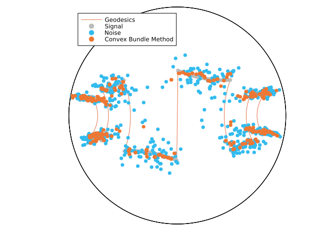

# A comparison of the RCBM with the PBA, the SGM, and the CPPA for denoising a signal on the hyperbolic space
Hajg Jasa
2024-06-27

## Introduction

In this example we compare the Riemannian Convex Bundle Method (RCBM) [BergmannHerzogJasa:2024](@cite)
with the Proximal Bundle Algorithm, which was introduced in [HoseiniMonjeziNobakhtianPouryayevali:2021](@cite), and with the Subgradient Method (SGM), introduced in [FerreiraOliveira:1998:1](@cite), to denoise an artificial signal on the Hyperbolic space $\mathcal H^2$.
This example reproduces the results from [BergmannHerzogJasa:2024](@cite), Section 5.2.

``` julia
using PrettyTables
using BenchmarkTools
using CSV, DataFrames
using ColorSchemes, Plots
using QuadraticModels, RipQP
using Random, LinearAlgebra, LRUCache
using ManifoldDiff, Manifolds, Manopt, ManoptExamples
```

## The Problem

Let $\mathcal M = \mathcal H^2$ be the $2$-dimensional hyperbolic space and let $p, q \in \mathcal M^n$ be two manifold-valued signals, for $n \in \mathbb N$.
Let $f \colon \mathcal M \to \mathbb R$ be defined by

``` math
    f_q (p)
    =
    \frac{1}{n}
    \left{
    \frac{1}{2} \sum_{i = 1}^n \mathrm{dist}(p_i, q_i)^2
    +
    \alpha \operatorname{TV}(p)
    \right}
    ,
```

where $\operatorname{TV}(p)$, is the total variation term given by

``` math
    \operatorname{TV}(p)
    =
    \sum_{i = 1}^{n-1} \mathrm{dist}(p_i, p_{i+1})
    .
```

## Numerical Experiment

We initialize the experiment parameters, as well as some utility functions.

``` julia
Random.seed!(33)
n = 496
σ = 0.1 # Noise parameter
α = 0.5 # TV parameter
atol = 1e-8
k_max = 0.0
k_min = -1.0
max_iters = 5000
#
# Colors
data_color = RGBA{Float64}(colorant"#BBBBBB")
noise_color = RGBA{Float64}(colorant"#33BBEE") # Tol Vibrant Teal
result_color = RGBA{Float64}(colorant"#EE7733") # Tol Vibrant Orange
```

``` julia
function artificial_H2_signal(
    pts::Integer=100; a::Real=0.0, b::Real=1.0, T::Real=(b - a) / 2
)
    t = range(a, b; length=pts)
    x = [[s, sign(sin(2 * π / T * s))] for s in t]
    y = [
        [x[1]]
        [
            x[i] for
            i in 2:(length(x) - 1) if (x[i][2] != x[i + 1][2] || x[i][2] != x[i - 1][2])
        ]
        [x[end]]
    ]
    y = map(z -> Manifolds._hyperbolize(Hyperbolic(2), z), y)
    data = []
    geodesics = []
    l = Int(round(pts * T / (2 * (b - a))))
    for i in 1:2:(length(y) - 1)
        append!(
            data,
            shortest_geodesic(Hyperbolic(2), y[i], y[i + 1], range(0.0, 1.0; length=l)),
        )
        if i + 2 ≤ length(y) - 1
            append!(
                geodesics,
                shortest_geodesic(Hyperbolic(2), y[i], y[i + 1], range(0.0, 1.0; length=l)),
            )
            append!(
                geodesics,
                shortest_geodesic(
                    Hyperbolic(2), y[i + 1], y[i + 2], range(0.0, 1.0; length=l)
                ),
            )
        end
    end
    return data, geodesics
end
function matrixify_Poincare_ball(input)
    input_x = []
    input_y = []
    for p in input
        push!(input_x, p.value[1])
        push!(input_y, p.value[2])
    end
    return hcat(input_x, input_y)
end
```

We now fix the data for the experiment…

``` julia
H = Hyperbolic(2)
signal, geodesics = artificial_H2_signal(n; a=-6.0, b=6.0, T=3)
noise = map(p -> exp(H, p, rand(H; vector_at=p, σ=σ)), signal)
diameter = 3 * maximum([distance(H, noise[i], noise[j]) for i in 1:n, j in 1:n])
Hn = PowerManifold(H, NestedPowerRepresentation(), length(noise))
```

… As well as objective, subdifferential, and proximal map.

``` julia
function f(M, p)
    return 1 / length(noise) *
           (1 / 2 * distance(M, noise, p)^2 + α * ManoptExamples.Total_Variation(M, p))
end
domf(M, p) = distance(M, p, noise) < diameter / 2 ? true : false
function ∂f(M, p)
    return 1 / length(noise) * (
        ManifoldDiff.grad_distance(M, noise, p) +
        α * ManoptExamples.subgrad_Total_Variation(M, p; atol=atol)
    )
end
proxes = (
    (M, λ, p) -> ManifoldDiff.prox_distance(M, λ, noise, p, 2),
    (M, λ, p) -> ManoptExamples.prox_Total_Variation(M, α * λ, p),
)
```

We can now plot the initial setting.

``` julia
global ball_scene = plot()
if export_orig
    ball_signal = convert.(PoincareBallPoint, signal)
    ball_noise = convert.(PoincareBallPoint, noise)
    ball_geodesics = convert.(PoincareBallPoint, geodesics)
    plot!(ball_scene, H, ball_signal; geodesic_interpolation=100, label="Geodesics")
    plot!(
        ball_scene,
        H,
        ball_signal;
        markercolor=data_color,
        markerstrokecolor=data_color,
        label="Signal",
    )
    plot!(
        ball_scene,
        H,
        ball_noise;
        markercolor=noise_color,
        markerstrokecolor=noise_color,
        label="Noise",
    )
    matrix_data = matrixify_Poincare_ball(ball_signal)
    matrix_noise = matrixify_Poincare_ball(ball_noise)
    matrix_geodesics = matrixify_Poincare_ball(ball_geodesics)
    CSV.write(
        joinpath(results_folder, experiment_name * "-noise.csv"),
        DataFrame(matrix_data, :auto);
        header=["x", "y"],
    )
    CSV.write(
        joinpath(results_folder, experiment_name * "-noise.csv"),
        DataFrame(matrix_noise, :auto);
        header=["x", "y"],
    )
    CSV.write(
        joinpath(results_folder, experiment_name * "-geodesics.csv"),
        DataFrame(matrix_geodesics, :auto);
        header=["x", "y"],
    )
    display(ball_scene)
end
```


We introduce some keyword arguments for the solvers we will use in this experiment

``` julia
rcbm_kwargs = [
    :cache => (:LRU, [:Cost, :SubGradient], 50),
    :diameter => diameter,
    :debug => [
        :Iteration,
        (:Cost, "F(p): %1.8f "),
        (:ξ, "ξ: %1.16f "),
        (:ε, "ε: %1.16f "),
        :WarnBundle,
        :Stop,
        1000,
        "\n",
        ],
    :domain => domf,
    :k_max => k_max,
    :k_min => k_min,
    :record => [:Iteration, :Cost, :Iterate],
    :return_state => true,
    :stopping_criterion => StopWhenLagrangeMultiplierLess(atol) | StopAfterIteration(max_iters),
]
rcbm_bm_kwargs = [
    :cache => (:LRU, [:Cost, :SubGradient], 50),
    :diameter => diameter,
    :domain => domf,
    :k_max => k_max,
    :k_min => k_min,
    :stopping_criterion => StopWhenLagrangeMultiplierLess(atol) | StopAfterIteration(max_iters),
]
pba_kwargs = [
    :cache => (:LRU, [:Cost, :SubGradient], 50),
    :debug => [
        :Iteration,
        :Stop,
        (:Cost, "F(p): %1.16f "),
        (:ν, "ν: %1.16f "),
        (:c, "c: %1.16f "),
        (:μ, "μ: %1.8f "),
        :Stop,
        1000,
        "\n",
    ],
    :record => [:Iteration, :Cost, :Iterate],
    :return_state => true,
    :stopping_criterion => StopWhenLagrangeMultiplierLess(atol) | StopAfterIteration(max_iters),
]
pba_bm_kwargs = [
    :cache =>(:LRU, [:Cost, :SubGradient], 50),
    :stopping_criterion => StopWhenLagrangeMultiplierLess(atol) | StopAfterIteration(max_iters),
]
sgm_kwargs = [
    :cache => (:LRU, [:Cost, :SubGradient], 50),
    :debug => [:Iteration, (:Cost, "F(p): %1.16f "), :Stop, 1000, "\n"],
    :record => [:Iteration, :Cost, :Iterate],
    :return_state => true,
    :stepsize => DecreasingLength(; exponent=1, factor=1, subtrahend=0, length=1, shift=0, type=:absolute),
    :stopping_criterion => StopWhenSubgradientNormLess(√atol) | StopAfterIteration(max_iters),
]
sgm_bm_kwargs = [
    :cache => (:LRU, [:Cost, :SubGradient], 50),
    :stopping_criterion => StopWhenSubgradientNormLess(√atol) | StopAfterIteration(max_iters),
]
cppa_kwargs = [
    :debug => [
        :Iteration,
        " | ",
        DebugProximalParameter(),
        " | ",
        (:Cost, "F(p): %1.16f "),
        " | ",
        :Change,
        "\n",
        1000,
        :Stop,
    ],
    :record => [:Iteration, :Cost, :Iterate],
    :return_state => true,
    :stopping_criterion => StopWhenAny(StopAfterIteration(max_iters), StopWhenChangeLess(Hn, atol)),
]
cppa_bm_kwargs = [
    :stopping_criterion => StopWhenAny(StopAfterIteration(max_iters), StopWhenChangeLess(Hn, atol)),
]
```

Finally, we run the optimization algorithms…

``` julia
rcbm = convex_bundle_method(Hn, f, ∂f, noise; rcbm_kwargs...)
rcbm_result = get_solver_result(rcbm)
rcbm_record = get_record(rcbm)
#
pba = proximal_bundle_method(Hn, f, ∂f, noise; pba_kwargs...)
pba_result = get_solver_result(pba)
pba_record = get_record(pba)
#
sgm = subgradient_method(Hn, f, ∂f, noise; sgm_kwargs...)
sgm_result = get_solver_result(sgm)
sgm_record = get_record(sgm)
#
cppa = cyclic_proximal_point(Hn, f, proxes, noise; cppa_kwargs...)
cppa_result = get_solver_result(cppa)
cppa_record = get_record(cppa)
```

… And we benchmark their performance.

``` julia
if benchmarking
    pba_bm = @benchmark proximal_bundle_method($Hn, $f, $∂f, $noise; $pba_bm_kwargs...)
    rcbm_bm = @benchmark convex_bundle_method($Hn, $f, $∂f, $noise; $rcbm_bm_kwargs...)
    sgm_bm = @benchmark subgradient_method($Hn, $f, $∂f, $noise; $sgm_bm_kwargs...)
    cppa_bm = @benchmark cyclic_proximal_point($Hn, $f, $proxes, $noise; $cppa_bm_kwargs...)
    #
    experiments = ["RCBM", "PBA", "SGM", "CPPA"]
    records = [rcbm_record, pba_record, sgm_record, cppa_record]
    results = [rcbm_result, pba_result, sgm_result, cppa_result]
    times = [
        median(rcbm_bm).time * 1e-9,
        median(pba_bm).time * 1e-9,
        median(sgm_bm).time * 1e-9,
        median(cppa_bm).time * 1e-9,
    ]
    #
    global B = cat(
        experiments,
        [maximum(first.(record)) for record in records],
        [t for t in times],
        [minimum([r[2] for r in record]) for record in records],
        [distance(Hn, noise, result) / length(noise) for result in results];
        dims=2,
    )
    #
    global header = ["Algorithm", "Iterations", "Time (s)", "Objective", "Error"]
    #
    # Finalize - export costs
    if export_table
        for (time, record, result, experiment) in zip(times, records, results, experiments)
            A = cat(first.(record), [r[2] for r in record]; dims=2)
            CSV.write(
                joinpath(results_folder, experiment_name * "_" * experiment * "-result.csv"),
                DataFrame(A, :auto);
                header=["i", "cost"],
            )
        end
        CSV.write(
            joinpath(results_folder, experiment_name * "-comparisons.csv"),
            DataFrame(B, :auto);
            header=header,
        )
    end
end
```

We can take a look at how the algorithms compare to each other in their performance with the following table…

    | Algorithm | Iterations | Time (s) | Objective |     Error |
    |-----------|------------|----------|-----------|-----------|
    |      RCBM |       5000 |  13.8923 |  0.140232 | 0.0136919 |
    |       PBA |       5000 |   9.5191 |  0.142887 | 0.0130322 |
    |       SGM |       5000 |  7.89653 |  0.146216 | 0.0124605 |
    |      CPPA |       5000 |  3.73857 |  0.131913 | 0.0173612 |

Lastly, we plot the results.

``` julia
if export_result
    # Convert hyperboloid points to Poincaré ball points
    ball_b = convert.(PoincareBallPoint, rcbm_result)
    ball_p = convert.(PoincareBallPoint, pba_result)
    ball_s = convert.(PoincareBallPoint, sgm_result)
    ball_c = convert.(PoincareBallPoint, cppa_result)
    #
    # Plot results
    plot!(
        ball_scene,
        H,
        ball_b;
        markercolor=result_color,
        markerstrokecolor=result_color,
        label="Convex Bundle Method",
    )
    #
    # Write csv files
    matrix_b = matrixify_Poincare_ball(ball_b)
    CSV.write(
        joinpath(results_folder, experiment_name * "-bundle_optimum.csv"),
        DataFrame(matrix_b, :auto);
        header=["x", "y"],
    )
    #
    # Suppress some plots for clarity, since they are visually indistinguishable
    # plot!(ball_scene, H, ball_p; label="Proximal Bundle Method")
    # plot!(ball_scene, H, ball_s; label="Subgradient Method")
    # plot!(ball_scene, H, ball_c; label="CPPA")
    display(ball_scene)
end
```



## Technical details

This tutorial is cached. It was last run on the following package versions.

``` julia
using Pkg
Pkg.status()
```

    Status `~/Repositories/Julia/ManoptExamples.jl/examples/Project.toml`
      [6e4b80f9] BenchmarkTools v1.5.0
      [336ed68f] CSV v0.10.15
      [35d6a980] ColorSchemes v3.27.1
    ⌅ [5ae59095] Colors v0.12.11
      [a93c6f00] DataFrames v1.7.0
      [7073ff75] IJulia v1.26.0
      [682c06a0] JSON v0.21.4
      [8ac3fa9e] LRUCache v1.6.1
      [d3d80556] LineSearches v7.3.0
      [af67fdf4] ManifoldDiff v0.3.13
      [1cead3c2] Manifolds v0.10.7
      [3362f125] ManifoldsBase v0.15.22
      [0fc0a36d] Manopt v0.5.3 `../../Manopt.jl`
      [5b8d5e80] ManoptExamples v0.1.10 `..`
      [51fcb6bd] NamedColors v0.2.2
      [91a5bcdd] Plots v1.40.9
    ⌃ [08abe8d2] PrettyTables v2.3.2
      [6099a3de] PythonCall v0.9.23
      [f468eda6] QuadraticModels v0.9.7
      [1e40b3f8] RipQP v0.6.4
    Info Packages marked with ⌃ and ⌅ have new versions available. Those with ⌃ may be upgradable, but those with ⌅ are restricted by compatibility constraints from upgrading. To see why use `status --outdated`

``` julia
using Dates
now()
```

    2024-11-29T17:29:02.109

## Literature

```@bibliography
Pages = ["H2-Signal-TV.md"]
Canonical=false
```
