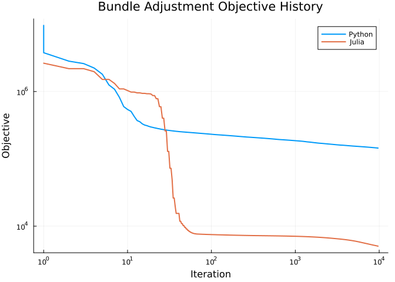

# Bundle adjustment
Mateusz Baran
2026-08-21

## Preface

This notebook reproduces the results of Section 6.3 in [BaranBergmann:2026](@cite). We use the following packages and parameters.
If you wish to run this file yourself, you need to download the data from https://grail.cs.washington.edu/projects/bal/ , for example https://grail.cs.washington.edu/projects/bal/data/ladybug/problem-49-7776-pre.txt.bz2 , and update the path `data_filename` in the cell below.

``` julia
using Manopt, Manifolds, LinearAlgebra, Test, Chairmarks
using CodecBzip2
using StaticArrays, RecursiveArrayTools

using ManifoldDiff, DifferentiationInterface
using ForwardDiff
using SparseArrays
using DelimitedFiles
using CSV, DataFrames
using Serialization

using ManoptExamples: BlockNonzeroVector, BlockNonzeroMatrix

using NamedColors

export_csv = true
ptc = NamedColors.load_paul_tol()
ltmads_color = ptc["mutedsand"]
robust_color = ptc["mutedgreen"]

data_filename = "/home/mateusz/data/bal/ladybug/problem-49-7776-pre.txt.bz2"
```

## Introduction

The bundle adjustment problem is a classical problem in computer vision and photogrammetry [Zach:2014](@cite).
Here we extend the standard formulation with constraints on the camera parameters and point positions [GongMengSeibel:2015](@cite).

In the following part we define basic structures needed for the reading the data, computing the objective and its Jacobian.

``` julia

struct BALObservation{T <: Real, I <: Integer}
    camera_index::I
    point_index::I
    xy::SVector{2, T}
end

struct BALCamera{TR <: Real, TT <: Real, TF <: Real, TK1 <: Real, TK2 <: Real}
    R::SMatrix{3, 3, TR, 9}
    t::SVector{3, TT}
    f::TF
    k1::TK1
    k2::TK2
end

const BALPoint{T} = SVector{3, T}

struct BALDataset{T <: Real, I <: Integer}
    num_cameras::Int
    num_points::Int
    num_observations::Int
    observations::Vector{BALObservation{T, I}}
    cameras::Vector{BALCamera{T, T, T, T, T}}
    points::Vector{BALPoint{T}}
end

function _skew(v::NTuple{3, T}) where {T <: Real}
    vx, vy, vz = v
    return @SMatrix T[
        zero(T) -vz vy
        vz zero(T) -vx
        -vy vx zero(T)
    ]
end

"""
    rodrigues_to_rotation_matrix(r)

Convert a Rodrigues vector `r = (r1, r2, r3)` to a 3×3 rotation matrix.
"""
function rodrigues_to_rotation_matrix(r::NTuple{3, T}) where {T <: Real}
    θ2 = r[1]^2 + r[2]^2 + r[3]^2
    θ = sqrt(θ2)

    A, B = if θ < sqrt(eps(T))
        (
            one(T) - θ2 / 6 + θ2^2 / 120,
            inv(T(2)) - θ2 / 24 + θ2^2 / 720,
        )
    else
        (sin(θ) / θ, (one(T) - cos(θ)) / θ2)
    end

    K = _skew(r)
    I3 = one(SMatrix{3, 3, T, 9})
    return I3 + A * K + B * (K * K)
end

"""
    project_point(camera, point)

Project a world-space `BALPoint` into image coordinates using the BAL camera model.
The model uses Rodrigues rotation `R`, translation `t`, focal length `f`, and radial distortion `(k1, k2)`.
Returns `SVector{2, T}`.
"""
function project_point(camera::BALCamera, point::BALPoint)
    R = camera.R
    xc, yc, zc = R * point + camera.t

    abs(zc) > eps() || throw(DomainError(zc, "Point projects to infinity (z≈0 in camera frame)."))

    xn = -xc / zc
    yn = -yc / zc
    r2 = xn^2 + yn^2
    radial = 1 + camera.k1 * r2 + camera.k2 * r2^2

    return SVector{2}(camera.f * radial * xn, camera.f * radial * yn)
end

"""
    reprojection_error(camera, point, observation)

Compute the reprojection residual as `SVector{2, T}`:
`project_point(camera, point) - observation.xy`.
"""
function reprojection_error(camera::BALCamera{T}, point::BALPoint{T}, obs_xy::AbstractVector) where {T <: Real}
    return project_point(camera, point) - obs_xy
end

function _next_nonempty_line!(state::Base.Iterators.Stateful)
    while !isempty(state)
        line = strip(popfirst!(state))
        if !isempty(line)
            return line
        end
    end
    throw(EOFError())
end

"""
    read_bal_bz2(path; one_based_indices=true, T=Float64, I=Int)

Read a bzip2-compressed BAL dataset from the given `path`.
Each camera is parsed as 9 parameters `(r, t, f, k1, k2)` from BAL, where `r` is a Rodrigues vector,
and stored as a 3×3 rotation matrix in `BALCamera.R`.
Each point is parsed as 3D coordinates `(x, y, z)`.
Returns a `BALDataset`.
"""
function read_bal_bz2(path::AbstractString; one_based_indices::Bool = true, T::Type = Float64, I::Type = Int)
    return open(path, "r") do raw_io
        io = Bzip2DecompressorStream(raw_io)
        try
            lines = Base.Iterators.Stateful(eachline(io))

            header = split(_next_nonempty_line!(lines))
            length(header) == 3 || throw(ArgumentError("Header must contain exactly 3 fields"))

            num_cameras = parse(Int, header[1])
            num_points = parse(Int, header[2])
            num_observations = parse(Int, header[3])

            observations = Vector{BALObservation{T, I}}(undef, num_observations)
            idx_shift = one_based_indices ? 1 : 0

            for k in 1:num_observations
                fields = split(_next_nonempty_line!(lines))
                length(fields) == 4 || throw(ArgumentError("Observation line $k must have 4 fields"))

                cam_idx = parse(I, fields[1]) + idx_shift
                pt_idx = parse(I, fields[2]) + idx_shift
                x = parse(T, fields[3])
                y = parse(T, fields[4])

                observations[k] = BALObservation{T, I}(cam_idx, pt_idx, SVector{2, T}(x, y))
            end

            remaining_tokens = String[]
            while !isempty(lines)
                line = strip(popfirst!(lines))
                isempty(line) && continue
                append!(remaining_tokens, split(line))
            end

            expected_values = 9 * num_cameras + 3 * num_points
            length(remaining_tokens) == expected_values || throw(
                ArgumentError(
                    "Expected $expected_values camera/point values, got $(length(remaining_tokens))",
                ),
            )

            values = parse.(T, remaining_tokens)
            cursor = 1

            cameras = Vector{BALCamera{T, T, T, T, T}}(undef, num_cameras)
            for k in 1:num_cameras
                r = (values[cursor], values[cursor + 1], values[cursor + 2])
                t = SVector{3, T}(values[cursor + 3], values[cursor + 4], values[cursor + 5])
                f = values[cursor + 6]
                k1 = values[cursor + 7]
                k2 = values[cursor + 8]
                R = rodrigues_to_rotation_matrix(r)
                cameras[k] = BALCamera{T, T, T, T, T}(R, t, f, k1, k2)
                cursor += 9
            end

            points = Vector{BALPoint{T}}(undef, num_points)
            for k in 1:num_points
                points[k] = BALPoint{T}(values[cursor], values[cursor + 1], values[cursor + 2])
                cursor += 3
            end

            return BALDataset{T, I}(
                num_cameras,
                num_points,
                num_observations,
                observations,
                cameras,
                points,
            )
        catch e
            rethrow(e)
        finally
            close(io)
        end
    end
end


struct Fi_block{TD <: BALDataset}
    dataset::TD
    obs_idx::Int
end


function (f::Fi_block)(M::AbstractManifold, r, p)
    p_cam, p_t, p_intr, p_pt = p.x
    obs = f.dataset.observations[f.obs_idx]

    cam = BALCamera(
        SMatrix{3, 3}(view(p_cam, :, :, obs.camera_index)),
        SVector{3}(view(p_t, :, obs.camera_index)),
        p_intr[1, obs.camera_index],
        p_intr[2, obs.camera_index],
        p_intr[3, obs.camera_index],
    )
    pt_idx = f.dataset.observations[f.obs_idx].point_index
    return r .= reprojection_error(cam, SVector{3}(view(p_pt, :, pt_idx)), obs.xy)
end

struct jacFi_block_ad{TD <: BALDataset}
    dataset::TD
    obs_idx::Int
end

function (f::jacFi_block_ad)(
        M::AbstractManifold, J, p;
        basis_arg::AbstractBasis = DefaultOrthonormalBasis(),
    )
    fi = Fi_block(f.dataset, f.obs_idx)
    Rot3 = Rotations(3)

    M_cam, M_t, M_intr, M_pt = M.manifolds
    p_cam, p_t, p_intr, p_pt = p.x
    obs = f.dataset.observations[f.obs_idx]

    pt_idx = f.dataset.observations[f.obs_idx].point_index

    ManifoldDiff._jacobian!(J, zeros(manifold_dimension(M)), AutoForwardDiff()) do cY
        Y = get_vector(M, p, cY, basis_arg)
        Y_cam, Y_t, Y_intr, Y_pt = Y.x
        Y_t_proj = project(M_t, p_t, Y_t)
        Y_intr_proj = project(M_intr, p_intr, Y_intr)
        Y_pt_proj = project(M_pt, p_pt, Y_pt)
        cam = BALCamera(
            SMatrix{3, 3}(exp(Rot3, SMatrix{3, 3}(p_cam[M_cam, obs.camera_index]), Y_cam[M_cam, obs.camera_index])),
            SVector{3}(p_t[M_t, obs.camera_index] + Y_t_proj[M_t, obs.camera_index]),
            p_intr[M_intr, obs.camera_index][1] + Y_intr_proj[M_intr, obs.camera_index][1],
            p_intr[M_intr, obs.camera_index][2] + Y_intr_proj[M_intr, obs.camera_index][2],
            p_intr[M_intr, obs.camera_index][3] + Y_intr_proj[M_intr, obs.camera_index][3],
        )
        return reprojection_error(cam, SVector{3}(p_pt[M_pt, pt_idx]) + Y_pt_proj[M_pt, pt_idx], obs.xy)
    end

    return J
end

struct jacFi_block_analytical{TD <: BALDataset}
    dataset::TD
    obs_idx::Int
end

function (f::jacFi_block_analytical)(
        M::AbstractManifold, J::BlockNonzeroMatrix, p;
        basis_arg::DefaultOrthonormalBasis = DefaultOrthonormalBasis(),
    )

    M_cam, M_t, M_intr, M_pt = M.manifolds
    p_cam, p_t, p_intr, p_pt = p.x
    obs = f.dataset.observations[f.obs_idx]

    cam_idx = obs.camera_index
    pt_idx = obs.point_index

    R = SMatrix{3, 3}(view(p_cam, :, :, cam_idx))
    t = SVector{3}(view(p_t, :, cam_idx))
    Xw = SVector{3}(view(p_pt, :, pt_idx))

    cam = BALCamera(
        R,
        t,
        p_intr[1, cam_idx],
        p_intr[2, cam_idx],
        p_intr[3, cam_idx],
    )

    xc = R * Xw + t
    x, y, z = xc

    abs(z) > eps(eltype(xc)) || throw(DomainError(z, "Point projects to infinity (z≈0 in camera frame)."))

    xn = -x / z
    yn = -y / z
    r2 = xn^2 + yn^2

    radial = 1 + cam.k1 * r2 + cam.k2 * r2^2
    radial_prime = cam.k1 + 2 * cam.k2 * r2

    du_dxn = cam.f * (radial + 2 * xn^2 * radial_prime)
    du_dyn = cam.f * (2 * xn * yn * radial_prime)
    dv_dxn = du_dyn
    dv_dyn = cam.f * (radial + 2 * yn^2 * radial_prime)

    J_uv_xy = @SMatrix [du_dxn du_dyn; dv_dxn dv_dyn]
    J_xy_cam = @SMatrix [
        -inv(z) 0 x / z^2
        0 -inv(z) y / z^2
    ]
    J_proj_cam = J_uv_xy * J_xy_cam

    rot_lie_jac = (-inv(sqrt(eltype(xc)(2)))) * _skew((Xw[1], Xw[2], Xw[3]))
    J_rot = J_proj_cam * (R * rot_lie_jac)
    J_t = J_proj_cam
    project_jacobian_to_tangent!(J_t, M_t, p_t, cam_idx)
    J_intr = @MArray [
        radial * xn cam.f * r2 * xn cam.f * r2^2 * xn
        radial * yn cam.f * r2 * yn cam.f * r2^2 * yn
    ]
    project_jacobian_to_tangent!(J_intr, M_intr, p_intr, cam_idx)
    J_p = J_proj_cam * R

    d_cam = manifold_dimension(M_cam)
    d_t = manifold_dimension(M_t)
    d_intr = manifold_dimension(M_intr)

    col_cam = (cam_idx - 1) * 3 + 1
    col_t = d_cam + (cam_idx - 1) * 3 + 1
    col_intr = d_cam + d_t + (cam_idx - 1) * 3 + 1
    col_p = d_cam + d_t + d_intr + (pt_idx - 1) * 3 + 1

    row_starts = (1, 1, 1, 1)
    col_starts = (col_cam, col_t, col_intr, col_p)
    if J.row_starts != row_starts || J.col_starts != col_starts
        error(
            "jacFi_block_analytical received BlockNonzeroMatrix with incompatible block layout. " *
                "Expected row_starts=$(row_starts), col_starts=$(col_starts), got row_starts=$(J.row_starts), col_starts=$(J.col_starts).",
        )
    end

    J.blocks[1] .= J_rot
    J.blocks[2] .= J_t
    J.blocks[3] .= J_intr
    J.blocks[4] .= J_p

    return J
end

function Manopt.allocate_jacobian(
        M::AbstractManifold,
        vgf::VectorGradientFunction{FunctionVectorialType{NestedPowerRepresentation}, <:CoefficientVectorialType, <:Fi_block, <:jacFi_block_analytical},
        ::AbstractBasis = DefaultOrthonormalBasis();
        T::Type = Float64,
    )
    fJ = vgf.jacobian!
    obs = fJ.dataset.observations[fJ.obs_idx]

    M_cam, M_t, M_intr, _ = M.manifolds
    d_cam = manifold_dimension(M_cam)
    d_t = manifold_dimension(M_t)
    d_intr = manifold_dimension(M_intr)

    col_cam = (obs.camera_index - 1) * 3 + 1
    col_t = d_cam + (obs.camera_index - 1) * 3 + 1
    col_intr = d_cam + d_t + (obs.camera_index - 1) * 3 + 1
    col_p = d_cam + d_t + d_intr + (obs.point_index - 1) * 3 + 1

    blocks = (
        zeros(T, vgf.range_dimension, 3),
        zeros(T, vgf.range_dimension, 3),
        zeros(T, vgf.range_dimension, 3),
        zeros(T, vgf.range_dimension, 3),
    )
    return BlockNonzeroMatrix(
        vgf.range_dimension,
        manifold_dimension(M),
        (1, 1, 1, 1),
        (col_cam, col_t, col_intr, col_p),
        blocks,
    )
end
```

Next, we add a utility to subsample the data to make the example run in a shorter time.

``` julia

"""
    subsample_bal_dataset(dataset, num_cameras, num_points)

Create a reduced `BALDataset` containing only the first `num_cameras` cameras and
the first `num_points` points.

Observations are filtered to those that reference both selected cameras and points,
and their indices are remapped to the new compact index ranges.
"""
function subsample_bal_dataset(dataset::BALDataset{T, I}, num_cameras::Integer, num_points::Integer) where {T <: Real, I <: Integer}
    1 <= num_cameras <= dataset.num_cameras || throw(
        ArgumentError("num_cameras must be in 1:$(dataset.num_cameras), got $num_cameras"),
    )
    1 <= num_points <= dataset.num_points || throw(
        ArgumentError("num_points must be in 1:$(dataset.num_points), got $num_points"),
    )

    return subsample_bal_dataset(dataset, collect(1:num_cameras), collect(1:num_points))
end

"""
    subsample_bal_dataset(dataset, camera_indices, point_indices)

Create a reduced `BALDataset` from explicitly selected camera and point indices.
Observations are kept only when both their camera and point are selected; indices
in the returned observations are remapped to `1:length(camera_indices)` and
`1:length(point_indices)`.
"""
function subsample_bal_dataset(
        dataset::BALDataset{T, I},
        camera_indices::AbstractVector{<:Integer},
        point_indices::AbstractVector{<:Integer},
    ) where {T <: Real, I <: Integer}
    isempty(camera_indices) && throw(ArgumentError("camera_indices cannot be empty"))
    isempty(point_indices) && throw(ArgumentError("point_indices cannot be empty"))

    allunique(camera_indices) || throw(ArgumentError("camera_indices must be unique"))
    allunique(point_indices) || throw(ArgumentError("point_indices must be unique"))

    all(1 <= i <= dataset.num_cameras for i in camera_indices) || throw(
        ArgumentError("camera_indices must be in 1:$(dataset.num_cameras)"),
    )
    all(1 <= i <= dataset.num_points for i in point_indices) || throw(
        ArgumentError("point_indices must be in 1:$(dataset.num_points)"),
    )

    camera_map = Dict{I, I}(I(old_idx) => I(new_idx) for (new_idx, old_idx) in enumerate(camera_indices))
    point_map = Dict{I, I}(I(old_idx) => I(new_idx) for (new_idx, old_idx) in enumerate(point_indices))

    observations = BALObservation{T, I}[]
    for obs in dataset.observations
        haskey(camera_map, obs.camera_index) || continue
        haskey(point_map, obs.point_index) || continue

        push!(
            observations,
            BALObservation{T, I}(
                camera_map[obs.camera_index],
                point_map[obs.point_index],
                obs.xy,
            ),
        )
    end

    cameras = dataset.cameras[Int.(camera_indices)]
    points = dataset.points[Int.(point_indices)]

    return BALDataset{T, I}(
        length(cameras),
        length(points),
        length(observations),
        observations,
        cameras,
        points,
    )
end

function subsample_bal(dataset::BALDataset, num_cameras::Int)
    cam_indices = 1:num_cameras
    pt_indices = points_observed_by_cameras(dataset, cam_indices)
    return subsample_bal_dataset(dataset, cam_indices, pt_indices)
end

"""
    points_observed_by_cameras(dataset, camera_indices)

Return unique point indices observed by any camera listed in `camera_indices`.
The returned indices follow first-appearance order in `dataset.observations`.
"""
function points_observed_by_cameras(
        dataset::BALDataset{T, I},
        camera_indices::AbstractVector{<:Integer},
    ) where {T <: Real, I <: Integer}
    isempty(camera_indices) && throw(ArgumentError("camera_indices cannot be empty"))
    all(1 <= i <= dataset.num_cameras for i in camera_indices) || throw(
        ArgumentError("camera_indices must be in 1:$(dataset.num_cameras)"),
    )

    selected_cameras = Set{I}(I.(camera_indices))
    seen_points = Set{I}()
    points = I[]

    for obs in dataset.observations
        obs.camera_index in selected_cameras || continue
        obs.point_index in seen_points && continue
        push!(points, obs.point_index)
        push!(seen_points, obs.point_index)
    end

    return points
end
```

    Main.Notebook.points_observed_by_cameras

Now we read the data.

``` julia
data1 = read_bal_bz2(data_filename)
```

    BALDataset{Float64, Int64}(49, 7776, 31843, BALObservation{Float64, Int64}[BALObservation{Float64, Int64}(1, 1, [-332.65, 262.09]), BALObservation{Float64, Int64}(2, 1, [-199.76, 166.7]), BALObservation{Float64, Int64}(4, 1, [-253.06, 202.27]), BALObservation{Float64, Int64}(27, 1, [58.13, 271.89]), BALObservation{Float64, Int64}(30, 1, [238.22, 237.37]), BALObservation{Float64, Int64}(37, 1, [317.55, 221.15]), BALObservation{Float64, Int64}(1, 2, [122.41, 65.54999]), BALObservation{Float64, Int64}(2, 2, [123.39, 60.03003]), BALObservation{Float64, Int64}(5, 2, [122.68, 70.53998]), BALObservation{Float64, Int64}(9, 2, [126.96, 77.32001])  …  BALObservation{Float64, Int64}(48, 7772, [-341.99, 22.15997]), BALObservation{Float64, Int64}(49, 7772, [136.54, 19.21997]), BALObservation{Float64, Int64}(48, 7773, [-178.12, -14.04999]), BALObservation{Float64, Int64}(49, 7773, [369.95, -19.21997]), BALObservation{Float64, Int64}(48, 7774, [-174.18, -14.04999]), BALObservation{Float64, Int64}(49, 7774, [376.82, -19.23999]), BALObservation{Float64, Int64}(48, 7775, [-379.07, 43.83002]), BALObservation{Float64, Int64}(49, 7775, [111.22, 36.46997]), BALObservation{Float64, Int64}(48, 7776, [-281.64, 24.15002]), BALObservation{Float64, Int64}(49, 7776, [202.2, 26.34998])], BALCamera{Float64, Float64, Float64, Float64, Float64}[BALCamera{Float64, Float64, Float64, Float64, Float64}([0.9999085155206503 0.0042998631065060255 -0.012824654636859513; -0.004501204604228039 0.9998664233935709 -0.01571224131877058; 0.012755381076247395 0.015768530287053183 0.9997943056980201], [-0.034093839577186584, -0.10751387104921525, 1.1202240291236032], 399.75152639358436, -3.177064385280358e-7, 5.882049053459402e-13), BALCamera{Float64, Float64, Float64, Float64, Float64}([0.9996377114474195 0.009197113237257602 -0.025295433585269315; -0.009600099774460264 0.9998281952556147 -0.015856167765915172; 0.02514525673931602 0.016093261944102582 0.999554262150641], [-0.00856676614082241, -0.12188049069425422, 0.719013307500946], 402.0175338595593, -3.7804765613385677e-7, 9.30743116838448e-13), BALCamera{Float64, Float64, Float64, Float64, Float64}([0.9999754999727286 0.006389499473040255 -0.0028589772253993753; -0.006429825340425637 0.9998767120679152 -0.01432543229180176; 0.002767092405929797 0.014343464042531518 0.999893298426826], [-0.03651773525727264, -0.09832188864647372, 1.3142176366009473], 399.4520281820726, -3.171178992950316e-7, 5.498091330008535e-13), BALCamera{Float64, Float64, Float64, Float64, Float64}([0.999777508588392 0.0010104747182345774 -0.021069225463496877; -0.0013231624736898021 0.9998891196778825 -0.014832315761790007; 0.021051901620900558 0.014856893707401756 0.9996679899584217], [-0.024950970734443037, -0.11398470545726247, 0.9216602073702798], 400.4017536835857, -3.2952646187978145e-7, 6.732885068879348e-13), BALCamera{Float64, Float64, Float64, Float64, Float64}([0.9999789042487924 0.006343211943625609 0.0013981128790757588; -0.006322447749609898 0.9998765165333205 -0.014386741800905226; -0.001489198387671982 0.014377598806153497 0.9998955280131677], [-0.046798213049368695, -0.09059542591254682, 1.5018614537656685], 399.33701786990997, -3.205886868605129e-7, 5.377378107928205e-13), BALCamera{Float64, Float64, Float64, Float64, Float64}([0.9997613215733768 0.006243978616681869 -0.020935916910643608; -0.006506172254545076 0.9999009673529925 -0.012478990710151355; 0.02085592502022246 0.012612224926010303 0.9997029369637596], [0.011685775354751097, -0.1268362165583245, 0.5141636650047947], 402.5349918213326, -3.8581094810939964e-7, 1.0498504345556275e-12), BALCamera{Float64, Float64, Float64, Float64, Float64}([0.9999707344918974 0.0061676072517142504 0.00452667433374563; -0.006105494322352693 0.9998887470256678 -0.01360942726641591; -0.004610108330062179 0.013581391395168153 0.9998971410644979], [-0.056648223764757935, -0.08314469628790983, 1.6829877059527225], 398.9493428921846, -3.0134311309248137e-7, 4.333007278222162e-13), BALCamera{Float64, Float64, Float64, Float64, Float64}([0.9997691356500352 0.01164512814780767 -0.018057308548136503; -0.01191895081839368 0.9998144731877125 -0.015131352079889004; 0.0178777518992232 0.015343082962624757 0.9997224493789424], [0.02957335797624281, -0.13665800476565831, 0.30559022996871843], 402.79146963221916, -3.7985271771959495e-7, 1.0566028783032002e-12), BALCamera{Float64, Float64, Float64, Float64, Float64}([0.9999646813296532 0.004718840204993331 0.006954756674731771; -0.004606889199530235 0.9998609607149851 -0.0160260977786286; -0.007029414284863234 0.015993491964754015 0.9998473861292957], [-0.06743790040867771, -0.0807931207807083, 1.8593089747465263], 398.32357102508524, -2.6680574966849537e-7, 2.9493189811408063e-13), BALCamera{Float64, Float64, Float64, Float64, Float64}([0.9999504983995925 0.0023549895481513026 0.009667200972084233; -0.002186833346360733 0.9998467668797288 -0.01736837701307705; -0.009706621983049148 0.017346376693166694 0.9998024228342802], [-0.07655597738372918, -0.07680032847432483, 2.0324911381645463], 397.6575335886219, -2.481177967965727e-7, 2.2220682777523466e-13)  …  BALCamera{Float64, Float64, Float64, Float64, Float64}([0.9996883098883564 0.016311347315577967 0.018900344476016233; -0.015949726732779727 0.9996898082087852 -0.019128344952764987; -0.019206490822405366 0.018820927507243245 0.9996383763131825], [0.16963050457696044, -0.20571525157988435, -1.5776228908300032], 410.6184099876556, -7.571348696032157e-7, 2.5317961163062445e-12), BALCamera{Float64, Float64, Float64, Float64, Float64}([0.3485833733988305 -0.02329111640945298 -0.936988343410041; 0.011153241179537816 0.9997234932393594 -0.020701262678484027; 0.9372114153173139 -0.003234340998386518 0.34874675917809417], [-3.357267191870961, -0.04230071388960088, 0.979191486222444], 402.67502354700304, 3.0088076574753757e-9, -2.4691143617701325e-14), BALCamera{Float64, Float64, Float64, Float64, Float64}([0.3519079350394795 -0.022650687317170508 -0.9357605204432966; 0.010773337968250835 0.999738965832248 -0.02014783823860898; 0.9359726173586871 -0.0029910801940235803 0.35206009855421216], [-3.2173747441191276, -0.04507585676851315, 0.9551197136042927], 402.98882320791324, 1.1311189115092265e-8, -1.5915152114053587e-14), BALCamera{Float64, Float64, Float64, Float64, Float64}([0.30947055213226116 -0.021569831697949543 -0.9506643570280078; -0.005415514478792587 0.9996865073905411 -0.024445022892840517; 0.9508936058076547 0.012713351321490342 0.3092567236654572], [-0.6740673443231142, -0.1415664425333927, 0.23340244000915744], 401.58414074796923, 2.587071199087985e-8, -1.1673321103519848e-13), BALCamera{Float64, Float64, Float64, Float64, Float64}([0.9994160974120628 0.01649055571191449 0.02992533719032074; -0.016045664079000405 0.9997580409253667 -0.015046470328174305; -0.030166221140640492 0.014557512747203695 0.9994388815353888], [0.1356069299033995, -0.20212487340233046, -1.376286356738806], 408.5893957647017, -7.343666047559653e-7, 2.4551235752209984e-12), BALCamera{Float64, Float64, Float64, Float64, Float64}([0.35324218084541237 -0.024144496571251138 -0.9352202975539495; 0.008273771718183531 0.9997084412580974 -0.02268429366016289; 0.935495326751092 0.00027525011528064733 0.35333895605245913], [-3.075133079305801, -0.05634294612903103, 0.9247710543817742], 402.78411073240625, 2.6441292980137116e-8, -1.4793136416996808e-15), BALCamera{Float64, Float64, Float64, Float64, Float64}([0.9998213206405252 0.018411530330084986 0.004282796229159361; -0.01833075999224101 0.9996664927562086 -0.01819028583085111; -0.0046162788848809104 0.01810852869245779 0.999825370331165], [0.21147063560367463, -0.2179809959595539, -1.7774054908747985], 410.5114122169437, -7.371114286052213e-7, 2.2287232906504176e-12), BALCamera{Float64, Float64, Float64, Float64, Float64}([0.34064126610747547 -0.023663740109886915 -0.9398955022919877; 0.015417929017254674 0.999689381188727 -0.01958133303222615; 0.9400669206442247 -0.007821032061805141 0.3409003023876237], [-3.4938757915053715, -0.03586534034665019, 0.9816070502505051], 402.3011128976494, 2.0078395070800688e-8, -3.2677448779573e-14), BALCamera{Float64, Float64, Float64, Float64, Float64}([0.9996688562848695 0.0007070208277941966 0.025723100428410393; -0.00036206236333435513 0.9999099809331953 -0.013412641090487665; -0.025730267875521202 0.013398886212153852 0.9995791230129447], [-0.14607226568006815, -0.012937801074314303, 3.362967948340021], 395.27331372149314, -2.8858056159710553e-7, 5.732766079605257e-13), BALCamera{Float64, Float64, Float64, Float64, Float64}([0.3277982893860393 -0.023233254687290872 -0.9444620147746661; 0.017515637092868512 0.9996751968654316 -0.018512245387618573; 0.9445853502637107 -0.010474571528036512 0.3280987647317293], [-3.6369157442842077, -0.028163736756758692, 0.9620538672467951], 403.85565612062595, 1.4565222901531937e-8, 3.7759294886475856e-14)], SVector{3, Float64}[[-0.6120001571722636, 0.5717590477602829, -1.8470812764548823], [1.7074972220818254, 0.9538692172378666, -6.877168577973562], [-0.37336956576509006, 1.5358796912679662, -4.782423049290384], [1.7173365638756202, 0.761972557168679, -6.8460103741461875], [1.6101822394968637, 1.2975947942209867, -6.832572584051145], [-0.40654401040611504, 1.354488072141559, -7.071321513839115], [2.2366726805183, 0.3247308160846927, -6.208873114614725], [1.403796377102331, 1.2396759465448868, -6.82222163053328], [1.3085921709869803, 0.020492306890920065, -2.980027045788169], [1.5804620556806404, 1.2377938510933983, -5.029377465247182]  …  [-0.8910821045741955, -0.16788418725354712, -4.494566797320796], [-0.9121985582330264, -0.3113290519586495, -4.050025888643179], [-0.049048788500147225, -0.31669058826253804, -4.094578043316447], [-0.5463489535240862, 1.095941320300914, -4.81463486258627], [-0.7560316713834854, 0.022704851304015252, -4.48644247237069], [-0.7516117532851013, 0.016747670016466855, -4.557131714237137], [-0.6860792737866311, -0.1355139880597621, -5.543829743554321], [-0.6642267335241681, -0.13508206155480518, -5.5425241123027185], [-0.8193482549379905, 0.07654736683564434, -4.514336957501453], [-0.7480001740845955, 0.03709491415824542, -4.81316929867681]])

We use a custom solver that can exploit Jacobian sparsity of the problem.

``` julia
"""
    CachedLMSparseSolver()

Cache for repeated sparse LM linear solves with a fixed sparsity pattern.
Reuses symbolic factorization and updates only numeric values via `cholesky!`.
"""
mutable struct CachedLMSparseSolver
    factorization::Any
    rowval_objid::UInt
    colptr_objid::UInt
    rowval_len::Int
    colptr_len::Int
    CachedLMSparseSolver() = new(nothing, 0, 0, -1, -1)
end

function _solve_lm_cached!(sk, JJ::SparseMatrixCSC, grad_f_c, solver::CachedLMSparseSolver)
    pattern_changed =
        solver.rowval_objid != objectid(JJ.rowval) ||
        solver.colptr_objid != objectid(JJ.colptr) ||
        solver.rowval_len != length(JJ.rowval) ||
        solver.colptr_len != length(JJ.colptr)

    if pattern_changed
        solver.factorization = nothing
        solver.rowval_objid = objectid(JJ.rowval)
        solver.colptr_objid = objectid(JJ.colptr)
        solver.rowval_len = length(JJ.rowval)
        solver.colptr_len = length(JJ.colptr)
    end

    try
        if isnothing(solver.factorization)
            solver.factorization = cholesky(Symmetric(JJ))
        else
            cholesky!(solver.factorization, Symmetric(JJ))
        end
        ldiv!(sk, solver.factorization, grad_f_c)
    catch e
        if e isa PosDefException
            sk .= Symmetric(JJ) \ grad_f_c
        elseif e isa ArgumentError || e isa DimensionMismatch
            # Structure or dimensions changed; rebuild the cached factorization.
            solver.factorization = cholesky(Symmetric(JJ))
            ldiv!(sk, solver.factorization, grad_f_c)
        else
            rethrow()
        end
    end
    return sk
end

function (solver::CachedLMSparseSolver)(sk, JJ::SparseMatrixCSC, grad_f_c)
    return _solve_lm_cached!(sk, JJ, grad_f_c, solver)
end

function (solver::CachedLMSparseSolver)(sk, JJ::AbstractMatrix, grad_f_c)
    # Dense fallback keeps behavior aligned with Manopt default.
    return Manopt.default_lm_lin_solve!(sk, JJ, grad_f_c)
end
```

Now we can construct the problem and solve it using Manopt.jl.

``` julia

function project_jacobian_to_tangent!(J, M::AbstractManifold, p, idx::Integer)
    return J
end
function project_jacobian_to_tangent!(J, M::Hyperrectangle, p, idx::Integer)
    lb = M.lb
    ub = M.ub
    p_idx = view(p, :, idx)
    atol = sqrt(eps(eltype(p)))
    zero_j = zero(eltype(J))

    for j in axes(J, 2)
        pj = p_idx[j]
        lbj = lb[j, idx]
        ubj = ub[j, idx]
        if pj <= lbj + atol
            @views J[:, j] .= max.(J[:, j], zero_j)
        end
        if pj >= ubj - atol
            @views J[:, j] .= min.(J[:, j], zero_j)
        end
    end

    return J
end

function construct_bal_problem(data::BALDataset)
    M_point_pos = Hyperrectangle(fill(-1.0, 3, data.num_points), fill(1.0, 3, data.num_points))
    intrinsics_bounds_low = reduce(hcat, [SVector(350, 0.0, 0.0) for cam in data.cameras])
    intrinsics_bounds_upp = reduce(hcat, [SVector(450, 0.1, 0.1) for cam in data.cameras])
    M = ProductManifold(
        PowerManifold(Rotations(3), ArrayPowerRepresentation(), data.num_cameras),
        Euclidean(3, data.num_cameras),
        Hyperrectangle(intrinsics_bounds_low, intrinsics_bounds_upp),
        M_point_pos,
    )

    F = [Fi_block(data, i) for i in 1:data.num_observations]
    JF = [jacFi_block_analytical(data, i) for i in 1:data.num_observations]

    f = [
        VectorGradientFunction(
                F[i], JF[i], 2;
                evaluation = InplaceEvaluation(),
                function_type = FunctionVectorialType(),
                jacobian_type = CoefficientVectorialType(DefaultOrthonormalBasis()),
            ) for i in 1:data.num_observations
    ]

    return M, f, F
end

function point_from_bal_state(
        cameras::AbstractVector{<:BALCamera},
        points::AbstractVector{<:BALPoint},
    )
    n_cameras = length(cameras)
    n_points = length(points)

    p_cam = stack([Matrix{Float64}(cam.R) for cam in cameras])
    p_t = reduce(hcat, [SVector{3, Float64}(cam.t...) for cam in cameras])
    p_intr = stack([SVector{3, Float64}(cam.f, cam.k1, cam.k2) for cam in cameras])
    p_pt = reduce(hcat, [SVector{3, Float64}(pt...) for pt in points])

    size(p_cam, 3) == n_cameras || throw(ArgumentError("Invalid camera rotation layout."))
    size(p_t, 2) == n_cameras || throw(ArgumentError("Invalid camera translation layout."))
    size(p_intr, 2) == n_cameras || throw(ArgumentError("Invalid camera intrinsics layout."))
    size(p_pt, 2) == n_points || throw(ArgumentError("Invalid point layout."))

    return ArrayPartition(p_cam, p_t, p_intr, p_pt)
end

function _count_active_bounds(M::ProductManifold, q; atol::Real = 1.0e-10)
    active = 0
    for (Mi, qi) in zip(M.manifolds, q.x)
        Mi isa Hyperrectangle || continue
        lb = Mi.lb
        ub = Mi.ub
        for idx in eachindex(qi, lb, ub)
            x = qi[idx]
            l = lb[idx]
            u = ub[idx]
            if (x <= l + atol) || (x >= u - atol)
                active += 1
            end
        end
    end
    return active
end

function save_julia_solution_and_active_bounds(
        q,
        M::ProductManifold;
        output_dir::AbstractString = joinpath(@__DIR__, "bal_csv_solution"),
        atol::Real = 1.0e-10,
    )
    mkpath(output_dir)

    p_cam, p_t, p_intr, p_pt = q.x

    q_serialized = joinpath(output_dir, "julia_solution_q.jls")
    open(q_serialized, "w") do io
        Serialization.serialize(io, q)
    end

    n_cameras = size(p_cam, 3)
    camera_rot_flat = Matrix{Float64}(undef, n_cameras, 9)
    for i in 1:n_cameras
        camera_rot_flat[i, :] .= vec(p_cam[:, :, i])
    end

    camera_rot_csv = joinpath(output_dir, "julia_solution_camera_rotations.csv")
    camera_t_csv = joinpath(output_dir, "julia_solution_camera_translations.csv")
    camera_intr_csv = joinpath(output_dir, "julia_solution_camera_intrinsics.csv")
    points_csv = joinpath(output_dir, "julia_solution_points_3d.csv")

    writedlm(camera_rot_csv, camera_rot_flat, ',')
    writedlm(camera_t_csv, Matrix(p_t), ',')
    writedlm(camera_intr_csv, Matrix(p_intr), ',')
    writedlm(points_csv, Matrix(p_pt), ',')

    active_bounds_count = _count_active_bounds(M, q; atol = atol)
    active_bounds_csv = joinpath(output_dir, "julia_solution_active_bounds.csv")
    open(active_bounds_csv, "w") do io
        println(io, "metric,value")
        println(io, "active_bounds_count,$(active_bounds_count)")
    end

    @info "Saved Julia solution and active-bounds summary" q_serialized = q_serialized active_bounds_count = active_bounds_count active_bounds_csv = active_bounds_csv
    return (
        q_serialized = q_serialized,
        camera_rot_csv = camera_rot_csv,
        camera_t_csv = camera_t_csv,
        camera_intr_csv = camera_intr_csv,
        points_csv = points_csv,
        active_bounds_csv = active_bounds_csv,
        active_bounds_count = active_bounds_count,
    )
end

function run_bundle_adjustment(data::BALDataset)
    M, f, F = construct_bal_problem(data)

    p0 = ArrayPartition(
        stack([Matrix{Float64}(I, 3, 3) for _ in 1:data.num_cameras]), # camera rotations
        ones(3, data.num_cameras), # camera translations
        stack([SVector(400.0, 0.0, 0.0) for cam in data.cameras]), # camera intrinsics [f, k1, k2]
        zeros(3, data.num_points), # 3D point positions
    )

    hr = fill(HuberRobustifier(), length(F))

    n = manifold_dimension(M)
    A = spzeros(n, n)
    sparse_lm_solver = CachedLMSparseSolver()

    # A = Matrix{Float64}(undef, n, n)

    t1 = time()

    lm_state = LevenbergMarquardt(
        M, f, p0;
        initial_jacobian_matrices = [Manopt.allocate_jacobian(M, fi) for fi in f],
        initial_damping_term = 0.1,
        damping_increase_factor = 8.0, candidate_acceptance_threshold = 0.2, damping_term_min = 1.0e-5, scaling_threshold = 1.0e-1, scaling_mode = :Strict,
        damping_reduction_factor = 0.2, damping_reduction_threshold = 0.5,
        robustifier = hr,
        debug = [:Iteration, (:Cost, "f(x): %8.8e "), :damping_term, "\n", :Stop, 5],
        record = [:Iteration, :Cost],
        stopping_criterion = StopAfterIteration(10000) | StopWhenGradientNormLess(1.0e-12) | StopWhenStepsizeLess(1.0e-11),
        sub_state = CoordinatesNormalSystemState(
            M;
            A = A,
            linsolve = sparse_lm_solver
        ),
        use_unified_basis = true,
        return_state = true,
    )
    t2 = time()
    @info "Finished LM optimization" time = t2 - t1

    records = get_record(lm_state, :Iteration, (:Iteration, :Cost))

    records_csv = joinpath(@__DIR__, "bal_csv_solution", "julia_iteration_cost.csv")
    mkpath(dirname(records_csv))
    open(records_csv, "w") do io
        println(io, "iteration,objective")
        for (iter, objective) in records
            println(io, "$(iter),$(objective)")
        end
    end
    @info "Saved Julia iteration/cost history CSV" path = records_csv num_rows = length(records)

    q = get_state(lm_state).p
    save_julia_solution_and_active_bounds(q, M)

    return q
end

"""
    read_python_solution_csv(camera_csv_path, points_csv_path; T = Float64)

Load the CSV files exported by `LM-BAL-ls.py` and return:
- `camera_params`: matrix with rows `[r1,r2,r3,tx,ty,tz,f,k1,k2]`
- `points_3d`: matrix with rows `[x,y,z]`
- `cameras`: `Vector{BALCamera}` converted from Rodrigues vectors
- `points`: `Vector{BALPoint}`
"""
function read_python_solution_csv(camera_csv_path::AbstractString, points_csv_path::AbstractString; T::Type = Float64)
    camera_params_raw = readdlm(camera_csv_path, ',', T)
    points_3d_raw = readdlm(points_csv_path, ',', T)

    camera_params = ndims(camera_params_raw) == 1 ? reshape(camera_params_raw, 1, :) : Matrix(camera_params_raw)
    points_3d = ndims(points_3d_raw) == 1 ? reshape(points_3d_raw, 1, :) : Matrix(points_3d_raw)

    size(camera_params, 2) == 9 || throw(ArgumentError("Expected 9 camera parameters per row, got $(size(camera_params, 2))."))
    size(points_3d, 2) == 3 || throw(ArgumentError("Expected 3 point coordinates per row, got $(size(points_3d, 2))."))

    cameras = Vector{BALCamera{T, T, T, T, T}}(undef, size(camera_params, 1))
    for i in axes(camera_params, 1)
        r = (camera_params[i, 1], camera_params[i, 2], camera_params[i, 3])
        t = SVector{3, T}(camera_params[i, 4], camera_params[i, 5], camera_params[i, 6])
        f = camera_params[i, 7]
        k1 = camera_params[i, 8]
        k2 = camera_params[i, 9]
        cameras[i] = BALCamera{T, T, T, T, T}(rodrigues_to_rotation_matrix(r), t, f, k1, k2)
    end

    points = [BALPoint{T}(points_3d[i, 1], points_3d[i, 2], points_3d[i, 3]) for i in axes(points_3d, 1)]

    return camera_params, points_3d, cameras, points
end

data1_sub = subsample_bal(data1, 5)

run_bundle_adjustment(data1_sub)

"""
    plot_python_julia_history_and_export_latex_data(; kwargs...)

Read `python_opt_history.csv` and `julia_iteration_cost.csv`, plot objective values,
and export subsampled (every `subsample_step` iterations) CSV files for LaTeX.

Keyword arguments:
- `python_csv`: path to Python history CSV.
- `julia_csv`: path to Julia history CSV.
- `output_dir`: directory where plot and LaTeX-ready CSV files are saved.
- `subsample_step`: iteration stride for subsampling (default: `10`).

Returns a named tuple with output file paths.
"""
function plot_python_julia_history_and_export_latex_data(
        ;
        python_csv::AbstractString = joinpath(@__DIR__, "bal_csv_solution", "python_opt_history.csv"),
        julia_csv::AbstractString = joinpath(@__DIR__, "bal_csv_solution", "julia_iteration_cost.csv"),
        subsample_step::Integer = 10,
    )
    subsample_step > 0 || throw(ArgumentError("subsample_step must be > 0"))

    isfile(python_csv) || throw(ArgumentError("CSV file not found: $python_csv"))
    isfile(julia_csv) || throw(ArgumentError("CSV file not found: $julia_csv"))

    py = CSV.read(python_csv, DataFrame)
    jl = CSV.read(julia_csv, DataFrame)

    "iteration" in names(py) || throw(ArgumentError("Python CSV must contain column: iteration"))
    "objective" in names(py) || throw(ArgumentError("Python CSV must contain column: objective"))
    "iteration" in names(jl) || throw(ArgumentError("Julia CSV must contain column: iteration"))
    "objective" in names(jl) || throw(ArgumentError("Julia CSV must contain column: objective"))

    py_iter = Int.(round.(Float64.(py.iteration)))
    py_obj = Float64.(py.objective)
    jl_iter = Int.(round.(Float64.(jl.iteration)))
    jl_obj = Float64.(jl.objective)

    isempty(py_iter) && throw(ArgumentError("Python CSV has no data rows"))
    max_py_iter = maximum(py_iter)
    jl_keep = jl_iter .<= max_py_iter
    any(jl_keep) || throw(ArgumentError("No Julia iterations overlap with Python iteration range"))
    jl_iter = jl_iter[jl_keep]
    jl_obj = jl_obj[jl_keep]

    py_mask = map(i -> (i <= 100) || (mod(i, subsample_step) == 0), py_iter)
    jl_mask = map(i -> (i <= 100) || (mod(i, subsample_step) == 0), jl_iter)

    # Ensure non-empty exports even if iterations do not hit the exact stride.
    any(py_mask) || (py_mask = fill(false, length(py_iter)); !isempty(py_mask) && (py_mask[1] = true))
    any(jl_mask) || (jl_mask = fill(false, length(jl_iter)); !isempty(jl_mask) && (jl_mask[1] = true))

    py_sub_iter = py_iter[py_mask]
    py_sub_obj = py_obj[py_mask]
    jl_sub_iter = jl_iter[jl_mask]
    jl_sub_obj = jl_obj[jl_mask]

    # Log-scale x-axes require strictly positive values; map iteration 0 to 1 for plotting only.
    py_plot_iter = max.(py_iter, 1)
    jl_plot_iter = max.(jl_iter, 1)
    plt = try
        Base.eval(Main, :(begin
            using Plots
            p = plot(
                $(py_plot_iter),
                $(py_obj);
                label = "Python",
                xlabel = "Iteration",
                ylabel = "Objective",
                xscale = :log10,
                yscale = :log10,
                linewidth = 2,
                legend = :topright,
                title = "Bundle Adjustment Objective History",
            )
            plot!(p, $(jl_plot_iter), $(jl_obj); label = "Julia", linewidth = 2)
            p
        end))
    catch e
        @warn "Could not generate plot. Install Plots.jl to enable plotting." exception = (e, catch_backtrace())
        nothing
    end

    return plt
end
plot_python_julia_history_and_export_latex_data()
```

    Initial f(x): 2.63842469e+06 damping_term: 0.1
    # 5     f(x): 1.51465426e+06 damping_term: 0.051200000000000016
    # 10    f(x): 1.03441954e+06 damping_term: 0.026214400000000013
    # 15    f(x): 9.39522333e+05 damping_term: 0.013421772800000007
    # 20    f(x): 8.71824680e+05 damping_term: 0.0068719476736000045
    # 25    f(x): 5.95871209e+05 damping_term: 0.14073748835532812
    # 30    f(x): 1.28969891e+05 damping_term: 0.07205759403792801
    # 35    f(x): 2.61610426e+04 damping_term: 0.03689348814741915
    # 40    f(x): 1.54605591e+04 damping_term: 0.7555786372591442
    # 45    f(x): 1.09092700e+04 damping_term: 15.474250491067275
    # 50    f(x): 9.09608475e+03 damping_term: 7.922816251426446
    # 55    f(x): 8.37085068e+03 damping_term: 162.25927682921363
    # 60    f(x): 7.83106699e+03 damping_term: 83.07674973655739
    # 65    f(x): 7.68820338e+03 damping_term: 1701.4118346046955
    # 70    f(x): 7.61717063e+03 damping_term: 871.1228593176043
    # 75    f(x): 7.58602091e+03 damping_term: 446.01490397061343
    # 80    f(x): 7.56648870e+03 damping_term: 9134.385233318164
    # 85    f(x): 7.54456958e+03 damping_term: 4676.8052394589
    # 90    f(x): 7.52797362e+03 damping_term: 2394.524282602957
    # 95    f(x): 7.50881234e+03 damping_term: 1225.9964326927143
    # 100   f(x): 7.49170530e+03 damping_term: 627.7101735386699
    # 105   f(x): 7.48111930e+03 damping_term: 12855.504354071962
    # 110   f(x): 7.46751306e+03 damping_term: 6582.018229284847
    # 115   f(x): 7.45586654e+03 damping_term: 3369.993333393842
    # 120   f(x): 7.44004209e+03 damping_term: 1725.4365866976475
    # 125   f(x): 7.42920292e+03 damping_term: 883.4235323891958
    # 130   f(x): 7.42319494e+03 damping_term: 18092.51394333073
    # 135   f(x): 7.41485155e+03 damping_term: 9263.367138985335
    # 140   f(x): 7.40744341e+03 damping_term: 4742.843975160492
    # 145   f(x): 7.39803377e+03 damping_term: 2428.336115282172
    # 150   f(x): 7.38651375e+03 damping_term: 1243.3080910244726
    # 155   f(x): 7.37994644e+03 damping_term: 636.57374260453
    # 160   f(x): 7.37351684e+03 damping_term: 13037.030248540776
    # 165   f(x): 7.36509194e+03 damping_term: 6674.95948725288
    # 170   f(x): 7.35874264e+03 damping_term: 3417.579257473475
    # 175   f(x): 7.35120716e+03 damping_term: 1749.8005798264196
    # 180   f(x): 7.34421796e+03 damping_term: 895.897896871127
    # 185   f(x): 7.33989831e+03 damping_term: 18347.988927920684
    # 190   f(x): 7.33420197e+03 damping_term: 9394.170331095393
    # 195   f(x): 7.32921722e+03 damping_term: 4809.815209520842
    # 200   f(x): 7.32231584e+03 damping_term: 2462.625387274671
    # 205   f(x): 7.31727131e+03 damping_term: 1260.864198284632
    # 210   f(x): 7.31284415e+03 damping_term: 645.5624695217317
    # 215   f(x): 7.30810412e+03 damping_term: 13221.119375805065
    # 220   f(x): 7.30440448e+03 damping_term: 6769.213120412194
    # 225   f(x): 7.29987285e+03 damping_term: 3465.837117651044
    # 230   f(x): 7.29421769e+03 damping_term: 1774.508604237335
    # 235   f(x): 7.29091497e+03 damping_term: 908.5484053695156
    # 240   f(x): 7.28775357e+03 damping_term: 18607.071341967683
    # 245   f(x): 7.28343014e+03 damping_term: 9526.820527087455
    # 250   f(x): 7.28016571e+03 damping_term: 4877.732109868778
    # 255   f(x): 7.27609105e+03 damping_term: 2497.398840252815
    # 260   f(x): 7.27224025e+03 damping_term: 1278.6682062094415
    # 265   f(x): 7.26992397e+03 damping_term: 26187.124863169363
    # 270   f(x): 7.26675410e+03 damping_term: 13407.807929942717
    # 275   f(x): 7.26392716e+03 damping_term: 6864.797660130673
    # 280   f(x): 7.26020742e+03 damping_term: 3514.776401986905
    # 285   f(x): 7.25738102e+03 damping_term: 1799.5655178172958
    # 290   f(x): 7.25484835e+03 damping_term: 921.3775451224556
    # 295   f(x): 7.25227078e+03 damping_term: 18869.81212410789
    # 300   f(x): 7.25014039e+03 damping_term: 9661.343807543242
    # 305   f(x): 7.24759865e+03 damping_term: 4946.6080294621415
    # 310   f(x): 7.24440399e+03 damping_term: 2532.663311084617
    # 315   f(x): 7.24247862e+03 damping_term: 1296.7236152753242
    # 320   f(x): 7.24069065e+03 damping_term: 26556.89964083864
    # 325   f(x): 7.23913498e+03 damping_term: 13597.132616109388
    # 330   f(x): 7.23739694e+03 damping_term: 6961.731899448007
    # 335   f(x): 7.23507852e+03 damping_term: 3564.4067325173805
    # 340   f(x): 7.23371937e+03 damping_term: 1824.976247048899
    # 345   f(x): 7.23251366e+03 damping_term: 37375.513539561456
    # 350   f(x): 7.23071587e+03 damping_term: 19136.262932255468
    # 355   f(x): 7.22951663e+03 damping_term: 9797.7666213148
    # 360   f(x): 7.22787376e+03 damping_term: 5016.456510113178
    # 365   f(x): 7.22624492e+03 damping_term: 2568.4257331779477
    # 370   f(x): 7.22476149e+03 damping_term: 1315.0339753871094
    # 375   f(x): 7.22320109e+03 damping_term: 26931.895815928
    # 380   f(x): 7.22195051e+03 damping_term: 13789.130657755139
    # 385   f(x): 7.22047777e+03 damping_term: 7060.034896770632
    # 390   f(x): 7.21843559e+03 damping_term: 3614.737867146564
    # 395   f(x): 7.21728141e+03 damping_term: 1850.7457879790409
    # 400   f(x): 7.21621338e+03 damping_term: 37903.27373781076
    # 405   f(x): 7.21458731e+03 damping_term: 19406.47615375911
    # 410   f(x): 7.21351544e+03 damping_term: 9936.115790724667
    # 415   f(x): 7.21201278e+03 damping_term: 5087.2912848510305
    # 420   f(x): 7.21050101e+03 damping_term: 2604.693137843728
    # 425   f(x): 7.20912340e+03 damping_term: 1333.6028865759888
    # 430   f(x): 7.20765993e+03 damping_term: 27312.187117076253
    # 435   f(x): 7.20649735e+03 damping_term: 13983.839803943045
    # 440   f(x): 7.20512116e+03 damping_term: 7159.725979618841
    # 445   f(x): 7.20320788e+03 damping_term: 3665.7797015648475
    # 450   f(x): 7.20212975e+03 damping_term: 1876.879207201202
    # 455   f(x): 7.20112975e+03 damping_term: 38438.48616348062
    # 460   f(x): 7.19961626e+03 damping_term: 19680.504915702084
    # 465   f(x): 7.19862836e+03 damping_term: 10076.418516839469
    # 470   f(x): 7.19724058e+03 damping_term: 5159.126280621809
    # 475   f(x): 7.19583879e+03 damping_term: 2641.4726556783667
    # 480   f(x): 7.19511683e+03 damping_term: 54097.35998829295
    # 485   f(x): 7.19399206e+03 damping_term: 27697.848314005994
    # 490   f(x): 7.19295359e+03 damping_term: 14181.29833677107
    # 495   f(x): 7.19170480e+03 damping_term: 7260.824748426789
    # 500   f(x): 7.18991260e+03 damping_term: 3717.542271194516
    # 505   f(x): 7.18890771e+03 damping_term: 1903.3816428515927
    # 510   f(x): 7.18797613e+03 damping_term: 38981.256045600625
    # 515   f(x): 7.18653562e+03 damping_term: 19958.403095347523
    # 520   f(x): 7.18560480e+03 damping_term: 10218.702384817932
    # 525   f(x): 7.18427796e+03 damping_term: 5231.975621026782
    # 530   f(x): 7.18293043e+03 damping_term: 2678.771517965713
    # 535   f(x): 7.18169704e+03 damping_term: 1371.5310171984452
    # 540   f(x): 7.18039189e+03 damping_term: 28088.95523222416
    # 545   f(x): 7.17935335e+03 damping_term: 14381.545078898773
    # 550   f(x): 7.17813357e+03 damping_term: 7363.351080396173
    # 555   f(x): 7.17639760e+03 damping_term: 3770.0357531628415
    # 560   f(x): 7.17542545e+03 damping_term: 1930.2583056193753
    # 565   f(x): 7.17453082e+03 damping_term: 39531.69009908481
    # 570   f(x): 7.17313785e+03 damping_term: 20240.225330731424
    # 575   f(x): 7.17224746e+03 damping_term: 10362.99536933449
    # 580   f(x): 7.17096837e+03 damping_term: 5305.853629099261
    # 585   f(x): 7.16966642e+03 damping_term: 2716.5970580988214
    # 590   f(x): 7.16847284e+03 damping_term: 1390.8976937465968
    # 595   f(x): 7.16722208e+03 damping_term: 28485.584767930304
    # 600   f(x): 7.16622019e+03 damping_term: 14584.619401180316
    # 605   f(x): 7.16505171e+03 damping_term: 7467.3251334043225
    # 610   f(x): 7.16337612e+03 damping_term: 3823.2704683030133
    # 615   f(x): 7.16243814e+03 damping_term: 1957.514479771143
    # 620   f(x): 7.16158021e+03 damping_term: 40089.89654571301
    # 625   f(x): 7.16023277e+03 damping_term: 20526.027031405065
    # 630   f(x): 7.15900221e+03 damping_term: 10509.325840079395
    # 635   f(x): 7.15734968e+03 damping_term: 5380.774830120651
    # 640   f(x): 7.15606046e+03 damping_term: 2754.956713021774
    # 645   f(x): 7.15489056e+03 damping_term: 1410.5378370671485
    # 650   f(x): 7.15368080e+03 damping_term: 28887.814903135204
    # 655   f(x): 7.15270807e+03 damping_term: 14790.561230405227
    # 660   f(x): 7.15158341e+03 damping_term: 7572.7673499674775
    # 665   f(x): 7.14996219e+03 damping_term: 3877.2568831833487
    # 670   f(x): 7.14905417e+03 damping_term: 1985.155524189875
    # 675   f(x): 7.14822979e+03 damping_term: 40655.98513540864
    # 680   f(x): 7.14692478e+03 damping_term: 20815.864389329232
    # 685   f(x): 7.14572964e+03 damping_term: 10657.722567336568
    # 690   f(x): 7.14414369e+03 damping_term: 5456.753954476324
    # 695   f(x): 7.14289557e+03 damping_term: 2793.8580246918787
    # 700   f(x): 7.14175911e+03 damping_term: 1430.455308642242
    # 705   f(x): 7.14059693e+03 damping_term: 29295.724720993123
    # 710   f(x): 7.13965425e+03 damping_term: 14999.411057148482
    # 715   f(x): 7.13857322e+03 damping_term: 7679.698461260023
    # 720   f(x): 7.13700259e+03 damping_term: 3932.005612165132
    # 725   f(x): 7.13612238e+03 damping_term: 2013.186873428548
    # 730   f(x): 7.13532932e+03 damping_term: 41230.06716781667
    # 735   f(x): 7.13406330e+03 damping_term: 21109.79438992214
    # 740   f(x): 7.13290037e+03 damping_term: 10808.214727640137
    # 745   f(x): 7.13137619e+03 damping_term: 5533.8059405517515
    # 750   f(x): 7.13016617e+03 damping_term: 2833.308641562497
    # 755   f(x): 7.12906056e+03 damping_term: 1450.654024479999
    # 760   f(x): 7.12794223e+03 damping_term: 29709.394421350382
    # 765   f(x): 7.12702728e+03 damping_term: 15211.209943731397
    # 770   f(x): 7.12598636e+03 damping_term: 7788.139491190476
    # 775   f(x): 7.12446232e+03 damping_term: 3987.5274194895246
    # 780   f(x): 7.12292281e+03 damping_term: 2041.6140387786368
    # 785   f(x): 7.12206566e+03 damping_term: 41812.25551418649
    # 790   f(x): 7.12080620e+03 damping_term: 21407.874823263486
    # 795   f(x): 7.11966066e+03 damping_term: 10960.831909510907
    # 800   f(x): 7.11818111e+03 damping_term: 5611.945937669585
    # 805   f(x): 7.11700302e+03 damping_term: 2873.316320086828
    # 810   f(x): 7.11592504e+03 damping_term: 1471.137955884456
    # 815   f(x): 7.11484573e+03 damping_term: 30128.905336513664
    # 820   f(x): 7.11395674e+03 damping_term: 15425.999532294998
    # 825   f(x): 7.11295307e+03 damping_term: 7898.111760535041
    # 830   f(x): 7.11147368e+03 damping_term: 4043.8332213939416
    # 835   f(x): 7.10997565e+03 damping_term: 2070.442609353698
    # 840   f(x): 7.10915205e+03 damping_term: 42402.66463956374
    # 845   f(x): 7.10792958e+03 damping_term: 21710.16429545664
    # 850   f(x): 7.10681470e+03 damping_term: 11115.604119273803
    # 855   f(x): 7.10539026e+03 damping_term: 5691.189309068188
    # 860   f(x): 7.10424643e+03 damping_term: 2913.888926242913
    # 865   f(x): 7.10319697e+03 damping_term: 1491.9111302363717
    # 870   f(x): 7.10215695e+03 damping_term: 30554.339947240893
    # 875   f(x): 7.10129397e+03 damping_term: 15643.82205298734
    # 880   f(x): 7.10032762e+03 damping_term: 8009.63689112952
    # 885   f(x): 7.09889020e+03 damping_term: 4100.934088258316
    # 890   f(x): 7.09742954e+03 damping_term: 2099.6782531882577
    # 895   f(x): 7.09663891e+03 damping_term: 43001.410625295524
    # 900   f(x): 7.09545006e+03 damping_term: 22016.722240151314
    # 905   f(x): 7.09436313e+03 damping_term: 11272.561786957476
    # 910   f(x): 7.09299132e+03 damping_term: 5771.551634922228
    # 915   f(x): 7.09187887e+03 damping_term: 2955.0344370801813
    # 920   f(x): 7.09085573e+03 damping_term: 1512.977631785053
    # 925   f(x): 7.08985249e+03 damping_term: 30985.78189895789
    # 930   f(x): 7.08833275e+03 damping_term: 15864.72033226644
    # 935   f(x): 7.08730225e+03 damping_term: 8122.736810120419
    # 940   f(x): 7.08587888e+03 damping_term: 4158.841246781655
    # 945   f(x): 7.08444254e+03 damping_term: 2129.326718352208
    # 950   f(x): 7.08367851e+03 damping_term: 43608.611191853226
    # 955   f(x): 7.08251705e+03 damping_term: 22327.608930228853
    # 960   f(x): 7.08145250e+03 damping_term: 11431.735772277174
    # 965   f(x): 7.08012902e+03 damping_term: 5853.048715405915
    # 970   f(x): 7.07904415e+03 damping_term: 2996.760942287829
    # 975   f(x): 7.07804283e+03 damping_term: 1534.3416024513688
    # 980   f(x): 7.07707476e+03 damping_term: 31423.316018204037
    # 985   f(x): 7.07558731e+03 damping_term: 16088.73780132047
    # 990   f(x): 7.07459664e+03 damping_term: 8237.433754276082
    # 995   f(x): 7.07320986e+03 damping_term: 4217.566082189354
    # 1000  f(x): 7.07180454e+03 damping_term: 2159.39383408095
    # 1005  f(x): 7.07106951e+03 damping_term: 44224.38572197786
    # 1010  f(x): 7.06993604e+03 damping_term: 22642.88548965267
    # 1015  f(x): 7.06889263e+03 damping_term: 11593.157370702167
    # 1020  f(x): 7.06761534e+03 damping_term: 5935.696573799511
    # 1025  f(x): 7.06579560e+03 damping_term: 3039.0766457853497
    # 1030  f(x): 7.06477597e+03 damping_term: 1556.0072426420993
    # 1035  f(x): 7.06381861e+03 damping_term: 31867.028329310197
    # 1040  f(x): 7.06235274e+03 damping_term: 16315.918504606823
    # 1045  f(x): 7.06139170e+03 damping_term: 8353.750274358696
    # 1050  f(x): 7.06003610e+03 damping_term: 4277.120140471653
    # 1055  f(x): 7.05865892e+03 damping_term: 2189.885511921487
    # 1060  f(x): 7.05794932e+03 damping_term: 44848.85528415206
    # 1065  f(x): 7.05684134e+03 damping_term: 22962.613905485858
    # 1070  f(x): 7.05581755e+03 damping_term: 11756.858319608762
    # 1075  f(x): 7.05458253e+03 damping_term: 6019.511459639686
    # 1080  f(x): 7.05280250e+03 damping_term: 3081.98986733552
    # 1085  f(x): 7.05180422e+03 damping_term: 1577.9788120757867
    # 1090  f(x): 7.05087840e+03 damping_term: 32317.006071312117
    # 1095  f(x): 7.04944121e+03 damping_term: 16546.307108511806
    # 1100  f(x): 7.04851405e+03 damping_term: 8471.709239558046
    # 1105  f(x): 7.04719008e+03 damping_term: 4337.51513065372
    # 1110  f(x): 7.04584007e+03 damping_term: 2220.807746894705
    # 1115  f(x): 7.04459887e+03 damping_term: 1137.0535664100892
    # 1120  f(x): 7.04329199e+03 damping_term: 23286.857040078627
    # 1125  f(x): 7.04224682e+03 damping_term: 11922.870804520258
    # 1130  f(x): 7.04102432e+03 damping_term: 6104.509851914374
    # 1135  f(x): 7.03927376e+03 damping_term: 3125.5090441801603
    # 1140  f(x): 7.03829239e+03 damping_term: 1600.2606306202424
    # 1145  f(x): 7.03739345e+03 damping_term: 32773.33771510257
    # 1150  f(x): 7.03598242e+03 damping_term: 16779.948910132516
    # 1155  f(x): 7.03468846e+03 damping_term: 8591.33384198785
    # 1160  f(x): 7.03294919e+03 damping_term: 4398.7629270977795
    # 1165  f(x): 7.03159316e+03 damping_term: 2252.1666186740636
    # 1170  f(x): 7.03035859e+03 damping_term: 1153.1093087611207
    # 1175  f(x): 7.02908390e+03 damping_term: 23615.678643427756
    # 1180  f(x): 7.02805568e+03 damping_term: 12091.227465435013
    # 1185  f(x): 7.02686913e+03 damping_term: 6190.708462302728
    # 1190  f(x): 7.02515377e+03 damping_term: 3169.642732698997
    # 1195  f(x): 7.02419098e+03 damping_term: 1622.8570791418867
    # 1200  f(x): 7.02331987e+03 damping_term: 33236.11298082585
    # 1205  f(x): 7.02193498e+03 damping_term: 17016.889846182836
    # 1210  f(x): 7.02065904e+03 damping_term: 8712.647601245613
    # 1215  f(x): 7.01897682e+03 damping_term: 4460.875571837754
    # 1220  f(x): 7.01764766e+03 damping_term: 2283.968292780931
    # 1225  f(x): 7.01643125e+03 damping_term: 1169.3917659038368
    # 1230  f(x): 7.01519749e+03 damping_term: 23949.14336571058
    # 1235  f(x): 7.01418823e+03 damping_term: 12261.96140324382
    # 1240  f(x): 7.01303908e+03 damping_term: 6278.124238460837
    # 1245  f(x): 7.01135807e+03 damping_term: 3214.3996100919485
    # 1250  f(x): 7.00965537e+03 damping_term: 1645.7726003670778
    # 1255  f(x): 7.00870257e+03 damping_term: 33705.42285551776
    # 1260  f(x): 7.00730941e+03 damping_term: 17257.176502025097
    # 1265  f(x): 7.00603881e+03 damping_term: 8835.674369036851
    # 1270  f(x): 7.00439652e+03 damping_term: 4523.865276946868
    # 1275  f(x): 7.00308962e+03 damping_term: 2316.219021796797
    # 1280  f(x): 7.00189032e+03 damping_term: 1185.90413915996
    # 1285  f(x): 7.00069167e+03 damping_term: 24287.316769995985
    # 1290  f(x): 6.99970072e+03 damping_term: 12435.106186237947
    # 1295  f(x): 6.99858500e+03 damping_term: 6366.77436735383
    # 1300  f(x): 6.99693611e+03 damping_term: 3259.788476085161
    # 1305  f(x): 6.99526006e+03 damping_term: 1669.011699755603
    # 1310  f(x): 6.99433870e+03 damping_term: 34181.359610994754
    # 1315  f(x): 6.99297164e+03 damping_term: 17500.856120829318
    # 1320  f(x): 6.99171965e+03 damping_term: 8960.438333864613
    # 1325  f(x): 6.99012698e+03 damping_term: 4587.744426938682
    # 1330  f(x): 6.98884490e+03 damping_term: 2348.925146592606
    # 1335  f(x): 6.98766396e+03 damping_term: 1202.6496750554143
    # 1340  f(x): 6.98650021e+03 damping_term: 24630.26534513489
    # 1345  f(x): 6.98474863e+03 damping_term: 12610.695856709064
    # 1350  f(x): 6.98353728e+03 damping_term: 6456.676278635042
    # 1355  f(x): 6.98189171e+03 damping_term: 3305.818254661142
    # 1360  f(x): 6.98023324e+03 damping_term: 1692.5789463865049
    # 1365  f(x): 6.97933471e+03 damping_term: 34664.016821995625
    # 1370  f(x): 6.97799000e+03 damping_term: 17747.976612861763
    # 1375  f(x): 6.97675529e+03 damping_term: 9086.964025785224
    # 1380  f(x): 6.97520746e+03 damping_term: 4652.525581202036
    # 1385  f(x): 6.97394898e+03 damping_term: 2382.0930975754427
    # 1390  f(x): 6.97278602e+03 damping_term: 1219.6316659586269
    # 1395  f(x): 6.97165518e+03 damping_term: 24978.05651883268
    # 1400  f(x): 6.96993151e+03 damping_term: 12788.764937642334
    # 1405  f(x): 6.96875867e+03 damping_term: 6547.847648072877
    # 1410  f(x): 6.96714616e+03 damping_term: 3352.4979958133135
    # 1415  f(x): 6.96551584e+03 damping_term: 1716.4789738564168
    # 1420  f(x): 6.96464548e+03 damping_term: 35153.48938457942
    # 1425  f(x): 6.96332648e+03 damping_term: 17998.58656490467
    # 1430  f(x): 6.96211143e+03 damping_term: 9215.276321231191
    # 1435  f(x): 6.96060868e+03 damping_term: 4718.22147647037
    # 1440  f(x): 6.95849062e+03 damping_term: 2415.72939595283
    # 1445  f(x): 6.95729689e+03 damping_term: 1236.8534507278491
    # 1450  f(x): 6.95617113e+03 damping_term: 25330.75867090635
    # 1455  f(x): 6.95446782e+03 damping_term: 12969.348439504054
    # 1460  f(x): 6.95332378e+03 damping_term: 6640.306401026078
    # 1465  f(x): 6.95174215e+03 damping_term: 3399.836877325352
    # 1470  f(x): 6.95014093e+03 damping_term: 1740.7164811905805
    # 1475  f(x): 6.94929652e+03 damping_term: 35649.873534783095
    # 1480  f(x): 6.94800397e+03 damping_term: 18252.735249808946
    # 1485  f(x): 6.94681064e+03 damping_term: 9345.400447902182
    # 1490  f(x): 6.94535165e+03 damping_term: 4784.845029325918
    # 1495  f(x): 6.94327882e+03 damping_term: 2449.8406550148707
    # 1500  f(x): 6.94211013e+03 damping_term: 1254.3184153676139
    # 1505  f(x): 6.94101811e+03 damping_term: 25688.441146728735
    # 1510  f(x): 6.93935072e+03 damping_term: 13152.481867125116
    # 1515  f(x): 6.93824332e+03 damping_term: 6734.07071596806
    # 1520  f(x): 6.93669982e+03 damping_term: 3447.844206575647
    # 1525  f(x): 6.93513529e+03 damping_term: 1765.2962337667316
    # 1530  f(x): 6.93431817e+03 damping_term: 36153.26686754266
    # 1535  f(x): 6.93305751e+03 damping_term: 18510.472636181843
    # 1540  f(x): 6.93189209e+03 damping_term: 9477.361989725105
    # 1545  f(x): 6.93048069e+03 damping_term: 4852.409338739254
    # 1550  f(x): 6.92849619e+03 damping_term: 2484.4335814344986
    # 1555  f(x): 6.92739375e+03 damping_term: 1272.0299936944634
    # 1560  f(x): 6.92636738e+03 damping_term: 26051.17427086261
    # 1565  f(x): 6.92480363e+03 damping_term: 13338.201226681658
    # 1570  f(x): 6.92376812e+03 damping_term: 6829.15902806101
    # 1575  f(x): 6.92232573e+03 damping_term: 3496.5294223672377
    # 1580  f(x): 6.92086248e+03 damping_term: 1790.223064252026
    # 1585  f(x): 6.92009932e+03 damping_term: 36663.7683558815
    # 1590  f(x): 6.91892156e+03 damping_term: 18771.84939821133
    # 1595  f(x): 6.91783189e+03 damping_term: 9611.186891884201
    # 1600  f(x): 6.91651005e+03 damping_term: 4920.927688644711
    # 1605  f(x): 6.91461464e+03 damping_term: 2519.514976586093
    # 1610  f(x): 6.91354816e+03 damping_term: 1289.9916680120798
    # 1615  f(x): 6.91255766e+03 damping_term: 26419.029360887398
    # 1620  f(x): 6.91102980e+03 damping_term: 13526.54303277435
    # 1625  f(x): 6.91002811e+03 damping_term: 6925.590032780469
    # 1630  f(x): 6.90861789e+03 damping_term: 3545.9020967836004
    # 1635  f(x): 6.90718150e+03 damping_term: 1815.5018735532035
    # 1640  f(x): 6.90585725e+03 damping_term: 929.5369592592402
    # 1645  f(x): 6.90445272e+03 damping_term: 19036.91692562924
    # 1650  f(x): 6.90333313e+03 damping_term: 9746.901465922172
    # 1655  f(x): 6.90201609e+03 damping_term: 4990.413550552153
    # 1660  f(x): 6.90014516e+03 damping_term: 2555.0917378827025
    # 1665  f(x): 6.89909250e+03 damping_term: 1308.206969795944
    # 1670  f(x): 6.89812393e+03 damping_term: 26792.078741420934
    # 1675  f(x): 6.89661674e+03 damping_term: 13717.54431560752
    # 1680  f(x): 6.89564055e+03 damping_term: 7023.382689591051
    # 1685  f(x): 6.89425355e+03 damping_term: 3595.9719370706184
    # 1690  f(x): 6.89283699e+03 damping_term: 1841.1376317801569
    # 1695  f(x): 6.89152700e+03 damping_term: 942.6624674714403
    # 1700  f(x): 6.89015665e+03 damping_term: 19305.7273338151
    # 1705  f(x): 6.88905318e+03 damping_term: 9884.532394913333
    # 1710  f(x): 6.88776835e+03 damping_term: 5060.880586195627
    # 1715  f(x): 6.88592558e+03 damping_term: 2591.1708601321616
    # 1720  f(x): 6.88488842e+03 damping_term: 1326.6794803876671
    # 1725  f(x): 6.88394287e+03 damping_term: 27170.395758339426
    # 1730  f(x): 6.88245596e+03 damping_term: 13911.242628269789
    # 1735  f(x): 6.88108496e+03 damping_term: 7122.556225674132
    # 1740  f(x): 6.87924575e+03 damping_term: 3646.748787545156
    # 1745  f(x): 6.87781421e+03 damping_term: 1867.1353792231203
    # 1750  f(x): 6.87650552e+03 damping_term: 955.9733141622378
    # 1755  f(x): 6.87515678e+03 damping_term: 19578.333474042633
    # 1760  f(x): 6.87406551e+03 damping_term: 10024.10673870983
    # 1765  f(x): 6.87280729e+03 damping_term: 5132.342650219434
    # 1770  f(x): 6.87099025e+03 damping_term: 2627.759436912351
    # 1775  f(x): 6.86996755e+03 damping_term: 1345.412831699124
    # 1780  f(x): 6.86904304e+03 damping_term: 27554.054793198058
    # 1785  f(x): 6.86757533e+03 damping_term: 14107.676054117408
    # 1790  f(x): 6.86621909e+03 damping_term: 7223.130139708115
    # 1795  f(x): 6.86442270e+03 damping_term: 3698.242631530555
    # 1800  f(x): 6.86301152e+03 damping_term: 1893.5002273436444
    # 1805  f(x): 6.86171825e+03 damping_term: 969.4721163999461
    # 1810  f(x): 6.86039973e+03 damping_term: 19854.7889438709
    # 1815  f(x): 6.85932454e+03 damping_term: 10165.651939261901
    # 1820  f(x): 6.85809498e+03 damping_term: 5204.813792902095
    # 1825  f(x): 6.85630424e+03 damping_term: 2664.864661965873
    # 1830  f(x): 6.85529676e+03 damping_term: 1364.4107069265272
    # 1835  f(x): 6.85439237e+03 damping_term: 27943.13127785528
    # 1840  f(x): 6.85294420e+03 damping_term: 14306.883214261905
    # 1845  f(x): 6.85160292e+03 damping_term: 7325.124205702097
    # 1850  f(x): 6.84984767e+03 damping_term: 3750.463593319474
    # 1855  f(x): 6.84845674e+03 damping_term: 1920.2373597795709
    # 1860  f(x): 6.84717856e+03 damping_term: 983.1615282071406
    # 1865  f(x): 6.84588925e+03 damping_term: 20135.148097682242
    # 1870  f(x): 6.84482948e+03 damping_term: 10309.19582601331
    # 1875  f(x): 6.84362721e+03 damping_term: 5278.308262918816
    # 1880  f(x): 6.84186257e+03 damping_term: 2702.493830614434
    # 1885  f(x): 6.84007071e+03 damping_term: 1383.6768412745905
    # 1890  f(x): 6.83906761e+03 damping_term: 28337.701709303616
    # 1895  f(x): 6.83760420e+03 damping_term: 14508.903275163455
    # 1900  f(x): 6.83626483e+03 damping_term: 7428.55847688369
    # 1905  f(x): 6.83453573e+03 damping_term: 3803.42194016445
    # 1910  f(x): 6.83316140e+03 damping_term: 1947.3520333641989
    # 1915  f(x): 6.83189702e+03 damping_term: 997.0442410824699
    # 1920  f(x): 6.83063381e+03 damping_term: 20419.466057368987
    # 1925  f(x): 6.82958863e+03 damping_term: 10454.766621372924
    # 1930  f(x): 6.82841162e+03 damping_term: 5352.840510142938
    # 1935  f(x): 6.82667275e+03 damping_term: 2740.654341193185
    # 1940  f(x): 6.82490279e+03 damping_term: 1403.2150226909107
    # 1945  f(x): 6.82392407e+03 damping_term: 28737.843664709853
    # 1950  f(x): 6.82248179e+03 damping_term: 14713.775956331447
    # 1955  f(x): 6.82115931e+03 damping_term: 7533.4532896417
    # 1960  f(x): 6.81946847e+03 damping_term: 3857.1280842965516
    # 1965  f(x): 6.81811463e+03 damping_term: 1974.8495791598348
    # 1970  f(x): 6.81686680e+03 damping_term: 1011.1229845298357
    # 1975  f(x): 6.81563033e+03 damping_term: 20707.798723171036
    # 1980  f(x): 6.81460121e+03 damping_term: 10602.392946263572
    # 1985  f(x): 6.81344968e+03 damping_term: 5428.425188486949
    # 1990  f(x): 6.81173687e+03 damping_term: 2779.353696505318
    # 1995  f(x): 6.80999017e+03 damping_term: 1423.029092610723
    # 2000  f(x): 6.80903472e+03 damping_term: 29143.635816667607
    # 2005  f(x): 6.80761380e+03 damping_term: 14921.541538133819
    # 2010  f(x): 6.80630806e+03 damping_term: 7639.829267524517
    # 2015  f(x): 6.80465418e+03 damping_term: 3911.592584972553
    # 2020  f(x): 6.80332072e+03 damping_term: 2002.7354035059475
    # 2025  f(x): 6.80208923e+03 damping_term: 1025.4005265950452
    # 2030  f(x): 6.80087909e+03 damping_term: 21000.20278466653
    # 2035  f(x): 6.79904875e+03 damping_term: 10752.103825749266
    # 2040  f(x): 6.79778451e+03 damping_term: 5505.077158783624
    # 2045  f(x): 6.79606966e+03 damping_term: 2818.5995052972157
    # 2050  f(x): 6.79433734e+03 damping_term: 1443.1229467121748
    # 2055  f(x): 6.79339753e+03 damping_term: 29555.15794866534
    # 2060  f(x): 6.79199522e+03 damping_term: 15132.240869716657
    # 2065  f(x): 6.79070570e+03 damping_term: 7747.70732529493
    # 2070  f(x): 6.78908567e+03 damping_term: 3966.826150551005
    # 2075  f(x): 6.78777239e+03 damping_term: 2031.014989082115
    # 2080  f(x): 6.78655773e+03 damping_term: 1039.879674410043
    # 2085  f(x): 6.78537284e+03 damping_term: 21296.73573191768
    # 2090  f(x): 6.78356779e+03 damping_term: 10903.928694741855
    # 2095  f(x): 6.78233332e+03 damping_term: 5582.811491707831
    # 2100  f(x): 6.78064642e+03 damping_term: 2858.39948375441
    # 2105  f(x): 6.77893904e+03 damping_term: 1463.500535682258
    # 2110  f(x): 6.77802129e+03 damping_term: 29972.490970772647
    # 2115  f(x): 6.77664107e+03 damping_term: 15345.915377035599
    # 2120  f(x): 6.77536957e+03 damping_term: 7857.108673042227
    # 2125  f(x): 6.77378488e+03 damping_term: 4022.839640597621
    # 2130  f(x): 6.77249254e+03 damping_term: 2059.693895985982
    # 2135  f(x): 6.77129518e+03 damping_term: 1054.5632747448233
    # 2140  f(x): 6.77013540e+03 damping_term: 21597.455866773984
    # 2145  f(x): 6.76835607e+03 damping_term: 11057.897403788282
    # 2150  f(x): 6.76715046e+03 damping_term: 5661.6434707396
    # 2155  f(x): 6.76549133e+03 damping_term: 2898.7614570186756
    # 2160  f(x): 6.76380895e+03 damping_term: 1484.1658659935622
    # 2165  f(x): 6.76291242e+03 damping_term: 30395.71693554816
    # 2170  f(x): 6.76155413e+03 damping_term: 15562.60707100066
    # 2175  f(x): 6.76030067e+03 damping_term: 7968.054820352339
    # 2180  f(x): 6.75875021e+03 damping_term: 4079.644068020399
    # 2185  f(x): 6.75655732e+03 damping_term: 2088.777762826445
    # 2190  f(x): 6.75532455e+03 damping_term: 1069.45421456714
    # 2195  f(x): 6.75416133e+03 damping_term: 21902.422314335032
    # 2200  f(x): 6.75239852e+03 damping_term: 11214.040224939537
    # 2205  f(x): 6.75121239e+03 damping_term: 5741.588595169043
    # 2210  f(x): 6.74957797e+03 damping_term: 2939.693360726551
    # 2215  f(x): 6.74791979e+03 damping_term: 1505.123000691994
    # 2220  f(x): 6.74704250e+03 damping_term: 30824.919054172045
    # 2225  f(x): 6.74570569e+03 damping_term: 15782.358555736091
    # 2230  f(x): 6.74447062e+03 damping_term: 8080.56758053688
    # 2235  f(x): 6.74295279e+03 damping_term: 4137.250601234884
    # 2240  f(x): 6.74079512e+03 damping_term: 2118.272307832261
    # 2245  f(x): 6.73958221e+03 damping_term: 1084.555421610118
    # 2250  f(x): 6.73844364e+03 damping_term: 22211.69503457522
    # 2255  f(x): 6.73670756e+03 damping_term: 11372.387857702513
    # 2260  f(x): 6.73554876e+03 damping_term: 5822.662583143687
    # 2265  f(x): 6.73394213e+03 damping_term: 2981.203242569568
    # 2270  f(x): 6.73230955e+03 damping_term: 1526.376060195619
    # 2275  f(x): 6.73145232e+03 damping_term: 31260.18171280628
    # 2280  f(x): 6.73013762e+03 damping_term: 16005.213036956817
    # 2285  f(x): 6.72892154e+03 damping_term: 8194.669074921892
    # 2290  f(x): 6.72743594e+03 damping_term: 4195.67056636001
    # 2295  f(x): 6.72531350e+03 damping_term: 2148.1833299763252
    # 2300  f(x): 6.72412072e+03 damping_term: 1099.8698649478786
    # 2305  f(x): 6.72300608e+03 damping_term: 22525.334834132555
    # 2310  f(x): 6.72129682e+03 damping_term: 11532.97143507587
    # 2315  f(x): 6.72016442e+03 damping_term: 5904.8813747588465
    # 2320  f(x): 6.71858533e+03 damping_term: 3023.29926387653
    # 2325  f(x): 6.71697830e+03 damping_term: 1547.9292231047837
    # 2330  f(x): 6.71614025e+03 damping_term: 31701.590489185975
    # 2335  f(x): 6.71484743e+03 damping_term: 16231.214330463223
    # 2340  f(x): 6.71365037e+03 damping_term: 8310.381737197173
    # 2345  f(x): 6.71219569e+03 damping_term: 4254.915449444953
    # 2350  f(x): 6.71010815e+03 damping_term: 2178.5167101158163
    # 2355  f(x): 6.70893565e+03 damping_term: 1115.400555579298
    # 2360  f(x): 6.70784407e+03 damping_term: 22843.403378264025
    # 2365  f(x): 6.70616216e+03 damping_term: 11695.822529671183
    # 2370  f(x): 6.70505536e+03 damping_term: 5988.261135191647
    # 2375  f(x): 6.70350395e+03 damping_term: 3065.989701218123
    # 2380  f(x): 6.70192332e+03 damping_term: 1569.7867270236793
    # 2385  f(x): 6.70046835e+03 damping_term: 803.7308042361238
    # 2390  f(x): 6.69891289e+03 damping_term: 16460.406870755818
    # 2395  f(x): 6.69768283e+03 damping_term: 8427.72831782698
    # 2400  f(x): 6.69622577e+03 damping_term: 4314.996898727415
    # 2405  f(x): 6.69416620e+03 damping_term: 2209.278412148437
    # 2410  f(x): 6.69301070e+03 damping_term: 1131.1505470199997
    # 2415  f(x): 6.69193887e+03 damping_term: 23165.963202969597
    # 2420  f(x): 6.69028396e+03 damping_term: 11860.973159920435
    # 2425  f(x): 6.68920056e+03 damping_term: 6072.818257879264
    # 2430  f(x): 6.68767657e+03 damping_term: 3109.282948034184
    # 2435  f(x): 6.68612248e+03 damping_term: 1591.9528693935024
    # 2440  f(x): 6.68469105e+03 damping_term: 815.0798691294733
    # 2445  f(x): 6.68316830e+03 damping_term: 16692.835719771614
    # 2450  f(x): 6.68195991e+03 damping_term: 8546.731888523069
    # 2455  f(x): 6.68053392e+03 damping_term: 4375.926726923812
    # 2460  f(x): 6.67851066e+03 damping_term: 2240.474484184992
    # 2465  f(x): 6.67737572e+03 damping_term: 1147.122935902716
    # 2470  f(x): 6.67632646e+03 damping_term: 23493.07772728763
    # 2475  f(x): 6.67469966e+03 damping_term: 12028.455796371269
    # 2480  f(x): 6.67364061e+03 damping_term: 6158.56936774209
    # 2485  f(x): 6.67214436e+03 damping_term: 3153.187516283951
    # 2490  f(x): 6.67061689e+03 damping_term: 1614.4320083373832
    # 2495  f(x): 6.66920888e+03 damping_term: 826.5891882687404
    # 2500  f(x): 6.66771854e+03 damping_term: 16928.546575743803
    # 2505  f(x): 6.66653157e+03 damping_term: 8667.415846780828
    # 2510  f(x): 6.66513613e+03 damping_term: 4437.716913551785
    # 2515  f(x): 6.66314883e+03 damping_term: 2272.111059738514
    # 2520  f(x): 6.66203405e+03 damping_term: 1163.3208625861196
    # 2525  f(x): 6.66100697e+03 damping_term: 23824.811265763732
    # 2530  f(x): 6.65940796e+03 damping_term: 12198.303368071032
    # 2535  f(x): 6.65837262e+03 damping_term: 6245.5313244523695
    # 2540  f(x): 6.65690373e+03 damping_term: 3197.7120381196137
    # 2545  f(x): 6.65540258e+03 damping_term: 1637.2285635172427
    # 2550  f(x): 6.65401793e+03 damping_term: 838.2610245208284
    # 2555  f(x): 6.65255912e+03 damping_term: 17167.58578218657
    # 2560  f(x): 6.65139340e+03 damping_term: 8789.803920479526
    # 2565  f(x): 6.65002776e+03 damping_term: 4500.3796072855175
    # 2570  f(x): 6.64807604e+03 damping_term: 2304.1943589301854
    # 2575  f(x): 6.64698143e+03 damping_term: 1179.747511772255
    # 2580  f(x): 6.64597596e+03 damping_term: 24161.229041095783
    # 2585  f(x): 6.64440477e+03 damping_term: 12370.549269041043
    # 2590  f(x): 6.64339254e+03 damping_term: 6333.721225749015
    # 2595  f(x): 6.64195084e+03 damping_term: 3242.865267583496
    # 2600  f(x): 6.64047619e+03 damping_term: 1660.3470170027501
    # 2605  f(x): 6.63911505e+03 damping_term: 850.0976727054082
    # 2610  f(x): 6.63768729e+03 damping_term: 17410.00033700676
    # 2615  f(x): 6.63654282e+03 damping_term: 8913.920172547461
    # 2620  f(x): 6.63520646e+03 damping_term: 4563.9271283443
    # 2625  f(x): 6.63329041e+03 damping_term: 2336.730689712282
    # 2630  f(x): 6.63221592e+03 damping_term: 1196.4061131326887
    # 2635  f(x): 6.63123174e+03 damping_term: 24502.397196957467
    # 2640  f(x): 6.62968848e+03 damping_term: 12545.227364842225
    # 2645  f(x): 6.62869886e+03 damping_term: 6423.15641079922
    # 2650  f(x): 6.62728426e+03 damping_term: 3288.6560823292007
    # 2655  f(x): 6.62583614e+03 damping_term: 1683.7919141525508
    # 2660  f(x): 6.62449867e+03 damping_term: 862.1014600461062
    # 2665  f(x): 6.62310147e+03 damping_term: 17655.83790174426
    # 2670  f(x): 6.62197826e+03 damping_term: 9039.789005693063
    # 2675  f(x): 6.62067069e+03 damping_term: 4628.371970914849
    # 2680  f(x): 6.61879033e+03 damping_term: 2369.7264491084034
    # 2685  f(x): 6.61773596e+03 damping_term: 1213.2999419435027
    # 2690  f(x): 6.61677278e+03 damping_term: 24848.38281100294
    # 2695  f(x): 6.61525758e+03 damping_term: 12722.371999233506
    # 2700  f(x): 6.61386507e+03 damping_term: 6513.854463607557
    # 2705  f(x): 6.61198750e+03 damping_term: 3335.0934853670697
    # 2710  f(x): 6.61053254e+03 damping_term: 1707.56786450794
    # 2715  f(x): 6.60920684e+03 damping_term: 874.2747466280655
    # 2720  f(x): 6.60782928e+03 damping_term: 17905.146810942784
    # 2725  f(x): 6.60672414e+03 damping_term: 9167.435167202708
    # 2730  f(x): 6.60544138e+03 damping_term: 4693.726805607787
    # 2735  f(x): 6.60359639e+03 damping_term: 2403.188124471187
    # 2740  f(x): 6.60256199e+03 damping_term: 1230.4323197292479
    # 2745  f(x): 6.60161919e+03 damping_term: 25199.253908054998
    # 2750  f(x): 6.60013280e+03 damping_term: 12902.01800092416
    # 2755  f(x): 6.59876601e+03 damping_term: 6605.833216473171
    # 2760  f(x): 6.59693035e+03 damping_term: 3382.186606834264
    # 2765  f(x): 6.59550381e+03 damping_term: 1731.679542699143
    # 2770  f(x): 6.59420307e+03 damping_term: 886.6199258619613
    # 2775  f(x): 6.59285615e+03 damping_term: 18157.97608165297
    # 2780  f(x): 6.59177284e+03 damping_term: 9296.883753806322
    # 2785  f(x): 6.59051876e+03 damping_term: 4760.004481948838
    # 2790  f(x): 6.58871045e+03 damping_term: 2437.1222947578053
    # 2795  f(x): 6.58769650e+03 damping_term: 1247.8066149159965
    # 2800  f(x): 6.58677478e+03 damping_term: 25555.07947347961
    # 2805  f(x): 6.58531732e+03 damping_term: 13084.200690421563
    # 2810  f(x): 6.58397635e+03 damping_term: 6699.110753495842
    # 2815  f(x): 6.58218260e+03 damping_term: 3429.944705789872
    # 2820  f(x): 6.58078432e+03 damping_term: 1756.1316893644148
    # 2825  f(x): 6.57950841e+03 damping_term: 899.1394249545806
    # 2830  f(x): 6.57819200e+03 damping_term: 18414.37542306981
    # 2835  f(x): 6.57713021e+03 damping_term: 9428.160216611745
    # 2840  f(x): 6.57590450e+03 damping_term: 4827.218030905215
    # 2845  f(x): 6.57413260e+03 damping_term: 2471.53563182347
    # 2850  f(x): 6.57313896e+03 damping_term: 1265.4262434936168
    # 2855  f(x): 6.57223774e+03 damping_term: 25915.929466749276
    # 2860  f(x): 6.57080899e+03 damping_term: 13268.95588697563
    # 2865  f(x): 6.56949356e+03 damping_term: 6793.705414131523
    # 2870  f(x): 6.56774059e+03 damping_term: 3478.3771720353398
    # 2875  f(x): 6.56637019e+03 damping_term: 1780.9291120820942
    # 2880  f(x): 6.56511883e+03 damping_term: 911.8357053860324
    # 2885  f(x): 6.56383190e+03 damping_term: 18674.395246305947
    # 2890  f(x): 6.56279136e+03 damping_term: 9561.290366108646
    # 2895  f(x): 6.56159288e+03 damping_term: 4895.380667447628
    # 2900  f(x): 6.55985646e+03 damping_term: 2506.434901733186
    # 2905  f(x): 6.55888269e+03 damping_term: 1283.2946696873914
    # 2910  f(x): 6.55800128e+03 damping_term: 26281.87483519778
    # 2915  f(x): 6.55660040e+03 damping_term: 13456.319915621265
    # 2920  f(x): 6.55530989e+03 damping_term: 6889.635796798089
    # 2925  f(x): 6.55359618e+03 damping_term: 3527.4935279606225
    # 2930  f(x): 6.55225271e+03 damping_term: 1806.0766863158392
    # 2935  f(x): 6.55102511e+03 damping_term: 924.7112633937097
    # 2940  f(x): 6.54976641e+03 damping_term: 18938.086674303177
    # 2945  f(x): 6.54874640e+03 damping_term: 9696.300377243228
    # 2950  f(x): 6.54757422e+03 damping_term: 4964.5057931485335
    # 2955  f(x): 6.54587175e+03 damping_term: 2541.8269660920496
    # 2960  f(x): 6.54491710e+03 damping_term: 1301.4154066391297
    # 2965  f(x): 6.54405471e+03 damping_term: 26652.98752796938
    # 2970  f(x): 6.54268039e+03 damping_term: 13646.329614320326
    # 2975  f(x): 6.54141377e+03 damping_term: 6986.920762532009
    # 2980  f(x): 6.53973757e+03 damping_term: 3577.3034304163884
    # 2985  f(x): 6.53841967e+03 damping_term: 1831.5793563731913
    # 2990  f(x): 6.53721474e+03 damping_term: 937.7686304630741
    # 2995  f(x): 6.53598302e+03 damping_term: 19205.50155188376
    # 3000  f(x): 6.53498248e+03 damping_term: 9833.216794564489
    # 3005  f(x): 6.53383547e+03 damping_term: 5034.606998817019
    # 3010  f(x): 6.53216522e+03 damping_term: 2577.7187833943144
    # 3015  f(x): 6.53122861e+03 damping_term: 1319.7920170978891
    # 3020  f(x): 6.53038438e+03 damping_term: 27029.340510164773
    # 3025  f(x): 6.52903521e+03 damping_term: 13839.022341204365
    # 3030  f(x): 6.52779096e+03 damping_term: 7085.579438696636
    # 3035  f(x): 6.52615051e+03 damping_term: 3627.8166726126783
    # 3040  f(x): 6.52485682e+03 damping_term: 1857.4421363776914
    # 3045  f(x): 6.52367300e+03 damping_term: 951.0103738253782
    # 3050  f(x): 6.52246699e+03 damping_term: 19476.692455943747
    # 3055  f(x): 6.52148474e+03 damping_term: 9972.0665374432
    # 3060  f(x): 6.52036157e+03 damping_term: 5105.698067170919
    # 3065  f(x): 6.51872163e+03 damping_term: 2614.117410391511
    # 3070  f(x): 6.51780197e+03 damping_term: 1338.4281141204538
    # 3075  f(x): 6.51697491e+03 damping_term: 27411.007777186896
    # 3080  f(x): 6.51564933e+03 damping_term: 14034.435981919692
    # 3085  f(x): 6.51442588e+03 damping_term: 7185.631222742883
    # 3090  f(x): 6.51281939e+03 damping_term: 3679.043186044357
    # 3095  f(x): 6.51154837e+03 damping_term: 1883.6701112547112
    # 3100  f(x): 6.51038427e+03 damping_term: 964.4390969624123
    # 3105  f(x): 6.50920260e+03 damping_term: 19751.712705790207
    # 3110  f(x): 6.50823747e+03 damping_term: 10112.876905364588
    # 3115  f(x): 6.50713695e+03 damping_term: 5177.79297554667
    # 3120  f(x): 6.50552533e+03 damping_term: 2651.030003479896
    # 3125  f(x): 6.50388989e+03 damping_term: 1357.327361781707
    # 3130  f(x): 6.50297279e+03 damping_term: 27798.064369289365
    # 3135  f(x): 6.50163838e+03 damping_term: 14232.608957076158
    # 3140  f(x): 6.50042335e+03 damping_term: 7287.095786022994
    # 3145  f(x): 6.49883662e+03 damping_term: 3730.9930424437734
    # 3150  f(x): 6.49758429e+03 damping_term: 1910.2684377312123
    # 3155  f(x): 6.49643808e+03 damping_term: 978.0574401183809
    # 3160  f(x): 6.49527759e+03 damping_term: 20030.616373624445
    # 3165  f(x): 6.49432852e+03 damping_term: 10255.675583295717
    # 3170  f(x): 6.49324866e+03 damping_term: 5250.905898647408
    # 3175  f(x): 6.49166419e+03 damping_term: 2688.4638201074736
    # 3180  f(x): 6.49005491e+03 damping_term: 1376.4934758950267
    # 3185  f(x): 6.48915665e+03 damping_term: 28190.58638633015
    # 3190  f(x): 6.48784428e+03 damping_term: 14433.580229801039
    # 3195  f(x): 6.48664822e+03 damping_term: 7389.993077658133
    # 3200  f(x): 6.48509260e+03 damping_term: 3783.676455760965
    # 3205  f(x): 6.48386081e+03 damping_term: 1937.242345349614
    # 3210  f(x): 6.48273230e+03 damping_term: 991.8680808190024
    # 3215  f(x): 6.48159406e+03 damping_term: 20313.45829517317
    # 3220  f(x): 6.48066042e+03 damping_term: 10400.490647128667
    # 3225  f(x): 6.47960120e+03 damping_term: 5325.051211329879
    # 3230  f(x): 6.47804244e+03 damping_term: 2726.4262202008986
    # 3235  f(x): 6.47645758e+03 damping_term: 1395.9302247428602
    # 3240  f(x): 6.47557749e+03 damping_term: 28588.65100273378
    # 3245  f(x): 6.47428590e+03 damping_term: 14637.389313399697
    # 3250  f(x): 6.47310750e+03 damping_term: 7494.343328460647
    # 3255  f(x): 6.47158168e+03 damping_term: 3837.103784171852
    # 3260  f(x): 6.47036928e+03 damping_term: 1964.5971374959886
    # 3265  f(x): 6.46925738e+03 damping_term: 1005.8737343979464
    # 3270  f(x): 6.46814041e+03 damping_term: 20600.294080469946
    # 3275  f(x): 6.46722135e+03 damping_term: 10547.350569200615
    # 3280  f(x): 6.46618191e+03 damping_term: 5400.243491430715
    # 3285  f(x): 6.46464752e+03 damping_term: 2764.9246676125263
    # 3290  f(x): 6.46308577e+03 damping_term: 1415.6414298176135
    # 3295  f(x): 6.46222301e+03 damping_term: 28992.33648266473
    # 3300  f(x): 6.46095113e+03 damping_term: 14844.076279124345
    # 3305  f(x): 6.45978931e+03 damping_term: 7600.167054911667
    # 3310  f(x): 6.45829205e+03 damping_term: 3891.2855321147736
    # 3315  f(x): 6.45709805e+03 damping_term: 1992.3381924427642
    # 3320  f(x): 6.45600174e+03 damping_term: 1020.0771545306955
    # 3325  f(x): 6.45490517e+03 damping_term: 20891.180124788647
    # 3330  f(x): 6.45399996e+03 damping_term: 10696.28422389179
    # 3335  f(x): 6.45297947e+03 damping_term: 5476.497522632597
    # 3340  f(x): 6.45146824e+03 damping_term: 2803.9667315878905
    # 3345  f(x): 6.44992819e+03 damping_term: 1435.630966573
    # 3350  f(x): 6.44908221e+03 damping_term: 29401.722195415045
    # 3355  f(x): 6.44782910e+03 damping_term: 15053.681764052504
    # 3360  f(x): 6.44668325e+03 damping_term: 7707.485063194884
    # 3365  f(x): 6.44521326e+03 damping_term: 3946.232352355781
    # 3370  f(x): 6.44403689e+03 damping_term: 2020.4709644061602
    # 3375  f(x): 6.44295563e+03 damping_term: 1034.4811337759543
    # 3380  f(x): 6.44187866e+03 damping_term: 21186.173619731548
    # 3385  f(x): 6.44098687e+03 damping_term: 10847.320893302554
    # 3390  f(x): 6.43998495e+03 damping_term: 5553.828297370909
    # 3395  f(x): 6.43849586e+03 damping_term: 2843.5600882539056
    # 3400  f(x): 6.43697638e+03 damping_term: 1455.902765186
    # 3405  f(x): 6.43614715e+03 damping_term: 29816.888631009282
    # 3410  f(x): 6.43491206e+03 damping_term: 15266.246979076754
    # 3415  f(x): 6.43378163e+03 damping_term: 7816.318453287298
    # 3420  f(x): 6.43233873e+03 damping_term: 4001.955048083098
    # 3425  f(x): 6.43117943e+03 damping_term: 2049.0009846185467
    # 3430  f(x): 6.43011283e+03 damping_term: 1049.088504124696
    # 3435  f(x): 6.42905531e+03 damping_term: 21485.332564473778
    # 3440  f(x): 6.42746238e+03 damping_term: 11000.490273010575
    # 3445  f(x): 6.42636281e+03 damping_term: 5632.251019781415
    # 3450  f(x): 6.42487088e+03 damping_term: 2883.712522128085
    # 3455  f(x): 6.42336334e+03 damping_term: 1476.4608113295797
    # 3460  f(x): 6.42254526e+03 damping_term: 30237.91741602979
    # 3465  f(x): 6.42132547e+03 damping_term: 15481.813717007257
    # 3470  f(x): 6.42020886e+03 damping_term: 7926.688623107717
    # 3475  f(x): 6.41879242e+03 damping_term: 4058.464575031152
    # 3480  f(x): 6.41764986e+03 damping_term: 2077.93386241595
    # 3485  f(x): 6.41659758e+03 damping_term: 1063.9021375569666
    # 3490  f(x): 6.41556010e+03 damping_term: 21788.71577716668
    # 3495  f(x): 6.41398826e+03 damping_term: 11155.822477909342
    # 3500  f(x): 6.41291246e+03 damping_term: 5711.781108689584
    # 3505  f(x): 6.41144342e+03 damping_term: 2924.4319276490673
    # 3510  f(x): 6.40995634e+03 damping_term: 1497.3091469563228
    # 3515  f(x): 6.40915584e+03 damping_term: 30664.891329665494
    # 3520  f(x): 6.40795402e+03 damping_term: 15700.424360788737
    # 3525  f(x): 6.40685209e+03 damping_term: 8038.6172727238345
    # 3530  f(x): 6.40546378e+03 damping_term: 4115.772043634604
    # 3535  f(x): 6.40433814e+03 damping_term: 2107.275286340918
    # 3540  f(x): 6.40329982e+03 damping_term: 1078.92494660655
    # 3545  f(x): 6.40228242e+03 damping_term: 22096.38290650215
    # 3550  f(x): 6.40073154e+03 damping_term: 11313.348048129103
    # 3555  f(x): 6.39967853e+03 damping_term: 5792.434200642101
    # 3560  f(x): 6.39823179e+03 damping_term: 2965.7263107287563
    # 3565  f(x): 6.39676485e+03 damping_term: 1518.4518710931234
    # 3570  f(x): 6.39598110e+03 damping_term: 31097.894319987172
    # 3575  f(x): 6.39479679e+03 damping_term: 15922.121891833434
    # 3580  f(x): 6.39370907e+03 damping_term: 8152.126408618719
    # 3585  f(x): 6.39234797e+03 damping_term: 4173.888721212785
    # 3590  f(x): 6.39123878e+03 damping_term: 2137.031025260946
    # 3595  f(x): 6.39021399e+03 damping_term: 1094.1598849336046
    # 3600  f(x): 6.38921581e+03 damping_term: 22408.394443440226
    # 3605  f(x): 6.38768480e+03 damping_term: 11473.097955041398
    # 3610  f(x): 6.38665365e+03 damping_term: 5874.226152981197
    # 3615  f(x): 6.38522842e+03 damping_term: 3007.603790326373
    # 3620  f(x): 6.38378072e+03 damping_term: 1539.8931406471033
    # 3625  f(x): 6.38301331e+03 damping_term: 31537.01152045268
    # 3630  f(x): 6.38184617e+03 damping_term: 16146.949898471777
    # 3635  f(x): 6.38077274e+03 damping_term: 8267.238348017552
    # 3640  f(x): 6.37943806e+03 damping_term: 4232.826034184988
    # 3645  f(x): 6.37754974e+03 damping_term: 2167.2069295027145
    # 3650  f(x): 6.37649463e+03 damping_term: 1109.6099479053898
    # 3655  f(x): 6.37549301e+03 damping_term: 22724.811733102386
    # 3660  f(x): 6.37397406e+03 damping_term: 11635.103607348423
    # 3665  f(x): 6.37295878e+03 damping_term: 5957.1730469623935
    # 3670  f(x): 6.37155290e+03 damping_term: 3050.0726000447457
    # 3675  f(x): 6.37012391e+03 damping_term: 1561.63717122291
    # 3680  f(x): 6.36937231e+03 damping_term: 31982.329266645203
    # 3685  f(x): 6.36822203e+03 damping_term: 16374.952584522347
    # 3690  f(x): 6.36716249e+03 damping_term: 8383.975723275444
    # 3695  f(x): 6.36585462e+03 damping_term: 4292.5955703170275
    # 3700  f(x): 6.36399348e+03 damping_term: 2197.8089320023187
    # 3705  f(x): 6.36295361e+03 damping_term: 1125.2781731851871
    # 3710  f(x): 6.36197222e+03 damping_term: 23045.696986832634
    # 3715  f(x): 6.36047357e+03 damping_term: 11799.39685725831
    # 3720  f(x): 6.35948083e+03 damping_term: 6041.291190916257
    # 3725  f(x): 6.35809675e+03 damping_term: 3093.141089749124
    # 3730  f(x): 6.35668731e+03 damping_term: 1583.6882379515519
    # 3735  f(x): 6.35595230e+03 damping_term: 32433.93511324779
    # 3740  f(x): 6.35481923e+03 damping_term: 16606.17477798287
    # 3745  f(x): 6.35377404e+03 damping_term: 8502.361486327229
    # 3750  f(x): 6.35249269e+03 damping_term: 4353.209080999542
    # 3755  f(x): 6.35065865e+03 damping_term: 2228.843049471766
    # 3760  f(x): 6.34963423e+03 damping_term: 1141.1676413295443
    # 3765  f(x): 6.34867253e+03 damping_term: 23371.11329442907
    # 3770  f(x): 6.34719435e+03 damping_term: 11966.010006747685
    # 3775  f(x): 6.34622351e+03 damping_term: 6126.597123454816
    # 3780  f(x): 6.34486087e+03 damping_term: 3136.817727208866
    # 3785  f(x): 6.34347088e+03 damping_term: 1606.0506763309395
    # 3790  f(x): 6.34275165e+03 damping_term: 32891.91785125765
    # 3795  f(x): 6.34163540e+03 damping_term: 16840.661939843918
    # 3800  f(x): 6.34060398e+03 damping_term: 8622.418913200088
    # 3805  f(x): 6.33934832e+03 damping_term: 4414.678483558447
    # 3810  f(x): 6.33754040e+03 damping_term: 2260.315383581925
    # 3815  f(x): 6.33653098e+03 damping_term: 1157.2814763939457
    # 3820  f(x): 6.33558816e+03 damping_term: 23701.12463654801
    # 3825  f(x): 6.33412962e+03 damping_term: 12134.975813912584
    # 3830  f(x): 6.33317965e+03 damping_term: 6213.107616723245
    # 3835  f(x): 6.33183780e+03 damping_term: 3181.1110997623023
    # 3840  f(x): 6.33046659e+03 damping_term: 1628.728883078299
    # 3845  f(x): 6.32920928e+03 damping_term: 833.9091881360894
    # 3850  f(x): 6.32785962e+03 damping_term: 17078.460173027113
    # 3855  f(x): 6.32679874e+03 damping_term: 8744.171608589884
    # 3860  f(x): 6.32554141e+03 damping_term: 4477.0158635980215
    # 3865  f(x): 6.32375251e+03 damping_term: 2292.2321221621874
    # 3870  f(x): 6.32275489e+03 damping_term: 1173.6228465470401
    # 3875  f(x): 6.32182856e+03 damping_term: 24035.795897283384
    # 3880  f(x): 6.32038893e+03 damping_term: 12306.327499409093
    # 3885  f(x): 6.31945884e+03 damping_term: 6300.839679697457
    # 3890  f(x): 6.31813741e+03 damping_term: 3226.029916005098
    # 3895  f(x): 6.31678500e+03 damping_term: 1651.7273169946104
    # 3900  f(x): 6.31554282e+03 damping_term: 845.6843863012406
    # 3905  f(x): 6.31422080e+03 damping_term: 17319.61623144941
    # 3910  f(x): 6.31317506e+03 damping_term: 8867.6435105021
    # 3915  f(x): 6.31194378e+03 damping_term: 4540.233477377075
    # 3920  f(x): 6.31018111e+03 damping_term: 2324.599540417063
    # 3925  f(x): 6.30919791e+03 damping_term: 1190.1949646935363
    # 3930  f(x): 6.30829034e+03 damping_term: 24375.192876923626
    # 3935  f(x): 6.30687028e+03 damping_term: 12480.098752984897
    # 3940  f(x): 6.30596053e+03 damping_term: 6389.810561528268
    # 3945  f(x): 6.30465950e+03 damping_term: 3271.583007502474
    # 3950  f(x): 6.30332570e+03 damping_term: 1675.050499841267
    # 3955  f(x): 6.30209863e+03 damping_term: 857.6258559187289
    # 3960  f(x): 6.30080341e+03 damping_term: 17564.17752921557
    # 3965  f(x): 6.29977269e+03 damping_term: 8992.858894958372
    # 3970  f(x): 6.29856660e+03 damping_term: 4604.343754218687
    # 3975  f(x): 6.29682962e+03 damping_term: 2357.424002159968
    # 3980  f(x): 6.29586067e+03 damping_term: 1207.0010891059037
    # 3985  f(x): 6.29497121e+03 damping_term: 24719.38230488891
    # 3990  f(x): 6.29357035e+03 damping_term: 12656.323740103126
    # 3995  f(x): 6.29228774e+03 damping_term: 6480.0377549328
    # 4000  f(x): 6.29054851e+03 damping_term: 3317.779330525594
    # 4005  f(x): 6.28920329e+03 damping_term: 1698.7030172291045
    # 4010  f(x): 6.28798045e+03 damping_term: 869.7359448213016
    # 4015  f(x): 6.28670200e+03 damping_term: 17812.19214994026
    # 4020  f(x): 6.28568301e+03 damping_term: 9119.842380769414
    # 4025  f(x): 6.28449795e+03 damping_term: 4669.359298953941
    # 4030  f(x): 6.28278520e+03 damping_term: 2390.711961064418
    # 4035  f(x): 6.28182972e+03 damping_term: 1224.0445240649822
    # 4040  f(x): 6.28095710e+03 damping_term: 25068.431852850837
    # 4045  f(x): 6.27957510e+03 damping_term: 12835.037108659631
    # 4050  f(x): 6.27830783e+03 damping_term: 6571.538999633733
    # 4055  f(x): 6.27660373e+03 damping_term: 3364.627967812472
    # 4060  f(x): 6.27527765e+03 damping_term: 1722.6895195199859
    # 4065  f(x): 6.27406996e+03 damping_term: 882.0170339942329
    # 4070  f(x): 6.27281688e+03 damping_term: 18063.70885620189
    # 4075  f(x): 6.27181237e+03 damping_term: 9248.61893437537
    # 4080  f(x): 6.27065086e+03 damping_term: 4735.292894400191
    # 4085  f(x): 6.26896306e+03 damping_term: 2424.469961932898
    # 4090  f(x): 6.26802129e+03 damping_term: 1241.328620509644
    # 4095  f(x): 6.26716562e+03 damping_term: 25422.41014803751
    # 4100  f(x): 6.26580249e+03 damping_term: 13016.273995795207
    # 4105  f(x): 6.26455051e+03 damping_term: 6664.332285847147
    # 4110  f(x): 6.26288077e+03 damping_term: 3412.13813035374
    # 4115  f(x): 6.26157360e+03 damping_term: 1747.0147227411153
    # 4120  f(x): 6.26038098e+03 damping_term: 894.4715380434513
    # 4125  f(x): 6.25915250e+03 damping_term: 18318.777099129886
    # 4130  f(x): 6.25816225e+03 damping_term: 9379.213874754501
    # 4135  f(x): 6.25702360e+03 damping_term: 4802.157503874306
    # 4140  f(x): 6.25536020e+03 damping_term: 2458.704641983645
    # 4145  f(x): 6.25443183e+03 damping_term: 1258.8567766956266
    # 4150  f(x): 6.25359263e+03 damping_term: 25781.386786726434
    # 4155  f(x): 6.25224798e+03 damping_term: 13200.070034803937
    # 4160  f(x): 6.25101105e+03 damping_term: 6758.435857819618
    # 4165  f(x): 6.24937462e+03 damping_term: 3460.319159203645
    # 4170  f(x): 6.24808593e+03 damping_term: 1771.6834095122667
    # 4175  f(x): 6.24690809e+03 damping_term: 907.1019056702808
    # 4180  f(x): 6.24570349e+03 damping_term: 18577.44702812735
    # 4185  f(x): 6.24472712e+03 damping_term: 9511.652878401204
    # 4190  f(x): 6.24361064e+03 damping_term: 4869.966273741417
    # 4195  f(x): 6.24197116e+03 damping_term: 2493.4227321556064
    # 4200  f(x): 6.24030366e+03 damping_term: 1276.6324388636706
    # 4205  f(x): 6.23937437e+03 damping_term: 26145.432347927977
    # 4210  f(x): 6.23801836e+03 damping_term: 13386.461362139127
    # 4215  f(x): 6.23678535e+03 damping_term: 6853.868217415234
    # 4220  f(x): 6.23517011e+03 damping_term: 3509.1805273166
    # 4225  f(x): 6.23389702e+03 damping_term: 1796.7004299860998
    # 4230  f(x): 6.23273290e+03 damping_term: 919.9106201528832
    # 4235  f(x): 6.23154858e+03 damping_term: 18839.76950073105
    # 4240  f(x): 6.23058591e+03 damping_term: 9645.961984374298
    # 4245  f(x): 6.22948996e+03 damping_term: 4938.732535999641
    # 4250  f(x): 6.22787285e+03 damping_term: 2528.6310584318167
    # 4255  f(x): 6.22622506e+03 damping_term: 1294.6591019170903
    # 4260  f(x): 6.22531495e+03 damping_term: 26514.618407262013
    # 4265  f(x): 6.22397792e+03 damping_term: 13575.484624518152
    # 4270  f(x): 6.22276067e+03 damping_term: 6950.648127753295
    # 4275  f(x): 6.22117662e+03 damping_term: 3558.7318414096876
    # 4280  f(x): 6.21992189e+03 damping_term: 1822.0707028017603
    # 4285  f(x): 6.21877256e+03 damping_term: 932.9001998345013
    # 4290  f(x): 6.21761195e+03 damping_term: 19105.796092610588
    # 4295  f(x): 6.21666304e+03 damping_term: 9782.167599416623
    # 4300  f(x): 6.21558957e+03 damping_term: 5008.469810901312
    # 4305  f(x): 6.21399639e+03 damping_term: 2564.336543181472
    # 4310  f(x): 6.21236889e+03 damping_term: 1312.9403101089138
    # 4315  f(x): 6.21147970e+03 damping_term: 26889.017551030556
    # 4320  f(x): 6.21016192e+03 damping_term: 13767.176986127648
    # 4325  f(x): 6.20896032e+03 damping_term: 7048.794616897357
    # 4330  f(x): 6.20740863e+03 damping_term: 3608.9828438514473
    # 4335  f(x): 6.20617242e+03 damping_term: 1847.7992160519411
    # 4340  f(x): 6.20503826e+03 damping_term: 946.073198618594
    # 4345  f(x): 6.20390047e+03 damping_term: 19375.579107708807
    # 4350  f(x): 6.20296622e+03 damping_term: 9920.296503146912
    # 4355  f(x): 6.20191482e+03 damping_term: 5079.19180961122
    # 4360  f(x): 6.20034489e+03 damping_term: 2600.546206520945
    # 4365  f(x): 6.19873896e+03 damping_term: 1331.4796577387242
    # 4370  f(x): 6.19787066e+03 damping_term: 27268.70339048907
    # 4375  f(x): 6.19657245e+03 damping_term: 13961.576135930405
    # 4380  f(x): 6.19538602e+03 damping_term: 7148.326981596369
    # 4385  f(x): 6.19386816e+03 damping_term: 3659.943414577341
    # 4390  f(x): 6.19265039e+03 damping_term: 1873.8910282635989
    # 4395  f(x): 6.19153092e+03 damping_term: 959.4322064709628
    # 4400  f(x): 6.19041692e+03 damping_term: 19649.171588525318
    # 4405  f(x): 6.18873225e+03 damping_term: 10060.375853324964
    # 4410  f(x): 6.18758601e+03 damping_term: 5150.912436902382
    # 4415  f(x): 6.18601764e+03 damping_term: 2637.26716769402
    # 4420  f(x): 6.18442587e+03 damping_term: 1350.2807898593383
    # 4425  f(x): 6.18357249e+03 damping_term: 27653.75057631925
    # 4430  f(x): 6.18229111e+03 damping_term: 14158.720295075458
    # 4435  f(x): 6.18111880e+03 damping_term: 7249.264791078636
    # 4440  f(x): 6.17963134e+03 damping_term: 3711.6235730322624
    # 4445  f(x): 6.17843125e+03 damping_term: 1900.3512693925186
    # 4450  f(x): 6.17732614e+03 damping_term: 972.9798499289697
    # 4455  f(x): 6.17623460e+03 damping_term: 19926.627326545302
    # 4460  f(x): 6.17457195e+03 damping_term: 10202.433191191196
    # 4465  f(x): 6.17345159e+03 damping_term: 5223.645793889893
    # 4470  f(x): 6.17190722e+03 damping_term: 2674.5066464716256
    # 4475  f(x): 6.17033680e+03 damping_term: 1369.3474029934725
    # 4480  f(x): 6.16950251e+03 damping_term: 28044.23481330632
    # 4485  f(x): 6.16823995e+03 damping_term: 14358.648224412836
    # 4490  f(x): 6.16708281e+03 damping_term: 7351.627890899374
    # 4495  f(x): 6.16562618e+03 damping_term: 3764.0334801404797
    # 4500  f(x): 6.16444389e+03 damping_term: 1927.1851418319256
    # 4505  f(x): 6.16335333e+03 damping_term: 986.7187926179461
    # 4510  f(x): 6.16228368e+03 damping_term: 20208.000872815537
    # 4515  f(x): 6.16064280e+03 damping_term: 10346.496446881556
    # 4520  f(x): 6.15954760e+03 damping_term: 5297.4061808033575
    # 4525  f(x): 6.15802680e+03 damping_term: 2712.2719645713196
    # 4530  f(x): 6.15647741e+03 damping_term: 1388.6832458605159
    # 4535  f(x): 6.15566158e+03 damping_term: 28440.232875223366
    # 4540  f(x): 6.15441744e+03 damping_term: 14561.399232114367
    # 4545  f(x): 6.15327510e+03 damping_term: 7455.436406842557
    # 4550  f(x): 6.15184816e+03 damping_term: 3817.1834403033895
    # 4555  f(x): 6.14982279e+03 damping_term: 1954.3979214353358
    # 4560  f(x): 6.14870276e+03 damping_term: 1000.6517357748921
    # 4565  f(x): 6.14763365e+03 damping_term: 20493.347548669793
    # 4570  f(x): 6.14600701e+03 damping_term: 10492.593944918935
    # 4575  f(x): 6.14492970e+03 damping_term: 5372.208099798496
    # 4580  f(x): 6.14342970e+03 damping_term: 2750.57054709683
    # 4585  f(x): 6.14190019e+03 damping_term: 1408.2921201135773
    # 4590  f(x): 6.14110098e+03 damping_term: 28841.822619926064
    # 4595  f(x): 6.13987447e+03 damping_term: 14767.013181402148
    # 4600  f(x): 6.13874653e+03 damping_term: 7560.7107488779
    # 4605  f(x): 6.13734770e+03 damping_term: 3871.0839034254855
    # 4610  f(x): 6.13535097e+03 damping_term: 1981.9949585538488
    # 4615  f(x): 6.13424655e+03 damping_term: 1014.7814187795708
    # 4620  f(x): 6.13319850e+03 damping_term: 20782.723456605614
    # 4625  f(x): 6.13159327e+03 damping_term: 10640.754409782076
    # 4630  f(x): 6.13053900e+03 damping_term: 5448.066257808423
    # 4635  f(x): 6.12906144e+03 damping_term: 2789.409923997913
    # 4640  f(x): 6.12755239e+03 damping_term: 1428.1778810869318
    # 4645  f(x): 6.12677007e+03 damping_term: 29249.083004660366
    # 4650  f(x): 6.12556130e+03 damping_term: 14975.530498386112
    # 4655  f(x): 6.12444808e+03 damping_term: 7667.47161517369
    # 4660  f(x): 6.12307675e+03 damping_term: 3925.7454669689296
    # 4665  f(x): 6.12110809e+03 damping_term: 2009.9816790880923
    # 4670  f(x): 6.12001942e+03 damping_term: 1029.1106196931034
    # 4675  f(x): 6.11899174e+03 damping_term: 21076.18549131476
    # 4680  f(x): 6.11740761e+03 damping_term: 10791.00697155316
    # 4685  f(x): 6.11637591e+03 damping_term: 5524.995569435219
    # 4690  f(x): 6.11492051e+03 damping_term: 2828.7977315508324
    # 4695  f(x): 6.11343154e+03 damping_term: 1448.3444385540263
    # 4700  f(x): 6.11266565e+03 damping_term: 29662.094101586463
    # 4705  f(x): 6.11147425e+03 damping_term: 15186.992180012268
    # 4710  f(x): 6.11037518e+03 damping_term: 7775.739996166281
    # 4715  f(x): 6.10903052e+03 damping_term: 3981.178878037137
    # 4720  f(x): 6.10708949e+03 damping_term: 2038.3635855550147
    # 4725  f(x): 6.10601587e+03 damping_term: 1043.6421558041677
    # 4730  f(x): 6.10500797e+03 damping_term: 21373.79135086936
    # 4735  f(x): 6.10344459e+03 damping_term: 10943.381171645115
    # 4740  f(x): 6.10243429e+03 damping_term: 5603.011159882299
    # 4745  f(x): 6.10100036e+03 damping_term: 2868.7417138597375
    # 4750  f(x): 6.09953106e+03 damping_term: 1468.7957574961856
    # 4755  f(x): 6.09819106e+03 damping_term: 752.0234278380472
    # 4760  f(x): 6.09673628e+03 damping_term: 15401.439802123208
    # 4765  f(x): 6.09560796e+03 damping_term: 7885.537178687084
    # 4770  f(x): 6.09426469e+03 damping_term: 4037.3950354877875
    # 4775  f(x): 6.09234441e+03 damping_term: 2067.1462581697474
    # 4780  f(x): 6.09128285e+03 damping_term: 1058.3788841829107
    # 4785  f(x): 6.09029170e+03 damping_term: 21675.599548066013
    # 4790  f(x): 6.08874778e+03 damping_term: 11097.906968609801
    # 4795  f(x): 6.08775688e+03 damping_term: 5682.12836792822
    # 4800  f(x): 6.08634337e+03 damping_term: 2909.249724379249
    # 4805  f(x): 6.08489305e+03 damping_term: 1489.5358588821757
    # 4810  f(x): 6.08356879e+03 damping_term: 762.6423597476742
    # 4815  f(x): 6.08214006e+03 damping_term: 15618.915527632367
    # 4820  f(x): 6.08102759e+03 damping_term: 7996.884750147774
    # 4825  f(x): 6.07970957e+03 damping_term: 4094.4049920756606
    # 4830  f(x): 6.07781502e+03 damping_term: 2096.3353559427387
    # 4835  f(x): 6.07676882e+03 damping_term: 1073.3237022426824
    # 4840  f(x): 6.07579559e+03 damping_term: 21981.66942193014
    # 4845  f(x): 6.07427128e+03 damping_term: 11254.614744028235
    # 4850  f(x): 6.07330064e+03 damping_term: 5762.362748942458
    # 4855  f(x): 6.07190759e+03 damping_term: 2950.3297274585393
    # 4860  f(x): 6.07047610e+03 damping_term: 1510.5688204587723
    # 4865  f(x): 6.06916770e+03 damping_term: 773.4112360748916
    # 4870  f(x): 6.06776547e+03 damping_term: 15839.462114813781
    # 4875  f(x): 6.06666838e+03 damping_term: 8109.804602784658
    # 4880  f(x): 6.06537534e+03 damping_term: 4152.219956625745
    # 4885  f(x): 6.06350710e+03 damping_term: 2125.9366177923816
    # 4890  f(x): 6.06247518e+03 damping_term: 1088.4795483096996
    # 4895  f(x): 6.06152013e+03 damping_term: 22292.06114938265
    # 4900  f(x): 6.06001556e+03 damping_term: 11413.535308483919
    # 4905  f(x): 6.05906444e+03 damping_term: 5843.730077943768
    # 4910  f(x): 6.05769156e+03 damping_term: 2991.9897999072095
    # 4915  f(x): 6.05627877e+03 damping_term: 1531.8987775524913
    # 4920  f(x): 6.05498557e+03 damping_term: 784.3321741068758
    # 4925  f(x): 6.05360950e+03 damping_term: 16063.122925708816
    # 4930  f(x): 6.05252712e+03 damping_term: 8224.318937962917
    # 4935  f(x): 6.05125835e+03 damping_term: 4210.851296237014
    # 4940  f(x): 6.04941576e+03 damping_term: 2155.955863673352
    # 4945  f(x): 6.04839773e+03 damping_term: 1103.8494022007562
    # 4950  f(x): 6.04746019e+03 damping_term: 22606.83575707149
    # 4955  f(x): 6.04597489e+03 damping_term: 11574.699907620605
    # 4960  f(x): 6.04462322e+03 damping_term: 5926.24635270175
    # 4965  f(x): 6.04277948e+03 damping_term: 3034.238132583296
    # 4970  f(x): 6.04135788e+03 damping_term: 1553.5299238826478
    # 4975  f(x): 6.04007021e+03 damping_term: 795.4073210279158
    # 4980  f(x): 6.03871145e+03 damping_term: 16289.941934651719
    # 4985  f(x): 6.03764088e+03 damping_term: 8340.450270541682
    # 4990  f(x): 6.03639267e+03 damping_term: 4270.310538517342
    # 4995  f(x): 6.03457409e+03 damping_term: 2186.398995720879
    # 5000  f(x): 6.03356953e+03 damping_term: 1119.4362858090904
    # 5005  f(x): 6.03264819e+03 damping_term: 22926.055133370173
    # 5010  f(x): 6.03118157e+03 damping_term: 11738.14022828553
    # 5015  f(x): 6.02984557e+03 damping_term: 6009.9277968821925
    # 5020  f(x): 6.02803536e+03 damping_term: 3077.0830320036825
    # 5025  f(x): 6.02663256e+03 damping_term: 1575.4665123858858
    # 5030  f(x): 6.02536020e+03 damping_term: 806.6388543415737
    # 5035  f(x): 6.02402562e+03 damping_term: 16519.963736915433
    # 5040  f(x): 6.02296945e+03 damping_term: 8458.221433300703
    # 5045  f(x): 6.02174382e+03 damping_term: 4330.609373849961
    # 5050  f(x): 6.01994958e+03 damping_term: 2217.2719994111803
    # 5055  f(x): 6.01895823e+03 damping_term: 1135.2432636985245
    # 5060  f(x): 6.01805318e+03 damping_term: 23249.782040545786
    # 5065  f(x): 6.01660496e+03 damping_term: 11903.888404759446
    # 5070  f(x): 6.01528399e+03 damping_term: 6094.790863236837
    # 5075  f(x): 6.01350668e+03 damping_term: 3120.532921977261
    # 5080  f(x): 6.01212212e+03 damping_term: 1597.712856052358
    # 5085  f(x): 6.01086471e+03 damping_term: 818.0289822988074
    # 5090  f(x): 6.00955352e+03 damping_term: 16753.233557479576
    # 5095  f(x): 6.00851141e+03 damping_term: 8577.655581429544
    # 5100  f(x): 6.00730759e+03 damping_term: 4391.759657691927
    # 5105  f(x): 6.00553696e+03 damping_term: 2248.5809447382667
    # 5110  f(x): 6.00455888e+03 damping_term: 1151.2734437059926
    # 5115  f(x): 6.00366943e+03 damping_term: 23578.08012709873
    # 5120  f(x): 6.00223911e+03 damping_term: 12071.97702507455
    # 5125  f(x): 6.00093280e+03 damping_term: 6180.852236838171
    # 5130  f(x): 5.99918733e+03 damping_term: 3164.596345261144
    # 5135  f(x): 5.99782048e+03 damping_term: 1620.273328773706
    # 5140  f(x): 5.99657713e+03 damping_term: 829.5799443321375
    # 5145  f(x): 5.99528894e+03 damping_term: 16989.79725992218
    # 5150  f(x): 5.99425994e+03 damping_term: 8698.776197080157
    # 5155  f(x): 5.99307714e+03 damping_term: 4453.7734129050405
    # 5160  f(x): 5.99132945e+03 damping_term: 2280.3319874073813
    # 5165  f(x): 5.98954870e+03 damping_term: 1167.5299775525796
    # 5170  f(x): 5.98856605e+03 damping_term: 23911.013940276833
    # 5175  f(x): 5.98712623e+03 damping_term: 12242.439137421741
    # 5180  f(x): 5.98582452e+03 damping_term: 6268.128838359931
    # 5185  f(x): 5.98410054e+03 damping_term: 3209.281965240285
    # 5190  f(x): 5.98274888e+03 damping_term: 1643.152366203026
    # 5195  f(x): 5.98151843e+03 damping_term: 841.2940114959495
    # 5200  f(x): 5.98025110e+03 damping_term: 17229.701355437046
    # 5205  f(x): 5.97923462e+03 damping_term: 8821.607093983768
    # 5210  f(x): 5.97807156e+03 damping_term: 4516.66283211969
    # 5215  f(x): 5.97634614e+03 damping_term: 2312.531370045282
    # 5220  f(x): 5.97458572e+03 damping_term: 1184.0160614631845
    # 5225  f(x): 5.97362132e+03 damping_term: 24248.648938766022
    # 5230  f(x): 5.97219939e+03 damping_term: 12415.308256648204
    # 5235  f(x): 5.97091171e+03 damping_term: 6356.637827403882
    # 5240  f(x): 5.96921770e+03 damping_term: 3254.5985676307882
    # 5245  f(x): 5.96788297e+03 damping_term: 1666.3544666269638
    # 5250  f(x): 5.96666600e+03 damping_term: 853.1734869130056
    # 5255  f(x): 5.96542017e+03 damping_term: 17472.993011978357
    # 5260  f(x): 5.96441618e+03 damping_term: 8946.17242213292
    # 5265  f(x): 5.96327273e+03 damping_term: 4580.440280132057
    # 5270  f(x): 5.96156921e+03 damping_term: 2345.1854234276134
    # 5275  f(x): 5.95982871e+03 damping_term: 1200.7349367949382
    # 5280  f(x): 5.95888191e+03 damping_term: 24591.051505560335
    # 5285  f(x): 5.95747735e+03 damping_term: 12590.618370846893
    # 5290  f(x): 5.95620320e+03 damping_term: 6446.3966058736105
    # 5295  f(x): 5.95453825e+03 damping_term: 3300.5550622072888
    # 5300  f(x): 5.95321991e+03 damping_term: 1689.884191850132
    # 5305  f(x): 5.95201584e+03 damping_term: 865.2207062272678
    # 5310  f(x): 5.95079084e+03 damping_term: 17719.720063534445
    # 5315  f(x): 5.94979880e+03 damping_term: 9072.496672529638
    # 5320  f(x): 5.94867425e+03 damping_term: 4645.118296335175
    # 5325  f(x): 5.94699185e+03 damping_term: 2378.30056772361
    # 5330  f(x): 5.94527055e+03 damping_term: 1217.6898906744887
    # 5335  f(x): 5.94434064e+03 damping_term: 24938.28896101353
    # 5340  f(x): 5.94295283e+03 damping_term: 12768.40394803893
    # 5345  f(x): 5.94169163e+03 damping_term: 6537.422821395933
    # 5350  f(x): 5.94005469e+03 damping_term: 3347.1604845547186
    # 5355  f(x): 5.93875211e+03 damping_term: 1713.7461680920162
    # 5360  f(x): 5.93756052e+03 damping_term: 877.4380380631125
    # 5365  f(x): 5.93635555e+03 damping_term: 17969.931019532545
    # 5370  f(x): 5.93537511e+03 damping_term: 9200.604682000665
    # 5375  f(x): 5.93426880e+03 damping_term: 4710.709597184341
    # 5380  f(x): 5.93260677e+03 damping_term: 2411.883313758383
    # 5385  f(x): 5.93090404e+03 damping_term: 1234.8842566442922
    # 5390  f(x): 5.92999041e+03 damping_term: 25290.42957607511
    # 5395  f(x): 5.92861878e+03 damping_term: 12948.699942950458
    # 5400  f(x): 5.92737025e+03 damping_term: 6629.734370790637
    # 5405  f(x): 5.92576028e+03 damping_term: 3394.4239978448068
    # 5410  f(x): 5.92447297e+03 damping_term: 1737.9450868965414
    # 5415  f(x): 5.92329341e+03 damping_term: 889.8278844910294
    # 5420  f(x): 5.92210780e+03 damping_term: 18223.675074376282
    # 5425  f(x): 5.92031744e+03 damping_term: 9330.521638080658
    # 5430  f(x): 5.91910848e+03 damping_term: 4777.227078697298
    # 5435  f(x): 5.91744526e+03 damping_term: 2445.9402642930168
    # 5440  f(x): 5.91575363e+03 damping_term: 1252.321415318025
    # 5445  f(x): 5.91485102e+03 damping_term: 25647.542585713152
    # 5450  f(x): 5.91349292e+03 damping_term: 13131.541803885135
    # 5455  f(x): 5.91225548e+03 damping_term: 6723.34940358919
    # 5460  f(x): 5.91066984e+03 damping_term: 3442.354894637666
    # 5465  f(x): 5.90939676e+03 damping_term: 1762.4857060544853
    # 5470  f(x): 5.90822849e+03 damping_term: 902.3926814998966
    # 5475  f(x): 5.90706113e+03 damping_term: 18481.002117117885
    # 5480  f(x): 5.90528886e+03 damping_term: 9462.27308396436
    # 5485  f(x): 5.90410010e+03 damping_term: 4844.683818989753
    # 5490  f(x): 5.90245623e+03 damping_term: 2480.478115322754
    # 5495  f(x): 5.90078194e+03 damping_term: 1270.0047950452504
    # 5500  f(x): 5.89989435e+03 damping_term: 26009.69820252673
    # 5505  f(x): 5.89855123e+03 damping_term: 13316.965479693688
    # 5510  f(x): 5.89732534e+03 damping_term: 6818.28632560317
    # 5515  f(x): 5.89576471e+03 damping_term: 3490.962598708824
    # 5520  f(x): 5.89450585e+03 damping_term: 1787.372850538918
    # 5525  f(x): 5.89334893e+03 damping_term: 915.1348994759261
    # 5530  f(x): 5.89219965e+03 damping_term: 18741.96274126697
    # 5535  f(x): 5.89044530e+03 damping_term: 9595.884923528689
    # 5540  f(x): 5.88927668e+03 damping_term: 4913.093080846689
    # 5545  f(x): 5.88765208e+03 damping_term: 2515.5036573935054
    # 5550  f(x): 5.88599525e+03 damping_term: 1287.937872585475
    # 5555  f(x): 5.88512262e+03 damping_term: 26376.967630550527
    # 5560  f(x): 5.88379464e+03 damping_term: 13505.007426841872
    # 5565  f(x): 5.88258085e+03 damping_term: 6914.56380254304
    # 5570  f(x): 5.88104494e+03 damping_term: 3540.2566669020366
    # 5575  f(x): 5.87980039e+03 damping_term: 1812.6114134538432
    # 5580  f(x): 5.87865495e+03 damping_term: 928.0570436883678
    # 5585  f(x): 5.87752340e+03 damping_term: 19006.608254737774
    # 5590  f(x): 5.87578712e+03 damping_term: 9731.383426425742
    # 5595  f(x): 5.87463800e+03 damping_term: 4982.468314329981
    # 5600  f(x): 5.87303245e+03 damping_term: 2551.0237769369505
    # 5605  f(x): 5.87139294e+03 damping_term: 1306.124173791719
    # 5610  f(x): 5.87053471e+03 damping_term: 26749.423079254404
    # 5615  f(x): 5.86922160e+03 damping_term: 13695.70461657826
    # 5620  f(x): 5.86801950e+03 damping_term: 7012.20076368807
    # 5625  f(x): 5.86650762e+03 damping_term: 3590.246791008292
    # 5630  f(x): 5.86435738e+03 damping_term: 1838.2063569962456
    # 5635  f(x): 5.86317996e+03 damping_term: 941.1616547820779
    # 5640  f(x): 5.86204589e+03 damping_term: 19274.990689936956
    # 5645  f(x): 5.86032047e+03 damping_term: 9868.795233247723
    # 5650  f(x): 5.85918437e+03 damping_term: 5052.8231594228355
    # 5655  f(x): 5.85759532e+03 damping_term: 2587.045457624492
    # 5660  f(x): 5.85597192e+03 damping_term: 1324.56727430374
    # 5665  f(x): 5.85512660e+03 damping_term: 27127.137777740598
    # 5670  f(x): 5.85382753e+03 damping_term: 13889.09454220319
    # 5675  f(x): 5.85263663e+03 damping_term: 7111.216405608034
    # 5680  f(x): 5.85114735e+03 damping_term: 3640.942799671314
    # 5685  f(x): 5.84902058e+03 damping_term: 1864.162713431713
    # 5690  f(x): 5.84785525e+03 damping_term: 954.4513092770371
    # 5695  f(x): 5.84673815e+03 damping_term: 19547.16281399372
    # 5700  f(x): 5.84503019e+03 damping_term: 10008.147360764786
    # 5705  f(x): 5.84391217e+03 damping_term: 5124.171448711571
    # 5710  f(x): 5.84234125e+03 damping_term: 2623.5757817403246
    # 5715  f(x): 5.84073449e+03 damping_term: 1343.2708002510465
    # 5720  f(x): 5.83990253e+03 damping_term: 27510.185989141435
    # 5725  f(x): 5.83861767e+03 damping_term: 14085.215226440418
    # 5730  f(x): 5.83743805e+03 damping_term: 7211.630195937495
    # 5735  f(x): 5.83597122e+03 damping_term: 3692.3546603199984
    # 5740  f(x): 5.83386773e+03 damping_term: 1890.4855860838395
    # 5745  f(x): 5.83271438e+03 damping_term: 967.9286200749259
    # 5750  f(x): 5.83161402e+03 damping_term: 19823.178139134485
    # 5755  f(x): 5.82992346e+03 damping_term: 10149.467207236858
    # 5760  f(x): 5.82882331e+03 damping_term: 5196.527210105272
    # 5765  f(x): 5.82727072e+03 damping_term: 2660.6219315739
    # 5770  f(x): 5.82568114e+03 damping_term: 1362.238428965837
    # 5775  f(x): 5.82486253e+03 damping_term: 27898.643025220343
    # 5780  f(x): 5.82359246e+03 damping_term: 14284.105228912817
    # 5785  f(x): 5.82242494e+03 damping_term: 7313.461877203364
    # 5790  f(x): 5.82098088e+03 damping_term: 3744.492481128123
    # 5795  f(x): 5.81890226e+03 damping_term: 1917.1801503375991
    # 5800  f(x): 5.81776206e+03 damping_term: 981.5962369728509
    # 5805  f(x): 5.81667893e+03 damping_term: 20103.09093320399
    # 5810  f(x): 5.81500770e+03 damping_term: 10292.782557800443
    # 5815  f(x): 5.81392565e+03 damping_term: 5269.904669593828
    # 5820  f(x): 5.81239250e+03 damping_term: 2698.1911908320403
    # 5825  f(x): 5.81082130e+03 damping_term: 1381.473889706005
    # 5830  f(x): 5.81001606e+03 damping_term: 28292.585261178985
    # 5835  f(x): 5.80876144e+03 damping_term: 14485.803653723642
    # 5840  f(x): 5.80760672e+03 damping_term: 7416.731470706505
    # 5845  f(x): 5.80618536e+03 damping_term: 3797.366513001731
    # 5850  f(x): 5.80413219e+03 damping_term: 1944.2516546568868
    # 5855  f(x): 5.80300537e+03 damping_term: 995.4568471843261
    # 5860  f(x): 5.80193918e+03 damping_term: 20386.956230335
    # 5865  f(x): 5.80028743e+03 damping_term: 10438.121589931521
    # 5870  f(x): 5.79922315e+03 damping_term: 5344.318254044941
    # 5875  f(x): 5.79770950e+03 damping_term: 2736.2909460710102
    # 5880  f(x): 5.79615690e+03 damping_term: 1400.9809643883573
    # 5885  f(x): 5.79536482e+03 damping_term: 28692.09015067356
    # 5890  f(x): 5.79412577e+03 damping_term: 14690.350157144865
    # 5895  f(x): 5.79298408e+03 damping_term: 7521.459280458173
    # 5900  f(x): 5.79158514e+03 damping_term: 3850.987151594585
    # 5905  f(x): 5.78955771e+03 damping_term: 1971.705421616428
    # 5910  f(x): 5.78844444e+03 damping_term: 1009.5131758676115
    # 5915  f(x): 5.78739507e+03 damping_term: 20674.829841768686
    # 5920  f(x): 5.78576317e+03 damping_term: 10585.51287898557
    # 5925  f(x): 5.78471645e+03 damping_term: 5419.782594040613
    # 5930  f(x): 5.78322255e+03 damping_term: 2774.928688148794
    # 5935  f(x): 5.78168896e+03 damping_term: 1420.763488332183
    # 5940  f(x): 5.78029746e+03 damping_term: 727.4309060260778
    # 5945  f(x): 5.77877241e+03 damping_term: 14897.784955414074
    # 5950  f(x): 5.77760193e+03 damping_term: 7627.665897172007
    # 5955  f(x): 5.77620208e+03 damping_term: 3905.364939352068
    # 5960  f(x): 5.77419531e+03 damping_term: 1999.5468489482591
    # 5965  f(x): 5.77309357e+03 damping_term: 1023.7679866615089
    # 5970  f(x): 5.77205891e+03 damping_term: 20966.768366827702
    # 5975  f(x): 5.77044693e+03 damping_term: 10734.985403815786
    # 5980  f(x): 5.76941658e+03 damping_term: 5496.312526753684
    # 5985  f(x): 5.76794259e+03 damping_term: 2814.112013697887
    # 5990  f(x): 5.76642869e+03 damping_term: 1440.8253510133184
    # 5995  f(x): 5.76505369e+03 damping_term: 737.7025797188192
    # 6000  f(x): 5.76355364e+03 damping_term: 15108.148832641418
    # 6005  f(x): 5.76239833e+03 damping_term: 7735.372202312406
    # 6010  f(x): 5.76102133e+03 damping_term: 3960.510567583953
    # 6015  f(x): 5.75904221e+03 damping_term: 2027.7814106029846
    # 6020  f(x): 5.75795517e+03 damping_term: 1038.2240822287283
    # 6025  f(x): 5.75693749e+03 damping_term: 21262.82920404436
    # 6030  f(x): 5.75534729e+03 damping_term: 10886.568552470715
    # 6035  f(x): 5.75433454e+03 damping_term: 5573.923098865006
    # 6040  f(x): 5.75288177e+03 damping_term: 2853.8486266188834
    # 6045  f(x): 5.75138885e+03 damping_term: 1461.1704968288686
    # 6050  f(x): 5.75003175e+03 damping_term: 748.1192943763808
    # 6055  f(x): 5.74855754e+03 damping_term: 15321.48314882828
    # 6060  f(x): 5.74741846e+03 damping_term: 7844.59937220008
    # 6065  f(x): 5.74606506e+03 damping_term: 4016.4348785664424
    # 6070  f(x): 5.74411537e+03 damping_term: 2056.414657826019
    # 6075  f(x): 5.74304406e+03 damping_term: 1052.8843048069218
    # 6080  f(x): 5.74204396e+03 damping_term: 21563.070562445762
    # 6085  f(x): 5.74047713e+03 damping_term: 11040.292127972232
    # 6090  f(x): 5.73948251e+03 damping_term: 5652.629569521783
    # 6095  f(x): 5.73805234e+03 damping_term: 2894.1463395951537
    # 6100  f(x): 5.73658174e+03 damping_term: 1481.8029258727188
    # 6105  f(x): 5.73524548e+03 damping_term: 758.6830980468321
    # 6110  f(x): 5.73379285e+03 damping_term: 15537.829847999124
    # 6115  f(x): 5.73267444e+03 damping_term: 7955.368882175553
    # 6120  f(x): 5.73134494e+03 damping_term: 4073.148867673884
    # 6125  f(x): 5.72942336e+03 damping_term: 2085.4522202490293
    # 6130  f(x): 5.72837303e+03 damping_term: 1067.7515367675032
    # 6135  f(x): 5.72738934e+03 damping_term: 21867.55147299847
    # 6140  f(x): 5.72584672e+03 damping_term: 11196.186354175217
    # 6145  f(x): 5.72487238e+03 damping_term: 5732.447413337712
    # 6150  f(x): 5.72346628e+03 damping_term: 2935.013075628909
    # 6155  f(x): 5.72201949e+03 damping_term: 1502.7266947220016
    # 6160  f(x): 5.72070683e+03 damping_term: 769.3960676976649
    # 6165  f(x): 5.71928007e+03 damping_term: 15757.23146644818
    # 6170  f(x): 5.71818283e+03 damping_term: 8067.70251082147
    # 6175  f(x): 5.71687904e+03 damping_term: 4130.663685540593
    # 6180  f(x): 5.71499182e+03 damping_term: 2114.8998069967843
    # 6185  f(x): 5.71396093e+03 damping_term: 1082.8287011823538
    # 6190  f(x): 5.71299712e+03 damping_term: 22176.33180021461
    # 6195  f(x): 5.71148203e+03 damping_term: 11354.281881709881
    # 6200  f(x): 5.71052888e+03 damping_term: 5813.392323435461
    # 6205  f(x): 5.70914928e+03 damping_term: 2976.4568695989565
    # 6210  f(x): 5.70772901e+03 damping_term: 1523.945917234666
    # 6215  f(x): 5.70644012e+03 damping_term: 780.2603096241492
    # 6220  f(x): 5.70504333e+03 damping_term: 15979.731141102577
    # 6225  f(x): 5.70396715e+03 damping_term: 8181.622344244521
    # 6230  f(x): 5.70269132e+03 damping_term: 4188.990640253195
    # 6235  f(x): 5.70084050e+03 damping_term: 2144.7632078096362
    # 6240  f(x): 5.69982985e+03 damping_term: 1098.118762398534
    # 6245  f(x): 5.69888670e+03 damping_term: 22489.47225392198
    # 6250  f(x): 5.69740085e+03 damping_term: 11514.609794008056
    # 6255  f(x): 5.69646917e+03 damping_term: 5895.4802145321255
    # 6260  f(x): 5.69511729e+03 damping_term: 3018.4858698404482
    # 6265  f(x): 5.69372496e+03 damping_term: 1545.4647653583097
    # 6270  f(x): 5.69246126e+03 damping_term: 791.2779598634547
    # 6275  f(x): 5.69109487e+03 damping_term: 16205.372618003554
    # 6280  f(x): 5.69004069e+03 damping_term: 8297.150780417822
    # 6285  f(x): 5.68879318e+03 damping_term: 4248.141199573925
    # 6290  f(x): 5.68698007e+03 damping_term: 2175.04829418185
    # 6295  f(x): 5.68599037e+03 damping_term: 1113.6247266211074
    # 6300  f(x): 5.68506810e+03 damping_term: 22807.034401200282
    # 6305  f(x): 5.68361242e+03 damping_term: 11677.201613414547
    # 6310  f(x): 5.68270228e+03 damping_term: 5978.7272260682485
    # 6315  f(x): 5.68137872e+03 damping_term: 3061.1083397469433
    # 6320  f(x): 5.68001498e+03 damping_term: 1567.2874699504353
    # 6325  f(x): 5.67877718e+03 damping_term: 802.451184614623
    # 6330  f(x): 5.67744112e+03 damping_term: 16434.20026090748
    # 6335  f(x): 5.67640928e+03 damping_term: 8414.310533584632
    # 6340  f(x): 5.67518994e+03 damping_term: 4308.126993195332
    # 6345  f(x): 5.67341476e+03 damping_term: 2205.7610205160104
    # 6350  f(x): 5.67244613e+03 damping_term: 1129.3496425041974
    # 6355  f(x): 5.67154450e+03 damping_term: 23129.080678485963
    # 6360  f(x): 5.67011898e+03 damping_term: 11842.089307384816
    # 6365  f(x): 5.66923004e+03 damping_term: 6063.149725381027
    # 6370  f(x): 5.66793454e+03 damping_term: 3104.332659395086
    # 6375  f(x): 5.66659909e+03 damping_term: 1589.4183216102842
    # 6380  f(x): 5.66538689e+03 damping_term: 813.7821806644656
    # 6385  f(x): 5.66408044e+03 damping_term: 16666.25906000826
    # 6390  f(x): 5.66307052e+03 damping_term: 8533.12463872423
    # 6395  f(x): 5.66187875e+03 damping_term: 4368.959815026806
    # 6400  f(x): 5.66014106e+03 damping_term: 2236.907425293725
    # 6405  f(x): 5.65919353e+03 damping_term: 1145.2966017503875
    # 6410  f(x): 5.65831224e+03 damping_term: 23455.674403847937
    # 6415  f(x): 5.65691716e+03 damping_term: 12009.305294770145
    # 6420  f(x): 5.65605003e+03 damping_term: 6148.7643109223145
    # 6425  f(x): 5.65478321e+03 damping_term: 3148.167327192226
    # 6430  f(x): 5.65347678e+03 damping_term: 1611.8616715224198
    # 6435  f(x): 5.65229241e+03 damping_term: 825.2731758194791
    # 6440  f(x): 5.65101558e+03 damping_term: 16901.594640782932
    # 6445  f(x): 5.65002963e+03 damping_term: 8653.616456080863
    # 6450  f(x): 5.64886612e+03 damping_term: 4430.651625513402
    # 6455  f(x): 5.64716688e+03 damping_term: 2268.4936322628623
    # 6460  f(x): 5.64624146e+03 damping_term: 1161.4687397185858
    # 6465  f(x): 5.64538062e+03 damping_term: 23786.87978943664
    # 6470  f(x): 5.64401549e+03 damping_term: 12178.88245219156
    # 6475  f(x): 5.64278772e+03 damping_term: 6235.58781552208
    # 6480  f(x): 5.64108955e+03 damping_term: 3192.6209615473053
    # 6485  f(x): 5.63979052e+03 damping_term: 1634.6219323122205
    # 6490  f(x): 5.63862440e+03 damping_term: 836.926429343857
    # 6495  f(x): 5.63737028e+03 damping_term: 17140.253272962193
    # 6500  f(x): 5.63640363e+03 damping_term: 8775.809675756644
    # 6505  f(x): 5.63526429e+03 damping_term: 4493.214553987403
    # 6510  f(x): 5.63359954e+03 damping_term: 2300.52585164155
    # 6515  f(x): 5.63269307e+03 damping_term: 1177.8692360404739
    # 6520  f(x): 5.63185058e+03 damping_term: 24122.761954108908
    # 6525  f(x): 5.63051237e+03 damping_term: 12350.854120503762
    # 6530  f(x): 5.62930870e+03 damping_term: 6323.637309697928
    # 6535  f(x): 5.62764651e+03 damping_term: 3237.70230256534
    # 6540  f(x): 5.62637261e+03 damping_term: 1657.7035789134543
    # 6545  f(x): 5.62522872e+03 damping_term: 848.7442324036888
    # 6550  f(x): 5.62400024e+03 damping_term: 17382.28187962755
    # 6555  f(x): 5.62305225e+03 damping_term: 8899.728322369307
    # 6560  f(x): 5.62193637e+03 damping_term: 4556.660901053086
    # 6565  f(x): 5.62030248e+03 damping_term: 2333.01038133918
    # 6570  f(x): 5.61941296e+03 damping_term: 1194.5013152456604
    # 6575  f(x): 5.61858727e+03 damping_term: 24463.386936231127
    # 6580  f(x): 5.61727282e+03 damping_term: 12525.25411135034
    # 6585  f(x): 5.61609003e+03 damping_term: 6412.930105011375
    # 6590  f(x): 5.61446077e+03 damping_term: 3283.420213765825
    # 6595  f(x): 5.61320911e+03 damping_term: 1681.1111494481027
    # 6600  f(x): 5.61208452e+03 damping_term: 860.7289085174287
    # 6605  f(x): 5.61087951e+03 damping_term: 17627.728046436943
    # 6610  f(x): 5.60994794e+03 damping_term: 9025.396759775716
    # 6615  f(x): 5.60885346e+03 damping_term: 4621.003141005168
    # 6620  f(x): 5.60724703e+03 damping_term: 2365.953608194646
    # 6625  f(x): 5.60637257e+03 damping_term: 1211.3682473956592
    # 6630  f(x): 5.60556221e+03 damping_term: 24808.821706663104
    # 6635  f(x): 5.60426893e+03 damping_term: 12702.116713811512
    # 6640  f(x): 5.60310472e+03 damping_term: 6503.483757471495
    # 6645  f(x): 5.60150577e+03 damping_term: 3329.783683825406
    # 6650  f(x): 5.60027424e+03 damping_term: 1704.849246118608
    # 6655  f(x): 5.59916708e+03 damping_term: 872.8828140127275
    # 6660  f(x): 5.59798380e+03 damping_term: 17876.64003098066
    # 6665  f(x): 5.59706723e+03 damping_term: 9152.8396958621
    # 6670  f(x): 5.59599256e+03 damping_term: 4686.2539242813955
    # 6675  f(x): 5.59441146e+03 damping_term: 2399.362009232075
    # 6680  f(x): 5.59355091e+03 damping_term: 1228.4733487268225
    # 6685  f(x): 5.59275477e+03 damping_term: 25159.13418192533
    # 6690  f(x): 5.59148114e+03 damping_term: 12881.47670114577
    # 6695  f(x): 5.59033389e+03 damping_term: 6595.316070986635
    # 6700  f(x): 5.58876340e+03 damping_term: 3376.8018283451584
    # 6705  f(x): 5.58755052e+03 damping_term: 1728.9225361127214
    # 6710  f(x): 5.58645929e+03 damping_term: 885.2083384897137
    # 6715  f(x): 5.58529655e+03 damping_term: 18129.06677226934
    # 6720  f(x): 5.58439378e+03 damping_term: 9282.082187401904
    # 6725  f(x): 5.58333764e+03 damping_term: 4752.426079949775
    # 6730  f(x): 5.58178019e+03 damping_term: 2433.2421529342855
    # 6735  f(x): 5.58093236e+03 damping_term: 1245.8199823023542
    # 6740  f(x): 5.58014970e+03 damping_term: 25514.393237552216
    # 6745  f(x): 5.57889437e+03 damping_term: 13063.369337626737
    # 6750  f(x): 5.57776251e+03 damping_term: 6688.445100864889
    # 6755  f(x): 5.57621914e+03 damping_term: 3424.4838916428234
    # 6760  f(x): 5.57502373e+03 damping_term: 1753.335752521126
    # 6765  f(x): 5.57394709e+03 damping_term: 897.7079052908166
    # 6770  f(x): 5.57280401e+03 damping_term: 18385.057900355925
    # 6775  f(x): 5.57191396e+03 damping_term: 9413.149644982235
    # 6780  f(x): 5.57087554e+03 damping_term: 4819.532618230905
    # 6785  f(x): 5.56934036e+03 damping_term: 2467.600700534224
    # 6790  f(x): 5.56850439e+03 damping_term: 1263.411558673523
    # 6795  f(x): 5.56773462e+03 damping_term: 25874.668721633752
    # 6800  f(x): 5.56649654e+03 damping_term: 13247.830385476482
    # 6805  f(x): 5.56537910e+03 damping_term: 6782.889157363959
    # 6810  f(x): 5.56386167e+03 damping_term: 3472.839248570348
    # 6815  f(x): 5.56268282e+03 damping_term: 1778.0936952680186
    # 6820  f(x): 5.56161995e+03 damping_term: 910.3839719772258
    # 6825  f(x): 5.56049574e+03 damping_term: 18644.663746093585
    # 6830  f(x): 5.55961776e+03 damping_term: 9546.067837999917
    # 6835  f(x): 5.55859632e+03 damping_term: 4887.586733055959
    # 6840  f(x): 5.55708243e+03 damping_term: 2502.4444073246514
    # 6845  f(x): 5.55625776e+03 damping_term: 1281.2515365502215
    # 6850  f(x): 5.55550040e+03 damping_term: 26240.03146854854
    # 6855  f(x): 5.55427885e+03 damping_term: 13434.896111896853
    # 6860  f(x): 5.55317518e+03 damping_term: 6878.66680929119
    # 6865  f(x): 5.55168279e+03 damping_term: 3521.877406357089
    # 6870  f(x): 5.55051987e+03 damping_term: 1803.2012320548297
    # 6875  f(x): 5.54947020e+03 damping_term: 923.239030812073
    # 6880  f(x): 5.54836427e+03 damping_term: 18907.935351031258
    # 6885  f(x): 5.54749791e+03 damping_term: 9680.862899728005
    # 6890  f(x): 5.54649291e+03 damping_term: 4956.601804660739
    # 6895  f(x): 5.54499962e+03 damping_term: 2537.7801239862983
    # 6900  f(x): 5.54418587e+03 damping_term: 1299.343423480985
    # 6905  f(x): 5.54344053e+03 damping_term: 26610.553312890577
    # 6910  f(x): 5.54223502e+03 damping_term: 13624.603296199977
    # 6915  f(x): 5.54114467e+03 damping_term: 6975.796887654389
    # 6920  f(x): 5.53967664e+03 damping_term: 3571.6080064790476
    # 6925  f(x): 5.53852921e+03 damping_term: 1828.6632993172727
    # 6930  f(x): 5.53749237e+03 damping_term: 936.2756092504437
    # 6935  f(x): 5.53640425e+03 damping_term: 19174.92447744909
    # 6940  f(x): 5.53554919e+03 damping_term: 9817.561332453935
    # 6945  f(x): 5.53456021e+03 damping_term: 5026.591402216416
    # 6950  f(x): 5.53308704e+03 damping_term: 2573.6147979348057
    # 6955  f(x): 5.53158440e+03 damping_term: 1317.6907765426206
    # 6960  f(x): 5.53076816e+03 damping_term: 26986.307103592873
    # 6965  f(x): 5.52956002e+03 damping_term: 13816.989237039554
    # 6970  f(x): 5.52847674e+03 damping_term: 7074.298489364253
    # 6975  f(x): 5.52702576e+03 damping_term: 3622.0408265544984
    # 6980  f(x): 5.52589229e+03 damping_term: 1854.4849031959031
    # 6985  f(x): 5.52486779e+03 damping_term: 949.4962704363024
    # 6990  f(x): 5.52379614e+03 damping_term: 19445.683618535473
    # 6995  f(x): 5.52295212e+03 damping_term: 9956.190012690164
    # 7000  f(x): 5.52197838e+03 damping_term: 5097.569286497364
    # 7005  f(x): 5.52052534e+03 damping_term: 2609.9554746866506
    # 7010  f(x): 5.51904231e+03 damping_term: 1336.2972030395651
    # 7015  f(x): 5.51823956e+03 damping_term: 27367.366718250298
    # 7020  f(x): 5.51704772e+03 damping_term: 14012.091759744157
    # 7025  f(x): 5.51597800e+03 damping_term: 7174.190980989009
    # 7030  f(x): 5.51455053e+03 damping_term: 3673.1857822663733
    # 7035  f(x): 5.51343246e+03 damping_term: 1880.6711205203833
    # 7040  f(x): 5.51242093e+03 damping_term: 962.9036137064364
    # 7045  f(x): 5.51136651e+03 damping_term: 19720.266008707822
    # 7050  f(x): 5.51053376e+03 damping_term: 10096.776196458406
    # 7055  f(x): 5.50957556e+03 damping_term: 5169.549412586704
    # 7060  f(x): 5.50814264e+03 damping_term: 2646.809299244393
    # 7065  f(x): 5.50667918e+03 damping_term: 1355.1663612131297
    # 7070  f(x): 5.50588987e+03 damping_term: 27753.807077644902
    # 7075  f(x): 5.50471431e+03 damping_term: 14209.949223754193
    # 7080  f(x): 5.50365815e+03 damping_term: 7275.494002562147
    # 7085  f(x): 5.50225407e+03 damping_term: 3725.0529293118198
    # 7090  f(x): 5.50115139e+03 damping_term: 1907.227099807652
    # 7095  f(x): 5.50015289e+03 damping_term: 976.500275101518
    # 7100  f(x): 5.49911561e+03 damping_term: 19998.725634079092
    # 7105  f(x): 5.49829419e+03 damping_term: 10239.347524648496
    # 7110  f(x): 5.49735143e+03 damping_term: 5242.545932620031
    # 7115  f(x): 5.49593867e+03 damping_term: 2684.1835175014567
    # 7120  f(x): 5.49449487e+03 damping_term: 1374.301960960746
    # 7125  f(x): 5.49371890e+03 damping_term: 28145.70416047608
    # 7130  f(x): 5.49255964e+03 damping_term: 14410.600530163756
    # 7135  f(x): 5.49151712e+03 damping_term: 7378.227471443844
    # 7140  f(x): 5.49013623e+03 damping_term: 3777.6524653792485
    # 7145  f(x): 5.48904898e+03 damping_term: 1934.1580622741758
    # 7150  f(x): 5.48806349e+03 damping_term: 990.2889278843782
    # 7155  f(x): 5.48704327e+03 damping_term: 20281.117243072065
    # 7160  f(x): 5.48623313e+03 damping_term: 10383.9320284529
    # 7165  f(x): 5.48530566e+03 damping_term: 5316.573198567886
    # 7170  f(x): 5.48391308e+03 damping_term: 2722.085477666758
    # 7175  f(x): 5.48248904e+03 damping_term: 1393.70776456538
    # 7180  f(x): 5.48172620e+03 damping_term: 28543.135018298985
    # 7185  f(x): 5.48058336e+03 damping_term: 14614.085129369083
    # 7190  f(x): 5.47955454e+03 damping_term: 7482.411586236972
    # 7195  f(x): 5.47819673e+03 damping_term: 3830.99473215333
    # 7200  f(x): 5.47712507e+03 damping_term: 1961.4693028625054
    # 7205  f(x): 5.47615278e+03 damping_term: 1004.2722830656029
    # 7210  f(x): 5.47514959e+03 damping_term: 20567.49635718355
    # 7215  f(x): 5.47435087e+03 damping_term: 10530.55813487798
    # 7220  f(x): 5.47343870e+03 damping_term: 5391.645765057527
    # 7225  f(x): 5.47206656e+03 damping_term: 2760.5226317094543
    # 7230  f(x): 5.47066262e+03 damping_term: 1413.3875874352407
    # 7235  f(x): 5.46991288e+03 damping_term: 28946.17779067373
    # 7240  f(x): 5.46878667e+03 damping_term: 14820.443028824951
    # 7245  f(x): 5.46777179e+03 damping_term: 7588.066830758376
    # 7250  f(x): 5.46643696e+03 damping_term: 3885.0902173482896
    # 7255  f(x): 5.46538099e+03 damping_term: 1989.1661912823247
    # 7260  f(x): 5.46442212e+03 damping_term: 1018.4530899365504
    # 7265  f(x): 5.46343582e+03 damping_term: 20857.919281900555
    # 7270  f(x): 5.46264867e+03 damping_term: 10679.254672333085
    # 7275  f(x): 5.46175171e+03 damping_term: 5467.778392234541
    # 7280  f(x): 5.46040005e+03 damping_term: 2799.5025368240854
    # 7285  f(x): 5.45901642e+03 damping_term: 1433.345298853932
    # 7290  f(x): 5.45827970e+03 damping_term: 29354.91172052853
    # 7295  f(x): 5.45717014e+03 damping_term: 15029.71480091061
    # 7300  f(x): 5.45616958e+03 damping_term: 7695.213978066233
    # 7305  f(x): 5.45485756e+03 damping_term: 3939.949556769912
    # 7310  f(x): 5.45381734e+03 damping_term: 2017.254173066195
    # 7315  f(x): 5.45287217e+03 damping_term: 1032.834136609892
    # 7320  f(x): 5.45190258e+03 damping_term: 21152.443117770592
    # 7325  f(x): 5.45112714e+03 damping_term: 10830.050876298546
    # 7330  f(x): 5.45024531e+03 damping_term: 5544.986048664857
    # 7335  f(x): 5.44891425e+03 damping_term: 2839.032856916407
    # 7340  f(x): 5.44755107e+03 damping_term: 1453.5848227412007
    # 7345  f(x): 5.44682728e+03 damping_term: 29769.41716973979
    # 7350  f(x): 5.44573460e+03 damping_term: 15241.941590906774
    # 7355  f(x): 5.44474879e+03 damping_term: 7803.874094544269
    # 7360  f(x): 5.44345923e+03 damping_term: 3995.583536406666
    # 7365  f(x): 5.44243511e+03 damping_term: 2045.7387706402133
    # 7370  f(x): 5.44150433e+03 damping_term: 1047.4182505677893
    # 7375  f(x): 5.44055102e+03 damping_term: 21451.12577162833
    # 7380  f(x): 5.43978806e+03 damping_term: 10982.976395073707
    # 7385  f(x): 5.43892121e+03 damping_term: 5623.283914277739
    # 7390  f(x): 5.43761072e+03 damping_term: 2879.1213641102026
    # 7395  f(x): 5.43626840e+03 damping_term: 1474.1101384244241
    # 7400  f(x): 5.43555745e+03 damping_term: 30189.77563493221
    # 7405  f(x): 5.43448179e+03 damping_term: 15457.165125085296
    # 7410  f(x): 5.43351126e+03 damping_term: 7914.068544043672
    # 7415  f(x): 5.43224401e+03 damping_term: 4052.0030945503604
    # 7420  f(x): 5.43123575e+03 damping_term: 2074.6255844097846
    # 7425  f(x): 5.43031947e+03 damping_term: 1062.2082992178098
    # 7430  f(x): 5.42938243e+03 damping_term: 21754.02596798075
    # 7435  f(x): 5.42863165e+03 damping_term: 11138.061295606145
    # 7440  f(x): 5.42777992e+03 damping_term: 5702.687383350348
    # 7445  f(x): 5.42649012e+03 damping_term: 2919.775940275378
    # 7450  f(x): 5.42516814e+03 damping_term: 1494.9252814209938
    # 7455  f(x): 5.42447036e+03 damping_term: 30616.069763501957
    # 7460  f(x): 5.42341142e+03 damping_term: 15675.427718913006
    # 7465  f(x): 5.42245570e+03 damping_term: 8025.81899208346
    # 7470  f(x): 5.42121082e+03 damping_term: 4109.219323946732
    # 7475  f(x): 5.42021844e+03 damping_term: 2103.9202938607273
    # 7480  f(x): 5.41931599e+03 damping_term: 1077.2071904566926
    # 7485  f(x): 5.41839541e+03 damping_term: 22061.20326055307
    # 7490  f(x): 5.41701028e+03 damping_term: 11295.336069403173
    # 7495  f(x): 5.41609102e+03 damping_term: 5783.212067534425
    # 7500  f(x): 5.41480876e+03 damping_term: 2961.004578577626
    # 7505  f(x): 5.41350305e+03 damping_term: 1516.0343442317446
    # 7510  f(x): 5.41281504e+03 damping_term: 31048.383369866133
    # 7515  f(x): 5.41177165e+03 damping_term: 15896.77228537146
    # 7520  f(x): 5.41082995e+03 damping_term: 8139.147410110189
    # 7525  f(x): 5.40960594e+03 damping_term: 4167.243473976418
    # 7530  f(x): 5.40862913e+03 damping_term: 2133.6286586759265
    # 7535  f(x): 5.40774040e+03 damping_term: 1092.4178732420746
    # 7540  f(x): 5.40683575e+03 damping_term: 22372.71804399769
    # 7545  f(x): 5.40547207e+03 damping_term: 11454.831638526819
    # 7550  f(x): 5.40456933e+03 damping_term: 5864.8737989257315
    # 7555  f(x): 5.40330770e+03 damping_term: 3002.815385049975
    # 7560  f(x): 5.40202245e+03 damping_term: 1537.4414771455874
    # 7565  f(x): 5.40134673e+03 damping_term: 31486.801451941632
    # 7570  f(x): 5.40031994e+03 damping_term: 16121.242343394119
    # 7575  f(x): 5.39939254e+03 damping_term: 8254.07607981779
    # 7580  f(x): 5.39819015e+03 damping_term: 4226.08695286671
    # 7585  f(x): 5.39722894e+03 damping_term: 2163.756519867756
    # 7590  f(x): 5.39635376e+03 damping_term: 1107.8433381722914
    # 7595  f(x): 5.39546501e+03 damping_term: 22688.63156576853
    # 7600  f(x): 5.39412256e+03 damping_term: 11616.57936167349
    # 7605  f(x): 5.39323606e+03 damping_term: 5947.688633176828
    # 7610  f(x): 5.39199472e+03 damping_term: 3045.2165801865367
    # 7615  f(x): 5.39072953e+03 damping_term: 1559.150889055507
    # 7620  f(x): 5.39006592e+03 damping_term: 31931.410207856785
    # 7625  f(x): 5.38905545e+03 damping_term: 16348.882026422676
    # 7630  f(x): 5.38814204e+03 damping_term: 8370.627597528412
    # 7635  f(x): 5.38696092e+03 damping_term: 4285.761329934548
    # 7640  f(x): 5.38601498e+03 damping_term: 2194.3098009264886
    # 7645  f(x): 5.38515303e+03 damping_term: 1123.4866180743622
    # 7650  f(x): 5.38427989e+03 damping_term: 23009.00593816294
    # 7655  f(x): 5.38295820e+03 damping_term: 11780.611040339427
    # 7660  f(x): 5.38208755e+03 damping_term: 6031.672852653787
    # 7665  f(x): 5.38086598e+03 damping_term: 3088.2165005587394
    # 7670  f(x): 5.37962030e+03 damping_term: 1581.166848286075
    # 7675  f(x): 5.37896846e+03 damping_term: 32382.29705289882
    # 7680  f(x): 5.37797378e+03 damping_term: 16579.736091084196
    # 7685  f(x): 5.37707385e+03 damping_term: 8488.824878635109
    # 7690  f(x): 5.37591339e+03 damping_term: 4346.278337861177
    # 7695  f(x): 5.37498223e+03 damping_term: 2225.2945089849227
    # 7700  f(x): 5.37413322e+03 damping_term: 1139.3507886002806
    # 7705  f(x): 5.37327505e+03 damping_term: 23333.904150533748
    # 7710  f(x): 5.37197341e+03 damping_term: 11946.95892507328
    # 7715  f(x): 5.37111825e+03 damping_term: 6116.842969637521
    # 7720  f(x): 5.36991584e+03 damping_term: 3131.823600454411
    # 7725  f(x): 5.36868916e+03 damping_term: 1603.4936834326586
    # 7730  f(x): 5.36804887e+03 damping_term: 32839.55063670085
    # 7735  f(x): 5.36706962e+03 damping_term: 16813.84992599084
    # 7740  f(x): 5.36618336e+03 damping_term: 8608.69116210731
    # 7745  f(x): 5.36504292e+03 damping_term: 4407.649874998943
    # 7750  f(x): 5.36412609e+03 damping_term: 2256.7167359994596
    # 7755  f(x): 5.36328993e+03 damping_term: 1155.4389688317235
    # 7760  f(x): 5.36244642e+03 damping_term: 23663.3900816737
    # 7765  f(x): 5.36116432e+03 damping_term: 12115.655721816936
    # 7770  f(x): 5.36032467e+03 damping_term: 6203.215729570272
    # 7775  f(x): 5.35914103e+03 damping_term: 3176.0464535399797
    # 7780  f(x): 5.35793266e+03 damping_term: 1626.1357842124698
    # 7785  f(x): 5.35730406e+03 damping_term: 33303.260860671384
    # 7790  f(x): 5.35633977e+03 damping_term: 17051.269560663754
    # 7795  f(x): 5.35546656e+03 damping_term: 8730.250015059843
    # 7800  f(x): 5.35434606e+03 damping_term: 4469.88800771064
    # 7805  f(x): 5.35344342e+03 damping_term: 2288.582659947848
    # 7810  f(x): 5.35261965e+03 damping_term: 1171.7543218932983
    # 7815  f(x): 5.35179084e+03 damping_term: 23997.528512374753
    # 7820  f(x): 5.35052770e+03 damping_term: 12286.734598335875
    # 7825  f(x): 5.34970351e+03 damping_term: 6290.808114347969
    # 7830  f(x): 5.34853849e+03 damping_term: 3220.893754546161
    # 7835  f(x): 5.34734828e+03 damping_term: 1649.0976023276348
    # 7840  f(x): 5.34673114e+03 damping_term: 33773.518895669964
    # 7845  f(x): 5.34578183e+03 damping_term: 17292.041674583026
    # 7850  f(x): 5.34492155e+03 damping_term: 8853.52533738651
    # 7855  f(x): 5.34382085e+03 damping_term: 4533.004972741895
    # 7860  f(x): 5.34293244e+03 damping_term: 2320.8985460438503
    # 7865  f(x): 5.34212124e+03 damping_term: 1188.3000555744516
    # 7870  f(x): 5.34130703e+03 damping_term: 24336.38513816477
    # 7875  f(x): 5.34006363e+03 damping_term: 12460.229190740363
    # 7880  f(x): 5.33925475e+03 damping_term: 6379.637345659067
    # 7885  f(x): 5.33810884e+03 damping_term: 3266.374320977443
    # 7890  f(x): 5.33693776e+03 damping_term: 1672.383652340451
    # 7895  f(x): 5.33633223e+03 damping_term: 34250.41719993244
    # 7900  f(x): 5.33539859e+03 damping_term: 17536.21360636541
    # 7905  f(x): 5.33455229e+03 damping_term: 8978.541366459092
    # 7910  f(x): 5.33347191e+03 damping_term: 4597.013179627056
    # 7915  f(x): 5.33259818e+03 damping_term: 2353.670747969053
    # 7920  f(x): 5.33180006e+03 damping_term: 1205.0794229601554
    # 7925  f(x): 5.33100071e+03 damping_term: 24680.026582223985
    # 7930  f(x): 5.32977718e+03 damping_term: 12636.173610098682
    # 7935  f(x): 5.32898376e+03 damping_term: 6469.720888370526
    # 7940  f(x): 5.32785688e+03 damping_term: 3312.4970948457103
    # 7945  f(x): 5.32670438e+03 damping_term: 1695.9985125610037
    # 7950  f(x): 5.32611039e+03 damping_term: 34734.04953724936
    # 7955  f(x): 5.32519191e+03 damping_term: 17783.833363071677
    # 7960  f(x): 5.32435875e+03 damping_term: 9105.3226818927
    # 7965  f(x): 5.32329820e+03 damping_term: 4661.925213129062
    # 7970  f(x): 5.32243871e+03 damping_term: 2386.90570912208
    # 7975  f(x): 5.32165294e+03 damping_term: 1222.0957230705053
    # 7980  f(x): 5.32086817e+03 damping_term: 25028.52040848395
    # 7985  f(x): 5.31966385e+03 damping_term: 12814.602449143784
    # 7990  f(x): 5.31888536e+03 damping_term: 6561.076453961618
    # 7995  f(x): 5.31777702e+03 damping_term: 3359.2711444283486
    # 8000  f(x): 5.31664276e+03 damping_term: 1719.9468259473147
    # 8005  f(x): 5.31605984e+03 damping_term: 35224.510995401004
    # 8010  f(x): 5.31515620e+03 damping_term: 18034.949629645318
    # 8015  f(x): 5.31433577e+03 damping_term: 9233.894210378405
    # 8020  f(x): 5.31329456e+03 damping_term: 4727.753835713745
    # 8025  f(x): 5.31244895e+03 damping_term: 2420.6099638854375
    # 8030  f(x): 5.31167522e+03 damping_term: 1239.3523015093442
    # 8035  f(x): 5.31090462e+03 damping_term: 25381.93513491137
    # 8040  f(x): 5.30971918e+03 damping_term: 12995.550789074623
    # 8045  f(x): 5.30895503e+03 damping_term: 6653.722004006208
    # 8050  f(x): 5.30786470e+03 damping_term: 3406.705666051179
    # 8055  f(x): 5.30674825e+03 damping_term: 1744.233301018204
    # 8060  f(x): 5.30617601e+03 damping_term: 35721.89800485282
    # 8065  f(x): 5.30528682e+03 damping_term: 18289.611778484646
    # 8070  f(x): 5.30447875e+03 damping_term: 9364.281230584142
    # 8075  f(x): 5.30345634e+03 damping_term: 4794.511990059082
    # 8080  f(x): 5.30199365e+03 damping_term: 2454.79013891025
    # 8085  f(x): 5.30120920e+03 damping_term: 1256.8525511220482
    # 8090  f(x): 5.30044156e+03 damping_term: 25740.34024697955
    # 8095  f(x): 5.29927114e+03 damping_term: 13179.054206453533
    # 8100  f(x): 5.29851757e+03 damping_term: 6747.67575370421
    # 8105  f(x): 5.29744382e+03 damping_term: 3454.8099858965566
    # 8110  f(x): 5.29634479e+03 damping_term: 1768.8627127790369
    # 8115  f(x): 5.29578278e+03 damping_term: 36226.308357714675
    # 8120  f(x): 5.29490797e+03 damping_term: 18547.869879149916
    # 8125  f(x): 5.29411336e+03 damping_term: 9496.509378124758
    # 8130  f(x): 5.29310922e+03 damping_term: 4862.212801599877
    # 8135  f(x): 5.29167076e+03 damping_term: 2489.4529544191373
    # 8140  f(x): 5.29090013e+03 damping_term: 1274.5999126625984
    # 8145  f(x): 5.29014638e+03 damping_term: 26103.80621133002
    # 8150  f(x): 5.28899532e+03 damping_term: 13365.148780200972
    # 8155  f(x): 5.28825688e+03 damping_term: 6842.956175462899
    # 8160  f(x): 5.28720178e+03 damping_term: 3503.5935618370054
    # 8165  f(x): 5.28612109e+03 damping_term: 1793.8399036605472
    # 8170  f(x): 5.28556998e+03 damping_term: 36737.841226968005
    # 8175  f(x): 5.28471012e+03 damping_term: 18809.77470820762
    # 8180  f(x): 5.28392852e+03 damping_term: 9630.604650602303
    # 8185  f(x): 5.28294316e+03 damping_term: 4930.869581108381
    # 8190  f(x): 5.28152924e+03 damping_term: 2524.6052255274917
    # 8195  f(x): 5.28077140e+03 damping_term: 1292.597875470076
    # 8200  f(x): 5.28003170e+03 damping_term: 26472.404489627155
    # 8205  f(x): 5.27889980e+03 damping_term: 13553.871098689104
    # 8210  f(x): 5.27817530e+03 damping_term: 6939.582002528823
    # 8215  f(x): 5.27713824e+03 damping_term: 3553.0659852947574
    # 8220  f(x): 5.27607553e+03 damping_term: 1819.169784470916
    # 8225  f(x): 5.27553477e+03 damping_term: 37256.59718596437
    # 8230  f(x): 5.27468942e+03 damping_term: 19075.37775921376
    # 8235  f(x): 5.27392041e+03 damping_term: 9766.593412717446
    # 8240  f(x): 5.27295337e+03 damping_term: 5000.495827311333
    # 8245  f(x): 5.27156336e+03 damping_term: 2560.253863583403
    # 8250  f(x): 5.27081798e+03 damping_term: 1310.8499781547025
    # 8255  f(x): 5.27009201e+03 damping_term: 26846.207552608306
    # 8260  f(x): 5.26897887e+03 damping_term: 13745.258266935454
    # 8265  f(x): 5.26826798e+03 damping_term: 7037.572232670953
    # 8270  f(x): 5.26724860e+03 damping_term: 3603.236983127528
    # 8275  f(x): 5.26620357e+03 damping_term: 1844.8573353612949
    # 8280  f(x): 5.26567295e+03 damping_term: 37782.67822819932
    # 8285  f(x): 5.26484187e+03 damping_term: 19344.731252838053
    # 8290  f(x): 5.26408530e+03 damping_term: 9904.502401453086
    # 8295  f(x): 5.26313629e+03 damping_term: 5071.105229543981
    # 8300  f(x): 5.26176972e+03 damping_term: 2596.405877526519
    # 8305  f(x): 5.26103733e+03 damping_term: 1329.359809293578
    # 8310  f(x): 5.26032479e+03 damping_term: 27225.28889433248
    # 8315  f(x): 5.25923001e+03 damping_term: 13939.347913898231
    # 8320  f(x): 5.25853337e+03 damping_term: 7136.9461319158945
    # 8325  f(x): 5.25753193e+03 damping_term: 3654.1164195409388
    # 8330  f(x): 5.25650439e+03 damping_term: 1870.907606804961
    # 8335  f(x): 5.25598473e+03 damping_term: 38316.187787365605
    # 8340  f(x): 5.25516860e+03 damping_term: 19617.88814713119
    # 8345  f(x): 5.25442674e+03 damping_term: 10044.358731331171
    # 8350  f(x): 5.25349593e+03 damping_term: 5142.71167044156
    # 8355  f(x): 5.25215331e+03 damping_term: 2633.0683752660793
    # 8360  f(x): 5.25143603e+03 damping_term: 1348.1310081362326
    # 8365  f(x): 5.25073709e+03 damping_term: 27609.723046630046
    # 8370  f(x): 5.24966229e+03 damping_term: 14136.178199874585
    # 8375  f(x): 5.24898119e+03 damping_term: 7237.723238335788
    # 8380  f(x): 5.24799899e+03 damping_term: 3705.714298027924
    # 8385  f(x): 5.24699091e+03 damping_term: 1897.3257205902974
    # 8390  f(x): 5.24648254e+03 damping_term: 38857.23075768929
    # 8395  f(x): 5.24568210e+03 damping_term: 19894.902147936922
    # 8400  f(x): 5.24495469e+03 damping_term: 10186.189899743706
    # 8405  f(x): 5.24404248e+03 damping_term: 5215.329228668778
    # 8410  f(x): 5.24272561e+03 damping_term: 2670.2485650784147
    # 8415  f(x): 5.24202227e+03 damping_term: 1367.1672653201485
    # 8420  f(x): 5.24133735e+03 damping_term: 27999.585593756645
    # 8425  f(x): 5.24028307e+03 damping_term: 14335.787824003404
    # 8430  f(x): 5.23961613e+03 damping_term: 7339.923365889745
    # 8435  f(x): 5.23865303e+03 damping_term: 3758.0407633355494
    # 8440  f(x): 5.23766428e+03 damping_term: 1924.1168708278017
    # 8445  f(x): 5.23716647e+03 damping_term: 39405.91351455339
    # 8450  f(x): 5.23638158e+03 damping_term: 20175.827719451336
    # 8455  f(x): 5.23566809e+03 damping_term: 10330.023792359085
    # 8460  f(x): 5.23477458e+03 damping_term: 5288.972181687853
    # 8465  f(x): 5.23348332e+03 damping_term: 2707.953757024181
    # 8470  f(x): 5.23279353e+03 damping_term: 1386.4723235963809
    # 8475  f(x): 5.23212281e+03 damping_term: 28394.95318725388
    # 8480  f(x): 5.23108883e+03 damping_term: 14538.21603187399
    # 8485  f(x): 5.23043602e+03 damping_term: 7443.566608319483
    # 8490  f(x): 5.22949189e+03 damping_term: 3811.1061034595764
    # 8495  f(x): 5.22852229e+03 damping_term: 1951.2863249713032
    # 8500  f(x): 5.22803505e+03 damping_term: 39962.3439354123
    # 8505  f(x): 5.22726555e+03 damping_term: 20460.7200949311
    # 8510  f(x): 5.22656579e+03 damping_term: 10475.888688604726
    # 8515  f(x): 5.22569097e+03 damping_term: 5363.65500856562
    # 8520  f(x): 5.22442516e+03 damping_term: 2746.191364385598
    # 8525  f(x): 5.22374889e+03 damping_term: 1406.0499785654263
    # 8530  f(x): 5.22309217e+03 damping_term: 28795.903561019935
    # 8535  f(x): 5.22207831e+03 damping_term: 14743.502623242208
    # 8540  f(x): 5.22143949e+03 damping_term: 7548.673343100012
    # 8545  f(x): 5.22051412e+03 damping_term: 3864.920751667207
    # 8550  f(x): 5.21956342e+03 damping_term: 1978.8394248536106
    # 8555  f(x): 5.21908663e+03 damping_term: 40526.63142100195
    # 8560  f(x): 5.21833229e+03 damping_term: 20749.635287553
    # 8565  f(x): 5.21764611e+03 damping_term: 10623.813267227139
    # 8570  f(x): 5.21678964e+03 damping_term: 5439.392392820297
    # 8575  f(x): 5.21554871e+03 damping_term: 2784.9689051239925
    # 8580  f(x): 5.21488573e+03 damping_term: 1425.9040794234843
    # 8585  f(x): 5.21424271e+03 damping_term: 29202.51554659296
    # 8590  f(x): 5.21324847e+03 damping_term: 14951.687959855597
    # 8595  f(x): 5.21262385e+03 damping_term: 7655.264235446067
    # 8600  f(x): 5.21171700e+03 damping_term: 3919.4952885483867
    # 8605  f(x): 5.21078475e+03 damping_term: 2006.7815877367743
    # 8610  f(x): 5.21031886e+03 damping_term: 41098.886916849144
    # 8615  f(x): 5.20957954e+03 damping_term: 21042.630101426763
    # 8620  f(x): 5.20890759e+03 damping_term: 10773.826611930504
    # 8625  f(x): 5.20806921e+03 damping_term: 5516.19922530842
    # 8630  f(x): 5.20685293e+03 damping_term: 2824.2940033579116
    # 8635  f(x): 5.20620409e+03 damping_term: 1446.0385297192508
    # 8640  f(x): 5.20557447e+03 damping_term: 29614.86908865026
    # 8645  f(x): 5.20459955e+03 damping_term: 15162.812973388935
    # 8650  f(x): 5.20398903e+03 damping_term: 7763.360242375136
    # 8655  f(x): 5.20310027e+03 damping_term: 3974.8404440960703
    # 8660  f(x): 5.20218607e+03 damping_term: 2035.1183073771886
    # 8665  f(x): 5.20173028e+03 damping_term: 41679.22293508483
    # 8670  f(x): 5.20100535e+03 damping_term: 21339.762142763433
    # 8675  f(x): 5.20034627e+03 damping_term: 10925.95821709488
    # 8680  f(x): 5.19952525e+03 damping_term: 5594.09060715258
    # 8685  f(x): 5.19833214e+03 damping_term: 2864.174390862121
    # 8690  f(x): 5.19769557e+03 damping_term: 1466.4572881214062
    # 8695  f(x): 5.19707872e+03 damping_term: 30033.0452607264
    # 8700  f(x): 5.19612161e+03 damping_term: 15376.919173491919
    # 8705  f(x): 5.19552384e+03 damping_term: 7872.982616827864
    # 8710  f(x): 5.19465157e+03 damping_term: 4030.967099815867
    # 8715  f(x): 5.19375370e+03 damping_term: 2063.8551551057244
    # 8720  f(x): 5.19330725e+03 damping_term: 42267.75357656524
    # 8725  f(x): 5.19259531e+03 damping_term: 21641.089831201407
    # 8730  f(x): 5.19194761e+03 damping_term: 11080.237993575121
    # 8735  f(x): 5.19114270e+03 damping_term: 5673.081852710463
    # 8740  f(x): 5.18997046e+03 damping_term: 2904.6179085877575
    # 8745  f(x): 5.18934483e+03 damping_term: 1487.164369196932
    # 8750  f(x): 5.18873978e+03 damping_term: 30457.126281153174
    # 8755  f(x): 5.18779862e+03 damping_term: 15594.048655950428
    # 8760  f(x): 5.18721270e+03 damping_term: 7984.15291184662
    # 8765  f(x): 5.18635535e+03 damping_term: 4087.88629086547
    # 8770  f(x): 5.18547216e+03 damping_term: 2092.997780923121
    # 8775  f(x): 5.18468868e+03 damping_term: 1071.614863832638
    # 8780  f(x): 5.18380099e+03 damping_term: 21946.67241129243
    # 8785  f(x): 5.18314607e+03 damping_term: 11236.696274581727
    # 8790  f(x): 5.18234592e+03 damping_term: 5753.188492585845
    # 8795  f(x): 5.18119012e+03 damping_term: 2945.632508203953
    # 8800  f(x): 5.18057332e+03 damping_term: 1508.1638442004241
    # 8805  f(x): 5.17997830e+03 damping_term: 30887.19552922469
    # 8810  f(x): 5.17905128e+03 damping_term: 15814.244110963044
    # 8815  f(x): 5.17847579e+03 damping_term: 8096.892984813079
    # 8820  f(x): 5.17763188e+03 damping_term: 4145.609208224298
    # 8825  f(x): 5.17676192e+03 damping_term: 2122.551914610841
    # 8830  f(x): 5.17598919e+03 damping_term: 1086.7465802807508
    # 8835  f(x): 5.17511736e+03 damping_term: 22256.569964149778
    # 8840  f(x): 5.17447192e+03 damping_term: 11395.363821644689
    # 8845  f(x): 5.17368587e+03 damping_term: 5834.426276682082
    # 8850  f(x): 5.17254727e+03 damping_term: 2987.226253661227
    # 8855  f(x): 5.17193924e+03 damping_term: 1529.4598418745484
    # 8860  f(x): 5.17135451e+03 damping_term: 31323.337561590757
    # 8865  f(x): 5.17044051e+03 damping_term: 16037.54883153447
    # 8870  f(x): 5.16987525e+03 damping_term: 8211.22500174565
    # 8875  f(x): 5.16904377e+03 damping_term: 4204.1472008937735
    # 8880  f(x): 5.16818586e+03 damping_term: 2152.5233668576125
    # 8885  f(x): 5.16742276e+03 damping_term: 1102.0919638310977
    # 8890  f(x): 5.16656600e+03 damping_term: 22570.843419260884
    # 8895  f(x): 5.16592933e+03 damping_term: 11556.271830661575
    # 8900  f(x): 5.16515659e+03 damping_term: 5916.811177298728
    # 8905  f(x): 5.16403385e+03 damping_term: 3029.407322776949
    # 8910  f(x): 5.16343414e+03 damping_term: 1551.056549261798
    # 8915  f(x): 5.16285903e+03 damping_term: 31765.638128881623
    # 8920  f(x): 5.16195706e+03 damping_term: 16264.006721987393
    # 8925  f(x): 5.16140169e+03 damping_term: 8327.171441657547
    # 8930  f(x): 5.16058185e+03 damping_term: 4263.511778128664
    # 8935  f(x): 5.15973511e+03 damping_term: 2182.918030401877
    # 8940  f(x): 5.15898129e+03 damping_term: 1117.654031565761
    # 8945  f(x): 5.15813864e+03 damping_term: 22889.554566466788
    # 8950  f(x): 5.15751028e+03 damping_term: 11719.451938030998
    # 8955  f(x): 5.15675026e+03 damping_term: 6000.359392271872
    # 8960  f(x): 5.15564249e+03 damping_term: 3072.1840088431986
    # 8965  f(x): 5.15505043e+03 damping_term: 1572.958212527718
    # 8970  f(x): 5.15448465e+03 damping_term: 32214.18419256767
    # 8975  f(x): 5.15359400e+03 damping_term: 16493.66230659465
    # 8980  f(x): 5.15304801e+03 damping_term: 8444.755100976463
    # 8985  f(x): 5.15223921e+03 damping_term: 4323.714611699949
    # 8990  f(x): 5.15140315e+03 damping_term: 2213.7418811903744
    # 8995  f(x): 5.15065761e+03 damping_term: 1133.4358431694718
    # 9000  f(x): 5.14982887e+03 damping_term: 23212.766068110785
    # 9005  f(x): 5.14920812e+03 damping_term: 11884.936226872724
    # 9010  f(x): 5.14846039e+03 damping_term: 6085.087348158835
    # 9015  f(x): 5.14736694e+03 damping_term: 3115.564722257324
    # 9020  f(x): 5.14678204e+03 damping_term: 1595.1691377957502
    # 9025  f(x): 5.14622528e+03 damping_term: 32669.063942056964
    # 9030  f(x): 5.14534548e+03 damping_term: 16726.560738333166
    # 9035  f(x): 5.14480844e+03 damping_term: 8563.999098026583
    # 9040  f(x): 5.14401022e+03 damping_term: 4384.7675381896115
    # 9045  f(x): 5.14318433e+03 damping_term: 2245.000979553082
    # 9050  f(x): 5.14244671e+03 damping_term: 1149.4405015311781
    # 9055  f(x): 5.14163137e+03 damping_term: 23540.54147135853
    # 9060  f(x): 5.14101793e+03 damping_term: 12052.757233335571
    # 9065  f(x): 5.14028207e+03 damping_term: 6171.011703467813
    # 9070  f(x): 5.13920235e+03 damping_term: 3159.557992175521
    # 9075  f(x): 5.13862437e+03 damping_term: 1617.693691993867
    # 9080  f(x): 5.13807633e+03 damping_term: 33130.3668120344
    # 9085  f(x): 5.13720686e+03 damping_term: 16962.747807761618
    # 9090  f(x): 5.13667860e+03 damping_term: 8684.92687757395
    # 9095  f(x): 5.13589059e+03 damping_term: 4446.682561317863
    # 9100  f(x): 5.13507443e+03 damping_term: 2276.701471394746
    # 9105  f(x): 5.13434455e+03 damping_term: 1165.67115335411
    # 9110  f(x): 5.13354212e+03 damping_term: 23872.945220692174
    # 9115  f(x): 5.13293582e+03 damping_term: 12222.947952994396
    # 9120  f(x): 5.13221146e+03 damping_term: 6258.1493519331325
    # 9125  f(x): 5.13114499e+03 damping_term: 3204.1724681897645
    # 9130  f(x): 5.13057378e+03 damping_term: 1640.5363037131597
    # 9135  f(x): 5.13003416e+03 damping_term: 33598.18350004552
    # 9140  f(x): 5.12917479e+03 damping_term: 17202.26995202331
    # 9145  f(x): 5.12841272e+03 damping_term: 8807.562215435935
    # 9150  f(x): 5.12734656e+03 damping_term: 4509.4718543031995
    # 9155  f(x): 5.12652895e+03 damping_term: 2308.8495894032385
    # 9160  f(x): 5.12580294e+03 damping_term: 1182.1309897744584
    # 9165  f(x): 5.12500953e+03 damping_term: 24210.042670580908
    # 9170  f(x): 5.12440913e+03 damping_term: 12395.541847337428
    # 9175  f(x): 5.12369453e+03 damping_term: 6346.517425836764
    # 9180  f(x): 5.12264053e+03 damping_term: 3249.416922028424
    # 9185  f(x): 5.12207566e+03 damping_term: 1663.7014640785533
    # 9190  f(x): 5.12154385e+03 damping_term: 34072.60598432877
    # 9195  f(x): 5.12069423e+03 damping_term: 17445.174263976336
    # 9200  f(x): 5.11993958e+03 damping_term: 8931.929223155885
    # 9205  f(x): 5.11888999e+03 damping_term: 4573.147762255813
    # 9210  f(x): 5.11808189e+03 damping_term: 2341.4516542749766
    # 9215  f(x): 5.11736311e+03 damping_term: 1198.823246988788
    # 9220  f(x): 5.11658201e+03 damping_term: 24551.90009833038
    # 9225  f(x): 5.11598827e+03 damping_term: 12570.572850345157
    # 9230  f(x): 5.11528449e+03 damping_term: 6436.133299376722
    # 9235  f(x): 5.11424312e+03 damping_term: 3295.300249280882
    # 9240  f(x): 5.11368455e+03 damping_term: 1687.1937276318117
    # 9245  f(x): 5.11316074e+03 damping_term: 34553.727541899505
    # 9250  f(x): 5.11232075e+03 damping_term: 17691.50850145255
    # 9255  f(x): 5.11157328e+03 damping_term: 9058.052352743707
    # 9260  f(x): 5.11054023e+03 damping_term: 4637.7228046047785
    # 9265  f(x): 5.10974151e+03 damping_term: 2374.514075957647
    # 9270  f(x): 5.10902973e+03 damping_term: 1215.7512068903154
    # 9275  f(x): 5.10826083e+03 damping_term: 24898.584717113663
    # 9280  f(x): 5.10767360e+03 damping_term: 12748.075375162196
    # 9285  f(x): 5.10698056e+03 damping_term: 6527.014592083046
    # 9290  f(x): 5.10595164e+03 damping_term: 3341.8314711465205
    # 9295  f(x): 5.10539933e+03 damping_term: 1711.0177132270187
    # 9300  f(x): 5.10488346e+03 damping_term: 35041.64276688935
    # 9305  f(x): 5.10405305e+03 damping_term: 17941.321096647353
    # 9310  f(x): 5.10331272e+03 damping_term: 9185.956401483445
    # 9315  f(x): 5.10229603e+03 damping_term: 4703.209677559525
    # 9320  f(x): 5.10150664e+03 damping_term: 2408.043354910477
    # 9325  f(x): 5.10080190e+03 damping_term: 1232.9181977141643
    # 9330  f(x): 5.10004510e+03 damping_term: 25250.164689186087
    # 9335  f(x): 5.09946433e+03 damping_term: 12928.08432086328
    # 9340  f(x): 5.09878192e+03 damping_term: 6619.179172282002
    # 9345  f(x): 5.09776534e+03 damping_term: 3389.019736208385
    # 9350  f(x): 5.09721911e+03 damping_term: 1735.1781049386934
    # 9355  f(x): 5.09671108e+03 damping_term: 35536.447589144445
    # 9360  f(x): 5.09589007e+03 damping_term: 18194.66116564196
    # 9365  f(x): 5.09515678e+03 damping_term: 9315.666516808684
    # 9370  f(x): 5.09415614e+03 damping_term: 4769.621256606047
    # 9375  f(x): 5.09337590e+03 damping_term: 2442.046083382296
    # 9380  f(x): 5.09267808e+03 damping_term: 1250.3275946917356
    # 9385  f(x): 5.09193308e+03 damping_term: 25606.709139286748
    # 9390  f(x): 5.09135868e+03 damping_term: 13110.635079314816
    # 9395  f(x): 5.09068666e+03 damping_term: 6712.645160609186
    # 9400  f(x): 5.08968220e+03 damping_term: 3436.8743222319035
    # 9405  f(x): 5.08865555e+03 damping_term: 1759.679652982735
    # 9410  f(x): 5.08810750e+03 damping_term: 36038.239293086415
    # 9415  f(x): 5.08728465e+03 damping_term: 18451.578518060247
    # 9420  f(x): 5.08655484e+03 damping_term: 9447.208201246849
    # 9425  f(x): 5.08556551e+03 damping_term: 4836.970599038387
    # 9430  f(x): 5.08479325e+03 damping_term: 2476.5289467076545
    # 9435  f(x): 5.08410202e+03 damping_term: 1267.9828207143194
    # 9440  f(x): 5.08336769e+03 damping_term: 25968.288168229265
    # 9445  f(x): 5.08279941e+03 damping_term: 13295.763542133383
    # 9450  f(x): 5.08213711e+03 damping_term: 6807.430933572293
    # 9455  f(x): 5.08114440e+03 damping_term: 3485.404637989014
    # 9460  f(x): 5.08012879e+03 damping_term: 1784.5271746503754
    # 9465  f(x): 5.07958943e+03 damping_term: 36547.11653683969
    # 9470  f(x): 5.07877592e+03 damping_term: 18712.123666861924
    # 9475  f(x): 5.07805325e+03 damping_term: 9580.607317433307
    # 9480  f(x): 5.07707919e+03 damping_term: 4905.270946525854
    # 9485  f(x): 5.07631581e+03 damping_term: 2511.4987246212377
    # 9490  f(x): 5.07563151e+03 damping_term: 1285.887347006074
    # 9495  f(x): 5.07490840e+03 damping_term: 26334.9728666844
    # 9500  f(x): 5.07434642e+03 damping_term: 13483.506107742416
    # 9505  f(x): 5.07369403e+03 damping_term: 6903.555127164118
    # 9510  f(x): 5.07271310e+03 damping_term: 3534.6202251080285
    # 9515  f(x): 5.07170853e+03 damping_term: 1809.7255552553106
    # 9520  f(x): 5.07117783e+03 damping_term: 37063.179371628765
    # 9525  f(x): 5.07037368e+03 damping_term: 18976.34783827393
    # 9530  f(x): 5.06965813e+03 damping_term: 9715.890093196254
    # 9535  f(x): 5.06869923e+03 damping_term: 4974.535727716483
    # 9540  f(x): 5.06794473e+03 damping_term: 2546.9622925908398
    # 9545  f(x): 5.06726730e+03 damping_term: 1304.0446938065102
    # 9550  f(x): 5.06655534e+03 damping_term: 26706.83532915733
    # 9555  f(x): 5.06599963e+03 damping_term: 13673.899688528554
    # 9560  f(x): 5.06535705e+03 damping_term: 7001.036640526621
    # 9565  f(x): 5.06438788e+03 damping_term: 3584.530759949631
    # 9570  f(x): 5.06339431e+03 damping_term: 1835.2797490942114
    # 9575  f(x): 5.06287219e+03 damping_term: 37586.529261449454
    # 9580  f(x): 5.06207737e+03 damping_term: 19244.302981862125
    # 9585  f(x): 5.06136884e+03 damping_term: 9853.08312671341
    # 9590  f(x): 5.06042505e+03 damping_term: 5044.778560877267
    # 9595  f(x): 5.05967940e+03 damping_term: 2582.9266231691613
    # 9600  f(x): 5.05900879e+03 damping_term: 1322.458431062611
    # 9605  f(x): 5.05830795e+03 damping_term: 27083.948668162277
    # 9610  f(x): 5.05775843e+03 damping_term: 13866.981718099089
    # 9615  f(x): 5.05712563e+03 damping_term: 7099.894639666734
    # 9620  f(x): 5.05616820e+03 damping_term: 3635.1460555093686
    # 9625  f(x): 5.05518565e+03 damping_term: 1861.1947804207969
    # 9630  f(x): 5.05467200e+03 damping_term: 38117.26910301792
    # 9635  f(x): 5.05388651e+03 damping_term: 19516.041780745178
    # 9640  f(x): 5.05318504e+03 damping_term: 9992.213391741534
    # 9645  f(x): 5.05225621e+03 damping_term: 5116.013256571667
    # 9650  f(x): 5.05151940e+03 damping_term: 2619.398787364694
    # 9655  f(x): 5.05085565e+03 damping_term: 1341.1321791307234
    # 9660  f(x): 5.05016582e+03 damping_term: 27466.387028597223
    # 9665  f(x): 5.04962251e+03 damping_term: 14062.79015864178
    # 9670  f(x): 5.04899940e+03 damping_term: 7200.148561224592
    # 9675  f(x): 5.04805368e+03 damping_term: 3686.476063346992
    # 9680  f(x): 5.04708225e+03 damping_term: 1887.47574443366
    # 9685  f(x): 5.04657690e+03 damping_term: 38655.50324600137
    # 9690  f(x): 5.04580081e+03 damping_term: 19791.617661952707
    # 9695  f(x): 5.04510653e+03 damping_term: 10133.308242919788
    # 9700  f(x): 5.04419287e+03 damping_term: 5188.253820374932
    # 9705  f(x): 5.04346545e+03 damping_term: 2656.3859560319656
    # 9710  f(x): 5.04280912e+03 damping_term: 1360.0696094883665
    # 9715  f(x): 5.04213078e+03 damping_term: 27854.22560232175
    # 9720  f(x): 5.04111086e+03 damping_term: 14261.363508388735
    # 9725  f(x): 5.04044615e+03 damping_term: 7301.818116295034
    # 9730  f(x): 5.03950476e+03 damping_term: 3738.5308755430583
    # 9735  f(x): 5.03854338e+03 damping_term: 1914.1278082780461
    # 9740  f(x): 5.03804492e+03 damping_term: 39201.33751353439
    # 9745  f(x): 5.03727878e+03 damping_term: 20071.08480692961
    # 9750  f(x): 5.03659281e+03 damping_term: 10276.395421147963
    # 9755  f(x): 5.03569407e+03 damping_term: 5261.514455627758
    # 9760  f(x): 5.03497652e+03 damping_term: 2693.8954012814124
    # 9765  f(x): 5.03432826e+03 damping_term: 1379.2744454560834
    # 9770  f(x): 5.03366125e+03 damping_term: 28247.540642940592
    # 9775  f(x): 5.03265451e+03 damping_term: 14462.740809185585
    # 9780  f(x): 5.03200131e+03 damping_term: 7404.923294303021
    # 9785  f(x): 5.03107298e+03 damping_term: 3791.3207266831473
    # 9790  f(x): 5.03012398e+03 damping_term: 1941.1562120617718
    # 9795  f(x): 5.02963415e+03 damping_term: 39754.87922302509
    # 9800  f(x): 5.02887819e+03 damping_term: 20354.498162188847
    # 9805  f(x): 5.02820023e+03 damping_term: 10421.503059040691
    # 9810  f(x): 5.02731664e+03 damping_term: 5335.809566228835
    # 9815  f(x): 5.02660859e+03 damping_term: 2731.934497909164
    # 9820  f(x): 5.02596791e+03 damping_term: 1398.7504629294922
    # 9825  f(x): 5.02531199e+03 damping_term: 28646.409480796006
    # 9830  f(x): 5.02431769e+03 damping_term: 14666.961654167559
    # 9835  f(x): 5.02367571e+03 damping_term: 7509.484366933791
    # 9840  f(x): 5.02275984e+03 damping_term: 3844.8559958701017
    # 9845  f(x): 5.02182257e+03 damping_term: 1968.5662698854926
    # 9850  f(x): 5.02134111e+03 damping_term: 40316.23720725489
    # 9855  f(x): 5.02059487e+03 damping_term: 20641.913450114505
    # 9860  f(x): 5.01992448e+03 damping_term: 10568.65968645863
    # 9865  f(x): 5.01905558e+03 damping_term: 5411.153759466819
    # 9870  f(x): 5.01835662e+03 damping_term: 2770.5107248470117
    # 9875  f(x): 5.01772316e+03 damping_term: 1418.5014911216704
    # 9880  f(x): 5.01707802e+03 damping_term: 29050.91053817181
    # 9885  f(x): 5.01609564e+03 damping_term: 14874.06619554397
    # 9890  f(x): 5.01546456e+03 damping_term: 7615.521892118514
    # 9895  f(x): 5.01456072e+03 damping_term: 3899.14720876468
    # 9900  f(x): 5.01363476e+03 damping_term: 1996.363370887516
    # 9905  f(x): 5.01316143e+03 damping_term: 40885.52183577634
    # 9910  f(x): 5.01242461e+03 damping_term: 20933.38717991749
    # 9915  f(x): 5.01176152e+03 damping_term: 10717.894236117756
    # 9920  f(x): 5.01090693e+03 damping_term: 5487.561848892292
    # 9925  f(x): 5.01021681e+03 damping_term: 2809.631666632854
    # 9930  f(x): 5.00959035e+03 damping_term: 1438.5314133160214
    # 9935  f(x): 5.00895571e+03 damping_term: 29461.12334471212
    # 9940  f(x): 5.00798490e+03 damping_term: 15084.09515249261
    # 9945  f(x): 5.00736454e+03 damping_term: 7723.056718076217
    # 9950  f(x): 5.00647249e+03 damping_term: 3954.2050396550244
    # 9955  f(x): 5.00555759e+03 damping_term: 2024.552980303373
    # 9960  f(x): 5.00509230e+03 damping_term: 41462.845036613086
    # 9965  f(x): 5.00436476e+03 damping_term: 21228.9766587459
    # 9970  f(x): 5.00370891e+03 damping_term: 10869.236049277903
    # 9975  f(x): 5.00286840e+03 damping_term: 5565.0488572302875
    # 9980  f(x): 5.00218705e+03 damping_term: 2849.3050149019077
    # 9985  f(x): 5.00156755e+03 damping_term: 1458.844167629777
    # 9990  f(x): 5.00094328e+03 damping_term: 29877.128553057835
    # 9995  f(x): 4.99998394e+03 damping_term: 15297.089819165614
    # 10000 f(x): 4.99937412e+03 damping_term: 7832.109987412795
    At iteration 10000 the algorithm reached its maximal number of iterations (10000).
    ┌ Info: Finished LM optimization
    └   time = 196.73684406280518
    ┌ Info: Saved Julia iteration/cost history CSV
    │   path = "/home/mateusz/.julia/dev/ManoptExamples/examples/bal_csv_solution/julia_iteration_cost.csv"
    └   num_rows = 10000
    ┌ Info: Saved Julia solution and active-bounds summary
    │   q_serialized = "/home/mateusz/.julia/dev/ManoptExamples/examples/bal_csv_solution/julia_solution_q.jls"
    │   active_bounds_count = 4
    └   active_bounds_csv = "/home/mateusz/.julia/dev/ManoptExamples/examples/bal_csv_solution/julia_solution_active_bounds.csv"



## Literature

```@bibliography
Pages = ["LM-Bundle-Adjustment.md"]
Canonical=false
```

```@raw html
<details>
  <summary>Technical Details</summary>
```

This tutorial is cached. It was last run on the following package versions.

    Status `~/.julia/dev/ManoptExamples/examples/Project.toml`
      [6e4b80f9] BenchmarkTools v1.8.0
      [336ed68f] CSV v0.10.16
      [13f3f980] CairoMakie v0.15.13
      [0ca39b1e] Chairmarks v1.3.1
      [523fee87] CodecBzip2 v0.8.5
      [35d6a980] ColorSchemes v3.31.0
      [5ae59095] Colors v0.13.1
      [a93c6f00] DataFrames v1.8.2
      [a0c0ee7d] DifferentiationInterface v0.7.21
      [31c24e10] Distributions v0.25.131
      [f6369f11] ForwardDiff v1.4.5
      [e9467ef8] GLMakie v0.13.13
      [5c1252a2] GeometryBasics v0.5.11
      [4d00f742] GeometryTypes v0.8.5
      [7073ff75] IJulia v1.34.4
      [682c06a0] JSON v1.7.1
      [8ac3fa9e] LRUCache v1.6.2
      [b964fa9f] LaTeXStrings v1.4.1
      [d3d80556] LineSearches v7.7.1
      [ee78f7c6] Makie v0.24.13
      [7351309b] ManifoldAsymptote v0.1.0
      [af67fdf4] ManifoldDiff v0.4.5
      [9d80ff41] ManifoldMakie v0.1.2
      [1cead3c2] Manifolds v0.11.29
      [3362f125] ManifoldsBase v2.5.0
      [0fc0a36d] Manopt v0.6.4
      [5b8d5e80] ManoptExamples v0.1.21 `..`
      [51fcb6bd] NamedColors v0.2.3
      [6fe1bfb0] OffsetArrays v1.17.0
      [91a5bcdd] Plots v1.41.7
      [08abe8d2] PrettyTables v3.4.8
      [6099a3de] PythonCall v0.9.35
      [f468eda6] QuadraticModels v0.9.16
      [731186ca] RecursiveArrayTools v4.5.0
      [1e40b3f8] RipQP v0.7.0
      [90137ffa] StaticArrays v1.9.19

This tutorial was last rendered August 21, 2026, 18:29:30.

```@raw html
</details>
```
