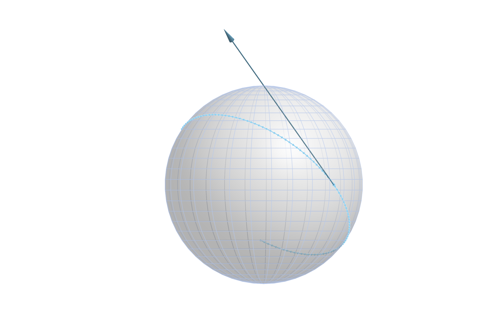
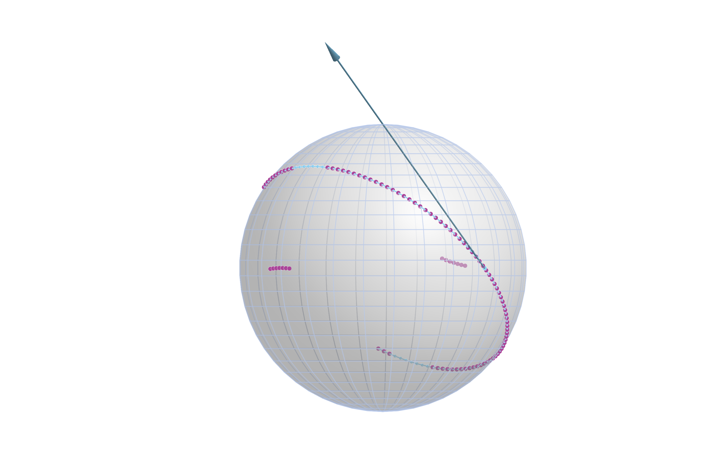
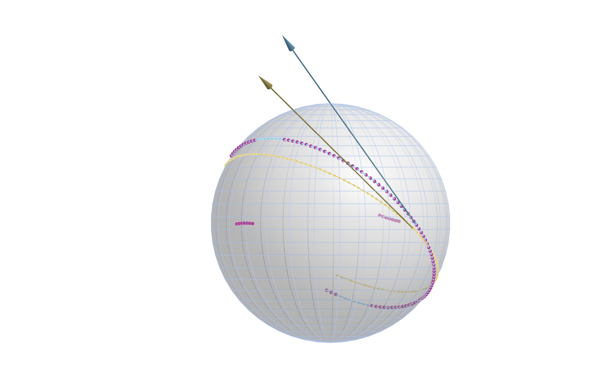
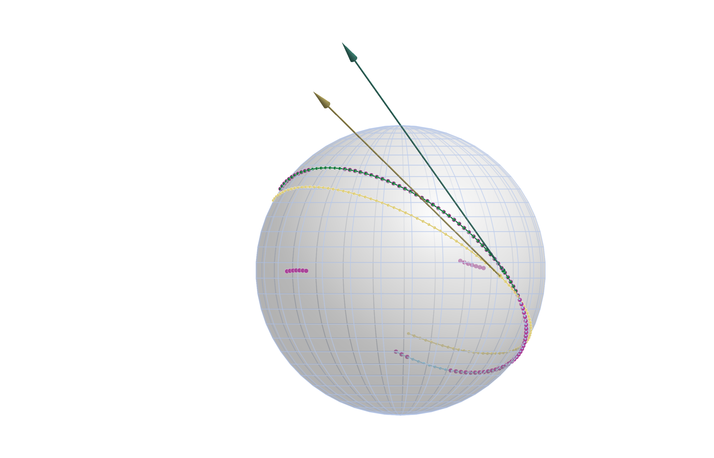

# Robust Geodesic Regression
Ronny Bergmann
2026-07-04

## Prequel

This notebook reproduces the results and images of Section 6.1 in [BaranBergmann:2026](@cite). We use the following packages and parameters

``` julia
using Colors, Distributions, GeometryBasics, GLMakie, Makie, ManifoldDiff, Manifolds, Manopt, NamedColors, Random, RecursiveArrayTools
## Set the interval we sample the points from on the geodesic
T = 1.0
## Number of points along the geodesic on [-T,T]
N = 100
## Outlier parameters
### Distance the outliers are moved
r = π / 4
### Number of outliers per each segment
oN = 7
## And set these slightly asymmetric
outlier_indices = [4:(4 + oN - 1)..., [(N - 11):-1:(N - 11 - oN + 1)...]...];
## Plotting colors
ptc = NamedColors.load_paul_tol()
orig_color = ptc["mutedcyan"]
noisy_color = ptc["mutedpurple"]
lsq_color = ptc["mutedsand"]
robust_color = ptc["mutedgreen"]
```

## Introduction

For robust geodesic regression on a Riemannian manifolds $\mathcal M$ consider $m \in \mathbb N$ points $q_1,\ldots,q_m \in \mathcal M$
thereon associated to scalar values $t_1,\ldots,t_m \in \mathbb R$.
We further denote the geodesic starting in a point $p \in \mathcal M$ in direction $X \in T_p\mathcal M$ by
The task of geodesic regression is given as the problem on the tangent bundle $T\mathcal M$ to find the geodesic $\gamma_{p,X}$, i.e. both $p$ and $X$, that “best fits” the data with $\gamma_{p,X}(t_i) \approx q_i$, $i=1,\ldots,m$, where we still have the freedom to choose in what sense we mean to address the approximately equal condition.
We consider

``` math
\operatorname*{argmin}_{(p,X) \in T\mathcal M} \sum_{i=1}^m \rho\bigl( d_{\mathcal M}^2( \gamma_{p,X}(t_i), q_i) \bigr),
```

where $\rho$ is a [robustifier](@extref Manopt :std:label:`Robustifiers`) applied to every summand.
Choosing $\rho(x) = x$ we get the classical (least squares) geodesic regression [Fletcher:2013](@cite). Here we want to consider approximations of the case where $\rho(x) = \sqrt{x}$, where the sum reduces to the sum of distances or the robust geodesic regression. Since that is no longer differentiable, we use [a scaled version](@extref `Manopt.ScaledRobustifierFunction`) of the [Huber robustifier](@extref `Manopt.HuberRobustifier`).

## Setup

We first setup the manifold, the true point, tangent vector, and data

``` julia
S = Manifolds.Sphere(2)
M = TangentBundle(S)
```

and the original data as

``` julia
p_true = [0.0, 1.0, 0.0]
X_true = π / 2 .* [1.0, 0.0, 1.0]
ts_true = collect(range(; start = -T, stop = T, length = N))
qs_true = geodesic(S, p_true, X_true, ts_true)
geo_line = geodesic(S, p_true, X_true, range(-T, T; length = 1000))
```

which looks like



We then generate outliers

``` julia
Random.seed!(42)
R(α) = [cos(α) -sin(α); sin(α) cos(α)]
data = [
  if i ∈ outlier_indices
    # all are outliers to the left or right
    α = π / 2
    c = get_coordinates(S, q, parallel_transport_to(S, p_true, X_true, q), DefaultOrthonormalBasis())
    X_offset = get_vector(S, q, r / norm(c) .* R(α) * c, DefaultOrthonormalBasis())
    exp(S, q, X_offset)
  else
    q
  end
  for (i, q) in enumerate(qs_true)
]
```



## The Residual and its Jacobian

We first define the overall least squares cost
as well as its partial gradients w. r. t. `p` and `X` for a single summand

``` julia
function cost1(M::AbstractManifold, p, X, ti::Real, di)
    return 1 / 2 * distance(M, exp(M, p, ti * X), di)^2
end
function cost1_grad_p(M::AbstractManifold, p, X, ti::Real, di)
    z = exp(M, p, ti * X)
    gz = ManifoldDiff.grad_distance(M, di, z, 1)
    return ManifoldDiff.adjoint_differential_exp_basepoint(M, p, ti * X, gz)
end
function cost1_grad_X(M::AbstractManifold, p, X, ti::Real, di)
    z = exp(M, p, ti * X)
    gz = ManifoldDiff.grad_distance(M, di, z, 1)
    return ti * ManifoldDiff.adjoint_differential_exp_argument(M, p, ti * X, gz)
end
```

This is then used to define the overall residual `F` and its Jacobian `JF`.

``` julia
function F(M, P; t = ts_true, d = data)
    # Extract manifold and (p,X)
    S = base_manifold(M); p = P[M, :point]; X = P[M, :vector]
    return [distance(S, geodesic(S, p, X, ti), di) for (ti, di) in zip(t, d)]
end
function JF(M, P; t = ts_true, d = data)
  # Extract manifold and (p,X)
  S = base_manifold(M); p = P[M, :point]; X = P[M, :vector]
  return [
    ArrayPartition(
      cost1_grad_p(S, p, X, ti, di), cost1_grad_X(S, p, X, ti, di),
    )
    for (ti, di) in zip(t, d)
  ]
end
```

We combine these into a [`VectorGradientFunction`](@extref `Manopt.VectorGradientFunction`)

``` julia
f = VectorGradientFunction(
    F, JF, N;
    evaluation = AllocatingEvaluation(),
    function_type = FunctionVectorialType(),
    jacobian_type = FunctionVectorialType(),
)
```

And we set a start point `p0`.

``` julia
m = mean(S, data)
X0 = log(S, m, data[end])
p0 = ArrayPartition(m, X0)
```

## Least Squares Geodesic Regression

We first run the [LevenbergMarquardt](@extref `Manopt.LevenbergMarquardt`) solver without
a robustifier, which means we solver the least squares problem, or in other words set $\rho(x) = x$

``` julia
P_star = LevenbergMarquardt(
    M, f, p0;
    damping_increase_factor = 2.0, candidate_acceptance_threshold = 0.2, damping_term_min = 1.0e-5,
    damping_increase_threshold = 0.2,
    damping_reduction_threshold = 0.5,
    scaling_threshold = 1.0e-1, scaling_mode = :Strict,
    retraction_method = StabilizedRetraction(default_retraction_method(M)),
    debug = [:Iteration, (:Cost, "f(x): %8.8e "), :damping_term, "\n",
    10, :Stop],
)
```

And we can extract the minimizer parts $P^* = (p^*,X^*)$ as

``` julia
p_star = P_star[M, :point]
X_star = P_star[M, :vector]
qs_star = geodesic(S, p_star, X_star, ts_true)
geo_line_mean = geodesic(S, p_star, X_star, range(-T, T; length = 1000))
```

which yields the result

``` julia
scatterlines!(
  ax1, Point3d.(geo_line_mean); markersize = 0, color = lsq_color, linewidth = 2,
)
scatter!(ax1, Point3d.([p_star]); markersize = 12, color = lsq_color)
scatter!(ax1, Point3d.(qs_star); markersize = 8, color = lsq_color)
arrows3d!(
  ax1, Point3d.([p_star]), Point3d.([X_star]);
  color = lsq_color, transparency = true, shaftradius = 0.0025, tiplength = 0.075, tipradius = 0.0125,
)
fig1
```



One can see, that the outliers yield that the least squares result is slightly “skewed” to one side.

## Robust Geodesic Regression

As comparison we take a scaled version of the [`HuberRobustifier`](@extref `Manopt.HuberRobustifier`)
by [concatenting](@extref `Manopt.ComposedRobustifierFunction`) it with a scaling,
so that we move the “cutoff” to a value `1.0e-4`, see [`ScaledRobustifierFunction`](@extref `Manopt.ScaledRobustifierFunction`).

The solver call uses the same variables for the remaining setup than the previous run.

``` julia
P_ast = LevenbergMarquardt(
  M, f, p0;
  damping_increase_factor = 8.0, candidate_acceptance_threshold = 0.2, damping_term_min = 1.0e-5,
  scaling_threshold = 1.0e-1, scaling_mode = :Strict,
  damping_increase_threshold = 0.2,
  damping_reduction_threshold = 0.5,
  robustifier = 1.0e-4 ∘ HuberRobustifier(),
  retraction_method = StabilizedRetraction(default_retraction_method(M)),
  debug = [:Iteration, (:Cost, "f(x): %8.8e "), :damping_term, "\n", 10, :Stop],
)
```

And we again extract the minimizer parts

``` julia
p_ast = P_ast[M, :point]
X_ast = P_ast[M, :vector]
qs_ast = geodesic(S, p_ast, X_ast, ts_true)
geo_line_robust = geodesic(S, p_ast, X_ast, range(-T, T; length = 1000))
```

to add them to the figure

``` julia
scatterlines!(
  ax1, Point3d.(geo_line_robust); markersize = 0, color = robust_color, linewidth = 2,
)
scatter!(ax1, Point3d.([p_ast]); markersize = 12, color = robust_color)
scatter!(ax1, Point3d.(qs_ast); markersize = 8, color = robust_color)
arrows3d!(
  ax1, Point3d.([p_ast]), Point3d.([X_ast]);
  color = robust_color, transparency = true, shaftradius = 0.0025, tiplength = 0.075, tipradius = 0.0125,
)
fig1
```



Here the new (green) dots and the tangent vector lie exactly on the original geodesic visually.

If we measure the (mean) error we get for least squares

``` julia
1 / N * norm([distance(S, qi, qmi) for (qi, qmi) in zip(qs_true, qs_star)])
```

    0.013904282413539831

On the other hand for the robust case we get

``` julia
1 / N * norm([distance(S, qi, qmi) for (qi, qmi) in zip(qs_true, qs_ast)])
```

    2.2737844213842437e-6

## Literature

```@bibliography
Pages = ["LM-Robust-Geodesic-Regression.md"]
Canonical=false
```

```@raw html
<details>
  <summary>Technical Details</summary>
```

This tutorial is cached. It was last run on the following package versions.

    Status `~/Repositories/Julia/ManoptExamples.jl/examples/Project.toml`
      [6e4b80f9] BenchmarkTools v1.8.0
      [336ed68f] CSV v0.10.16
      [13f3f980] CairoMakie v0.15.12
      [0ca39b1e] Chairmarks v1.3.1
      [35d6a980] ColorSchemes v3.31.0
      [5ae59095] Colors v0.13.1
      [a93c6f00] DataFrames v1.8.2
      [31c24e10] Distributions v0.25.129
      [e9467ef8] GLMakie v0.13.12
      [5c1252a2] GeometryBasics v0.5.11
      [4d00f742] GeometryTypes v0.8.5
      [7073ff75] IJulia v1.34.4
      [682c06a0] JSON v1.6.1
      [8ac3fa9e] LRUCache v1.6.2
      [b964fa9f] LaTeXStrings v1.4.0
      [d3d80556] LineSearches v7.7.1
      [ee78f7c6] Makie v0.24.12
      [7351309b] ManifoldAsymptote v0.1.0
      [af67fdf4] ManifoldDiff v0.4.5
      [9d80ff41] ManifoldMakie v0.1.2
      [1cead3c2] Manifolds v0.11.28
      [3362f125] ManifoldsBase v2.4.0
    ⌃ [0fc0a36d] Manopt v0.6.0
      [5b8d5e80] ManoptExamples v0.1.18 `..`
      [51fcb6bd] NamedColors v0.2.3
      [6fe1bfb0] OffsetArrays v1.17.0
      [91a5bcdd] Plots v1.41.6
    ⌃ [08abe8d2] PrettyTables v3.3.2
      [6099a3de] PythonCall v0.9.35
      [f468eda6] QuadraticModels v0.9.16
      [731186ca] RecursiveArrayTools v4.3.2
      [1e40b3f8] RipQP v0.7.0
    Info Packages marked with ⌃ have new versions available and may be upgradable.

This tutorial was last rendered July 5, 2026, 17:27:3.

```@raw html
</details>
```
