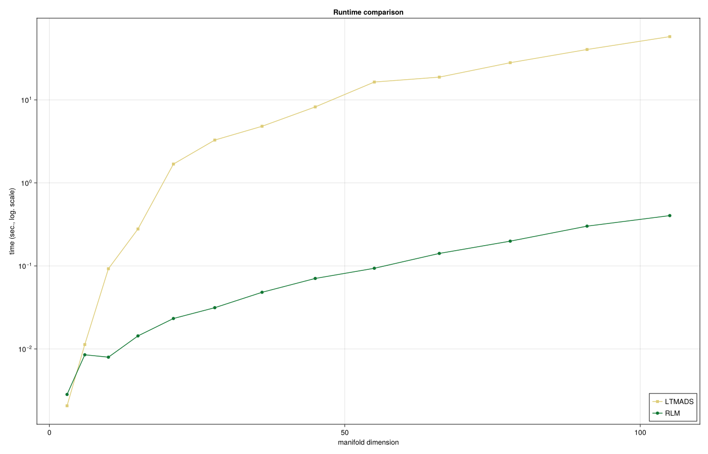
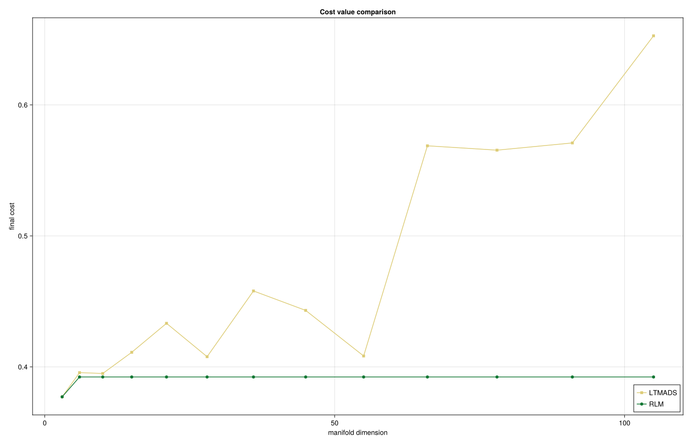

# Robust Procrustes on the Special Orthogonal group
Ronny Bergmann
2026-07-04

## Prequel

This notebook reproduces the results and images of Section 6.2 in [BaranBergmann:2026](@cite). We use the following packages and parameters

``` julia
using CairoMakie, Chairmarks, Colors, CSV, DataFrames, NamedColors, LinearAlgebra, Manopt, Manifolds, PrettyTables, Random
export_csv = true
ptc = NamedColors.load_paul_tol()
ltmads_color = ptc["mutedsand"]
robust_color = ptc["mutedgreen"]
```

Let two data sets $A \in \mathbb{R}^{d\times n}$, $A = (a_1,\ldots,a_n)$,
and $B \in \mathbb R^{d\times n}$, $B = (b_1,\ldots,b_n)$,
of measured data be given, where we obtain a set of columns of values $a_i \in \mathbb R^d$, $b_j \in \mathbb R^d$ each.

The Procrustes Problem
aims to find the best rotation $p \in \mathrm{SO}(d)$,
$\mathrm{SO}(d) := \{ p \in \mathbb R^{d\times d} \,\mid\, p^{\mathrm{T}}p = I_d, \det(p) = 1\}$,
such that $A \approx pB$, where we here use a robust norm and obtain
the robust Procrustes problem

``` math
\operatorname*{argmin}_{p \in \mathrm{SO}(d)}\ \lVert A - pB \rVert_{\mathrm{R}},
\qquad
\lVert C \rVert_{\mathrm{R}} := \sum_{i=1}^{n} \lVert c_i \rVert_2,
```

where $c_i$, $i=1,\ldots,n$ again denote the columns of the matrix $C = (c_1,\ldots,c_n) \in \mathbb R^{d\times n}$.

## Setup data

``` julia
raw"""
    generate_data(d)

Generate a data matrix ``A ∈ ℝ^{d× n}`` in a deterministic way,
here by using ``n = \frac{d(d-1)}{2}`` columns.
"""
function generate_data(d)
    # (1) push the first unit vector scaled by 1/2
    n = Int(d * (d + 1) / 2)
    A = zeros(d, n)
    A[1, 1] = 1.0
    k = 2
    dir = zeros(d)
    for i in 2:d # for each following dimension, set point on the diagonal of the preceding dimensions
        dir[1:i] .= 1 / sqrt(i)
        dir[(i + 1):end] .= 0
        v = range(0.0, 1.0, i + 2)[2:(end - 1)]
        for vi in v
            A[:, k] .= vi * dir
            k = k + 1
        end
    end
    return A
end

skew(A) = 0.5 .* (A - A')
```

And the cost, differential and adjoint differential

```` julia
"""
    f(M, p; A, B)

For given matrices ``A, B ∈ ℝ^{d,n}`` compute the robust Procrustes cost

```math
F_i(p) = (A - pB)_i = a_i - pb_i
```
"""
f(M, p; A, B) = sum(norm(A[:, i] - p * B[:, i]) for i in 1:size(A, 2))

"""
    Fi(M, p; i, A, B)
    Fi!(M, v, p; i, A, B)

For given matrices ``A, B ∈ ℝ^{d,n}`` compute the residual of the ith column

```math
F_i(p) = (A - pB)_i = a_i - pb_i
```

This can be computed in-place of `v`
"""
Fi(M, p; i, A, B) = A[:, i] - p * B[:, i]
Fi!(M, v, p; i, A, B) = (v .= A[:, i] .- p * B[:, i])

"""
    DFi(M, p, X; i, A, B)
    DFi!(M, y, p, X; i, A, B)

For given matrices ``A, B ∈ ℝ^{d,n}`` compute the differential of the residual of the ith column
with respect to the rotation ``p`` that is, ``X ∈ 𝔰𝔬(d)`` which reads

```math
\\mathcal J_{F_i}(p)[X] = DF_i(p)[X] = -pXb_i
```

This is computed in-place of `y`

"""
DFi(M, p, X; i, A, B) = - p * X * B[:, i]
DFi!(M, y, p, X; i, A, B) = (y .= - p * X * B[:, i])

raw"""
    adjointDFi(M, p, y; i, A, B)
    adjointDFi!(M, X, p, y; i, A, B)

For given matrices ``A, B ∈ ℝ^{d,n}`` compute the adjoint differential of the residual of the ith column
with respect to the rotation ``p`` that is, ``y ∈ ℝn`` but mapping into the Lie algebra ``𝔰𝔬(d)``.
This is also referred to as the Jacobian

```math
D*{F_i}(p)[y] = -\mathrm{skew}(p^{\mathrm{T}}yb_i^{\mathrm{T}})
```

This is computed in-place of `X`.
"""
adjointDFi(M, p, y; i, A, B) = - skew(p' * y * B[:, i]')
adjointDFi!(M, a, p, y; i, A, B) = (a .= - skew(p' * y * B[:, i]'))
````

## Experiment setup

We test matrix dimensions $d=3,...,15$ and setup a collection of statistics

``` julia
# Statistics:
matrix_sizes = collect(3:15)
num_experiments = length(matrix_sizes)
num_columns = zeros(Int, num_experiments)
manifold_dimensions = zeros(Int, num_experiments)
mean_time_rLM = zeros(Float64, num_experiments)
mean_time_LTMADS = zeros(Float64, num_experiments)
final_cost_rLM = zeros(Float64, num_experiments)
final_cost_LTMADS = zeros(Float64, num_experiments)
iterations_rLM = zeros(Int, num_experiments)
iterations_LTMADS = zeros(Int, num_experiments)
```

## Run experiments

``` julia
for (i, d) in enumerate(matrix_sizes)
    A = generate_data(d)
    n = size(A, 2) # number of summands in the vectorial cost sum
    M = Rotations(d)
    Random.seed!(42)
    e = Matrix{Float64}(I, d, d)
    p_star = exp(M, e, rand(M; vector_at=e, σ = 0.5/d))
    B = copy(A)
    # and generate a few outliers in [3,6] so it also works already for d=3
    B[2, 4] += 0.1;  B[3, 1] += 0.1; B[3, 2] += 0.1; B[1, 6] += 0.1
    mask = B .== A
    # then rotate
    B = p_star' * B
    # Seting cost and vectorial block function
    F(M, p) = [Fi(M, p; i = i, A = A, B = B) for i in 1:n]
    vgfs = [
        VectorDifferentialFunction(
                (M, c, p) -> Fi!(M, c, p; i = i, A = A, B = B),
                (M, y, p, X) -> DFi!(M, y, p, X; i = i, A = A, B = B),
                (M, X, p, y) -> adjointDFi!(M, X, p, y; i = i, A = A, B = B),
                d;
                function_type = FunctionVectorialType(), jacobian_type = FunctionVectorialType(),
                adjoint_jacobian_type = FunctionVectorialType(), evaluation = InplaceEvaluation(),
            ) for i in 1:n
    ]
    rs = [ 1.0e-5 ∘ HuberRobustifier() for _ in 1:n ]

    # Start with the identity
    p0 = Matrix{Float64}(I, d, d)
    @info " "
    @info "d=$d (n=$n) dim=$(manifold_dimension(M)), distance=$(distance(M, p0, p_star))"
    #
    # Solver runs. Both (a) an individual run to obtain stats like maxiter
    #
    # Least Squares Hubertized
    state1 = LevenbergMarquardt(
        M, vgfs, p0; candidate_acceptance_threshold = 0.2,
        damping_increase_factor = 4.0, damping_term_min = 1.0e-7,
        return_state = true, robustifier = rs,
        scaling_mode = :Strict, scaling_threshold = 1.0e-4,
    )
    iter1 = get_count(state1, :Iterations)
    p1 = get_solver_result(state1)
    time1 = @be LevenbergMarquardt(
        $M, $vgfs, $p0; robustifier = $rs, scaling_mode = :Strict, scaling_threshold = 1.0e-4,
        damping_increase_factor = 4.0, candidate_acceptance_threshold = 0.2, damping_term_min = 1.0e-7,
    ) samples = 5 evals = 3
    state2 = mesh_adaptive_direct_search(
        M, (M, p) -> f(M, p; A = A, B = B), p0;
        stopping_criterion = StoppingCriterion = StopAfterIteration(20000) | StopWhenPollSizeLess(1.0e-10),
        return_state = true
    )
    time2 = @be mesh_adaptive_direct_search(
        $M, $((M, p) -> f(M, p; A = A, B = B)), $p0;
        stopping_criterion = $(StoppingCriterion = StopAfterIteration(20000) | StopWhenPollSizeLess(1.0e-10))
    ) samples = 5 evals = 3
    iter2 = get_count(get_state(state2), :Iterations)
    p2 = get_solver_result(state2)
    # Collect stats
    num_columns[i] = n
    manifold_dimensions[i] = manifold_dimension(M)
    mean_time_rLM[i] = mean(time1).time
    mean_time_LTMADS[i] = mean(time2).time
    final_cost_rLM[i] = f(M, p1; A = A, B = B)
    final_cost_LTMADS[i] = f(M, p2; A = A, B = B)
    iterations_rLM[i] = iter1
    iterations_LTMADS[i] = iter2
end
```



as well as the resulting cost



## Literature

```@bibliography
Pages = ["LM-Robust-Procrustes.md"]
Canonical=false
```

```@raw html
<details>
  <summary>Technical Details</summary>
```

This tutorial is cached. It was last run on the following package versions.

    Status `~/Repositories/Julia/ManoptExamples.jl/examples/Project.toml`
      [6e4b80f9] BenchmarkTools v1.8.0
      [336ed68f] CSV v0.10.16
      [13f3f980] CairoMakie v0.15.12
      [0ca39b1e] Chairmarks v1.3.1
      [35d6a980] ColorSchemes v3.31.0
      [5ae59095] Colors v0.13.1
      [a93c6f00] DataFrames v1.8.2
      [31c24e10] Distributions v0.25.129
      [e9467ef8] GLMakie v0.13.12
      [5c1252a2] GeometryBasics v0.5.11
      [4d00f742] GeometryTypes v0.8.5
      [7073ff75] IJulia v1.34.4
      [682c06a0] JSON v1.6.1
      [8ac3fa9e] LRUCache v1.6.2
      [b964fa9f] LaTeXStrings v1.4.0
      [d3d80556] LineSearches v7.7.1
      [ee78f7c6] Makie v0.24.12
      [7351309b] ManifoldAsymptote v0.1.0
      [af67fdf4] ManifoldDiff v0.4.5
      [9d80ff41] ManifoldMakie v0.1.2
      [1cead3c2] Manifolds v0.11.28
      [3362f125] ManifoldsBase v2.4.0
    ⌃ [0fc0a36d] Manopt v0.6.0
      [5b8d5e80] ManoptExamples v0.1.18 `..`
      [51fcb6bd] NamedColors v0.2.3
      [6fe1bfb0] OffsetArrays v1.17.0
      [91a5bcdd] Plots v1.41.6
    ⌃ [08abe8d2] PrettyTables v3.3.2
      [6099a3de] PythonCall v0.9.35
      [f468eda6] QuadraticModels v0.9.16
      [731186ca] RecursiveArrayTools v4.3.2
      [1e40b3f8] RipQP v0.7.0
    Info Packages marked with ⌃ have new versions available and may be upgradable.

This tutorial was last rendered July 5, 2026, 20:18:54.

```@raw html
</details>
```
