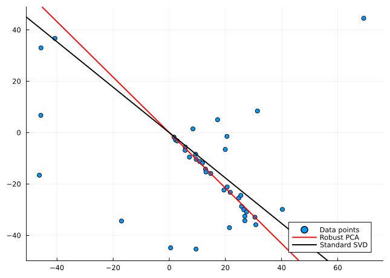

The Robust PCA computed on the Grassmann manifold
================
Ronny Bergmann, Laura Weigl
7/2/23

For this example we first load the necessary packages.

``` julia
using Pkg;
Pkg.activate("."); # use the example environment,
```

``` julia
using LinearAlgebra, Random, Statistics
using Manifolds, Manopt, ManoptExamples
using Plots
Random.seed!(42)
```

# Computing a Robust PCA

For a given matrix $D ∈ ℝ^{d×n}$ whose columns represent points in $ℝ^d$, a matrix $p ∈ ℝ^{d×m}$ is computed for a given dimension $m < n$:
$p$ represents an ONB of $ℝ^{d×m}$ such that the column space of $p$ approximates the points (columns of $D$), i.e. the vectors $D_i$ as well as possible.

We compute $p$ as a minimizer over the Grassmann manifold of the cost function:

``` math
\begin{split}
f(p)
& = \frac{1}{n}\sum_{i=1}^{n}{\operatorname{dist}(D_i, \operatorname{span}(p))}
\\
& = \frac{1}{n} \sum_{i=1}^{n}\lVert pp^TD_i - D_i\rVert
\end{split}
```

The output cost represents the average distance achieved with the returned $p$, an orthonormal basis (or a point on the Stiefel manifold) representing the subspace (a point on the Grassmann manifold). Notice that norms are not squared, so we have a robust cost function. This means that $f$ is nonsmooth, therefore we regularize with a pseudo-Huber loss function of smoothing parameter $ε$.

``` math
f_ϵ(p) = \frac{1}{n} \sum_{i=1}^n{ℓ_ϵ(\lVert pp^{\mathrm{T}}D_i - D_i\rVert)},
```

where $ℓ_ϵ(x) = \sqrt{x^2 + ϵ^2} - ϵ$.

The smoothing parameter is iteratively reduced in the final optimisation runs(with warm starts).

First, we generate random data. For illustration purposes we take points in $\mathbb R^2$ and $m=1$, that is we aim to find a robust regression line.

``` julia
n = 40
d = 2
outliers = 15
data = randn(d, 1) * (1:n)' + 0.05 * randn(2, n) .* [1:n 1:n]'
# Outliers:
permute = shuffle(1:size(data, 2))'
data[:, permute[1:outliers]] = 30 * randn(2, outliers)
# We are looking for a line here so we set
m = 1
```

We use the Manopt toolbox to optimize the regularized cost function over the Grassmann manifold. To do this, we first need to define the problem structure.

``` julia
M = Grassmann(d,m);
```

For the initial matrix $p_0$ we use classical PCA via singular value decomposition. Thus, we use the first $d$ left singular vectors.

Then, we compute an optimum of the cost function over the Grassmann manifold.
We use a trust-region method which is implemented in `Manopt.jl`.

Furthermore the cost and gradient are implemented in `ManoptExamples.jl`.
Since these are Huber regularized, both functors have the `ϵ` as a parameter.
To compute the Riemannian gradient we first compute the Euclidian gradient. Afterwards it is projected onto the tangent space by using the orthogonal projection $pp^T - I$, which converts the Euclidean to the Riemannian gradient.

The trust-region method also requires the Hessian Matrix. By using [`ApproxHessianFiniteDifference`](https://manoptjl.org/stable/solvers/trust_regions/#Manopt.ApproxHessianFiniteDifference) using a finite difference scheme we get an approximation of the Hessian Matrix.

We run the procedure several times, where the smoothing parameter $ε$ is reduced iteratively.

``` julia
ε = 1.0
iterations = 6
reduction = 0.5
U, S, V = svd(data);
p0 = U[:, 1:m]
```

    2×1 Matrix{Float64}:
     -0.7494248652139394
      0.6620893983436593

Let’s generate the cost and gradient we aim to use here

``` julia
f = ManoptExamples.RobustPCACost(M, data, ε)
grad_f = ManoptExamples.RobustPCAGrad!!(M, data, ε)
```

    ManoptExamples.RobustPCAGrad!!{Matrix{Float64}, Float64}([9.537606557855465 1.6583418797018163 … 30.833523701909474 30.512999245062304; -45.34339972619071 -1.7120433539256108 … -35.85943792458936 -32.93976007215313], 1.0, [0.0 0.0 … 0.0 0.0; 0.0 0.0 … 0.0 0.0])

and check the initial cost

``` julia
f(M, p0)
```

    9.43069094790552

Now we iterate the opimization with reducing `ε` after every iteration,
which we update in `f` and `grad_f`.

``` julia
q = copy(M, p0)
εi = ε
for i in 1:iterations
    f.ε = εi
    grad_f.ε = εi
    global q = trust_regions(
        M,
        f,
        grad_f,
        ApproxHessianFiniteDifference(
            M, q, f;
            vector_transport_method=ProjectionTransport(),
            retraction_method=PolarRetraction(),
        ),
        q;
        (project!)=project!,
    )
    global εi *= reduction
end
```

When finally setting `ε` we can investigate the final cost

``` julia
f.ε = 0.0
f(M, q)
```

    9.412965075156471

Finally, the results are presented visually. The data points are visualized in a scatter plot. The result of the robust PCA and (for comparison) the standard SVD solution are plotted as straight lines.

``` julia
fig = plot(data[1, :], data[2, :]; seriestype=:scatter, label="Data points");
plot!(
    fig,
    q[1] * [-1, 1] * 100,
    q[2] * [-1, 1] * 100;
    linecolor=:red,
    linewidth=2,
    label="Robust PCA",
);
plot!(
    fig,
    p0[1] * [-1, 1] * 100,
    p0[2] * [-1, 1] * 100;
    xlims=1.1 * [minimum(data[1, :]), maximum(data[1, :])],
    ylims=1.1 * [minimum(data[2, :]), maximum(data[2, :])],
    linewidth=2,
    linecolor=:black,
    label="Standard SVD",
)
```


