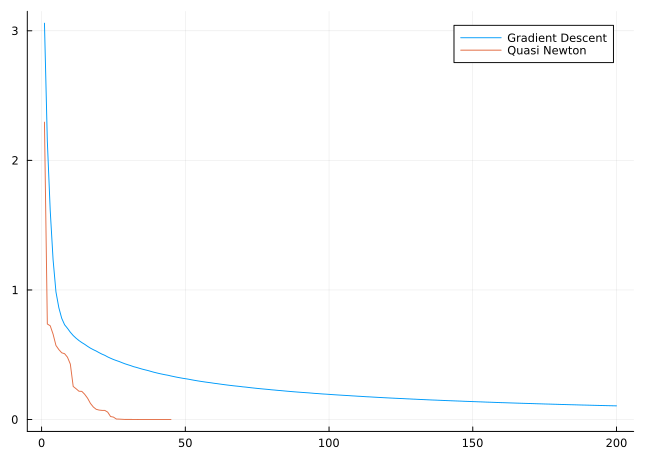

The Rosenbrock Function
================
Ronny Bergmann
1/3/23

After loading the necessary packages

``` julia
using Pkg;
Pkg.activate("."); # use the example environment,
```

``` julia
using Manifolds, Manopt, ManoptExamples
using Plots
```

We fix the parameters for the [Rosenbock example](@ref Rosenbrock).

``` julia
a = 100.0
b = 1.0
p0 = [1/10, 2/10]
```

which is defined on $\mathbb R^2$, so we need

``` julia
M = ℝ^2
```

    Euclidean(2; field = ℝ)

and can then generate both the cost and the gradient

``` julia
f = ManoptExamples.RosenbrockCost(M; a=a, b=b)
grad_f = ManoptExamples.RosenbrockGradient!!(M; a=a, b=b)
```

    ManoptExamples.RosenbrockGradient!!{Float64}(100.0, 1.0)

For comparison, we look at the initial cost

``` julia
f(M, p0)
```

    4.42

And to illustrate, we run two small solvers with their default settings as a comparison.

## Gradient Descent

We start with the [gradient descent solver](https://manoptjl.org/stable/solvers/gradient_descent/#Manopt.gradient_descent).

Since we need the state anyways to access the record, we also get from the `return_state=true`
a short summary of the solver run.

``` julia
gd_state = gradient_descent(M, f, grad_f, p0; record = [:Iteration, :Cost], return_state=true)
```

    # Solver state for `Manopt.jl`s Gradient Descent
    After 200 iterations

    ## Parameters
    * retraction method: ExponentialRetraction()

    ## Stepsize
    ArmijoLineseach() with keyword parameters
      * initial_stepsize = 1.0
      * retraction_method = ExponentialRetraction()
      * contraction_factor = 0.95
      * sufficient_decrease = 0.1
      * linesearch_stopsize = 0.0

    ## Stopping Criterion
    Stop When _one_ of the following are fulfilled:
        Max Iteration 200:  reached
        |Δf| < 1.0e-9: not reached
    Overall: reached
    This indicates convergence: No

    ## Record
    (Iteration = RecordGroup([RecordIteration(), RecordCost()]),)

From the summary we see, that the gradient is not yet small enough, but we hit
the 200 iterations (default) iteration limit.
Collecting the cost recording and printing the final cost

``` julia
gd_x = get_record(gd_state, :Iteration, :Iteration)
gd_y =  get_record(gd_state, :Iteration, :Cost)
f(M, get_solver_result(gd_state))
```

    0.10562873187751265

## Quasi Newton

We can improve this using the [quasi Newton](https://manoptjl.org/stable/solvers/quasi_Newton/#Manopt.quasi_Newton) algorithm

``` julia
qn_state = quasi_Newton(M, f, grad_f, p0;
    record = [:Iteration, :Cost], return_state=true
)
```

    # Solver state for `Manopt.jl`s Quasi Newton Method
    After 45 iterations

    ## Parameters
    * direction update:        limited memory InverseBFGS (size 20), projections, and ParallelTransport() as vector transport.
    * retraction method:       ExponentialRetraction()
    * vector trnasport method: ParallelTransport()

    ## Stepsize
    WolfePowellLinesearch(DefaultManifold(), 0.0001, 0.999) with keyword arguments
      * retraction_method = ExponentialRetraction()
      * vector_transport_method = ParallelTransport()

    ## Stopping Criterion
    Stop When _one_ of the following are fulfilled:
        Max Iteration 1000: not reached
        |Δf| < 1.0e-6: reached
    Overall: reached
    This indicates convergence: Yes

    ## Record
    (Iteration = RecordGroup([RecordIteration(), RecordCost()]),)

And we see it stops far earlier, after 45 Iterations. We again collect the recorded values

``` julia
qn_x = get_record(qn_state, :Iteration, :Iteration)
qn_y =  get_record(qn_state, :Iteration, :Cost)
f(M, get_solver_result(qn_state))
```

    1.4409702527480214e-14

and see that the final value is close to the one of the minimizer

``` julia
f(M, ManoptExamples.minimizer(f))
```

    0.0

which we also see if we plot the recorded cost.

``` julia
fig = plot(gd_x, gd_y; linewidth=1, label="Gradient Descent");
plot!(fig, qn_x, qn_y; linewidth=1, label="Quasi Newton")
```


